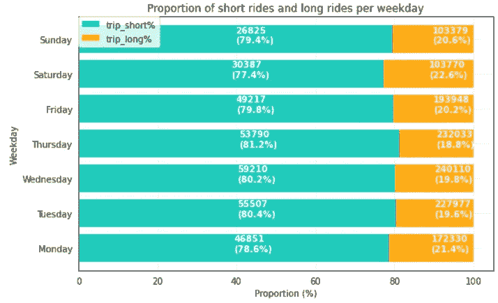
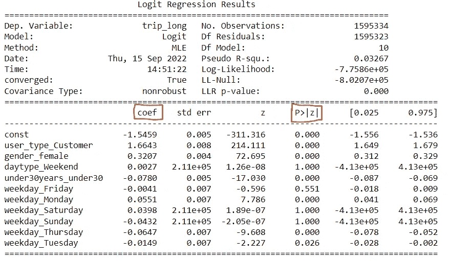

# 如何解释 Logistic 回归中分类变量的比值比

> 原文：<https://towardsdatascience.com/how-to-interpret-the-odds-ratio-with-categorical-variables-in-logistic-regression-5bb38e3fc6a8>

## **参考类别说明及选择正确的类别**

由[德克斯·伊齐基尔](https://unsplash.com/ja/@dexezekiel?utm_source=medium&utm_medium=referral)在 [Unsplash](https://unsplash.com?utm_source=medium&utm_medium=referral) 上拍摄的照片

逻辑回归是一个非常流行的机器学习模型，一直是许多文章和博客的焦点。虽然有一些使用相对简单的数据的精彩例子，但我很难找到一篇使用分类变量作为特征的综合文章。

为什么每个变量的一个类别在统计输出中被省略？我如何解释回归系数，即“对数优势比”，一个特定类别的变量？

我将通过涵盖以下主题来揭开这一神秘面纱:

**虚拟变量概述**

**什么是参考类别，如何选择一个**

**如何解释虚拟变量的比值比**

我将使用 Python 和 statsmodels 包(有很好的统计输出)以及一个开源的自行车旅行数据集，该数据集包含纽约市的城市自行车数据和大量派生的分类变量。从行程持续时间特性中，我生成了一个布尔目标变量，表示自行车行程是否超过 20 分钟，我已经武断地决定这是一次“长”行程。我们将研究哪些分类特征会显著增加或减少自行车旅行超过 20 分钟的几率。

我们开始吧！

## **处理分类数据—你好虚拟变量**

数据变量可以是**连续的**(介于理论最小值和最大值之间的测量值，如年龄、体重)或**分类的/离散的**(固定值或分类，如工作日、性别)。分类数据不能直接用于机器学习算法，因此需要进行预处理。

分类变量可以转换成数字的虚拟变量，这是一种更好的格式。这是数据被转置的地方，因此每个类别由一组二进制特征表示，指示该类别在每行数据中的存在与否。两种流行的方法是[熊猫 get_dummies()](https://pandas.pydata.org/docs/reference/api/pandas.get_dummies.html) 和 s [cikit-learn 的 OneHotEncoder()](https://scikit-learn.org/stable/modules/generated/sklearn.preprocessing.OneHotEncoder.html) 。在这篇文章中，我将重点介绍 pd.get_dummies 方法。

为了避免多重共线性(变量之间的相关性)，大多数模型都要求从数据中删除一个哑变量。这是如何工作的？因为每行至少有一个特性类别的值(假设您已经处理了丢失的值！)，如果特性的每个虚拟变量都是 0，那么默认情况下，最后一个类别必须是 1。因此，可以删除一个虚拟变量。

那么我们如何删除一个虚拟变量呢？

## **“drop _ first”参数可能不是你的朋友**

我学会了在使用 pd.get_dummies()创建虚拟变量时总是使用“drop_first=True”参数。这是在线学习平台涵盖的概念之一，但似乎从未深入到你使用它时实际发生的细节。

我注意到我不能选择哪个类别被删除。默认情况下，它总是删除按字母顺序排列的类别。这违背了所有的数据科学逻辑——当然，类别很重要，而且肯定有一些数据驱动的逻辑来挑选哪一个没有通过最终筛选？

让我们来回答第一个问题。为什么删除类别很重要？

## **参考类别**

被丢弃的类别被称为**引用类别**。当您解释您的模型的结果时，该类别将与所有其他类别进行比较。

考虑到这一点，有必要通过将逻辑回归模型与您的数据相拟合来回想您试图回答的问题。在我们的例子中，一次自行车旅行是否会超过 20 分钟，你想确定事件发生的几率是多少？相对于其他类别，例如一周中的某一天，您是否对特定类别的效果感兴趣？*(后面更有解读！)*

因此，参考类别应该是允许**更容易解释的类别，也是您最关心的类别**。从数学上来说，这可能是在您的数据中具有最大代表性的类别，即代表“标准”的类别。同样，它也可能是在您的数据中意外出现的类别。

可视化你的数据可以帮助你做出决定。要素类别的频率或百分比的简单条形图有助于了解它们在数据中的分布情况。它还会揭示你可能想要研究的任何有趣或意想不到的模式。

现在让我们考虑一下我们的纽约自行车旅行数据。我已经从每次自行车旅行的开始时间中获得了额外的特征；“工作日”,七个类别代表一周中的某一天,“日类型”表示旅行发生在工作日还是周末。对于那些骑自行车观光的人来说，你可能会认为周末(周六和周日)是骑自行车旅行时间较长的日子。事实上，我们下面的探索性可视化显示，周六的自行车旅行超过 20 分钟的比例似乎略高。

图片由作者提供，在 matplotlib 中创建。

如果您的研究问题旨在解决一周中的某一天对自行车旅行超过 20 分钟是否有影响，您可以将参考类别设置为“周末”,以证实您的怀疑，即工作日自行车旅行超过 20 分钟的几率明显高于周末超过 20 分钟的几率。或者，您可以将您的参考类别设置为一周中的某一天，以评估相对于您选择作为参考类别的那一天，其他日子对赔率的影响。

其他一些挑选参考类别的策略可以在[这里](https://www.theanalysisfactor.com/strategies-dummy-coding/)找到。

## **手动选择正确的参考类别**

因此，我们认为，有能力选择作为参考的类别是非常重要的。那么，我们如何绕过讨厌的默认 drop_first 参数，选择我们自己的参数呢？

幸运的是，你可以使用一些工具来选择合适的丢弃方式。以下代码显示了一个快速示例函数，用于确定数据集中具有最高值计数的类别，然后从数据中删除这些类别，并将它们用作引用类别。使用相同的方法，您可以修改函数来选择拥有数据集中最常见属性以外的属性的类别，以用作引用。

作者代码

太好了，现在我们有了最常见类别的列表。现在我们可以把这些从虚拟变量的数据框架中去掉。

作者代码

太好了！现在我们已经用虚拟变量准备好了数据，我们知道哪些是参考类别。我们准备运行逻辑回归！

## **到赔率比**

我已经略微谈到了对比值比的解释，但是让我们再深入一点。在我们将逻辑回归模型拟合到我们的数据之后，查看 statsmodels 的输出是有帮助的。

statsmodel 逻辑回归输出，图片由作者提供。

在这里，您可以看到左侧列出的所有特性，包括虚拟变量(省略了参考类别！)及其相应的统计数据。让我们分别关注第一列和第四列中的系数(coef)和 P 值(P>|z)。

该系数代表**的对数优势比**。由于[这篇文章](/a-simple-interpretation-of-logistic-regression-coefficients-e3a40a62e8cf)有一个很棒的解释，我不会在这里赘述，但它值得做一个高层次的总结。

> **几率是某件事情发生的概率超过它没有发生的概率，记为(p/(1-p** ))。如果自行车旅行超过 20 分钟的概率是 25%，那么这个概率是 0.25/(1-. 25)= 0.33。所以在 100 次自行车旅行中，有 33 次会超过 20 分钟。
> 
> **比值比是两个比值之间的比率或比较，以观察它们在不同情况或条件下如何变化**。特征的比值比是条件 1 中自行车旅行超过 20 分钟的比值，与条件 2 中自行车旅行超过 20 分钟的比值。
> 
> 正的比值比表明该事件更有可能发生，而负的比值比表明该事件不太可能发生。
> 
> 注意，系数是**对数**比值比。对数优势比的“对数”部分就是优势比的对数，因为逻辑回归使用对数函数来解决回归问题。仅仅使用**比值比**要容易得多，所以我们必须取对数比值比的**指数** (np.exp())来得到比值比。

对于分类特征或预测因素，**比值比比较每个预测因素类别相对于参考类别**的事件发生几率，假设所有其他变量保持不变。

好了，理论完成后，让我们来看几个例子，看看这在实践中是如何工作的。

*注意。我们的引用类别是每个特性中最常见的，在我们的例子中是:*

*   *[user _ type]=‘订户’(另一个选项是‘客户’，我假设是指付费乘车的非订户)*
*   *【性别】=‘男性’*
*   *【日类型】=‘工作日’*
*   *【30 岁以下】=‘30 岁以上’*
*   *【工作日】=‘星期三’*

> **如果所有其他变量保持不变，给定优势比 exp(1.66) = 5.28** ，如果您是客户，则乘车超过 20 分钟的几率是订户的 5 倍。*(也许他们是在充分利用他们的车，因为他们不是固定的付费用户！)*
> 
> **如果所有其他变量都不变，给定 exp(0.32) = 1.37 的比值比，如果你是女性，那么骑行超过 20 分钟的几率比男性高 37%。**
> 
> **如果所有其他变量都保持不变，给定优势比 exp(-0.07) = 0.92** ，如果你的年龄在 30 岁以下，那么骑行超过 20 分钟的几率比 30 岁以上的人低 8%。
> 
> **在工作日或周末，如果所有其他变量保持不变，超过 20 分钟的乘车几率几乎不变，给定的几率比为 exp(0.002) = 1.003** 。

所以，我们有它！我希望这有助于解释更多关于在逻辑回归中使用分类特征的问题，并且 1)你应该关心你使用的参考类别，2)你有选择的权力，3)对于分类变量来说，优势比并不是很难把握。

你可以在我的 GitHub 库[这里](https://github.com/lucydickinson/datascience/tree/main/Logistic%20regression%20with%20categorical%20variables)看到我的全部代码。感谢阅读:)