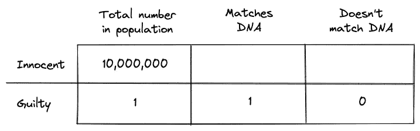
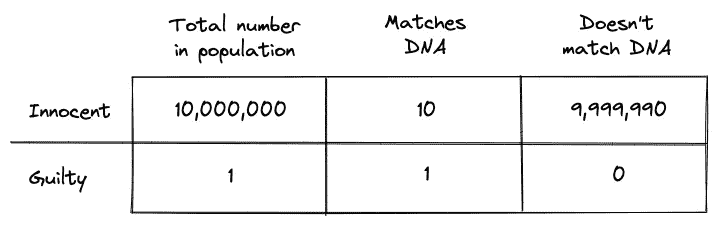
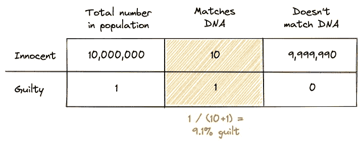
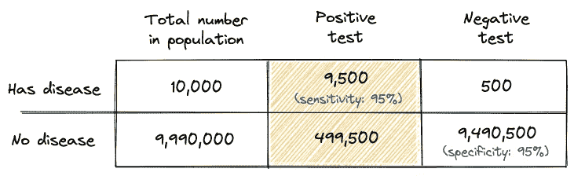
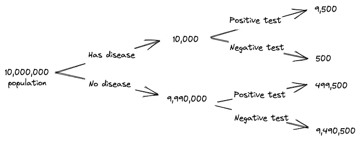
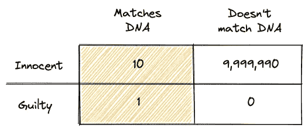
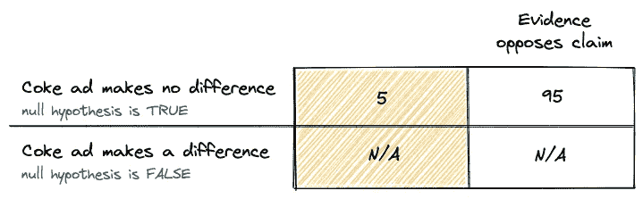
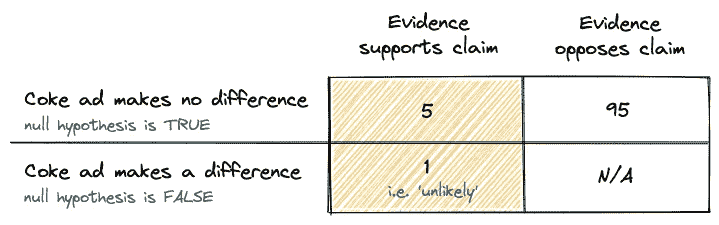
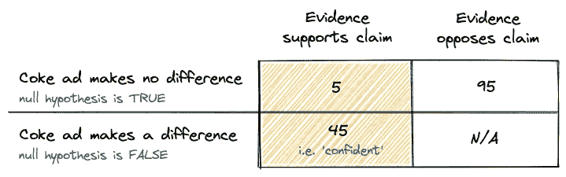

# 如何凭直觉发现检察官的谬误(并进行更好的假设检验)

> 原文：<https://towardsdatascience.com/how-to-intuit-the-prosecutors-fallacy-and-run-better-hypothesis-tests-2d8561bfc5a6>

## 面向商业领域的数据科学家和分析师

[廷杰伤害律师事务所](https://unsplash.com/@tingeyinjurylawfirm?utm_source=medium&utm_medium=referral)在 [Unsplash](https://unsplash.com?utm_source=medium&utm_medium=referral) 上的照片

被告与犯罪现场发现的 DNA 匹配的可能性只有百万分之一。所以被告是有罪的。听起来还好吗？不是的！

仅仅基于这一证据，被告很有可能是无辜的，这是不直观但非常有启发性的**检察官谬误**所描述的逻辑陷阱。

当我们理解了这一点，我们就开始在广告、媒体和人们的日常决策中处处看到它。它也是正确解释 p 值的一个常见困难的基础[,对此获得更好的直觉会使我们如何在商业环境中进行假设检验变得更加清晰。](https://fivethirtyeight.com/features/not-even-scientists-can-easily-explain-p-values/)

再举一个例子。您因严重疾病进行的医学测试呈阳性。当你回忆起测试的准确率为 95%时，你感到一阵恐慌。然而，你真正的机会可能比这大得多——也许你真的有 10%的机会。这怎么可能呢？

## 学习目标

本文的第一个目标是对检察官的谬误作一个总体介绍，并用通俗易懂的语言解释它，针对使其难以直观理解的原因。如果你没有遇到过它或者对它的概念不清楚，那么无论你走哪条路，它都是一个很好的生活工具，我希望你会像我一样发现学习它的乐趣。

文章的第二部分将探讨在使用**假设检验**时，检察官的谬误如何在 **p 值**的解释中发挥作用，并针对执业数据专业人员。如果你很难解释为什么 p 值不是你的零假设为假的概率，而是*你得到的结果与给定零假设*时观察到的结果一样极端的概率，这是值得理解的——继续读下去。

# 理解检察官的谬误

## 附件 A

所以被告与犯罪现场的 DNA 匹配的几率是百万分之一。这是一个高度准确的 DNA 测试，已经有一个阳性匹配。然而，无论这一证据看起来多么令人信服，仅凭这一点并不能证明被告有罪。不是因为这个概率中还有少量的不确定性(从来没有绝对的确定性)，而是因为*给出无罪证据的概率*和*给出无罪证据的概率*不一样。

为了理解这意味着什么，让我们首先假设我们正在一个 1000 万人口的城市中寻找罪犯(加上一个罪犯)。而且有 100%的把握，真正的罪犯的 DNA 会与犯罪现场的 DNA 相匹配。

把这些数字放在一个表格里，我们得到这个:

作者图片

现在，我们被告知，只有百万分之一的机会，一个无辜的人会得到 DNA 匹配。因此，如果我们要测试这个城市所有的 1000 万人，我们希望其中有 10 人匹配。

将此添加到表格中:

作者图片

现在看看所有无辜的人，他们的 DNA 都符合这个场景。事实上，无罪匹配的数量比正确有罪匹配的数量多十倍！这是 10 次假阳性对 1 次真阳性。

用百分比表示，那么整个城市给出证据的有罪概率是 1 / (1 + 10) = 9.1%。仅根据这一 DNA 证据，现在看起来被告有 1–9.1% = 90.9%的无罪几率，这与检察官最初声称的 0.0001%的无罪几率形成了鲜明对比。

作者图片

最初声明的含义是，由于只有百万分之一的无辜者会与 DNA 匹配，而被告与 DNA 匹配，他们有罪的概率是 1–0.000001，这几乎是必然的。但是这种逻辑是有缺陷的，尤其是当概率适用的人群很大的时候；我们从数据中得出的结论可能会像这个例子一样发生戏剧性的转变。DNA 匹配无罪的概率不能与 DNA 匹配无罪的概率相混淆。

那是不是说我们在刑事审判中对 DNA 证据无能为力？我们可以，但这里的关键是要明白，需要有其他理由相信被告有罪。如果我们仅仅依靠 DNA 匹配，我们就会暴露在虚假的匹配面前，但是如果我们已经对某人有了其他的怀疑，那么这个额外的证据将是非常令人信服的。我们还可以使用 DNA 来缩小嫌疑人的范围，以帮助集中调查(根据[对金州杀手](https://www.youtube.com/watch?v=KT18KJouHWg)的追捕)，但这不是决定性的，这与我们将在第二部分探讨的假设检验中使用 p 值有重要的相似之处。

这里值得一提的是，检察官谬论的一个延伸是**辩护人谬论**，其中错误地认为，一项指控被告有罪的证据应该被放弃，因为它可以与许多其他证据相匹配。这被用于 OJ Simpson 的审判中，辩护律师认为，与 OJ 匹配的现场血液样本(400 分之一的匹配率)也可以与洛杉矶数以千计的其他人匹配，因此不是有用的证据。这是对检察官谬论的曲解，证据是有用的，因为它是与其他证据一起考虑的，尽管它本身并不具有决定性。

## 附件 B

这是你一直害怕的消息。您很健康，但已接受了一种罕见疾病的筛查，您接受的“95%准确率”测试呈阳性。你感到麻木。但是你应该吗？

在这里，我们首先遇到“准确性”意味着什么的问题，在医学测试中，术语*和 ***特异性*** 用于定义准确性的两个不同方面:*

*   ***敏感度**:患病者被正确识别为患病的可能性(真实阳性率)*
*   ***特异性**:未患病者被正确识别为未患病的可能性(真实阴性率)*

*对于本例，我们将假设 95%的准确度适用于*灵敏度*和*特异性*。我们假设这种疾病会影响 1/1000 的人口。*

*因此，在 1000 万人口中，我们预计会有 10，000 人患有这种疾病。把这些数字放在一个表格里，我们就有了这幅图:*

**

*作者图片*

*另一种可能更直观的表达方式是使用决策树:*

**

*作者图片*

*有了这些数字，假设你刚刚进行了阳性测试(并且没有其他理由相信你患有这种疾病)，你患有这种疾病的几率为 9500/(9500+499500)= 1.87%。*

*即使这种疾病在人群中流行了 10 倍，在得到阳性检测后，你患这种疾病的可能性也只有 16.1%。最重要的是，将测试的特异性提高到 99%，你的几率仍然是 49%。(在澳大利亚，COVID 家用快速抗原检测试剂盒[必须经过](https://www.tga.gov.au/covid-19-rapid-antigen-self-tests-are-approved-australia)认证，灵敏度为> 80%，特异性为> 98%)。*

*最初的 95%的“准确性”测量没有给你足够的关于患该疾病的实际概率的信息，因为你错过了关于该疾病在人群中的流行率的信息，因此错过了你患该疾病的先前可能性。*

*如果您患有某种疾病，那么您获得阳性检测结果的概率(95%)与您在检测结果中患有该疾病的概率是不同的，为了对您患该疾病的可能性做出任何判断，您首先需要知道您患该疾病的可能性有多大，而不管检测结果如何(ABC 使用真实世界 COVID 情景的精彩评论[此处](https://www.abc.net.au/news/2022-01-27/how-accurate-rapid-antigen-test-more-looking-for-lines/100782662))。*

*先验概率和随着新信息(如 COVID 测试结果)的出现而更新概率的想法在贝叶斯框架中被正式化，著名的贝叶斯公式为我们刚刚通过列联表说明的内容提供了一条捷径。这是改天的话题。*

# *检察官的谬误是如何进入假设检验的*

*从这一点来说，我假设你有一些假设检验的背景知识，并有一些概念的工作知识，如检验统计，零假设和 p 值。[这个](/p-values-explained-by-data-scientist-f40a746cfc8)可能是下一个去的好地方，如果你不感兴趣的话。*

*本节的重点将是对 p 值有一个更好的直觉，特别是 p 值是**而不是**零假设为真的概率；p 值 0.05 是**而不是**零假设为真的概率为 5%，或者替代假设为真的概率为 95%。更确切地说，这是*得到观察到的结果的概率(或者更极端的情况),假设零假设*，这种差异很难凭直觉理解，更不用说在现实世界中组织测试时帮助他人理解了。*

## *有关系吗？*

*首先，这种措辞上的差异真的有关系吗？实际上，这不是一回事吗？事实并非如此，原因来自于同样的区分，这些区分使得检察官的谬论成为一个陷阱，并带来严重的实际后果。*

*不理解这种差异的危险在于，我们可能会从我们的测试结果中得出毫无根据的结论，就像检察官对被告的无辜提出错误的主张一样。*

*具体来说，当我们认为可以:*

*   *在多个区段重复测试，直到我们的 p 值低于 0.05*
*   *将我们最初的测试结果分成几个子集，并指出任何 p 值低于 0.05 的结果都是有意义的*

## *附件 C*

*想象一下，你是一家超市，在你的网站上测试可口可乐的广告，并把你的在线客户分成两部分，在 A/B 测试中，一半看到广告，另一半看不到。您仔细计算了所需的样本量，并让数据累积起来，但在测试结束时，您失望地发现两组之间的可乐销售没有显著差异。*

*但是，你想，如果它引起了某些客户群体的共鸣呢？所以你去探索不同的细目分类，并开始注意到各处 p < 0.05 的结果:住在纽卡斯尔的顾客，倾向于价值产品的退休者，购买大量奶酪的人…*

*营销人员变得兴奋起来。也许我们在这里有所发现。是的，纽卡斯尔的人们会对可口可乐的广告反应良好，这是有道理的，因为我们目前正在那里的市中心做一个大型广告牌广告，它已经在顾客的脑海中浮现了。让我们加倍努力，继续在网上锁定这个群体。*

*这是一种错误的推理，类似于检察官从人群中随机挑选人，直到出现阳性 DNA 匹配，并声称有罪，尽管实际可能性为 9.1%。事实上，似乎有证据支持这个(广告牌)是确认偏差；如果我们去寻找正当理由，我们经常会找到，但仅仅因为事后看来它们是合理的，并不意味着它们是相关的。注意不要后理性化。*

*为了解开这个问题，我们将再次使用列联表。再次从我们的第一个例子的数字，阴影部分基本上是什么 p 值代表。*

**

*作者图片*

*但是我们真正感兴趣的是:*

**

*作者图片*

*那么为什么我们不能只测量这个呢？原因很简单，当我们进行假设检验时，我们没有办法测量底部“有罪”框的数量。我们所能做的最好的事情就是通过收集样本数据来填写最上面一行，然后做出一个推论。*

*如果我们确实观察到了与 p 值为 0.05 的广告的“显著”差异，那么将此转换为我们的可口可乐广告 A/B 测试示例，我们可能会得到如下结果:*

**

*作者图片*

*这与双重否定相混淆，但最上面一行是说，如果可口可乐的广告真的对销售没有影响，我们只能获得 100 次中的 5 次(或者更极端)销售结果。考虑到无效假设，这是一个非常令人惊讶的结果。*

*但关键的是，这并没有说可口可乐的广告是否真的对销售有影响(在替代假设下的真实效果)。为了获得一个位置，我们需要在左下角的框中输入一个数字，这不是我们可以通过 A/B 测试或任何其他方式收集的数据。*

*为了帮助我们理解为什么 0.05 便士的价值与可口可乐广告的效果没有直接关系，让我们试着输入一些假设的数字。*

*这里能放什么？先说‘1’吧。这是一个任意的数字，只对上面的方框中的“5”有意义，但我们遵循的逻辑与我们在前面的例子中用来说明检察官谬误的逻辑相同。*

**

*作者图片*

*所以现在，尽管 p 值为 0.05，我们得到可口可乐广告产生差异的概率仅为 1 / (1+5) = 17%。*

*现在让我们试着输入一个更大的数字；比如说 45 英尺。这给了我们一个概率，广告产生了 45 / (45+5) = 90%的差异。同样的 p 值，我们可以从数据中得出两个截然相反的结论。*

**

*作者图片*

*但是，抛出这些没有基于真实、可测量数据的假设数字有什么意义呢？这是这次讨论的关键，也是在现实世界中更好地实践假设检验的关键。你在这里输入的数字代表你之前对假设的信心。*

*数字越高，你的信心越高。我们通过在这里插入不同的数字来证明，p 值 0.05 和我们假设为真的概率没有关系。如果测试一开始就是一次登月，即使有有利的 p 值，你仍然有理由持怀疑态度。**先前的定罪在假设检验中很重要**。*

*如前所述，贝叶斯思维模型提供了一种数学处理这种先验信念的方法，但是 p 值和置信区间的频率主义模型是当今商业世界中 A/B 测试的事实标准，这种推理中的陷阱经常被忽视。p 值不能取代人类推理的需要，我们必须从假设中的一些先验信念开始，测试结果和 p 值才是有用的。如果这变得不直观，回想一下检察官的例子。*

# *把所有的放在一起*

1.  *p 值并不能说明假设是否成立。不要纯粹根据测试是否通过了某个 p 值阈值来下结论。*
2.  *p 值是观察到结果的概率或更极端的情况，假设为零假设。这不同于给定证据的零假设的概率。检察官的谬论说明了为什么这种区分很重要。*
3.  *A/B 测试的 p 值有助于验证我们的假设，如果我们首先有充分的理由相信它的话。*
4.  *不要去寻找有吸引力的 p 值，并根据它们进行逆向推理。如果您发现某个细分市场的 p 值出乎意料地低，最好的办法是使用特定于该细分市场的新测试来验证它。*

# *在商业决策中使用 p 值*

*当在商业世界中用 p 值进行假设检验时，要清楚它们的正确用法，并准备好解释它，但不要觉得你需要强烈反对 p 值的每一次滥用才能成为一个好的顾问。*

*我们在需要快速做出决策且数据不完善的环境中工作，因此，如果决策者需要根据不可靠的数据不时凭直觉做出决策，请不要犹豫；毕竟，自信是等式的一部分。*

*因此，即使在你知道正确的做法是重新运行测试的情况下，如果这样做的成本超过了继续决策的成本，那么它可能没有很好的实际意义。明确你的立场，但没有必要在每个决定上都力求严谨。*

# *进一步阅读*

*[统计艺术](https://medium.com/@juntaah/review-the-art-of-statistics-david-spiegelhalter-ed366f4102ea)将 p 值描述为“弱证据”(即决策中的一个因素，但远非唯一因素)，并就我们如何在其他证据之上构建强有力的案例提供了一些很好的评论。*

*例如，在法庭上，不同的证据可以被逐项列出，每个证据被赋予不同的可能性比率(如果被告有罪，证据的概率/如果被告无罪，证据的概率)，有可能将它们相乘，以量化案件的实力，尽管英国法院没有这样做，因为这是陪审团的作用。*

*关于*回答问题和声称发现*和*从经验中学习贝叶斯方法*的章节充满了像这样的伟大的现实世界的例子和权衡证据的不同思想流派。*

*我还从系列讲座[中获得了一些灵感，称之为扯淡](https://www.callingbullshit.org/)，特别是关于“ [P 值和检察官的谬误](https://www.youtube.com/watch?v=eesUdFlYMh8)”的讲座。*