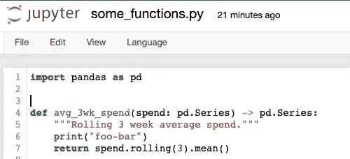
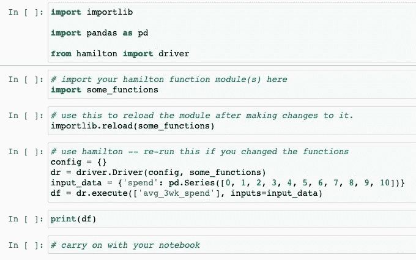

# 如何在笔记本上与汉密尔顿迭代

> 原文：<https://towardsdatascience.com/how-to-iterate-with-hamilton-in-a-notebook-8ec0f85851ed>

对于那些不知道的人来说， [Hamilton](https://github.com/DAGWorks-Inc/hamilton/) 是一个通用的微框架，用于指定数据流，例如指定 [Pandas](https://pandas.pydata.org/) 转换。它帮助你构建你的代码库，并改进你的代码，例如，你总是用 Hamilton 编写单元可测试转换代码。它通过引入一种范式来做到这一点，在这种范式中，函数必须以自以为是的、声明性的方式来编写。参见这篇 [TDS 帖子](/functions-dags-introducing-hamilton-a-microframework-for-dataframe-generation-more-8e34b84efc1d)获取更广泛的介绍。

使用 Hamilton 的一个开发含义是，它迫使您从一开始就将 python 函数组织成模块。如果在笔记本中迭代是您的开发方式，那么在笔记本环境中使用 Hamilton 似乎很困难。在本帖中，我将解释如何在笔记本上舒适地迭代汉密尔顿 DAG。

# 步骤 1 —安装 Jupyter & Hamilton

我假设您已经设置了这个步骤。但是以防万一你没有:

```
pip install notebook
pip install sf-hamilton
```

然后，要启动笔记本服务器，应该是:

```
jupyter notebook
```

# 步骤 2—设置文件

1.  启动你的 Jupyter 笔记本。
2.  转到您希望笔记本和 Hamilton 功能模块所在的目录。
3.  创建一个或多个 python 文件。通过“新建>文本文件”来完成。它将打开一个“文件”编辑器视图。给文件命名并给它一个`.py`扩展名。保存之后，您会看到 jupyter 现在提供了 python 语法高亮显示。保持此选项卡打开，以便您可以翻回到它来编辑此文件。
4.  启动将在另一个浏览器选项卡中使用的笔记本。

# 步骤 3——迭代的基本过程

概括地说，您将在选项卡之间来回切换。您将向汉密尔顿函数 python 模块中添加函数，然后将该模块导入/重新导入到笔记本中以获得更改。然后，您将像往常一样使用 Hamilton 来运行和执行事物，并使用笔记本来执行您使用笔记本执行的所有标准事物。

让我们看一个例子。

这是我添加到我们的哈密尔顿函数模块的一个函数。我将模块命名为`some_functions.py`(显然选择一个更适合您情况的名称)。

```
import pandas as pddef avg_3wk_spend(spend: pd.Series) -> pd.Series:
    """Rolling 3 week average spend."""
    print("foo") # will use this to prove it reloaded!
    return spend.rolling(3).mean()
```

下面是我在笔记本上设置的内容，以便能够使用 Hamilton 并导入该模块:

单元格 1:这只是导入了我们需要的基本东西。

```
import importlibimport pandas as pdfrom hamilton import driver
```

单元格 2:导入您的汉密尔顿功能模块

```
# import your hamilton function module(s) here
import some_functions
```

单元格 3:每当你对`some_functions.py`做出更改并保存时，运行这个单元格

```
# use this to reload the module after making changes to it.
importlib.reload(some_functions)
```

这样做的目的是重新加载模块，从而确保代码是最新的，以供您使用。

单元格 4:使用汉密尔顿

```
config = {}
dr = driver.Driver(config, some_functions)
input_data = {'spend': pd.Series([0, 1, 2, 3, 4, 5, 6, 7, 8, 9, 10])}
df = dr.execute(['avg_3wk_spend'], inputs=input_data)
```

运行该单元后，您应该会看到作为输出打印的`foo`。

好的，现在让我们说我们正在迭代我们的哈密尔顿函数。在另一个浏览器选项卡中，转到您的 Hamilton 功能模块(本例中为`some_functions.py`),将`print("foo")`更改为其他内容，例如`print("foo-bar").`保存文件——它看起来应该是这样的:

```
def avg_3wk_spend(spend: pd.Series) -> pd.Series:
    """Rolling 3 week average spend."""
    print("foo-bar")
    return spend.rolling(3).mean()
```

回到笔记本，重新运行单元 3 和单元 4。您现在应该会看到一个不同的输出，例如`foo-bar`。

恭喜你！你刚刚用 Jupyter 笔记本成功迭代了 Hamilton！

总结一下，在我看来事情是这样结束的:

*   下面是我的`some_functions.py`文件的样子:



作者图片

*   我的笔记本看起来是这样的:



作者图片

# 帮助:我正在使用谷歌 Colab，我不能做到以上几点

自从`1.8.0`发布以来，你现在可以用你的驱动程序内联定义函数来构建 DAG。*我们强烈建议只有在绝对必要的时候才使用这种方法*——用这种方法构建代码非常容易。

例如，假设我们想要添加一个函数来计算`avg_3wk_spend`的对数，而不是将其添加到`some_functions.py`，我们可以直接在笔记本中执行以下步骤:

```
# Step 1 - define function
import numpy as npdef log_avg_3wk_spend(avg_3wk_spend: pd.Series) -> pd.Series:
    “””Simple function taking the logarithm of spend over signups.”””
    return np.log(avg_3wk_spend)
```

然后我们必须创建一个“临时 python 模块”来存放它。我们通过导入`ad_hoc_utils`然后调用`create_temporary_module`函数，传入我们想要的函数，并为我们正在创建的模块提供一个名称。

```
# Step 2 - create a temporary module to house all notebook functions
from hamilton import ad_hoc_utils
temp_module = ad_hoc_utils.create_temporary_module(
     log_avg_3wk_spend, module_name='function_example')
```

现在，您可以像对待 python 模块一样对待`temp_module`,并将其传递给驱动程序，像平常一样使用 Hamilton:

```
# Step 3 - add the module to the driver and continue as usual
dr = driver.Driver(config, some_functions, temp_module) 
df = dr.execute(['avg_3wk_spend', 'log_avg_3wk_spend'], inputs=input_data)
```

## 这种方法的注意事项:

使用“临时 python 模块”不会通过在 Spark 上使用 Ray、Dask 或 Pandas 来实现计算的缩放。所以我们建议只将这种方法用于开发目的。

# 提示:你可以直接导入函数

将 Hamilton 函数放入一个模块的好处是，在另一个上下文中重用它非常容易。例如另一个笔记本，或者直接。

例如，很容易直接使用笔记本中的功能，就像这样:

```
some_functions.avg_3wk_spend(pd.Series([0, 1, 2, 3, 4, 5, 6, 7, 8, 9, 10]))
```

它调用我们在`some_functions.py`模块中定义的`avg_3wk_spend`函数。

# 提示:您可以使用 ipython magic 来自动加载代码

并排打开 Python 模块和 Jupyter 笔记本，然后将[% auto reload ipython magic](https://ipython.org/ipython-doc/3/config/extensions/autoreload.html)添加到笔记本以自动重新加载单元格:

```
from hamilton.driver import Driver

# load extension
%load_ext autoreload
# configure autoreload to only affect specified files
%autoreload 1  
# import & specify my_module to be reloaded 
# i.e. this is the data transformation module that I have open in other tab
%aimport my_module  

hamilton_driver = Driver({}, my_module)
hamilton_driver.execute(['desired_output1', 'desired_output2'])
```

然后，您将遵循以下流程:

1.  在 open python 模块中编写数据转换
2.  在笔记本中，实例化一个 Hamilton 驱动程序，并用一小部分数据测试 DAG。
3.  由于%autoreload，每次执行 Hamilton DAG 时，都会使用最新的更改重新导入模块。这种方法防止了无序的笔记本执行，并且函数总是驻留在干净的地方。py 文件。

鸣谢: [Thierry Jean 的博客文章](https://medium.com/@thijean/the-perks-of-creating-dataflows-with-hamilton-36e8c56dd2a)提供了这最后一个技巧。

# 最后

感谢你阅读这篇文章。我们很乐意帮助您成功使用汉密尔顿。欢迎在我们的 [github 知识库](https://github.com/DAGWorks-Inc/hamilton/)中留下问题/评论(我们也很喜欢⭐️！)，或者加入我们的 [slack 服务器](https://join.slack.com/t/hamilton-opensource/shared_invite/zt-1bjs72asx-wcUTgH7q7QX1igiQ5bbdcg)寻求帮助，或者提供建议/改进。