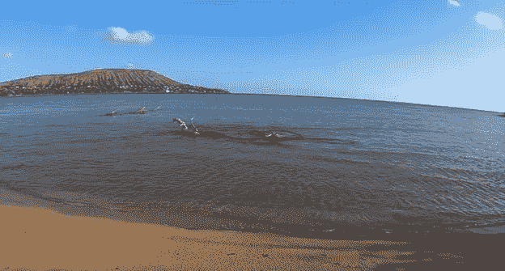
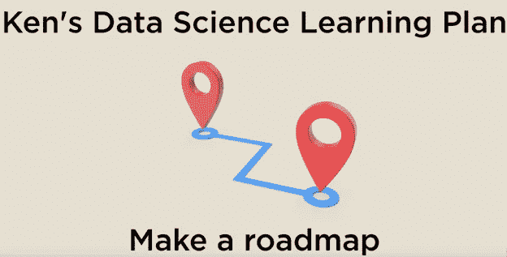
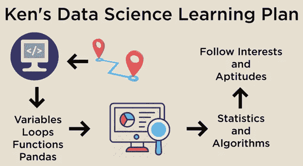

# 如果想完成目标，如何学习数据科学

> 原文：<https://towardsdatascience.com/how-to-learn-data-science-if-you-want-to-accomplish-your-goals-619b16552d77>

## 我向你展示如何从头开始规划你的旅程，这样你就有希望释放你的潜力

由 [Unsplash](https://unsplash.com/photos/qoAIlAmLJBU) 上的[奥克萨娜 V](https://unsplash.com/@arttravelling) 拍摄的照片

# 目录

1.  [学数据科学有可能吗？](#d220)
2.  [从哪里开始学习](#231e)
3.  [如何创建学习地图](#9f17)
4.  [我的学习地图会是什么样子？](#0a23)
5.  [开始项目之前…](#9529)
6.  [统计？？？](#831c)
7.  [项目执念](#0181)
8.  [如何有效利用项目](#146d)
9.  这需要多长时间？
10.  [关于目标的重要说明](#ed5d)
11.  [附录](#3191)

我喜欢定期更新自己的建议，告诉自己如何从零开始学习数据科学。数据领域变化很快，随着我自身知识的增长，我认为重新评估我推荐的方法很重要。

自从我之前努力传授这种智慧以来，我对学习数据科学的建议已经发生了变化。在这篇文章中，我给你我最新的方法，告诉你我将如何学习这个领域，并从中获得乐趣。作为免责声明，我不认为学习数据科学有一种“正确”的方法。不同的事情适合不同的人，你自己的尝试对你在任何职业中的成功都是不可或缺的。请务必阅读到最后，因为我回答了我在这个话题上最常被问到的问题:学习数据科学需要多长时间？

如果您喜欢视频格式，请点击此处观看:

# 学数据科学有可能吗？

首先，我想揭穿你可以“学习数据科学”的想法这意味着数据科学是一门静态学科，可以完整地学习。无论好坏，数据科学都在不断发展壮大。我不知道任何一个人，包括我自己，有可能了解整个领域。学习数据科学是一个旅程，而不是目的地，带着这种心态来学习可以让这个过程变得更加愉快。我看到很多学生被这个领域的巨大所淹没。如果你的目标是学习整个领域，这将是完全压倒性的。另一方面，如果你专注于一次只学一点点，并在头脑中有具体的小目标的情况下增长你的知识，这就变得容易管理了。

# 从哪里开始学习

话虽如此，让我们直接进入我想改变我以前的方法。回想起来，我对最开始的建议是非常模糊的。我通常会说类似“学习足够的 Python 和统计学来开始项目。”虽然这是个不错的建议，但这一次我想深入了解你应该如何开始这个学习过程。

作者图片

真正的第一步是了解该领域的组成部分，并为自己制定一个学习计划来导航旅程。如果我们没有任何明确的方向就跳进海里开始游泳，我们真的很容易累坏，可能会放弃。另一方面，如果我们有一张地图和一个明确的目标，我们至少知道我们正在进入什么。在做任何其他事情之前，您需要为您的数据科学学习创建此地图。真正酷的部分是，通过创建这个地图，你还会学到很多关于数据科学领域的知识。

作者图片

# 如何创建学习地图

那么，我该如何创建地图呢？有两种方法可以做到这一点，这两种方法在高空作业的水平上有所不同。最简单的方法是参加一个为你准备的在线课程或证书。这就是在线课程的巨大好处:它们可以为你规划出完整的学习路径，所以你只需要跟着走就行了。另一方面，它们要花钱。如果你愿意花时间为自己创建这个路线图，所有的信息都是免费的。明确一点，这里没有对错。不管你是否决定付钱给一个组织，做对你来说值得的事情。如果课程是你的速度，我在下面的附录中有 365 DataScience 的折扣代码；如果没有，我已经包含了一些链接到我最喜欢的免费资源。

下一个方法是查看多个在线课程、大学课程和其他资源，并大致了解它们是如何规划道路的。大多数付费课程让你了解课程的结构。然后，您可以基于您在那里看到的类和概念制定自己的路线图。通过这样做，您还可以感觉到该领域需要什么技能和技术。有趣的是，你可以看到什么是最有趣的，最吸引你的，并据此调整你的路线图。这对以后真的很重要。

# 我的学习地图会是什么样子？

好了，让我们为自己设定一个学习计划。我鼓励你在这里做你自己的研究，并根据你的兴趣和能力进行调整。

如果我为自己制定一个学习计划，我几乎肯定会从学习 Python 开始。编码语言允许你构建东西。如果你能建造东西，你几乎可以把你正在做的任何东西应用到实际问题中。我认为学习编程就像构建我的工具集一样。我可以赤手空拳搭建一个棚子，但是用锤子和电钻要容易得多。Python 是我的动力工具。我个人几乎总是觉得，与数学相比，编程是阻碍我提高学习速度的原因。需要说明的是，数学非常重要，我个人不会首先关注它。

对于编程，我会确保自己对变量、循环和函数等基础知识有扎实的理解。我也会非常专注于学习如何使用像 pandas 这样的导入库。事实上，我建议尽可能多的浏览熊猫文档。在我看来，为数据科学编码并不是真正的编码。你更多地利用其他人为特定目的而构建的工具。例如，我认为对熊猫的深刻理解会比对纯 Python 的非凡理解更好地服务于大多数数据科学家。我在下面的附录中包含了一些学习 Python 的免费和付费资源。另外，如果你对我学习编码的方法感兴趣，[看看我写的这篇关于这个问题的文章](/how-i-would-learn-to-code-if-i-had-to-start-over-607428f14266)。

# 在您开始项目之前…

以前，我会告诉你在此之后立即开始项目。在这篇文章中，我会为大多数人推荐一个额外的步骤。我收到了大量的反馈，说大多数人在学习了这些基本技能后，不知道从哪里开始做项目。有一个很好的解决方法。看看别人的项目。你可以去 Kaggle 看看其他人做过的项目。你可以看到他们所有的代码和他们留下的关于他们思维过程的评论。对我来说，这绝对是一座金矿。你可以坐在前排观看杰出的数据科学家如何解决问题。我肯定不聪明，但这里有一个我走过泰坦尼克号数据集的视频:

当开始做项目时，它们不一定是原创的。你可以像其他人一样进行完全相同的分析，仍然可以学到一些东西。一个典型的学习会议可能就是你在屏幕的一半上有别人的项目，然后一行一行地输入，在屏幕的另一半上运行。当你这样做的时候，你可以改变参数，尝试不同的视觉效果，看看它是如何工作的。很明显，你不应该把这项工作的功劳据为己有，也不应该把它作为自己的作品发表，但是你绝对可以通过这种方式从中学习。许多人认为他们用这种方法学不到任何东西，但我个人就是这么做的，这是最近让我走得最远的一件事。

当你浏览这些不同的练习册时。您将不可避免地开始看到您不熟悉的不同工具、算法和技术。你应该记下这些，并研究它们是什么。

# 统计？？？

好了，现在你开始熟悉这个过程了。我建议开始熟悉一些您将使用的统计数据和算法。你需要对统计学有一个坚实的基础理解(例如，集中趋势，概率论等。)、线性代数和微积分(你可能会等一会儿再看这个)。开始了解分类、回归和聚类算法之间的区别，并开始思考可以用这些算法解决的问题类型。有没有你看到的可以应用这些算法的数据集？你有没有可以在这些类别中找到答案的问题？

# 项目困扰

这就是项目成为我学习的主要焦点的地方。我会做尽可能多的项目。我会用我自己的数据，用我能找到的任何数据，在 Kaggle 上做。在下面的附录中，我添加了一些数据科学项目的视频播放列表。

我的数据教授朋友说，学习数据科学的最好方法是做数据科学，我非常同意。项目是你做真正的数据科学的第一个地方。早些时候，我提到反思数据科学的哪些部分让你感到兴奋非常重要。这就是它发挥关键作用的地方。在早期阶段，你应该把你的项目集中在你感兴趣的事情上。对一个项目来说，你能做的最重要的事情就是在这个项目上取得进展。如果你对这个话题或你正在使用的技术足够兴奋，你就尽可能地增加了你学到更多东西的机会。

# 如何有效地利用项目

在学习了 Python 的基础知识并做了一些项目之后，世界真的是你的了。我建议多做一些专注于技能的项目，这些技能与你自己的旅程相关。比如在大多数公司，SQL 真的很重要。如果你的目标是找一份工作，那就非常值得去做。我没有从 SQL 开始，因为我认为与 Python 相比，它非常容易学习，如果你能学习 Python，你应该能很快学会 SQL。如果你对图像分析着迷，你可能应该将你的学习和项目导向深度学习或其他一些技术。

正如你所知道的，在某个时间点之后，你真的需要调整你的计划来适应你的确切兴趣和能力。你可能不想听到这些，但这是你需要为自己做的事情。

作者图片

这就是事情的全部。如果我想在这之后学习一项新的技能或技术，我会仔细阅读并尝试尽快应用。你的项目和工作成为你过去如何使用许多算法或技术的参考。

随着您的成长，您的迭代循环变得更加紧密，您希望将更多的精力放在良好的学习习惯上。我创建了#66DaysOfData 来帮助在这个过程中保持好习惯。欢迎你随时加入这个项目，我在附录中留下了一些关于它的链接。

# 这需要多长时间？

你们中的大多数人可能想知道:这个过程需要多长时间？这是一个非常困难的问题。说实话，我认为你可以在短短 3 个月内很好地了解基础知识并做项目。不过，大多数人可能需要 6 个月左右的时间。我真的不建议太专注于需要多长时间。这是一个终身学习的过程，所以只要掌握了知识，3 个月，6 个月，1 年，甚至 5 年都不重要。

# 关于目标的重要说明

我想结束的一件事是目标的概念。当你创建路线图时，开始思考你的学习目标。你想学习什么概念，想做什么分析？大多数人学习数据科学不应该只是为了了解材料，而应该是你想要使用这些技能来实现的东西。当你学习的时候记住这些事情，但是不要害怕做出相应的调整。如果你一开始对这个领域知之甚少，你怎么可能设定准确的目标呢？随着你在这个领域的不断成长，你的目标设定、你的项目和你的学习必须不断发展。我看到很多人感到失望，当他们真的不知道他们实际上开始要做什么的时候，他们没有完成他们开始要做的事情。

这可能是一些额外的工作，但我建议再次阅读这篇文章，思考你的学习计划。在下面分享你的计划和目标，这样我们就可以互相问责了！

如果您喜欢这篇文章，请记得在 Medium 上关注我以获取更多类似内容，并注册我的简讯以获取我的内容创作和数据科学行业其他学习资源的每周更新！此外，考虑通过注册会员来支持我和成千上万的其他作家[。](https://medium.com/@kenneth.b.jee/membership)

非常感谢您的阅读，祝您在数据科学之旅中好运！

# 附录

学习数据科学的资源:

*   (付费)365 数据科学(年优惠 57%；这是一个附属链接):【https://365datascience.pxf.io/P0jbBY】T4
*   (免费)[https://kaggle.com/](https://www.youtube.com/redirect?event=video_description&redir_token=QUFFLUhqa2gyY094a3lQOWMxV016RWJoWU9fZHJaZENFd3xBQ3Jtc0tsWklJb1A4VV9RUnhvZU5PMVh6aW1XZ0t6UmwwUktkRm9USzlfM2VWc04tWVdveFpmR1FrODJSLUlYSnQ5QktVZkUxOW5seWFnV0pycGYtZnJlSXdNUHZKWGpFQmJORkEzQnNZQWU4T0NodktfLUFyOA&q=https%3A%2F%2Fkaggle.com%2F)
*   【https://www.freecodecamp.org/】

学习编程的资源:

*   (付费)365 数据科学(年优惠 57%；这是一个附属链接):【https://365datascience.pxf.io/P0jbBY】T4
*   (免费)[https://www.learnpython.org/](https://www.youtube.com/redirect?event=video_description&redir_token=QUFFLUhqbF94ejhfTXVmSzZNLVA3SEpzd2RTa004cGxBZ3xBQ3Jtc0ttWkVVNUh0aGhoU0Z0Nk9iVERfejJLQTZTeUp3RF9EckpHYlJFSUtJWE51c21OcklKd0cxd3Q0elBPSi1WNHpMaEY5azg4TW5ycG8xTmVSNGYxS0pIT3RyUGhNbzMyUkYyZHg4ZWZPNEVKQVI3bUZDVQ&q=https%3A%2F%2Fwww.learnpython.org%2F)
*   [(免费)](https://www.python.org/about/gettingstarted/)

熊猫文献:[https://pandas.pydata.org/docs/](https://pandas.pydata.org/docs/)

数据科学项目播放列表:

*   数据科学项目初学者播放列表:[https://www.youtube.com/watch?v=sq5Tn…](https://www.youtube.com/watch?v=sq5TnVJWv6A&list=PL2zq7klxX5ASt4dLSAd2FMoY3Og3V0jZv&t=0s)
*   数据科学项目播放列表:[https://www.youtube.com/watch?v=pPfw2…](https://www.youtube.com/watch?v=pPfw2fzwNiM&list=PL2zq7klxX5AReJn7nZfqOKLZ3IpKj7fwc)

[# 66 days ofdata](https://www.youtube.com/hashtag/66daysofdata):【https://www.youtube.com/watch?v=qV_Al...】T4