# 如何学习来自多个领域的不平衡数据

> 原文：<https://towardsdatascience.com/how-to-learn-imbalanced-data-arising-from-multiple-domains-7d0c0d6e3c17>

## 多领域长尾识别、非平衡领域推广及超越(ECCV 2022)

给大家介绍一下我们的新工作，已经被 ECCV 2022 接受: [**关于多领域长尾识别、不平衡领域泛化和超越**](https://arxiv.org/abs/2203.09513) 。顾名思义，这项工作的问题是，当存在来自多个域的数据，并且每个域都可能存在(潜在不同的)数据不平衡时，如何学习一个健壮的模型。现有的处理不平衡数据/长尾分布的方法只针对**单域**，即数据来源于同一个域；然而，自然数据可能来自 ***不同的*域**，其中一个域中的少数类可能有来自其他域的大量实例。有效地利用来自不同领域的数据可能会提高所有领域的长尾学习的性能。本文推广了传统不平衡分类问题的范式，将其从**单**域推广到**多域**。

我们首先提出 ***领域类可迁移性图*** ，量化了数据不平衡情况下不同领域类对之间的可迁移性。在这个图中，每个节点指的是一个域类对，每个边指的是嵌入空间中两个域类对之间的距离。我们证明了可迁移性图决定了跨领域不平衡学习的性能。受此启发，我们设计了 **BoDA** ，一个理论上跟踪可转移性统计量上限的损失函数，以提高模型性能。我们构建了五个新的多域不平衡数据集，并对大约 20 个算法进行了比较。代码、数据和模型已经在 GitHub 上开源:[https://github.com/YyzHarry/multi-domain-imbalance](https://github.com/YyzHarry/multi-domain-imbalance)。

# 背景和动机

现实世界中的数据经常表现出标签不平衡，而不是在类之间均匀的标签分布，事实上，数据本质上是不平衡的:少数类包含大量实例，而许多其他类只有少量实例。为了处理这种现象，已经提出了许多解决数据不平衡的方法。更详细的回顾可以在我的[上一篇文章](/struggling-with-data-imbalance-semi-supervised-self-supervised-learning-help-4de8b8f23490)中找到。

但是，现有的不平衡数据学习的解决方案主要考虑的是*单域*的情况，即*所有样本来自同一数据分布*。然而，在现实中，同一任务的**数据可能来自不同的域**。例如，下图显示了 Terra Incognita，这是一个为野生动物识别&分类收集的真实数据集。左图是在不同地点设立的相机陷阱，以及捕捉到的野生动物样本；右图显示了(部分)不同摄像机位置获得的具体数据分布及其拍摄效果。我们可以清楚地看到，即使是同样的野生动物分类任务，不同相机的参数、拍摄背景、光照强度等。 ***与*** 完全不同；即不同相机陷阱之间存在一个**畴隙**。而且由于有些动物只出现在特定的位置，这进一步导致了对于一个摄像机(域)的**数据不平衡**，甚至存在对于某些类别的 ***无数据*** (比如位置 100 对于类别 0 和 1 几乎没有数据)。然而，由于不同摄像机捕获的标签分布通常差异很大，这也意味着其他属性域可能具有这些类别中的许多样本-例如，位置 46 具有更多类别 1 数据。这表明我们可以利用*多域数据来解决 ***各域*** 内部固有的数据不平衡。*

*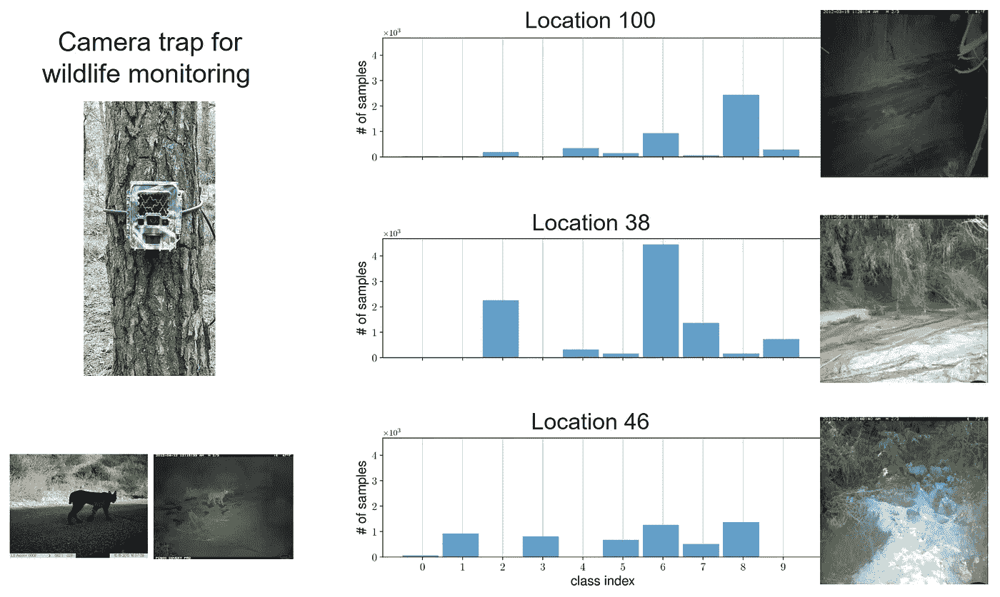*

*未知领域数据集。即使是同样的野生动物分类任务，参数、拍摄背景、光照强度等。不同相机的拍摄效果可能完全不同。每个相同的摄像机获得的数据也是极不平衡的；再者，不同相机拍摄到的标签分布也大相径庭，不匹配。但它也说明了我们可以利用多域数据来解决每个域中固有的数据不平衡。(图片由作者提供)*

*同样，在其他实际应用中也会出现类似的情况。例如，在视觉识别问题中，来自“*照片*图像的少数类可以用来自“*草图*图像的潜在丰富样本来补充。同样，在自动驾驶中，“*真实*生活中的少数事故类别可以通过“*模拟*中产生的事故来丰富。此外，在医学诊断中，来自不同人群的数据可以相互增强，来自一个机构的少数群体样本可以用来自其他机构的实例来丰富。在上面的例子中，不同的数据类型充当**不同的域**，这样的多域数据可以用来解决每个域中固有的数据不平衡。*

*因此，在本工作中，我们将**多域长尾识别(MDLT)** 问题公式化为从多域不平衡数据中学习，每个域都有其自己的不平衡标签分布，并推广到在 ***所有域类对*** 上平衡的测试集。MDLT 的目标是从多个不同领域的不平衡数据中学习，解决*标签不平衡*、*域转移*和*跨域的不同标签分布*，并推广到所有域的整个类别集。*

*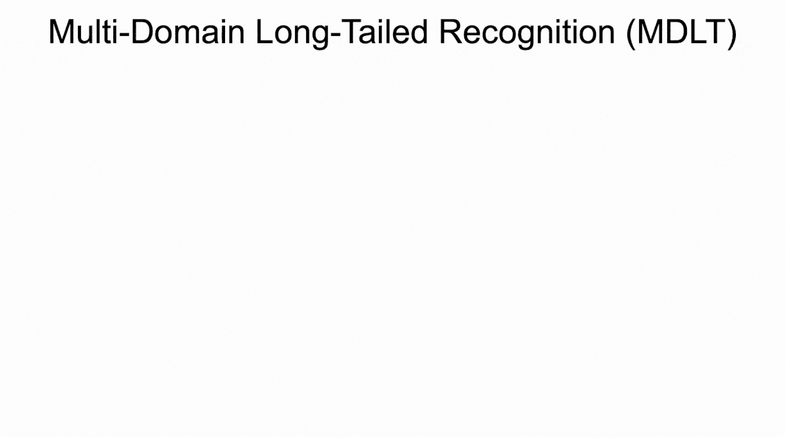*

*多域长尾识别(MDLT)从多域不平衡数据中学习，解决跨域的标签不平衡、域移位和发散标签分布，并推广到所有域类对。(图片由作者提供)*

# *多领域不平衡学习的挑战*

*然而，我们注意到，MDLT 带来了不同于其单一领域对手的新挑战。*

***(I)** 首先，每个域的 ***标签分布很可能与其他域的*** 不同。例如，在上面的 gif 图中，“*照片*”和“*漫画*”域名呈现出不平衡的标签分布；然而，“*漫画*”中的“马”类比“*照片*”中的样本要多得多。除了域内数据不平衡之外，这还带来了跨域的**不同标签分布的挑战**。*

***(二)**二、多域数据内在涉及*。简单地将不同的领域作为一个整体来对待，并应用传统的数据不平衡方法不太可能产生最好的结果，因为领域差距可以任意大。**

****(III)** 第三，MDLT 自然地激发了 内的*****和*** 域间的***——即概括为域内缺失类(gif 图右部)，以及没有训练数据的 ***新域*** ，其中后一种情况通常表示为**域概括(DG)** 。*******

***综上所述，与传统的单领域不平衡分类相比，MDLT 面临着新的困难和挑战。那么，应该怎么做多领域不平衡学习呢？在接下来的两节中，我们将从整体建模、激励示例、观察到的现象、理论推导，到最终损失函数的设计，逐步分析这个问题，并最终在 MDLT 任务上提高模型性能。***

# ***领域类可转移图***

***这里我们首先提出一组定义来模拟 MDLT 问题。我们认为，与单领域不平衡学习相反，在单领域不平衡学习中，人们关心的基本单元是 T21，在 MDLT，基本单元自然地转化为领域类对。***

***那么当我们从“领域类对”入手，就可以衡量它们之间的可转移性(相似性)，可转移性定义为嵌入空间中不同领域类对之间的距离:***

***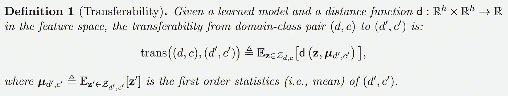***

***(图片由作者提供)***

***直观上，两个领域类对之间的 ***可转移性*** 是它们的学习表示之间的**平均距离，表征它们在特征空间中的接近程度。默认选择 *d* 作为欧氏距离，但也可以表示( *d，c* )的高阶统计量。例如，马氏距离使用协方差。那么，基于可转移性，我们可以进一步定义 ***可转移性图:********

***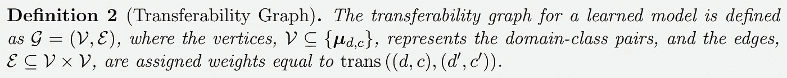***

***(图片由作者提供)***

***在可转移性图中，每个*节点*表示一个领域类对，每个*边*表示嵌入空间中两个领域类对之间的距离(即可转移性)。此外，我们可以使用多维标度(MDS)在 2D 空间中可视化该图。***

***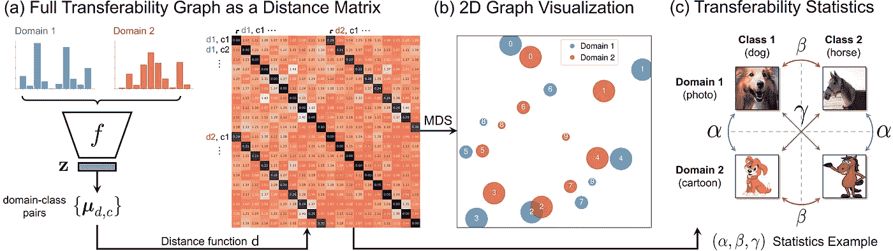***

***可转移性图的总体框架。(a)为所有域类对计算分布统计，由此我们生成完整的可转移性矩阵。(b) MDS 用于将图形投影到 2D 空间中进行可视化。(c)我们定义了(α，β，γ)可转移性统计量来进一步描述整个可转移性图。(图片由作者提供)***

***具体来说，如上面的图(a)(b)所示，对于每个域类对，我们可以计算特征统计(均值、协方差等)。)属于这个域类对的所有数据。然后对于不同的域类对，我们进一步计算对之间的可转移性，从中生成一个完整的可转移性图，用矩阵表示(图 a)。然后，我们可以使用多维标度(MDS)在 2D 平面上可视化这种相似性。在图 b 中，我们可以看到不同的域用不同的颜色标记，每个点代表一个域类对，它的大小代表包含的数据量，数字代表具体的类别；而它们之间的距离可以看作是可转移性。很明显，我们希望同号(也就是同一个类别)的域类对靠得更近，而不同类别的域类对离得更远。这种关系可以进一步抽象为三种可转移性统计量:*异域同类* ( ***α*** )、*异类同域* ( ***β*** )、以及*异类异域* ( ***γ*** ):***

***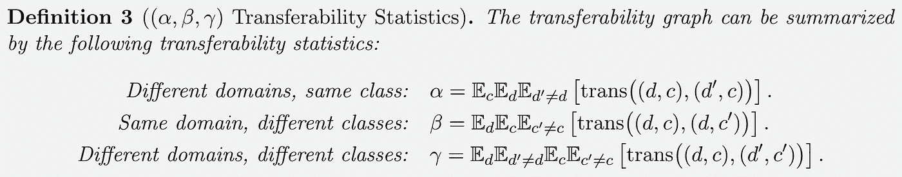***

***(图片由作者提供)***

***到目前为止，我们已经对 MDLT 进行了建模和数学定义。接下来，我们将进一步探讨可转移性(统计数据)和最终 MDLT 性能之间的关系。***

# ***在 MDLT，什么是好的代表？***

## ***分散的标签分布妨碍了可转移的特征***

***MDLT 必须处理跨域标签分布之间的差异。为了理解这个问题的含义，我们从一个例子开始。***

*****激励范例**。我们构建了*数字-MLT* ，一个双域玩具 MDLT 数据集，它结合了两个数字数据集:MNIST-M 和 SVHN。任务是 10 类数字分类。我们手动改变每个域类对的样本数量，以模拟不同的标签分布，并针对每种情况使用经验风险最小化(ERM)来训练普通的 ResNet-18。我们保持所有测试集的平衡和一致。结果揭示了有趣的观察。当跨域的每个域的标签分布是**平衡的**和**相同的**时，尽管存在域间隙，但这并不禁止模型学习高准确度(90.5%)的区别特征，如图 a 所示。如果标签分布是**不平衡的**但**相同的**，如图 b 所示，ERM 仍然能够在两个域中对齐相似的类，其中多数类(例如类 9)在可转移性方面比少数类(例如类 9)更接近相比之下，当标签都是跨域的**不平衡**和**不匹配**时，如图 c 所示，学习到的特征是 ***不再可转移*** ，导致跨域的**间隙**和最差的准确度。这是因为*跨域的发散标签分布*产生了不期望的捷径；该模型可以通过简单地分离两个域来最小化分类损失。***

***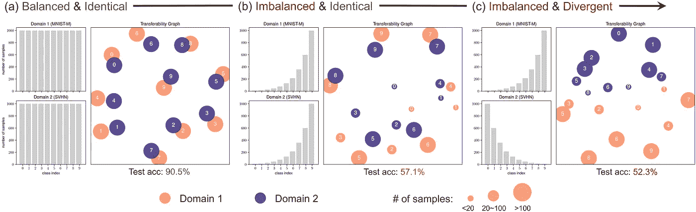***

***当数字的标号比例变化时，可转移性图形的演变模式——MLT。(a)两个域的标签分布是平衡且相同的。(b)两个域的标签分布不平衡但相同。两个域的标签分布是不平衡和发散的。(图片由作者提供)***

***可转移的特征是可取的。结果表明，需要*可转移特征*跨( *d，c* )对，尤其是出现不平衡时。特别地，跨域的同一类之间的可转移性链接应该大于域内或跨域的不同类之间的可转移性链接。这可以通过( *α，β，γ* )可转移性统计来捕获，如下所示。***

## ***可迁移性统计特征概括***

*****激励的例子。**同样，我们使用具有不同标签分布的*数字-MLT* 。我们考虑**三种不平衡类型**来组成不同的标签配置:(1) **统一**(即平衡标签)，(2) **前向-LT** ，其中标签在类 id 上呈现长尾，以及(3) **后向-LT** ，其中标签相对于类 id 是反向长尾。对于每种配置，我们用不同的超参数训练 20 个 ERM 模型。然后，我们计算每个模型的( *α，β，γ* )统计量，并绘制其相对于*(β+γ)——α*的分类精度。***

***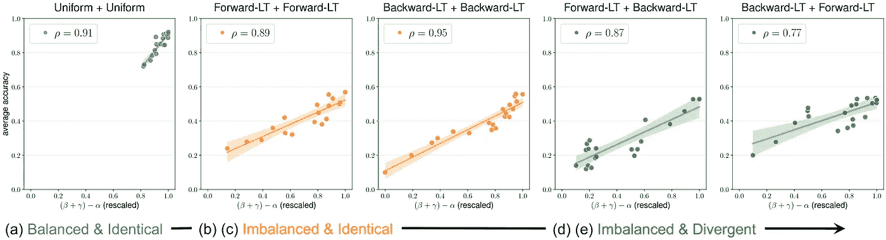***

***(β+γ)α数量与不同数字标签配置测试准确度之间的对应关系-MLT。每个图表示两个域的特定标记分布(例如,( a)对域 1 采用“统一”,对域 2 采用“统一”)。每个点对应一个使用不同超参数的 ERM 训练模型。(图片由作者提供)***

***它揭示了多个有趣的发现:**(1)****α，β，γ* ***统计数据表征了一个模特在 MDLT*** 的表现。特别是,(β+γ)α量在整个范围和每种标签配置中与测试性能表现出非常强的相关性。 **(2)** ***数据不平衡增加了学习较少可转移特征的风险。*然而，随着标签变得不平衡(图 b、c)和进一步发散(图 d、e)，模型学习不可转移特征(即较低的*(β+γ)——α*)的机会增加，导致性能大幅下降。******

## ****限制可转移性统计的损失****

****我们利用上述发现来设计一个特别适合 MDLT 的新损失函数。我们将首先引入损失函数，然后证明它最小化( *α，β，γ* )统计量的上界。我们从一个简单的损失开始，这个损失是由公制学习目标激发的。我们将这种损失称为 L_{DA}，因为它旨在实现域类分布对齐，即跨域对齐同一类的特征:****

****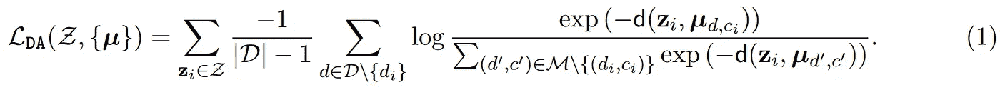****

****(图片由作者提供)****

****直观上，这种损失解决了 ***标签发散*** ，因为共享同一类的( *d，c* )对将被**拉近**，反之亦然。也与( *α，β，γ* )统计有关，因为分子代表 ***正*** *跨域对* ( *α* )，分母代表 ***负*** *跨类对* ( *β，γ* )。****

******但是**，并没有解决标签不平衡的问题。注意( *α，β，γ* )是以*方式定义的，与每个( *d，c* )的样本数无关。然而，给定一个**不平衡的**数据集，大多数样本将来自*多数*域类对，这将主导损失并导致*少数*对被忽略。*****

******平衡域级分布比对**。为了解决( *d，c* )对之间的数据不平衡，我们将损耗修改为 BoDA 损耗:****

****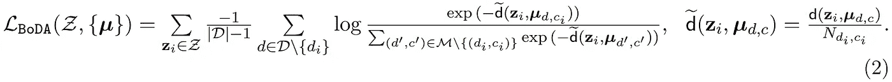****

****(图片由作者提供)****

****BoDA 通过因子 *1/N_{d，c}* 缩放原始的 *d* ，该因子是域类对中的样本数( *d，c* )。因此，它通过引入一个**平衡的** *距离度量*来抵消**不平衡的**域类对的影响。对于博达，我们有以下定理:****

****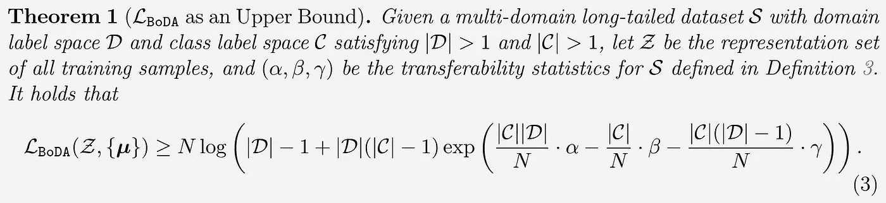****

****(图片由作者提供)****

****请参考[我们的论文](https://arxiv.org/pdf/2203.09513.pdf)了解证明细节。定理 1 具有以下有趣的含义:****

1.  *******BoDA 上界(*** *α，β，γ* ***)以期望的形式统计，自然转化为更好的性能*** 。通过最小化 BoDA，我们保证一个 ***低*** *α* (吸引相同阶层)和 ***高****、γ (分开不同阶层)，这是在 MDLT 推广的必要条件。*****
2.  ********常数因子对应于各成分对可转移性图形*** 的贡献大小。放大 *exp( )* 的论点，我们观察到目标与*α(β* 1/| D |+γ*(| D | 1)/| D |)*成正比。根据定义 3，我们注意到 *α* 总结了**相同类别**的数据相似性，而后一个表达式使用 *β* 和 *γ* 的**加权平均值**总结了不同类别的数据相似性**，其中它们的权重与关联域的数量成比例。*******

## ****针对数据不平衡的校准导致更好的传输****

****BoDA 的工作原理是鼓励 ***特征跨*** 域转移相似的类，也就是说，如果( *d，c* 和(*d′，c* )在不同的域中引用同一个类，那么我们希望将它们的特征互相转移。**但是**、*少数*领域类对自然会有**更差的**特征估计，这是由于*数据稀缺、*以及强迫其他对转移给它们会损害学习。因此，当在嵌入空间中拉近两个域类对时，我们希望少数的*(*d，c* )转移到多数的*中，而不是相反。******

****这里有很多细节，我就直接跳过了。在[我们的论文](https://arxiv.org/pdf/2203.09513.pdf)中给出了详细的激励示例和解释。结论是通过给 BoDA 增加一个*校准项*，可以通过两个域类对的**相对样本大小来控制*转移度*:******

****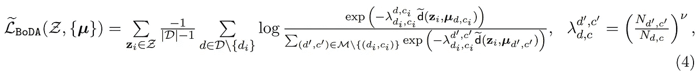****

****(图片由作者提供)****

# ****基准 MDLT 数据集和实验****

****为了支持多领域不平衡学习方法的实际评估，并促进未来的研究，我们从现有的多领域数据集筛选了五个 MDLT 基准:****

****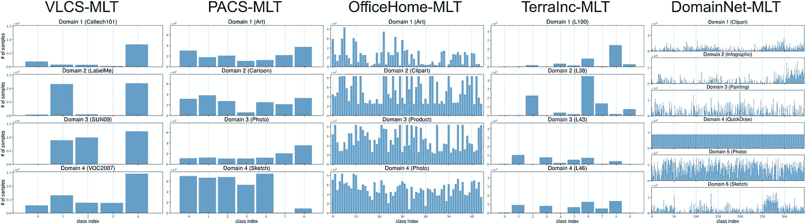****

****(图片由作者提供)****

****此外，我们选择了 **~20 种算法**，涵盖了多领域学习、分布式鲁棒优化、不变特征学习、元学习、不平衡学习等多个类别。作为基线比较，以及*每个算法的优化超参数*。这样的过程确保了比较是最佳对最佳的，并且超参数对于所有算法都是优化的。****

****在评估期间，我们报告跨域的平均**准确度*；我们还报告了域上最差的**精度*，并将所有域类对进一步划分为*多射*(超过 100 个训练样本的对)、*中射*(20∾100 个训练样本的对)、*少射*(20 个训练样本以下的对)和*零射*(没有训练数据的对)，并报告结果******

******实验**:由于实验很多，这里只展示有代表性的结果(所有结果请参考论文)。首先，BoDA 在所有数据集上始终保持**最佳**平均准确度**。它还在大多数情况下实现了**最佳** **最坏**精度。此外，在某些数据集上(例如，OfficeHome-MLT)，MDL 方法表现更好(例如，CORAL)，而在其他数据集上(例如，TerraInc-MLT)，不平衡方法实现更高的增益(例如，CRT)；然而，不考虑数据集，BoDA *优于所有方法*，突出了其对于 MDLT 任务的有效性。最后，与 ERM 相比，BoDA 略微提高了平均和多次拍摄的性能，而*大大提高了*中镜头、少镜头和零镜头对的性能。******

****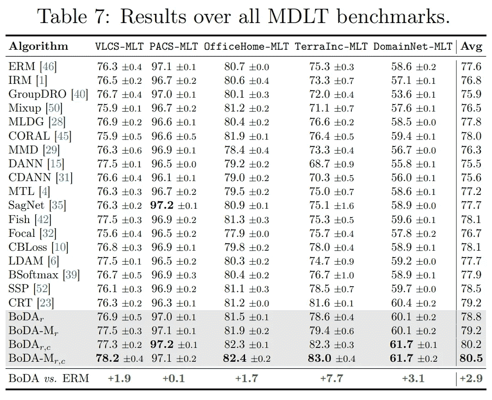****

****(图片由作者提供)****

******理解博达的分析**:我们对博达进行进一步分析。我们绘制了通过 BoDA 学习的可迁移性图，并在不同的跨域标签分布下与 ERM 进行了比较。从下图可以看出，博达学习了一个更平衡的特征空间来区分不同的类别。当标签分布**平衡**和**相同**时，ERM 和博达都能学习到好的特性；当标签开始**不平衡** (b，c)，甚至**不匹配**跨域(d，e)时，ERM 学习到的可迁移性图中有一个*明显的域缺口*；相比之下，博达总能学习到一个**平衡的**和**对齐的**特征空间。因此，更好的学习特征转化为更好的精度(9.5%的绝对精度增益)。****

****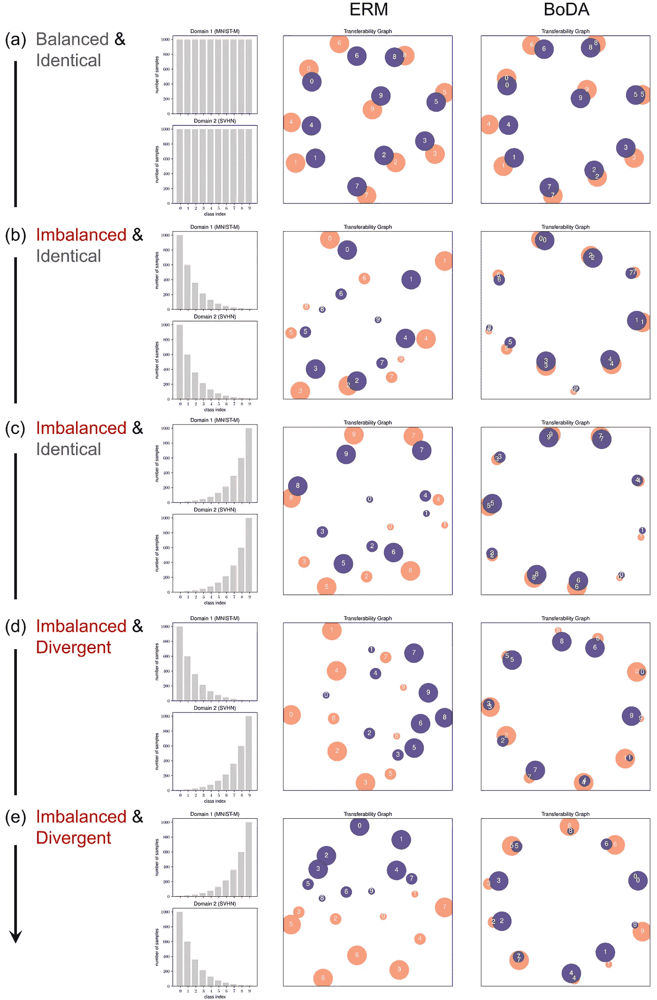****

****(图片由作者提供)****

## ****超越 MDLT:不平衡的领域泛化****

****领域泛化(DG)是指从多个领域学习，并泛化到看不见的领域。由于学习域的标签分布自然不同，甚至可能在每个域中存在类别不平衡，我们研究 BoDA 是否可以提高 DG 的性能。请注意，我们为 MDLT 调整的所有数据集都是 DG 的标准基准，这证实了数据不平衡是 DG 中的固有问题，但被过去的工作忽略了。****

****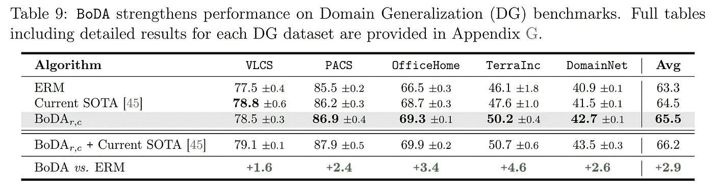****

****(图片由作者提供)****

****我们按照标准的 DG 评估测试 BoDA。上表揭示了以下发现:首先， **BoDA 单独使用**可以在五个数据集中的四个上改善当前的 SOTA，并实现**显著的**平均性能增益。此外，**将**与当前的 SOTA 相结合，博达在所有数据集上进一步显著提高了结果，表明**标签不平衡与现有的 DG 特定算法**正交。最后，与 MDLT 相似，增益取决于数据集内不平衡的严重程度 TerraInc 显示出跨域的最严重的标注不平衡，而 BoDA 在这方面的增益最高。这些有趣的结果揭示了**标签不平衡如何影响分布外泛化**，并强调了**整合标签不平衡对于实际 DG 算法设计的重要性**。****

# ****结束语****

****作为本文的总结，我们提出了(1)一个称为多域长尾识别(MDLT)的**新任务**,( 2)一个新的**理论上保证损失**函数 BoDA 来建模和改进 MDLT，以及(3)五个**新基准**来促进未来对多域不平衡数据的研究。此外，我们发现标签不平衡影响分布外泛化，实际和稳健的 DG 算法设计也需要纳入标签不平衡的重要性。最后，我附上了几个与本文相关的链接；感谢阅读！****

******代号**:[https://github.com/YyzHarry/multi-domain-imbalance](https://github.com/YyzHarry/multi-domain-imbalance)****

******项目页面**:[http://mdlt.csail.mit.edu/](http://mdlt.csail.mit.edu/)****