# 如何轻松学习新的编程语言

> 原文：<https://towardsdatascience.com/how-to-learn-new-programming-languages-easily-1e6e29d3898a>

## 学习任何新的编程语言——例如 Python、Java 和 Go

阿诺·弗朗西斯卡在 [Unsplash](https://unsplash.com?utm_source=medium&utm_medium=referral) 上的照片

经历了在大学学习编程语言，通过各种电子学习平台，并在极少的指导下投入到研究生项目中(包括教授自己开发的[超级利基“编码语言”](https://pat.comp.nus.edu.sg/))，我注意到不同编程语言的共同之处。

如果你已经知道至少一种编程语言，那么对比其他语言会让你更容易掌握。如果你没有——希望这篇文章将“学习如何编码”的抽象概念分解成更小的基本块。

这篇文章将涉及不同类型的编程语言，如何接近一种(新的)编程语言，编程语言的基本组成部分，以及最后如何设置您的笔记本电脑并运行代码！这些都将用 Python、Java 和 Go 中的例子来解释。

# 目录

1.  [声明式与命令式编程范例](https://medium.com/p/1e6e29d3898a/#8c37)
2.  [编译语言与解释语言](https://medium.com/p/1e6e29d3898a/#5b23)
3.  [打印和注释](https://medium.com/p/1e6e29d3898a/#7e01)
4.  [数据类型](https://medium.com/p/1e6e29d3898a/#6396)
5.  [条件和循环](https://medium.com/p/1e6e29d3898a/#9f31)
6.  [功能和类别](https://medium.com/p/1e6e29d3898a/#da22)
7.  [进口](https://medium.com/p/1e6e29d3898a/#7cf8)
8.  [设置和运行代码](https://medium.com/p/1e6e29d3898a/#f642)

# 声明式与命令式编程范例

> 了解编程范式的类型可以让我们知道编程语言的用途，以及代码是如何组织和执行的。

有两种编程范例——声明式和命令式。

*   [说明性](https://en.wikipedia.org/wiki/Declarative_programming):描述 ***程序做什么***；一组结果
*   [命令式](https://en.wikipedia.org/wiki/Imperative_programming):描述*程序应该怎么做；指令系统*

*声明式编程范例的子集包括[函数式](https://en.wikipedia.org/wiki/Functional_programming)、[数学式](https://en.wikipedia.org/wiki/Mathematical_programming)、[逻辑式](https://en.wikipedia.org/wiki/Logic_programming)和[反应式](https://en.wikipedia.org/wiki/Reactive_programming)编程。它试图执行操作，但不控制操作如何发生或操作的执行顺序。*

*命令式编程范例的子集包括[过程式](https://en.wikipedia.org/wiki/Procedural_programming)和[面向对象的](https://en.wikipedia.org/wiki/Object-oriented_programming)编程。它试图控制操作发生的顺序。*

*由于 Go 是一种过程化编程语言(我们后面会看到这是什么意思)，所以它是命令式编程。而 Python 和 Java 是多范式语言，这意味着它们根据您的编程需求支持声明式和命令式编程范式。*

# *编译语言与解释语言*

> *理解代码执行的幕后发生了什么*

*编译语言和解释语言的区别在于代码是如何执行的。*

*   *编译语言:需要一个**编译器**将[源代码](https://en.wikipedia.org/wiki/Source_code)转换成[目标代码](https://en.wikipedia.org/wiki/Object_code)(也称[机器码](https://en.wikipedia.org/wiki/Machine_code)、[字节码](https://en.wikipedia.org/wiki/Bytecode)或二进制码)*
*   *解释语言:需要一个**解释器**来直接执行编程或脚本语言*

*Go 是编译型语言，Python 是解释型语言，而 Java 是编译和解释并重；它首先被编译成中间形式，然后由解释器解释。*

*在我们运行代码的最后一节，我们将看到运行编译语言与运行解释语言有什么不同。*

> *定义和描述编程语言还有其他方法，但我发现了解编程范式和代码如何执行就足以让我充分了解编程语言。*

*还有其他类型的比较，下面的列表并不详尽，*

*   *[**弱类型与强类型**](https://en.wikipedia.org/wiki/Strong_and_weak_typing) :弱类型允许数据类型之间的隐式转换，而强类型不允许*
*   *[**静态与动态类型**](https://en.wikipedia.org/wiki/Type_system) :静态类型在编译时执行类型检查，而动态类型在运行时执行类型检查*
*   *[**高级**](https://en.wikipedia.org/wiki/High-level_programming_language)**vs .**[**低级**](https://en.wikipedia.org/wiki/Low-level_programming_language) **语言**:高级语言面向用户，低级语言面向机器*
*   *[**通用**](https://en.wikipedia.org/wiki/General-purpose_language)**vs .**[**特定领域**](https://en.wikipedia.org/wiki/Domain-specific_language) **语言**:通用语言可以解决多个领域的问题，而特定领域语言是专门为解决一个领域的问题而创建的*

*现在，让我们深入了解编程语言的基本组成部分！*

**

*[疾控中心](https://unsplash.com/@cdc?utm_source=medium&utm_medium=referral)在 [Unsplash](https://unsplash.com?utm_source=medium&utm_medium=referral) 上拍照*

# *打印和注释*

> *任何编程语言的第一行代码*

*您可能熟悉术语`print("Hello World")`，打印很重要，因为它不仅跟踪您正在执行的操作，而且有助于调试代码错误，例如打印中间变量以检查它们是否有错。*

*另一方面，注释对代码没有任何作用，但是允许你在代码中添加注释来解释代码在做什么。这有助于您和他人更好地理解代码。*

*下面是用 Python、Java 和 Go 注释和打印的代码片段。*

*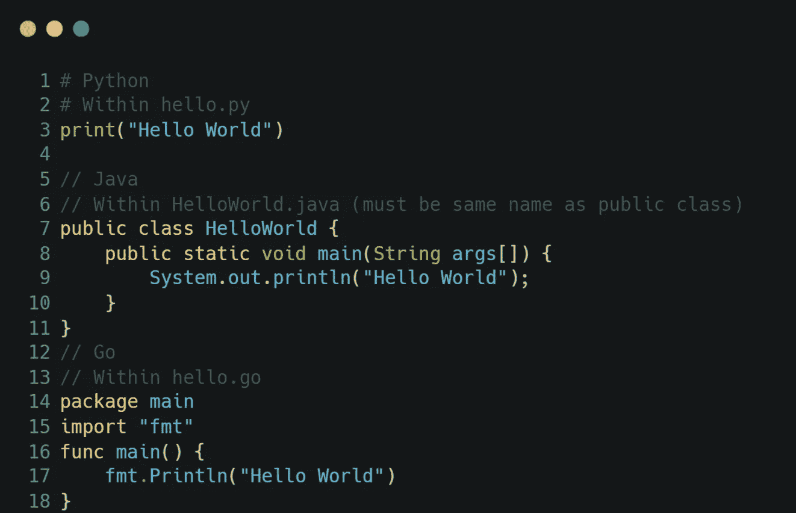*

*图 Python、Java 和 Go 中的注释和打印——作者图片*

## *关于打印和注释的更多主题:*

*   *注释的类型，即行内注释与块注释*
*   *打印不同的数据类型(见下一节)*
*   *(Python)使用 f 字符串打印*

# *数据类型*

> *任何编程语言的支柱*

*数据类型是任何编程语言的支柱，因为每个变量和对象都是一种数据类型。不同的数据类型可以执行不同的操作，并且有不同的方式与它们交互。例如，您可以从一组数字中获取最大值，但不能从单个数字中获取最大值。*

*有三种不同的数据类型—简单、复杂和用户定义的。[简单数据类型](https://www.ibm.com/docs/en/tivoli-netcoolimpact/6.1.1.5?topic=types-simple-data)代表单个值，比如描述数字或文本的变量。[复杂数据类型](https://www.ibm.com/docs/en/tivoli-netcoolimpact/6.1.1.5?topic=types-complex-data)由多种现有的数据类型组成，比如一个数字序列或者将一个数字映射到一个单词(例如，在电话簿中)。某些编程语言支持用户定义的数据类型，您可以在其中创建自己的数据结构。*

*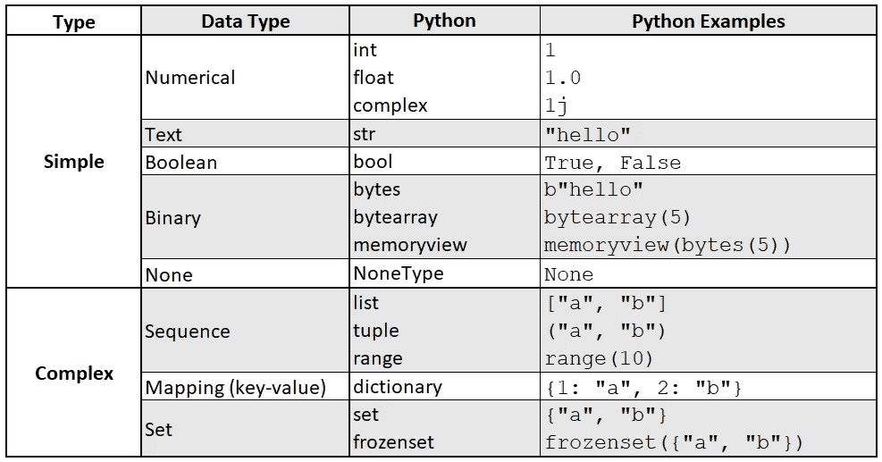*

*图 2a: Python 数据类型—作者图片*

*在 Python 中，上图是所有数据类型的列表，并提供了示例。由于 Python 是一种弱类型语言，我们可以将它赋给一个变量，而不用定义它的类型。举个例子，*

*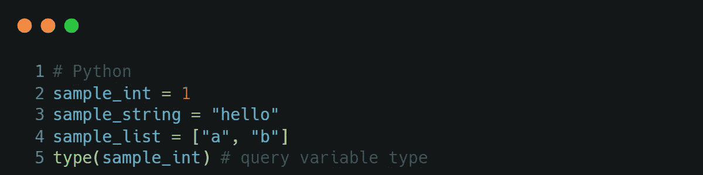*

*图 2b:用 Python 实例化变量——作者图片*

*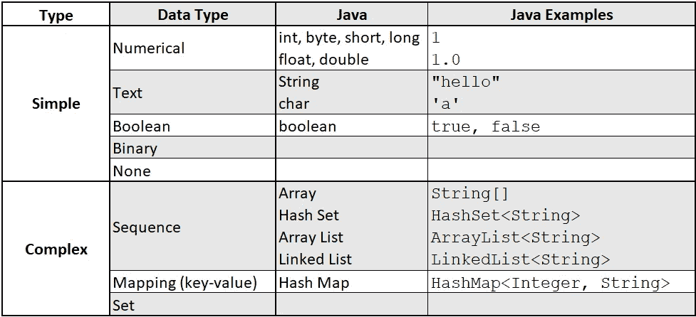*

*图 3a: Java 数据类型——作者图片*

*Java 是一种强类型语言；当初始化一个新变量时，必须指定变量的类型，有时甚至是变量的大小。*

*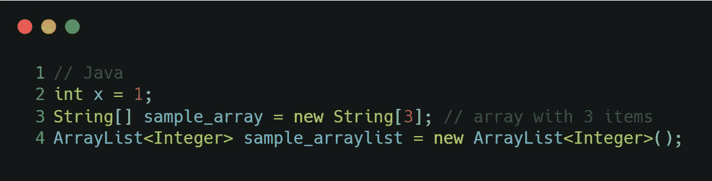*

*图 3b:用 Java 实例化变量——作者图片*

*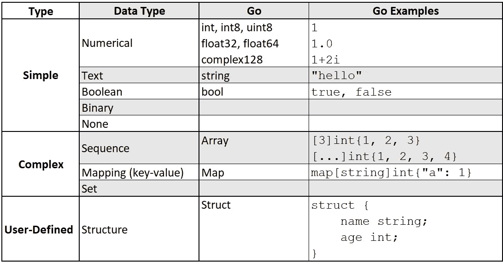*

*图 4a: Go 数据类型—按作者分类的图片*

*与 Java 类似，Go 是一种强类型语言，但是 Go 不需要显式地指定变量类型。Go 在如何创建新变量方面也有所不同；它定义了所有以关键字`var`开始的变量。或者，为了避免使用关键字`var`，可以使用数学表达式`:=`。下面是一些如何在 Go 中实例化变量的例子，*

*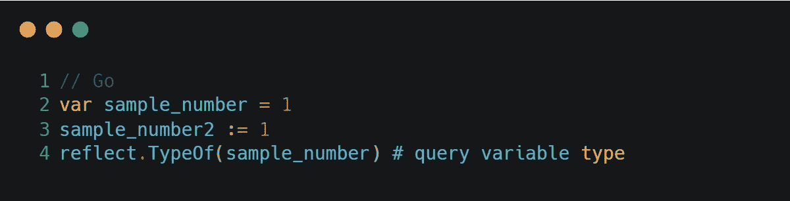*

*图 4b:用 Go-Image 按作者实例化变量*

*除了知道不同的数据类型之外，区分数据类型是可变的还是不可变的(如果它的值在创建后可以改变)或者它们是否被索引以知道何时选择每种数据类型是很重要的。一开始，接触多种数据类型可能会令人望而生畏。我发现将我关于数据类型的笔记组织成三个不同的部分是有益的——构造新变量、查询变量和转换变量。*

## *关于数据类型的更多主题:*

*   *【*构造*加载外部文件，即从 JSON 文件初始化字典*
*   *【*构造*】简单数据类型之间的转换，如十进制到整数，日期到字符串*
*   *[ *Query* 从复杂或用户定义的数据类型中检索项目*
*   *[ *转换* ]将项目前置或附加到复杂数据类型*
*   *[ *转换* ]替换可变数据类型中的项目*
*   *[ *转换* ]排序或反转复杂的数据类型，如列表、字典*
*   *[ *转换*字符串操作，即改变大小写、提取字符或子串、删除前导或尾随空格、拆分字符串*

# *条件句和循环*

> *基于条件控制代码流，或者重复一个代码，直到满足条件*

*了解了数据类型并实例化了一些变量之后，很自然地想要控制代码流或者修改变量(或者变量中的每一项)。为了控制代码流，我们可以只在满足某些条件的情况下执行一组指令，并相应地指导代码流。为了修改变量中的每一项，我们通过变量**迭代**，这可以使用循环来完成。*

*有一些常见的条件和循环，注意不是所有的编程语言都支持下面列出的所有类型的条件和循环，*

*   *If-else 条件:执行一个任务 ***如果*** 满足一个条件， ***else*** 执行另一个任务或者什么都不做*
*   *切换情况:在一种情况下执行一项任务，在另一种情况下执行另一项任务。这类似于 if-else 语句，只是条件的计算结果是一个值而不是布尔值(真或假)*
*   *For 循环:执行任务 ***for*** 复变量中的每一项*
*   *While loop:在 一个条件满足时执行一个任务 ***(当心无限循环！)****

*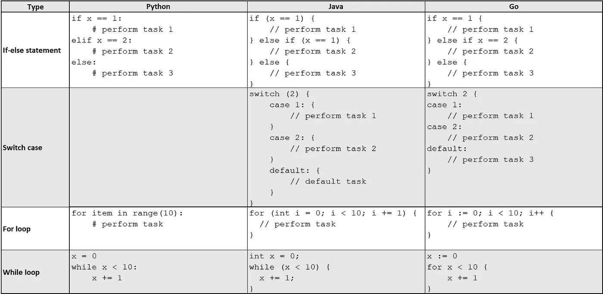*

*图 Python、Java 和 Go 中的条件句——作者图片*

## *关于条件句的更多主题:*

*   *不同数据类型的数学条件或更复杂的条件检查*
*   *为复杂数据类型实现 for 循环，即迭代列表*
*   *创建一个变量范围并为其实现一个循环*
*   *使用枚举器并为其实现一个循环*

# *函数和类*

> *对一系列操作进行分组，并重用它们*

*函数和类是最常见的代码，因为函数式编程使用函数，而面向对象编程使用类。*

*对于任何函数，都需要指明输入的名称。对于某些(更严格的)编程语言，还需要提供输入和预期输出的数据类型。作为面向对象的编程，类将几个相关的函数结合在一起。类内的函数被称为类 ***方法*** 。*

*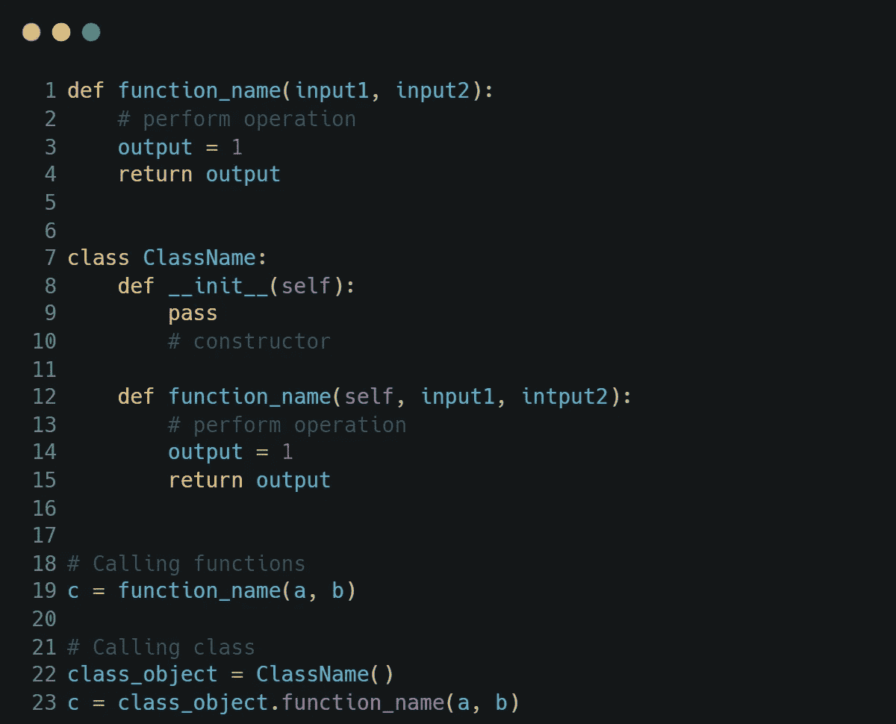*

*图 Python 中的函数和类——作者图片*

*在 Python 中，函数用关键字`def`定义(第 1 行)，输出用关键字`return`返回(第 4 行)。不需要指定输出的数据类型。*

*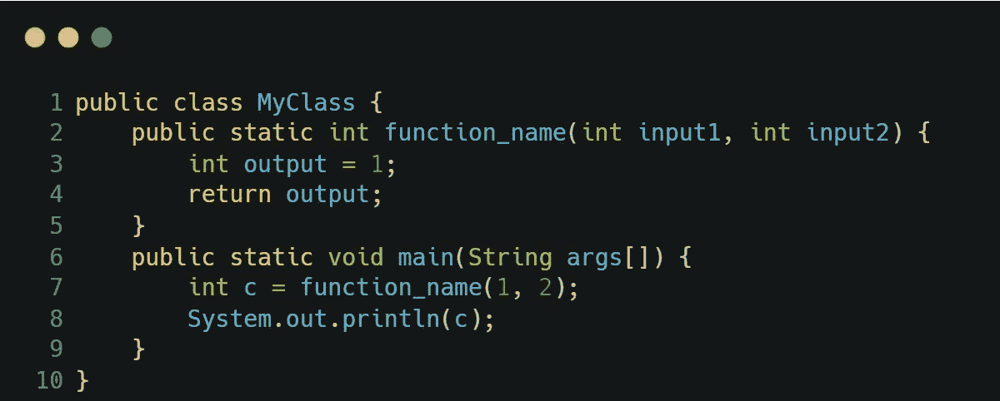*

*图 Java 中的类——作者图片*

*Java 里是面向对象编程，文件名必须跟在类名后面；类别`MyClass`必须包含在`MyClass.java`中。如果文件被执行，只有`main`功能(第 6 行)会运行。*

*在定义一个类方法时，需要定义输入和输出变量的数据类型，并且有一个可见性修饰符(private/public/protected)和其他隐式参数(static/final)的概念，这将不在本文中讨论。*

*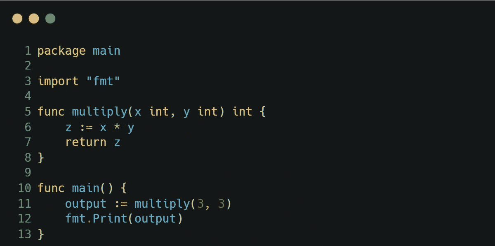*

*图 8:Go 中的类——按作者分类的图片*

*在 Go 中，类似于 Java，也是面向对象编程但是对文件名没有限制。执行该文件时，只会运行`main`功能(第 10 行)。*

*由于在执行`.go`文件时只运行`main`函数，所以函数通常被顺序地缝合在一起，形成过程。因此，正如本文开头提到的，Go 遵循过程化编程范式。*

## *关于函数和类的更多主题:*

*   *类方法与类对象*
*   *类中的构造函数、析构函数*
*   *(Python)类方法与静态方法*
*   *(Java)可见性修饰符和其他隐式参数*
*   *继承:将一个类扩展到另一个类*
*   *断言:确保满足条件*
*   *异常处理:控制出现错误时会发生什么*

# *进口*

> *使用内置包、外部包或其他文件中的代码*

*单个文件中的代码可能无法涵盖您需要的所有内容，您将需要依赖于包或文件中的现有代码，这些代码由他人或您自己编写，通过导入它们来实现。*

*有三种类型的导入—从内置包、外部包或其他文件导入。导入在代码开始时完成，因为您需要在使用它们之前导入包。*

*从内置包和外部包导入遵循相同的过程，只是需要额外的步骤来安装外部包。*

*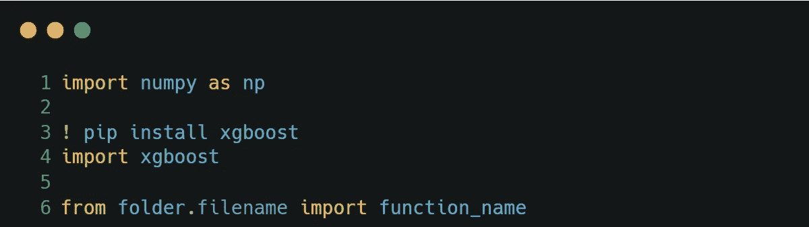*

*图 9:在 Python 中导入——按作者分类的图片*

*在 Python 中，常用`pip`或`conda`安装程序。外部包可以在终端上用命令`pip install package-name`或`conda install package-name`安装，用上面的例子导入。*

*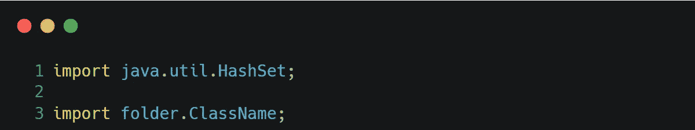*

*图 10:用 Java 导入——作者图片*

*在 Java 中，通过在各自的 Maven 或 Gradle 文件中添加包的详细信息，可以用 Maven 或 Gradle 安装外部包。上面显示了一些用 Java 执行导入的例子。*

*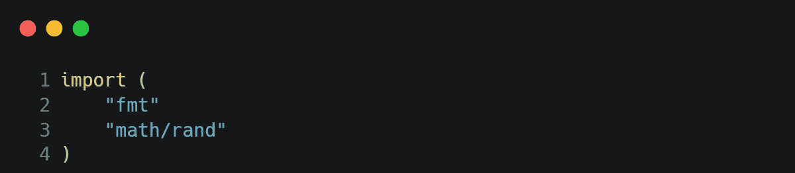*

*图 11:在 Go 中导入—按作者排序的图像*

*在 Go 中，可以在命令行用`go get package-name`安装外部包。同一文件夹中的所有代码都属于同一个包，因此不需要导入。但是，您需要用上面的例子导入内置或外部的包。*

# *设置和运行代码*

> *学习理论后迈出第一步*

*终于，你准备好开始编码和运行一些代码了！*

*要进行设置，您需要下载**编程语言**本身，本文末尾提供了链接。你还需要下载一个 **IDE(集成开发环境)**来运行代码。你可以把 IDE 看作是一个运行代码的漂亮界面，否则你就需要使用命令行界面，这对初学者来说并不友好。一些 IDE 可以运行多种编程语言，所以你只需要下载一个 IDE。*

*就个人而言，我不喜欢将我的 IDE 与多种编程语言混合在一起。这是我的设计，*

*   *Python: PyCharm(重载)，Sublime Text(轻量级)*
*   *Java: IntelliJ 理念*
*   *Go: Visual Studio 代码，终端*

*要运行代码，可以在 IDE 上(推荐)或通过命令行界面运行代码。*

*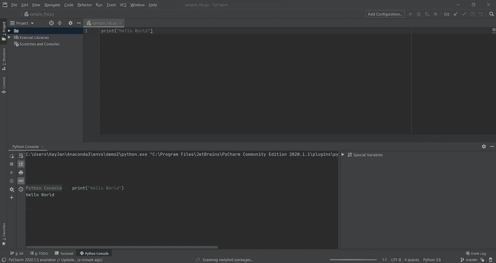*

*图 12:在 PyCharm 中运行 Python 作者图片*

*要运行 Python 代码，您可以点击 Ctrl-Enter 或 Ctrl-B 按钮，或者将其复制并粘贴到 Python 控制台——这取决于您的 IDE。*

*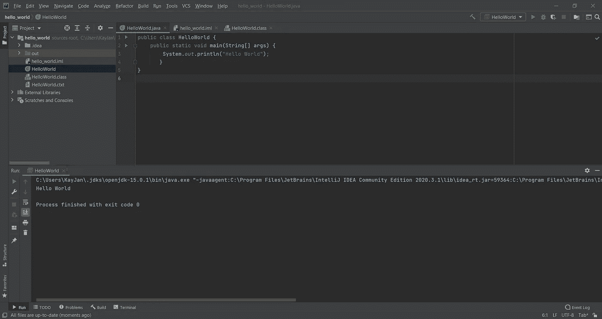*

*图 13:在 IntelliJ IDEA 中运行 Java 作者图片*

*要运行 Java 代码，您需要先构建代码，以便在运行它们之前将`.java`文件编译成`.class`文件。这个额外的步骤是因为 Java 既是编译语言又是解释语言，正如前面的章节所解释的。*

*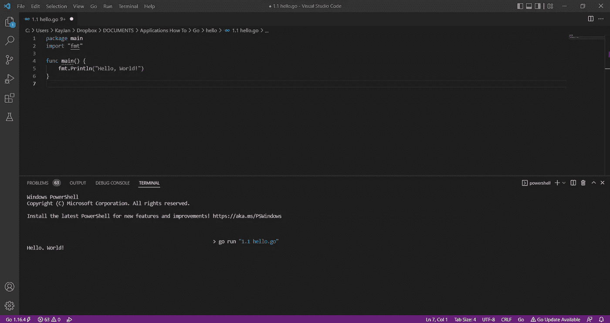*

*图 14:在 Visual Studio 代码中运行 Go——作者图片*

*要运行 Go 代码，您可以使用命令行界面并运行`go run file-name.go`来编译和执行代码。*

> *或者，如果您只想在没有任何安装的情况下玩玩，您可以使用在线 IDE。*

*在本文的最后有 Python、Java 和 Go 的在线 IDE 的链接。虽然在线 ide 很方便，但是它们不能执行复杂的任务，比如安装和导入某些外部包，或者在多个文件中编写代码。*

*恭喜你，你现在知道如何学习编程语言了，从理解编程语言的类型和组成编程语言的基本组件，到如何设置和运行代码。希望通过 Python、Java 和 Go 的例子，您可以看到编码语法和约定之间的相似之处和(一些)不同之处——一旦我们找到相似之处，学习其他语言就更容易了！不要担心混淆语法，是的，它会发生，谢天谢地，好的 ide 可以在你运行代码之前发现并反映这些错误。*

> *要掌握一门编程语言，最好是每天通过做一个简单的任务或项目来练习。*

*最后，除了经常练习编程语言，我认为编码是一种“思维方式”。例如，给定一个大项目，适当地组织你的代码而不是从上到下顺序运行它或者硬编码组件是很重要的。幸运的是，这种“思维方式”可以通过遵循编码最佳实践来加以利用(您可以将其视为一组推荐的规则)。遵循编码最佳实践可以使您的代码更加优雅、模块化和易于理解。有需求的话可以出续集；)*

* * 

# *相关链接*

## *计算机编程语言*

*   *安装:[https://www.python.org/downloads/](https://www.python.org/downloads/)*
*   *教程:【https://docs.python.org/3/tutorial/ *
*   *在线 IDE:【https://www.online-python.com/ *

## *Java 语言(一种计算机语言，尤用于创建网站)*

*   *安装:[https://www.oracle.com/java/technologies/downloads/](https://www.oracle.com/java/technologies/downloads/)*
*   *教程:[https://www.w3schools.com/java/](https://www.w3schools.com/java/)*
*   *在线 IDE:[https://www.jdoodle.com/online-java-compiler/](https://www.jdoodle.com/online-java-compiler/)*

## *去*

*   *安装:[https://go.dev/doc/install](https://go.dev/doc/install)*
*   *教程:[https://go.dev/doc/tutorial/getting-started](https://go.dev/doc/tutorial/getting-started)*
*   *在线 IDE:[https://go.dev/play/](https://go.dev/play/)*