# 如何用 5 种简单的方法提升你的熊猫技能

> 原文：<https://towardsdatascience.com/how-to-level-up-your-pandas-skills-in-5-easy-ways-223208ce18cc>

## 用熊猫提升你的数据科学技能的 5 种方法


[图片由翻腾 926](https://www.pexels.com/photo/panda-bear-in-zoo-5346041/)

[**Pandas**](https://pandas.pydata.org/) 是一个用于数据科学的强大而通用的 Python 库。在学习如何将 Python 用于数据科学应用时，它通常是您最先遇到的库之一。它可以用来加载数据，可视化数据和操作数据，以适应您正在进行的项目的目标。

然而，许多人没有超越如何使用库的基础，并且没有利用一些更高级和有趣的特性。

在这篇文章中，我们将介绍 5 个你以前可能没有遇到过的特性，这些特性将使你在使用这个库时更有效率。

# 加载库和数据

对于本文中使用的所有示例，我们将使用的数据是作为 Xeek 和 FORCE 2020 *(Bormann 等人，2020)* 举办的机器学习竞赛的一部分的测井数据的子集。该数据在此处[](https://zenodo.org/record/4351156#.Y4iZHC-l0eY)**公开，并根据 [**挪威政府数据公开许可证(NLOD) 2.0**](https://data.norge.no/nlod/en/2.0/) **获得许可。****

**然而，这里显示的所有方法和示例都可以应用于加载到 pandas 中的任何数据集。**

**首先，我们首先需要导入 pandas 库，为了方便起见，通常简称为`pd` 。**

**然后，我们将使用`read_csv()`函数将 csv 文件读入数据帧。**

```
import pandas as pd
df = pd.read_csv('data/Xeek_train_subset_clean.csv')
df
```

**当我们查看数据帧时，我们可以看到有 12 列数据混合了文本和数值。**

**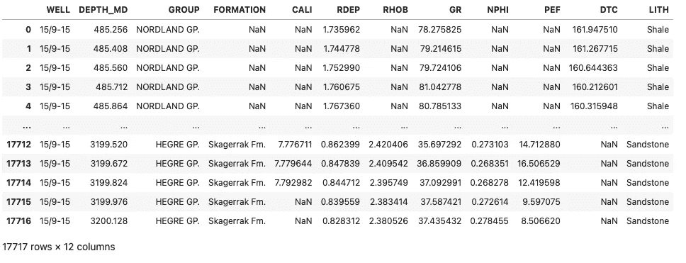**

**来自 Xeek Force 2020 机器学习竞赛的测井数据的数据帧。图片由作者提供。**

**现在已经完成了，我们现在可以继续 5 种方法来提高你与熊猫的数据科学技能。**

# **更改默认熊猫绘图库**

**在进行探索性数据分析时，我们通常希望快速绘制出我们的数据。你可以使用 [matplotlib](https://matplotlib.org/) 构建一个情节，然而，我们可以使用 pandas 通过几行代码来完成。**

**一旦你加载了数据，你就可以调用 dataframe，然后调用`.plot`方法。**

**例如，如果我们采用 GR 列并绘制直方图，如下所示:**

```
df.GR.plot(kind='hist', bins=30)
```

**这将返回以下图:**

**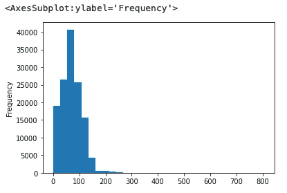**

**熊猫使用的伽玛射线直方图。plot()函数。图片由作者提供。**

**返回的图像非常简单，缺乏交互性。**

**从 pandas 版本 0.25 可以改变使用哪个绘图库。例如，代替 matplotlib，你可以为 [plotly](https://plotly.com/) 切换这个。 [Plotly](https://plotly.com/) 允许以高效的方式生成非常强大的交互式数据可视化。**

**有关如何使用 Plotly 生成另一种类型的散点图的更多信息，您可能有兴趣浏览我以前的文章:**

*   **[**使用 Plotly Express 创建交互式散点图**](https://medium.com/towards-data-science/using-plotly-express-to-create-interactive-scatter-plots-3699d8279b9e)**
*   **[**增强你的 Plotly 用边际图表达散点图**](/enhance-your-plotly-express-scatter-plot-with-marginal-plots-de469d42f12a)**

**要更改当前实例的默认绘图库，您需要更改 pandas 的`plotting.backend`选项。**

```
pd.options.plotting.backend = "plotly"
```

**一旦你完成了，你就可以像以前一样调用相同的代码**

```
df.GR.plot(kind='hist', bins=30)
```

**生成的绘图现在是交互式的，并在探索数据集时提供了更好的用户体验。**

**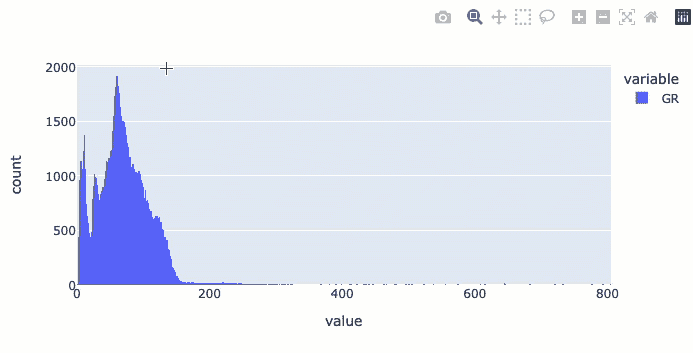**

**将 pandas 后端绘图选项更改为 plotly 后的伽马射线直方图。图片由作者提供。**

**您还可以使用其他类型的图，包括散点图，方法是稍微修改一下代码，如下所示:**

```
df.plot(kind='scatter', x='NPHI', y='RHOB', color='GR')
```

**当执行上面的代码时，您会得到下面的图:**

**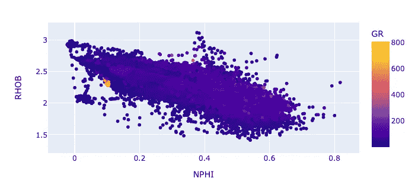**

**改变熊猫后端绘图选项后创建的交互式散点图。图片由作者提供。**

# **链接操作**

**将多个方法链接或连接在一起是一种长期实践的编程技术，可以提高代码的可读性。**

**它是在一行中一个接一个地调用对象上的方法的过程，而不是分别对对象应用这些方法。这有助于您流程的多个阶段。**

**例如，如果要加载数据，请将列更改为小写，然后删除缺失值(nan ),可以这样做:**

```
df = pd.read_csv('data/Xeek_train_subset_clean.csv')
df = df.rename(columns=str.lower)
df = df.dropna()
```

**然而，更有效的方法是像这样链接操作:**

```
df = pd.read_csv('data/Xeek_train_subset_clean.csv').rename(columns=str.lower).dropna()
```

**有时这一行可能会变得很长，所以您可能希望通过将它分成多行来提高可读性。**

**如本[堆栈溢出问题](https://stackoverflow.com/questions/8683178/chained-method-calls-indentation-style-in-python)所示，这可以使用行继续符(`\`)来完成。**

```
df = pd.read_csv('data/Xeek_train_subset_clean.csv')\
        .rename(columns=str.lower)\
        .dropna()
```

**或者使用圆括号，就像另一个 [StackOverflow 问题](https://stackoverflow.com/questions/4768941/how-to-break-a-line-of-chained-methods-in-python)中建议的那样，这样就不需要换行字符了。**

```
df = (pd.read_csv('data/Xeek_train_subset_clean.csv')
        .rename(columns=str.lower)
        .dropna())
```

# **查询()**

**我们在处理数据时经常做的一项常见任务是基于单个或多个条件对数据进行过滤。您可以使用以下代码来实现这一点:**

```
df[df.GR > 100]
```

**然而，使用 [**熊猫查询**](https://pandas.pydata.org/docs/reference/api/pandas.DataFrame.query.html) 函数会产生一段可读性更好的代码，尤其是当事情变得稍微复杂一些的时候。**

**例如，如果要查找 GR(伽马射线)列包含值大于 100 的所有行，可以像这样调用查询方法:**

```
df.query("GR > 100")
```

**它返回下面的 dataframe 对象。**

**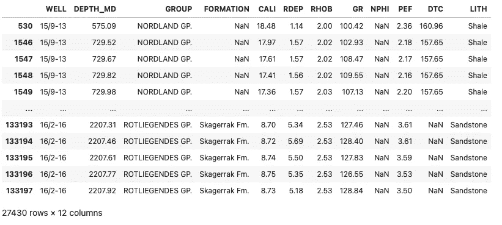**

**使用 pandas 查询方法过滤伽马射线大于 100 API 的行后的 Dataframe。图片由作者提供。**

**如果您想要组合多个条件，也可以使用逻辑。**

```
df.query("GR > 100 and GR < 110")
```

**它返回一个更小的数据帧，只有 7，763 行**

**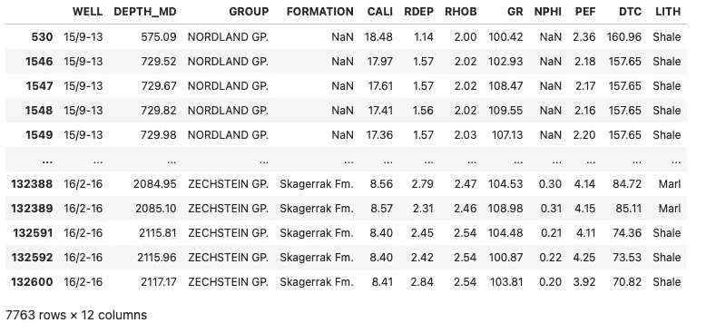**

**使用 pandas 查询方法过滤伽马射线大于 100 API 但小于 110 API 的行后的数据帧。图片由作者提供。**

**如果你想寻找一个特定的字符串值，比如这个数据集中的无水石膏，你需要修改我们的查询方法，把几个方法连接在一起。**

```
df.query("LITH.str.contains('Anhydrite')")
```

**这将返回其中 LITH 列包含单词 Anhydrite 的任何行**

**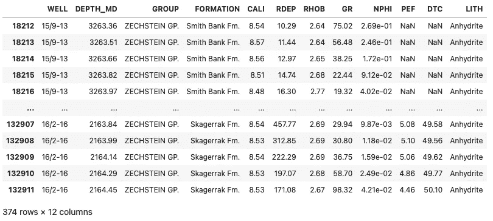**

**使用 pandas 查询方法过滤 LITH 包含硬石膏的行后的 Dataframe。图片由作者提供。**

**如果字符串包含特殊字符，例如我们的数据帧中的井列包含反斜杠和破折号，也可以使用这种方法:**

```
df.query("WELL.str.contains('15/9-13') and GROUP.str.contains('ZECHSTEIN GP.')")
```

**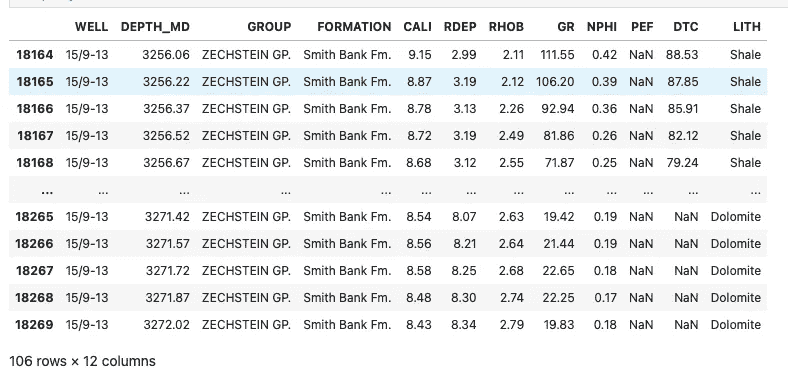**

**使用 pandas 查询方法筛选组中包含 Zechstein Gp 的行后的 Dataframe。井名是 15/9–13。图片由作者提供。**

# **eval()**

**Python 中的 [eval()方法](https://pandas.pydata.org/pandas-docs/stable/reference/api/pandas.eval.html)是一个强大的工具，可以对同一数据帧中的列计算任意 Python 表达式。**

**这意味着您可以通过提供字符串表达式从数据帧中提取列并执行算术计算。**

**例如，您可以从 GR 列中减去值 100:**

```
df.eval('GR-100')
```

**它返回**

**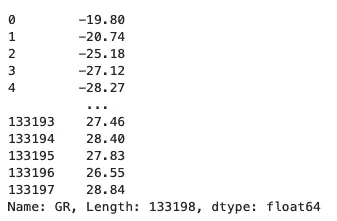**

**结果用 eval 方法进行简单计算后。图片由作者提供。**

**如果您想将这个计算放在一个新的列中，您需要调用`pd.eval`并传递目标数据帧后面的表达式。**

```
pd.eval('GR_TEST = df.GR - 100', target=df)
```

**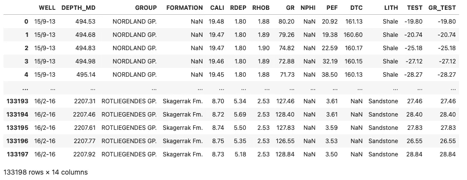**

**使用 pd.eval 添加基于简单表达式的新列后的 Dataframe。图片由作者提供。**

**岩石物理学中的常见计算是计算地层中粘土的体积。要进行这种计算，您只需扩展以下表达式:**

```
pd.eval('CLAYVOL = ((df.GR - 20)/(200-10))', target=df)
```

**这会创建一个名为`CLAYVOL`的新列**

**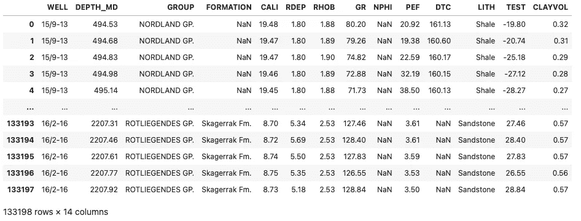**

**使用 pd.eval 方法根据伽马射线柱计算粘土体积后的数据帧。图片由作者提供。**

**如果您正在进行适当的岩石物理分析，您将需要考虑基于多个地层或深度范围的选定参数。上面举例说明了进行计算的一种快速方法。**

# **地图()**

**如果我们需要匹配某个对象(如字典)中的值，或者用另一个值替换数据帧中的值，我们可以使用 [**映射功能**](https://pandas.pydata.org/docs/reference/api/pandas.Series.map.html) **。****

**此函数只能应用于数据框架中的单个列或 Pandas 系列。**

**使用这个数据示例，我们可以创建一个新列，其中包含基于文本字符串的数字代码。这可以通过使用另一个数据帧或字典来实现。**

**如果使用字典作为参考，您首先需要创建一个或加载一个。这个例子使用了一个快速创建的简单例子。**

```
lith_dict = {'Shale':1,
 'Sandstone':2,
 'Sandstone/Shale':3,
 'Limestone':4,
 'Tuff':5,
 'Marl':6,
 'Anhydrite':7,
 'Dolomite':8,
 'Chalk':9,
 'Coal':10,
 'Halite':11}
```

**接下来，您将创建一个新列，例如，LITH_CODE。**

**然后调用 LITH 列并应用`.map`函数，它包含上面创建的字典。**

```
df['LITH_CODE'] = df['LITH'].map(lith_dict)
```

**当您调用 dataframe 时，您现在有了一个新列，该列的岩性代码映射到正确的岩性。**

**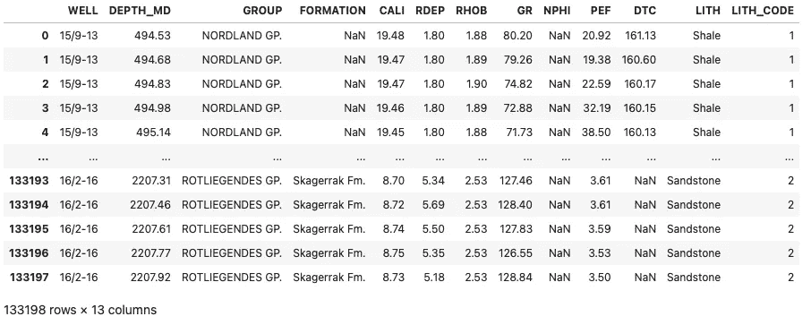**

**Dataframe 在使用 map 函数后，根据 string 的内容创建一个新的岩性代码列。图片由作者提供。**

# **摘要**

**Pandas 是一个令人难以置信的图书馆，允许用户以非常直观的方式可视化、转换和分析数据。本文介绍了一些鲜为人知的特性和方法，如果您刚刚开始数据科学之旅，其中许多可能对您来说是新的。了解这些将有助于您利用熊猫的力量来提高您的数据分析技能。**

***感谢阅读。在你走之前，你一定要订阅我的内容，把我的文章放到你的收件箱里。* [***你可以在这里做！***](https://andymcdonaldgeo.medium.com/subscribe)**或者，您可以* [***注册我的简讯***](https://fabulous-founder-2965.ck.page/2ca286e572) *免费获取更多内容，直接发送到您的收件箱。****

***其次，你可以通过注册成为会员来获得完整的媒介体验，并支持我和成千上万的其他作家。每月只需花费你 5 美元，你就可以接触到所有精彩的媒体文章，也有机会通过写作赚钱。如果你用 [***我的链接***](https://andymcdonaldgeo.medium.com/membership) ***，*** *报名，你直接用你的一部分费用支持我，不会多花你多少钱。如果你这样做了，非常感谢你的支持！****

# ***参考***

***博尔曼，彼得，奥桑德，彼得，迪里布，法哈德，曼拉尔，投降，&迪辛顿，彼得。(2020).机器学习竞赛 FORCE 2020 井测井和岩相数据集[数据集]。芝诺多。[https://doi.org/10.5281/zenodo.4351156](https://doi.org/10.5281/zenodo.4351156)***