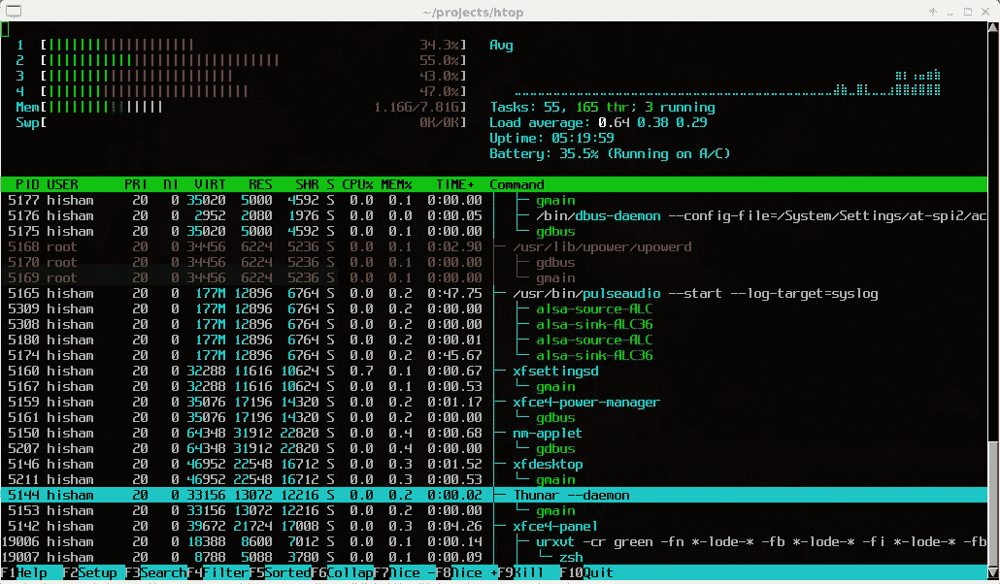

# 如何升级你的终端游戏

> 原文：<https://towardsdatascience.com/how-to-level-up-your-terminal-game-db7b44e31e65>

## 提高效率的 6 个命令行实用程序


作者图片

对于许多新开发人员来说，使用终端或命令行可能会显得低效甚至过时。然而， *shell* 是任何开发人员可用的最有用的工具之一。在这篇文章中，我将向你展示六个有用的工具来升级你的终端游戏！

```
***Table of Contents*****1\. xclip
2\. croc
3\. zoxide
4\. htop
5\. entr
6\. fzf** 
```

# 1.复制/粘贴

当我说“复制/粘贴”时，您可能会立即想到 Ctrl-C 和 Ctrl-V，但是您知道吗，您还可以使用命令行以编程方式将数据复制/粘贴到系统的剪贴板，而无需使用任何键盘快捷键。

如果您使用的是基于 Linux 的操作系统(或 Windows 上的 WSL)，您可以使用 xclip 实用程序从命令行与剪贴板进行交互。你可以使用你系统的包管理器来安装 xclip(比如 Ubuntu 上的`apt`，或者 Arch 上的`pacman`)。

运行`xclip -o`将会显示你剪贴板的当前内容，你可以把它导入另一个程序，重定向到一个文件，等等。

同时，通过管道将文本输入到命令`xclip`中会导致文本被复制到您的剪贴板中。(旁注:xclip 旨在与 X11 窗口系统一起使用。如果你用的是 Wayland，你应该安装`wl-clipboard`，它提供`wl-copy`和`wl-paste`。

如果你在 MacOS 上，你可以使用相应的`pbcopy`和`pbpaste`命令来代替。在 Windows 上，如果您没有使用 WSL，您可以使用`clip.exe`(对应于`copy`)和/或 Powershell 命令`Get-Clipboard`和`Set-Clipboard`。

无论您使用什么操作系统，我都建议您在 shell 配置文件中使用别名复制/粘贴命令，如下例所示。如果您正在使用 bash，您可能希望将您的别名添加到`~/.bashrc`(或者对于 zsh，添加到`~/.zshrc`)。您可以通过运行`echo $SHELL`来检查您当前使用的是什么 shell。

```
# Example copy/paste alias for Linux
alias paste='xclip -o'
alias copy='xclip -c'# Example copy/paste alias for MacOS
alias paste=pbpaste
alias copy=pbcopy
```

现在，您可以运行如下命令:

```
paste > file        # paste clipboard into a file
cat file | copy     # copy file contents to clipboard
paste | croc send  # send clipboard contents using croc
```

# 2.鳄鱼

Croc 是一个有用的跨平台工具，可以在两台计算机之间安全地传输数据(比如文件或文本)。不用再发送 zip 文件或者摆弄 Dropbox——如果你需要发送文件给某人，在大多数情况下，croc 更简单(可能)更快。

唯一的要求是发送方和接收方的系统上都安装了 croc。Croc 可能可以从您最喜欢的包管理器获得——更具体的安装说明可以在项目的 [github 页面](https://github.com/schollz/croc)上找到。

以下是 Croc 的使用示例:

```
$ croc send file.dat
Sending 'file.dat' (0 B)
Code is: <code-phrase>
```

在第二台计算机上，键入`croc <code-phrase>`将提示您接受传输的数据，如下所示:

```
Accept 'file.dat' (0 B)? (Y/n)
```

使用 croc 发送文本同样简单——您可以通过管道将文本输入到 croc 中，也可以手动键入文本，如下所示:

```
$ echo "Hello from croc!" | croc send
# or
$ croc send --text "Hello from croc!"
```

如果这还不够，croc 允许支持多种加密/哈希算法、可恢复传输和代理！在我看来，croc 是一个非常有用的工具，可以放在你的工具箱里。

# 3.佐西德

Zoxide 与我之前提到的其他工具有所不同。它旨在通过帮助您更快地遍历文件系统来改善命令行体验。

Zoxide 允许你进入一个目录而不用给出完整的路径。相反，Zoxide 会考虑你过去的历史，并根据你提供的名字来判断你想去哪里。本质上，佐希德只是一个“更聪明的”`cd`。

Zoxide 支持所有主要的 shells，并且可能从您最喜欢的包管理器中获得。你可以在它的 [Github 页面](https://github.com/ajeetdsouza/zoxide)上找到安装说明和更高级的使用技巧。

这里有一个如何使用 Zoxide 的例子。注意:Zoxide 提供了命令`z`，但是由于肌肉记忆，我更喜欢别名它而不是`cd`。

```
$ z /opt/local/lib  # changes your directory like normal
$ z ~               # jumps to home directory like normal
$ z lib             # will automatically jump /opt/local/lib
$ z ..              # go up one directory
$ z l               # may also jump to /opt/local/lib
```

使用 Zoxide 时，运行`z <something>`会根据 Zoxide 的匹配算法将目录更改为排名最高的选择。Zoxide 既考虑了一个目录被访问的频率，也考虑了它上次被访问的时间。

比如多次进入目录`/opt/local/lib`，就会增加它的“分数”。现在，如果你从你的主目录运行`z lib`，Zoxide 会直接把你带到`/opt/local/lib`。事实上，你甚至不需要完全输入`lib`。Zoxide 使用模糊字符串匹配，所以即使运行`z l`也能把你带到正确的地方。

我个人认为 Zoxide 很有用，因为它允许我跳转到不同项目的目录，而不必记住它们在我系统中的确切位置。只要我知道一个目录的名称(或者它的前 3 个字符)，我就可以到达那里。

# 4.htop

Htop 是终端的资源监视器和进程管理器。

Htop 可以使用你最喜欢的软件包管理器来安装。最新版本和源代码可以在它的 [Github](https://github.com/htop-dev/htop) 上找到。



来自[https://htop.dev/screenshots.html](https://htop.dev/screenshots.html)的 htop 官方截图

下面是 htop 允许您做的事情的快速列表:

*   查看每个内核的 CPU 负载、内存使用情况(包括交换)、正常运行时间等
*   显示哪些进程使用了最高数量的 CPU/内存
*   按名称或 PID 搜索流程
*   用你选择的中断终止进程(比如 SIGINT，SIGKILL，SIGTERM 等)

Htop 同时支持键盘和鼠标——如果你不需要的话，就不必学习快捷键。此外，通过树形视图，您可以看到哪些进程是其他进程的子进程，这非常有趣。我主要使用 htop 来监控系统负载和杀死行为不当的进程(在我自己的系统和远程服务器上)。

# 5.引入线

Entr 是一个实用程序，允许您在每次文件更改时重新运行命令。这允许您用一个简单的终端命令实现自己的 ad-hoc 实时重载服务器。Entr 应该可以从你最喜欢的包管理器中获得(或者如果你想手动安装它，请看它的主页[这里](https://eradman.com/entrproject/))。

使用 entr 的方法是在标准输入中提供一个文件名列表，以及每当这些文件之一发生变化时运行的命令。举例来说，假设我们有一个简单的 Python 项目，我们想在源代码发生变化时重新运行该程序。

这可以用一行代码来完成:

```
$ find . -name *.py | entr python main.py
```

如上所述，`find`命令用于生成当前目录中扩展名为`py`的所有文件的列表，然后该列表通过管道传输到`entr`，每当检测到其中一个文件发生变化时，它就会重新运行`main.py`。

如果我们需要更复杂的行为，我们可以简单地添加一个 Makefile 并告诉 entr 要构建哪个目标。例如，给定一个假设的 C 项目，我们可能希望运行下面的代码，让 Make 处理重新编译 C 文件的复杂性。

```
$ find src/ | entr make
```

Entr 还允许您在命令中使用已更改文件的名称。例如，运行`ls | entr echo /_`将监控当前目录中的每个文件，并在检测到变化时打印出文件的路径。

如果你想了解更多关于 entr 的知识，可以查看主页[这里](https://ls *.rb | entr -r ruby main.rb)。您将找到更多的例子，以及特殊命令行标志的文档。

# 6.fzf

我将用一个伟大的交互式实用程序来结束这篇文章。Fzf 是一个模糊查找器，允许您从列表中交互式地选择一个选项。它还具有很好的外壳集成和可配置性。

Fzf 可以从几乎所有的包管理器中获得，但是你也可以用 git 安装它(指令[在这里](https://github.com/junegunn/fzf))。

默认情况下，运行`fzf`将为位于当前目录或其子目录中的每个文件显示一个交互式选择器(相当于`find .`)。这本身就很有用——如果你想交互式地选择一个文件进行编辑，只需运行`vim $(fzf)`。通过输入搜索词，可以缩小 fzf 提供的选择范围。然后，你可以按<回车>来选择选项。


使用 fzf 选择要编辑的文件

您可以使用 fzf 从任何列表中选择一个项目。使用 fzf，您可以轻松地编写 shell 脚本，以交互方式检查 git 提交、选择要终止的进程、选择要安装的包等。可能性是无穷的，你可以在网上找到很多有用的脚本。

下面显示了来自 [fzf 示例 wiki](https://github.com/junegunn/fzf/wiki/examples#git) 的`fcoc`脚本。


使用 fzf 检验 git 提交

更不用说，fzf 还有许多更高级的特性，比如命令的 shell 完成、预览窗口、vim/tmux 集成等等。关于这些信息，我建议通读该项目的 Github。

# Git 仓库

<https://github.com/schollz/croc>  <https://github.com/ajeetdsouza/zoxide>  <https://github.com/htop-dev/htop>  <https://github.com/eradman/entr>  <https://github.com/junegunn/fzf>  

# 结论

不要小看终端！命令行是一些最简单但最有用的工具的家园！