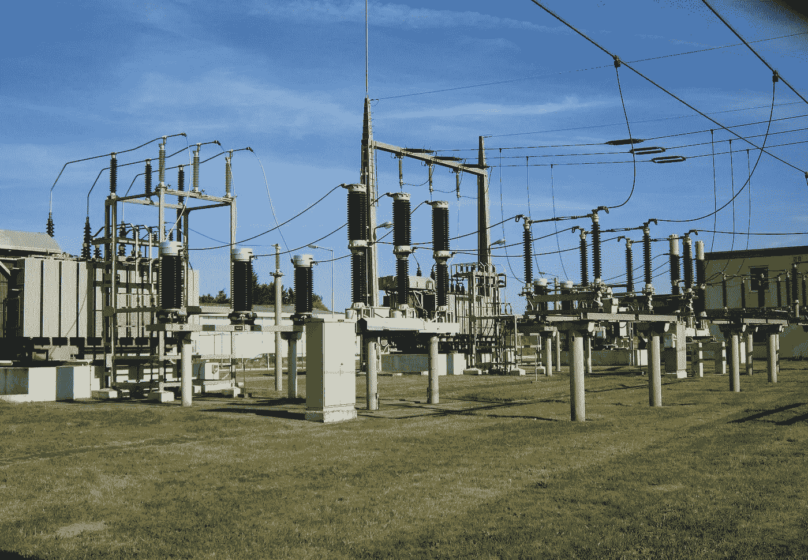
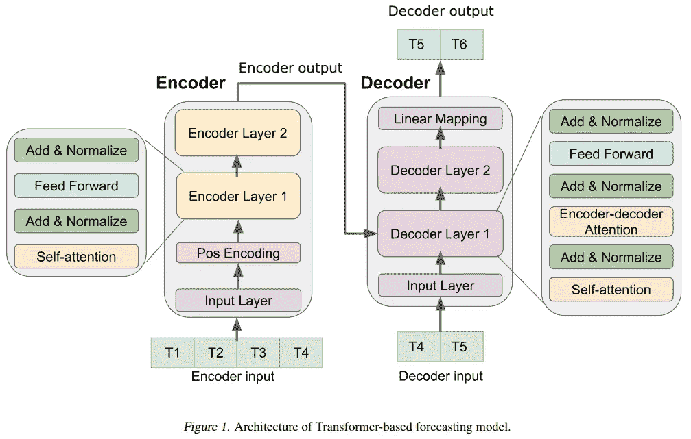
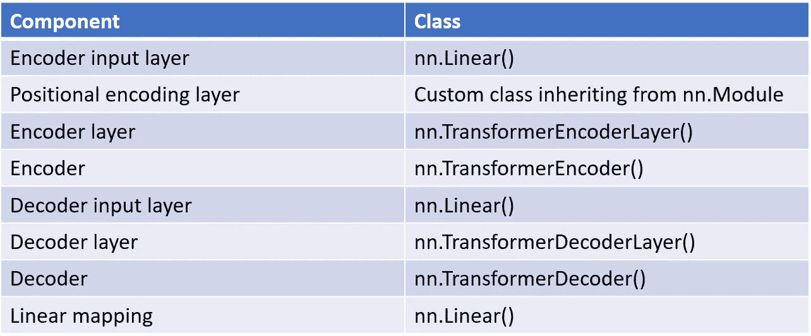
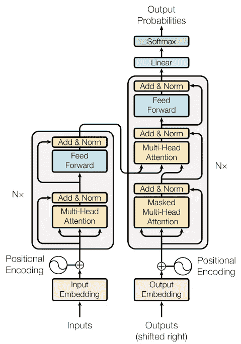
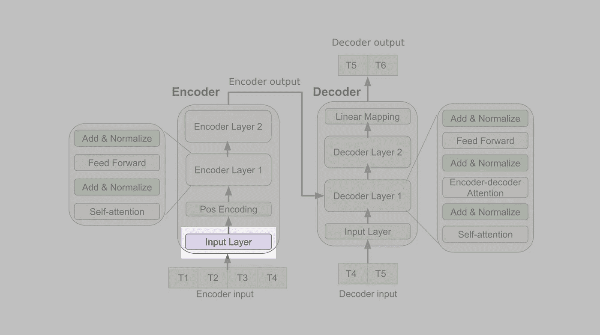
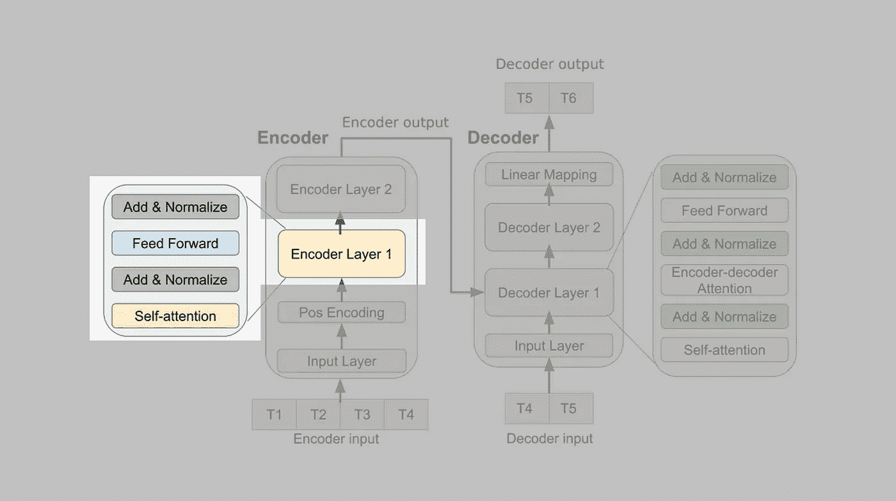
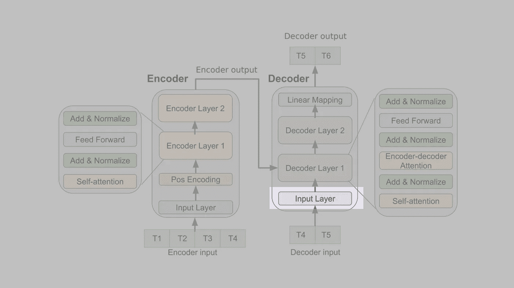
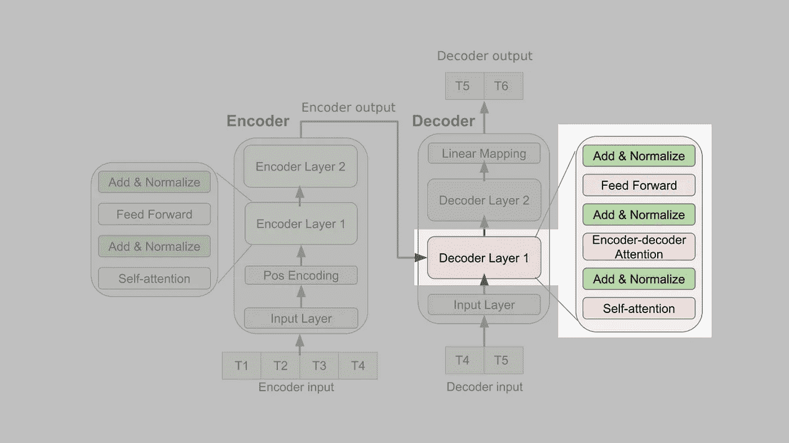
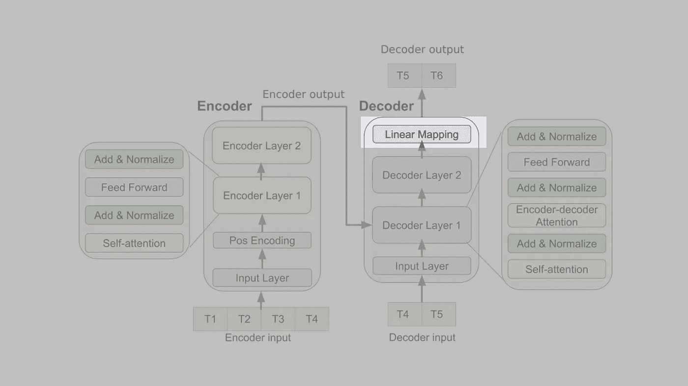

# 如何用 PyTorch 制作用于时间序列预测的转换器

> 原文：<https://towardsdatascience.com/how-to-make-a-pytorch-transformer-for-time-series-forecasting-69e073d4061e>

## 这篇文章将向你展示如何一步一步地将时序转换器架构图转换成 PyTorch 代码

变电站。图片由 [WikimediaImages](https://pixabay.com/photos/hockenheim-switchyard-transformer-844452/) 提供。

变压器模型在许多时间序列预测问题中表现出了最先进的性能[1][2][3]。

在本文中，您将学习如何在 PyTorch 中为时间序列预测编写一个 transformer 架构。具体来说，我们将对论文*“时间序列预测的深度转换模型:流感流行案例”* [2]中使用的架构进行编码，我们将使用他们的架构图作为出发点。

因此，我将一步一步地展示如何对图中的每个组件进行编码。通过这种方式，您将学习解释 transformer 架构图并将其转换为代码的通用技巧。

我将解释这个过程，就好像您以前从未实现过 transformer 模型一样。然而，我确实假设你对 PyTorch 和机器学习有基本的了解。最终的结果将是一个我们称之为`TimeSeriesTransformer`的类，在这个类中所有的东西都聚集在一起。

我还将解释模型的`forward()`方法的输入必须是什么，以及如何创建它们。

值得注意的是，没有一个转换器模型架构。存在几种不同的变压器架构。由此自然得出结论，例如，当我说编码器由 x、y、z 组成时，我指的是我们在本文中实现的 transformer 架构的编码器，而不是某种通用的 transformer 编码器。

这是我们将在本文中实现的架构图:

图一。图片作者:吴，格林，本&奥巴尼恩，2020 [2]

请注意，虽然该图仅描述了两个编码器层和两个解码器层，但作者实际上在每个层中都使用了四个层[2]。

下面的表 1 给出了构建图 1 中的时序转换器架构所需的所有组件的概述，以及使用什么类来制作每个组件。如您所见，我们只需要实现一个定制类。PyTorch 中提供了其他所有内容。耶！

表 1。时序转换器组件概述。图片由 Kasper Groes 阿尔宾 Ludvigsen。

起初让我困惑的是，在图 1 中，输入层和位置编码层被描述为编码器的一部分，而在解码器端，输入层和线性映射层被描述为解码器的一部分。

在最初的 transformer 论文[4]中，情况并非如此，其中输入层、位置编码层和线性层被描述为与编码器和解码器分离(参见下面的图 2)。

为了与最初的 transformer 文件保持一致，我将在这篇文章中说，编码器和解码器仅由 *n* 个堆叠的编码器或解码器层组成，我将把其他层视为编码器和解码器之外的独立层。此外，根据最初的 transformer 论文[4]，我不会将“添加和规范化”操作称为层。

图二。在最初的 transformer 论文中，输入层和位置编码层被描述为与编码器和解码器分离，这与[2]相反。瓦斯瓦尼等人的图片 2017 [4]

该员额的其余部分结构如下:

1.  首先，我们将在名为`TimeSeriesTransformer`的课程中了解如何制作变压器的每个组件，以及如何将它们组装在一起
2.  然后，我将展示如何为模型创建输入

我将不提供组件内部工作的详细描述，因为这些在别处已经解释得很清楚了(例如[5][6])。

当你读完这篇文章后，你可能想学习如何在推理过程中使用时间序列转换器:

  

# 1.分解变压器架构

让我们将图中所示的转换器架构分解成它的组成部分。

## **1.1。编码器输入层**

图片作者吴，格林，本&奥巴尼恩，2020 [2](本人重点)

编码器输入层简单地实现为神经网络。线性()层。`in_features`参数必须等于作为模型输入的变量数量。在一个单变量时间序列预测问题中，`in_features = 1`。`out_features`参数必须是`d_model`，它是一个在【4】中具有值`512`的超参数。

下面是`TimeSeriesTransformer`类中的代码:

## **1.2。位置编码层**

图片作者吴，格林，本&奥巴尼恩，2020 [2](本人重点)

最初的 transformer 论文的作者非常简洁地描述了位置编码层的作用以及为什么需要它:

> 由于我们的模型不包含递归和卷积，为了让模型利用序列的顺序，我们必须注入一些关于序列中记号的相对或绝对位置的信息

下面是将位置编码器实现为一个类的一种方法。

下面是如何在`TimeSeriesTransformer`类中使用`PositionalEncoder`类:

如您所见，`dim_val`是作为`d_model`参数提供的。这很重要，因为编码器输入层产生大小为`dim_val`的输出。

## **1.3。编码器层**

图片作者吴，格林，本&奥巴尼恩，2020 [2](本人重点)

请注意，虽然该图仅描述了两个编码器层，但作者实际上使用了四个编码器层[2]。

[2]使用的编码器层与 PyTorch Transformer 库所基于的[4]使用的编码器层相同，因此我们可以简单地使用 PyTorch 来创建编码器层。

这样做的方法是首先制作一个对象，我们可以称之为`encoder_layer`，用`torch.nn.TransformerEncoderLayer`这样:

`encoder_layer = torch.nn.TransformerEncoderLayer(d_model, nhead, batch_first=True)`

通过使用`torch.nn.TransformerEncoderLayer`，该层将自动具有如上所述的自我关注层和前馈层，以及中间的“添加&正常化”。注意，没有必要使`encoder_layer`成为`TimeSeriesTransformer`类的实例属性，因为它只是作为参数传递给`nn.TransformerEncoder`。

然后像这样将`encoder_layer`对象作为参数传递给`torch.nn.TransformerEncoder`，以便堆叠 4 个相同的编码器层:

`self.encoder = torch.nn.TransformerEncoder(encoder_layer, num_layers=4, norm=None)`

注意`norm`是`nn.TransformerEncoder`中的一个可选参数，当使用标准`nn.TransformerEncoderLayer`类时传递一个标准化对象是多余的，因为`nn.TransformerEncoderLayer`已经在每一层后标准化了。可选参数用于不包括标准化的自定义编码器层[7]。

下面是编码器代码在`TimeSeriesTransformer`类中的一个片段。

## 1.4.解码器输入层

图片作者吴，格林，本&奥巴尼恩，2020 [2](本人重点)

解码器输入层只是一个线性层，就像编码器输入层一样。`in_features`参数必须等于作为模型输入的变量的数量。在一个单变量时间序列预测问题中，`in_features = 1`。`out_features`参数必须是`d_model`，它是一个在【4】中具有值`512`的超参数。我们将使用这个值，因为[2]没有指定它。

下面是`TimeSeriesTransformer`类中的代码:

## 1.5.解码器层

图片作者吴，格林，本&奥巴尼恩，2020 [2](本人重点)

注意，尽管该图仅描绘了两个解码器层。作者实际上使用了四个解码器层[2]。

解码器的制作方式与编码器完全相同，根据[2]，其中`num_layers`为 4。

[2]没有指定他们使用多少头，所以我们将按照[4]使用`nheads=8`。

这里有一个片段展示了解码器代码放在`TimeSeriesTransformer`类中时的样子。

## 1.6.线性映射层

图片作者吴，格林，本&奥巴尼恩，2020 [2](本人重点)

尽管这一层被称为“线性映射层”，但除了参数值之外，它实际上与编码器和解码器输入层相同:

`in_features`必须等于输出序列长度乘以 d_model，以适应解码器的输出。

`out_features`必须等于目标序列长度，因为线性映射层是变压器模型的最后一层。因此，如果您的时间序列数据集由每小时的数据点组成，并且您想要预测未来 24 小时，`out_features`必须是 24。

下面是`TimeSeriesTransformer`类中的代码:

## 组装变压器模型

既然我们已经看到了如何对图中所示的构成 transformer 模型的每个组件进行编码，我们将把它们放在一个类中。参数的默认值是[2]中使用的值。

## 初始化转换器模型

既然我们已经看到了如何编写`TimeSeriesTransformer`类，我还想快速展示如何初始化模型以及什么值作为参数传递。模型的实现方式，只有`input_size`、`dec_seq_len`和`max_seq_len`是必需的，其余都有默认值。

# 2.如何创建变压器模型的输入

正如在`TimeSeriesTransformer`类中看到的，我们模型的`forward()`方法接受 4 个参数作为输入。在这一节中，我将解释如何创建这四个对象。

这些输入是:

1.  `src`
2.  `trg`
3.  `src_mask`
4.  `trg_mask`

## 2.1.如何为时序转换器模型创建 src 和 trg

让我们先仔细看看`src`和`trg`是如何为时序变压器模型制作的。

`src`是编码器输入，是“源”的简称。`src`只是整个序列中连续数据点的子集。`src`的长度决定了您的模型在进行预测时会考虑多少过去的数据点。如果数据集的分辨率为每小时，则一天有 24 个数据点，如果您希望模型基于过去两天的数据进行预测，则`src`的长度应为 48。

`trg`是解码器输入。Trg 是“target”的缩写，但这有点误导，因为它不是实际的目标序列，而是由`src`的最后一个数据点和实际目标序列中除最后一个数据点以外的所有数据点组成的序列。这就是为什么人们有时称 trg 序列为“右移”。`trg`的长度必须等于实际目标序列的长度【2】。你有时会看到术语`tgt`被用作同义词。

以下是对数据点`src`和`trg`必须包含的内容的简明解释:

> 在典型的训练设置中，我们训练模型从 10 个跟踪的每周数据点预测 4 个未来的每周 ILI 比率。也就是说，给定编码器输入(x1，x2，…，x10)和解码器输入(x10，…，x13)，解码器的目标是输出(x11，…，x14)。 *([2]第 5 页)*

给定一个序列，这里有一个函数产生`src`和`trg`以及实际的目标序列`trg_y`。`src`和`trg`对象被输入到模型中，而`trg_y`是目标序列，当计算损失时，模型的输出与该目标序列进行比较。给`get_src_trg()`函数的`sequence`必须是整个数据集的子序列，长度为 input _ sequence _ length+target _ sequence _ length。

下面是创建`src`、`trg`和`trg_y`的函数:

## 2.2.屏蔽变压器中的解码器输入

我们现在已经看到了如何生成我们的模型的`forward()`方法所需要的前两个输入。现在让我们考虑我们的模型的`forward()`方法需要的最后两个输入:`src_mask`和`trg_mask`

但首先你应该知道在变形金刚的上下文中有两种类型的屏蔽:

1.  *填充蒙版*。当使用不同长度的序列(句子通常具有不同的长度)时，短于所选最大序列长度(这是一个可以具有任何值的超参数，例如 50)的序列将用填充标记填充。填充标记必须被屏蔽，以防止模型关注这些标记。
2.  *解码器输入屏蔽*(又名“前瞻屏蔽”)。这种类型的屏蔽防止解码器在“考虑”令牌 *t* 具有什么“含义”时关注未来的令牌。

在这篇文章中，我们不会填充我们的序列，因为我们将以这样一种方式实现我们的自定义数据集类，即所有序列都具有相同的长度。因此，在我们的例子[8]中不需要*填充屏蔽*，也没有必要屏蔽编码器输入[9]

然而，我们需要使用*解码器输入屏蔽*，因为这种类型的屏蔽总是必要的。

回想一下，解码器接收两个输入:

1.  编码器输出
2.  解码器输入

这两个都需要屏蔽。

为了屏蔽这些输入，我们将为模型的`forward()`方法提供两个屏蔽张量:

1.  `src_mask`这会屏蔽编码器输出
2.  `trg_mask`这会屏蔽解码器输入

在我们的例子中，`src_mask`将需要具有以下尺寸:

[目标序列长度，编码器序列长度]

并且`trg_mask`将需要具有大小:

[目标序列长度，目标序列长度]

以下是生成遮罩的方法:

以下是如何使用遮罩作为模型的输入:

# 时间序列转换器的完整示例

我已经创建了[这个回购](https://github.com/KasperGroesLudvigsen/influenza_transformer)，它包含了一个完整的例子和一些时间序列数据。repo 还包含用时序转换器模型运行推理的代码，我的文章“[如何用 PyTorch 时序转换器](https://medium.com/towards-data-science/how-to-run-inference-with-a-pytorch-time-series-transformer-394fd6cbe16c)运行推理”中描述了这些代码

  

就是这样！我希望你喜欢这篇文章🤞

请留下评论让我知道你的想法。如果您有任何问题或建议，我将非常高兴收到您的来信🙌

关注更多与时间序列预测相关的帖子。我也写绿色软件工程和数据科学对环境的影响，比如这里的和这里的🍀

请随时在 LinkedIn 上与我联系。

# 参考

[1][https://arxiv.org/abs/2109.12218](https://arxiv.org/abs/2109.12218)

[2][https://arxiv.org/abs/2001.08317](https://arxiv.org/abs/2001.08317)

[https://arxiv.org/abs/2012.07436](https://arxiv.org/abs/2012.07436)

[https://arxiv.org/pdf/1706.03762.pdf](https://arxiv.org/pdf/1706.03762.pdf)

[5][https://towards data science . com/how-to-code-the-transformer-in-py torch-24 db 27 c 8 F9 EC # 1b3f](/how-to-code-the-transformer-in-pytorch-24db27c8f9ec#1b3f)

[6]http://jalammar.github.io/illustrated-transformer/

[https://github.com/pytorch/pytorch/issues/24930](https://github.com/pytorch/pytorch/issues/24930)

[8][https://github.com/huggingface/transformers/issues/4083](https://github.com/huggingface/transformers/issues/4083)

[9][https://medium . com/analytics-vid hya/masking-in-transformers-self-attention-mechanism-bad 3c 9 EC 235 c](https://medium.com/analytics-vidhya/masking-in-transformers-self-attention-mechanism-bad3c9ec235c)