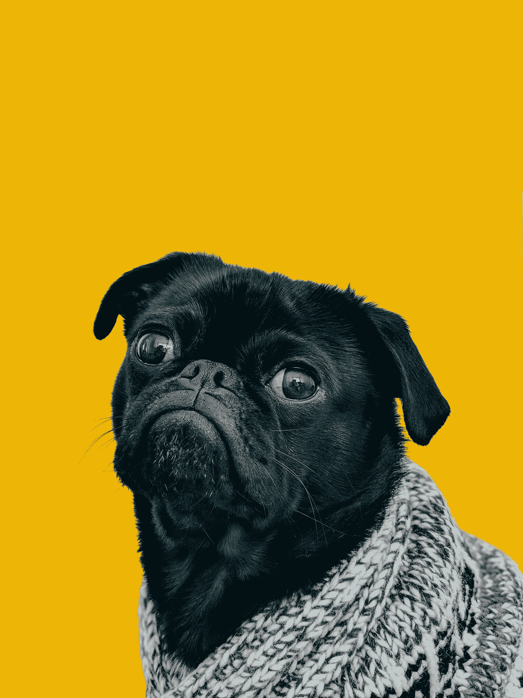
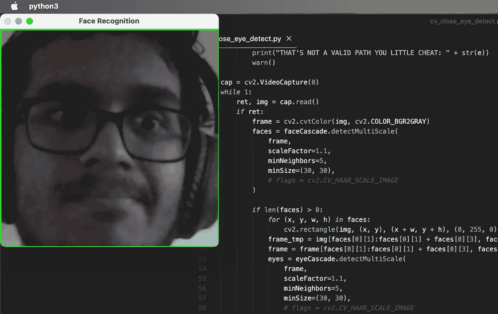

# 如何用计算机视觉让一只 AI 狗吃掉你的作业

> 原文：<https://towardsdatascience.com/how-to-make-an-ai-dog-eat-your-homework-with-computer-vision-1866ada7ac08>

## *OpenCV 和 Python 中一个有趣的项目，利用了面部特征检测*



由 [charlesdeluvio](https://unsplash.com/@charlesdeluvio?utm_source=medium&utm_medium=referral) 在 [Unsplash](https://unsplash.com?utm_source=medium&utm_medium=referral) 上拍摄的照片

虽然学习如何使用人工智能工具来应对复杂的挑战很重要，但我想向你展示它们如何让你发挥创造力，享受乐趣，并将任何事情变成现实。在这种情况下，**我们正在为自己没有按时完成工作找一个经典的童年借口:*我的狗把它吃了。***

# 项目范围

我们希望你的笔记本电脑上有一只狗。使用你的笔记本电脑的网络摄像头，狗会盯着你的脸。如果你分心了(例如，你把目光从电脑上移开了)或者因为你的努力工作而昏昏欲睡了(例如，你的眼睛闭上了)，你的新宠物狗会开始对你吠叫，让你重新开始工作或者叫醒你。如果你仍然没有开始工作，它会吃掉你的作业(也就是删除你应该在做的文件)。

**本项目为:**

*   **一个有趣的笑话**
*   一个强有力的方法让你继续工作
*   **学习 Python 和 OpenCV 中的面部特征检测、音频回放和系统文件操作的好方法。**

# 如何打造你的爱犬

## 设置

首先，打开一个新的 Python3 文件。使用您选择的软件包管理器安装`cv2`、`send2trash`和`playsound`(我喜欢 pip)。

从[*https://github . com/NP into/opencv/tree/master/data/Haar cascades*](https://github.com/npinto/opencv/tree/master/data/haarcascades)*，*下载这两个让 OpenCV 检测面部特征的文件，包括睁眼和闭眼:`haarcascade_eye_tree_eyeglasses.xml`和`haarcascade_frontalface_alt.xml`。将它们放在您的项目目录中。

在 Python 文件的顶部，导入我们下载的三个库和两个文件:

```
*import* cv2
*from* send2trash *import* send2trash
*from* playsound *import* playsoundeye_cascPath = '{PATH}/haarcascade_eye_tree_eyeglasses.xml'  *#eye detect model*face_cascPath = '{PATH}/haarcascade_frontalface_alt.xml'  *#face detect model*
```

还要定义两个全局变量，我们稍后将使用它们来跟踪用户闭上眼睛的帧数以及他们收到的没有受到惩罚的警告数。

```
frames_closed = 0 # number of frames the user's eyes are not detected as open
warnings = 0 # number of warning the user has received without their homework being eaten
```

## "狗的行为

为了让我们的 Python 脚本感觉像一只狗，我们需要它吠叫！由于我们将使用的面部特征检测不是 100%万无一失的，我们需要对用户宽容一点，所以我们将实现一个警告系统。每次警告，狗都会叫，三次警告后，它会吃掉你的作业(这个功能我们很快就会实现！).要让狗叫，可以在任何你想要的音频文件上使用`playsound`库(如果你没有，[试试这个网站](https://freesound.org/search/?q=dog+bark)轻松获得免费声音)。

注意功能开始时`global`的使用。在 Python 中，这有时对于访问全局变量而不是定义同名的局部变量是必要的。使用面向对象技术可以更容易地避免这种情况，但是因为这是一个快速脚本，所以我们可以接受有点混乱。尽量不要在大型项目中使用这种方法，因为它会很快变得一团糟。

```
def warn(): global warnings warnings += 1 playsound("./BARKS_WITH_ECHO_SPg.wav") *if* warnings >= 3: delete_hw(hw_path)
```

## 饮食行为

现在我们将编写代码，最终让你的狗吃你的作业。

首先，我们想使用 Python 内置的`input`函数获取用户正在处理的文件。这只是要求用户在运行脚本的终端中输入一个字符串。

```
hw_path = input("Whatcha working on? ")
```

然后使用`send2trash`库定义函数删除或吃掉作业。我使用这个库是因为它允许用户在需要的时候从系统垃圾中恢复他们的文件，但是如果你想冷酷无情，你可以使用`os.remove()`来代替。`os`库还有很多其他操作系统文件的简单函数，所以值得以后的项目学习。

如果用户给了我们一个无效的路径，我们也使用我们的`warn()`函数，我们用`try`和`except`检查，当`send2trash`接收到一个无效的路径时，捕捉到它给出的异常。再次注意前面讨论过的`global`的使用(这开始显示当多个变量被修改时它是如何变得混乱的！).

```
def delete_hw(path): global frames_closed global warnings frames_closed = 0 warnings = 0 *try*: send2trash(path) *except* Exception *as* e: print("THAT'S NOT A VALID PATH YOU LITTLE CHEAT: " + str(e)) warn()
```

现在我们有了主要的“狗吃了你的作业”功能。

## 给我们的狗一个大脑:计算机视觉和面部特征检测

如果我们的眼睛或闭上或不看我们的电脑(基本上，不工作)，我们希望狗在三次警告后吃我们的作业，所以是时候用 OpenCV 实现我们程序的主要逻辑了。

用 OpenCV 提供的构造函数加载我们下载的文件。这使用文件中的数据来形成用于检测面部和睁开的眼睛的分类器。这些 xml 文件包含识别不同特性的数据，如本文[所述。](https://ieeexplore.ieee.org/document/990517)本质上，图像的不同区域是用不同方向的矩形选取的。当按顺序排列时(“层叠”，正如您可能在函数名中看到的)，它们形成了一个粗略的决策树，可以有效地检测我们是否在查看文件的功能。我们使用 OpenCV 提供的标准分类器文件，因为面部特征检测是一项常见的任务，但如果你想修改这个项目，也可以用这个算法训练你自己的分类器文件！

```
faceCascade = cv2.CascadeClassifier(face_cascPath)
eyeCascade = cv2.CascadeClassifier(eye_cascPath)
```

用 OpenCV 的给定函数触发网络摄像头。有多种类型的参数可以传入这个构造函数，但是为了方便起见，我选择传入我的相机的设备索引。具体来说，我传入了索引 0，它总是选择设备的主摄像头。传入 1 将选择第二台摄像机，传入 2 将选择第三台摄像机，依此类推。因为如果你不知道索引并不好，所以也有其他的构造函数可用。

```
cap = cv2.VideoCapture(0)
```

然后有一个 while 循环来运行每一帧。大致步骤如下:

1.  当程序运行时，从网络摄像头捕捉每一帧的图像。
2.  如果有图像，将其转换为灰度。这是必要的，因为 OpenCV 中的`detectMultiScale`函数期望灰度图像，因为颜色信息实际上对算法没有任何帮助。你可以很容易地在黑白电影里认出一张脸，不是吗？形状最重要，这也是 xml 文件包含数据的目的。
3.  使用我们的人脸模型 xml 文件，使用上面提到的 Haar 级联算法来检测图像中是否有人脸。
4.  如果有一张脸，在屏幕上的图像周围画一个矩形，这样我们就可以看到它在工作。在循环结束时在窗口中显示图像。这并没有给项目增加任何功能，但是这是一个很好的视觉效果。
5.  同样，使用我们的眼睛模型来检查人脸中是否有睁开的眼睛，使用与检测人脸相同的技术。
6.  相应地更新`frames_closed`，如果一行中有太多关闭的框架，那么我们必须`warn()`用户。

代码如下:

```
*while* 1: ret, img = cap.read() *if* ret: frame = cv2.cvtColor(img, cv2.COLOR_BGR2GRAY) faces = faceCascade.detectMultiScale( frame, scaleFactor=1.1, minNeighbors=5, minSize=(30, 30), *# flags = cv2.CV_HAAR_SCALE_IMAGE* ) *if* len(faces) > 0: *for* (x, y, w, h) *in* faces: cv2.rectangle(img, (x, y), (x + w, y + h), (0, 255, 0), 2) frame_tmp = img[faces[0][1]:faces[0][1] + faces[0][3], faces[0][0]:faces[0][0] + faces[0][2]:1, :] frame = frame[faces[0][1]:faces[0][1] + faces[0][3], faces[0][0]:faces[0][0] + faces[0][2]:1] eyes = eyeCascade.detectMultiScale( frame, scaleFactor=1.1, minNeighbors=5, minSize=(30, 30), *# flags = cv2.CV_HAAR_SCALE_IMAGE* ) *if* len(eyes) == 0: print('no eyes!!!') frames_closed += 1 *else*: print('eyes!!!') frames_closed = 0 frame_tmp = cv2.resize(frame_tmp, (400, 400), interpolation=cv2.INTER_LINEAR) cv2.imshow('Face Recognition', frame_tmp) *else*: print('no face!!!') frames_closed += 1 *if* frames_closed >= 60: frames_closed = 0 warn()    waitkey = cv2.waitKey(1) *if* waitkey == ord('q') or waitkey == ord('Q'): cv2.destroyAllWindows() *break*
```

# 包裹



运行程序时应该看到的示例。

现在你应该有一只功能正常的人工智能狗，如果你不集中注意力，它会吃你的作业。希望这篇教程对你在 OpenCV 和 Python 中的面部特征检测有所帮助。我也希望你能从中发现一些幽默！一个主观上有用的工具…最重要的是，我希望这能激发你对代码的兴趣，让你的想象力自由驰骋——软件不仅仅是功利的。如果结合并正确使用，即使像这样简单的工具也是非常强大的。

## 面部识别风险

需要警惕的一点是面部检测的风险。这可能是对隐私的严重侵犯——幸运的是，这个简单的脚本不存储任何数据，所有处理都在本地完成。如果要修改的话，用户的隐私应该得到保护。此外，算法在不同种族、性别等方面的表现可能存在偏差。所以要注意这一点。

请在评论中告诉我任何想法或问题。我很高兴地指出我写的更多关于狂野的想法和艺术与科技相遇的文章！