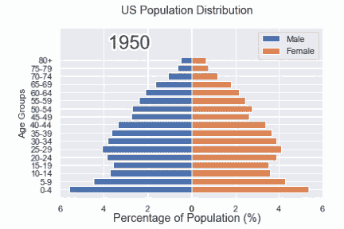
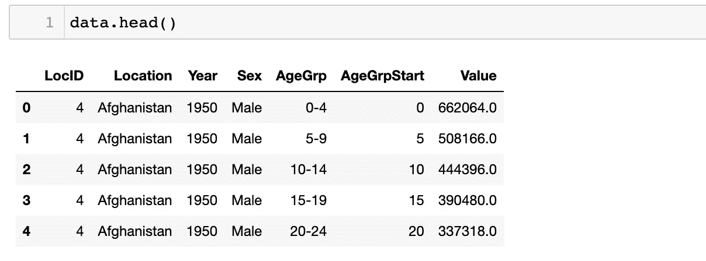
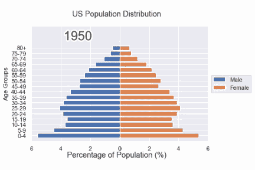
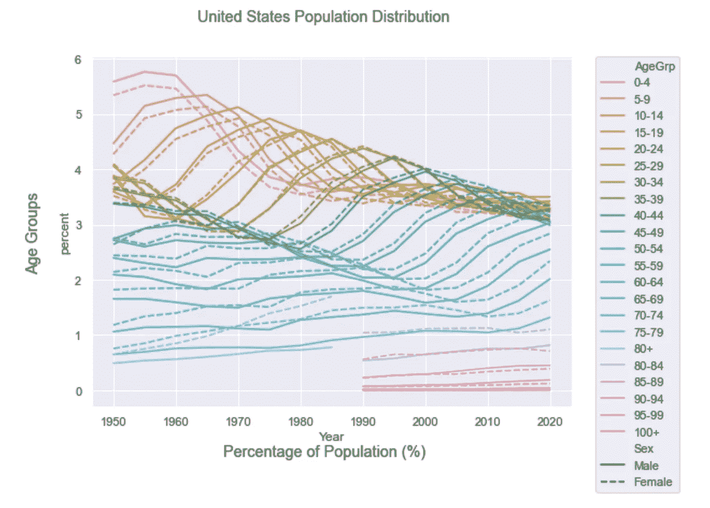
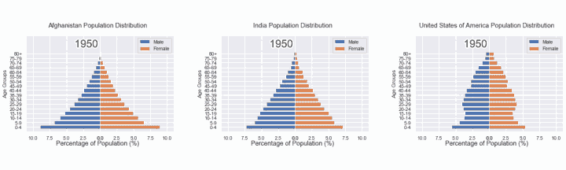

# 如何用 Python 制作 gif

> 原文：<https://towardsdatascience.com/how-to-make-gifs-in-python-664d15ed4256>

## 在数据分析中使用 gif，发现它们严肃的一面

照片由[格雷格·拉科齐](https://unsplash.com/@grakozy?utm_source=medium&utm_medium=referral)在 [Unsplash](https://unsplash.com?utm_source=medium&utm_medium=referral) 上拍摄

多亏了社交媒体，你可能已经非常熟悉 gif 了。在短短的几帧中，他们传达了非常具体的反应，只有图片才能传达。gif 在交流数据时也有类似的效果。

GIF 或图形交换格式是一种流行的图像格式，因为它们是被许多应用程序接受的紧凑、计算成本低的文件。本质上，gif 是把一堆图片串在一起，就像一本动画书。这种类似“动画书”的格式是展示多个图表趋势的理想方式。通过在帧之间快速移动，它们以静态图无法传达的方式揭示了数据中的趋势和模式。

图片作者。

# 密码

这个项目的回购可以在[这里](https://github.com/katyhagerty/create_gif)找到。

## 从现有图像创建 GIF

首先，加载数据。本文使用来自`bokeh`库的人口数据集。

下面是数据集的结构:

图片作者。

接下来，创建`filter_loc`，一个基于国家过滤数据集的函数。

现在，创建一个函数来绘制数据集中每年的人口密度。这个函数创建构成 GIF 的图(或帧)。

使用一个循环来调用`make_plot`的所有年份的利息。尽管数据集包括预测数据，但该 GIF 仅使用过去几年的数据。

把这些单独的图像串在一起，生成一个 GIF。

瞧啊。

图片作者。

## 创建 GIF 而不输出多个图像

在上面的例子中，代码输出静态图，然后将它们编译成 GIF。但是，可能会有不希望输出图的情况。例如，如果 GIF 有 1000 帧会怎样？如果 GIF 捕获了所有相关信息，为什么还要浪费存储空间呢？

`matplotlib`可以将一个函数作为输入并创建一个 GIF，而不是将文件名列表作为输入。使用函数消除了保存单个帧的需要。

首先，初始化绘图，这样函数就可以在以后覆盖。

接下来，定义`run`，这个函数为 GIF 创建不同的框架。

## GIF vs 静态图

gif 在很短的时间内显示大量数据，在某些情况下比静态图更有优势。为了说明这一点，将美国人口密度 GIF 与下面的静态图进行比较。两者显示了完全相同的信息。然而，GIF 更清楚地显示了人口是如何趋向于均匀分布的。

作者图片

## 一图多 gif

如果您想比较多个国家多年的人口分布情况，该怎么办？在一张图上绘制多个 gif 可以更容易地比较图表。

首先，创建必要的框架。

接下来，创建一个具有多个轴的图形。在适当的轴上绘制上面创建的框架。

这是成品:

图片作者。

上图并排绘制了三幅 gif 图，以说明阿富汗、印度和美国人口分布的差异。选择这三个国家是因为它们有不同的经济和生活水平。

由于高生育率和低存活率，阿富汗的人口分布偏向年轻人。印度的分布逐渐变得更加均匀。美国的图表显示了代表婴儿潮一代的聚类，但总体而言，趋向于均匀分布。

# 结论

感谢您阅读我的文章。我希望这篇文章能启发你考虑使用 gif 来整合数据和说明趋势。如果你喜欢我的内容，*请考虑关注我*。此外，欢迎所有反馈。我总是渴望学习新的或更好的做事方法。请随时留下您的评论或联系我 katyhagerty19@gmail.com。

如果你喜欢我的写作，请考虑关注我。你也可以通过订阅 Medium 来支持我和其他作家。通过订阅我下面的推荐链接，我收到了部分费用。不过， ***没有额外的费用给你*** 。谢谢你。

 [## 加入我的介绍链接媒体-凯蒂哈格蒂

### 作为一个媒体会员，你的会员费的一部分会给你阅读的作家，你可以完全接触到每一个故事…

medium.com](https://medium.com/@katyhagerty19/membership)