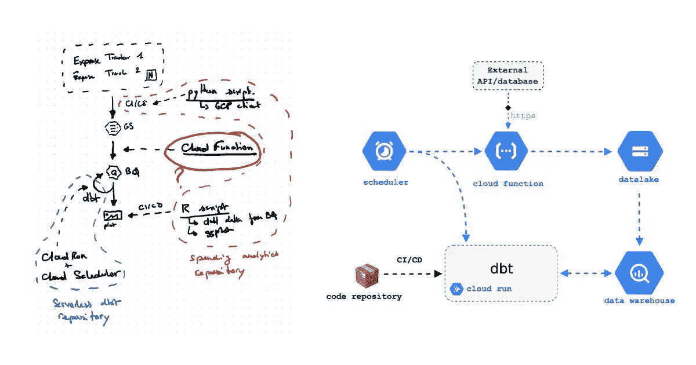
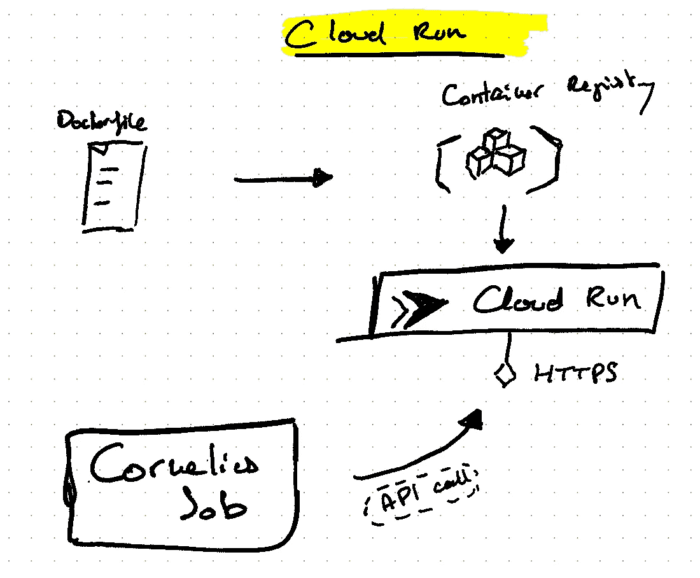
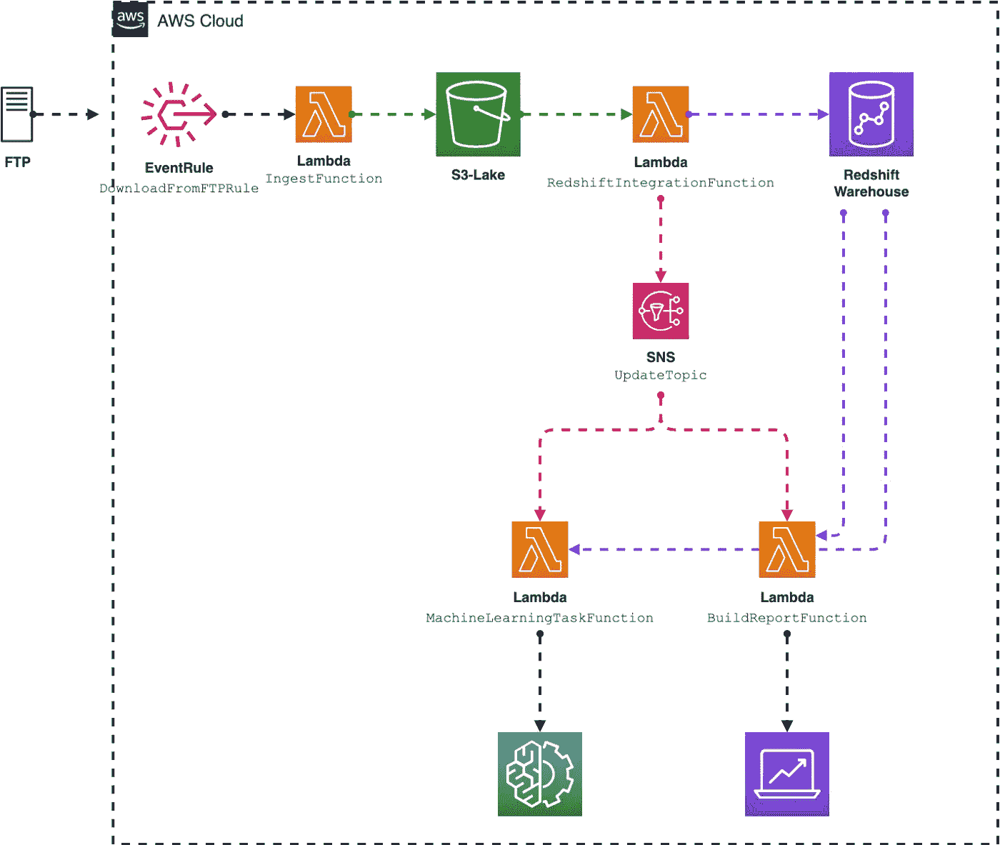
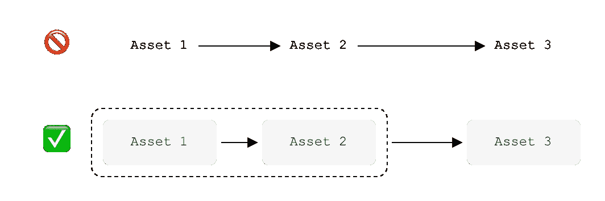
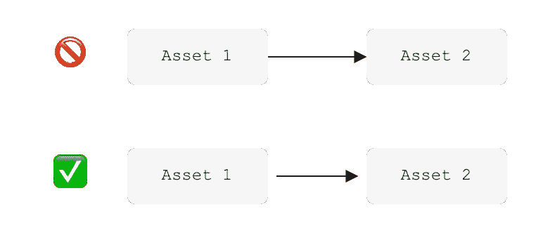
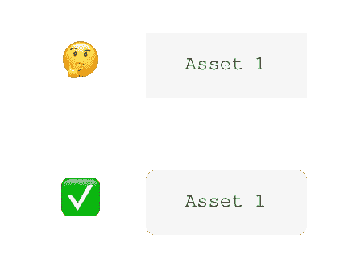
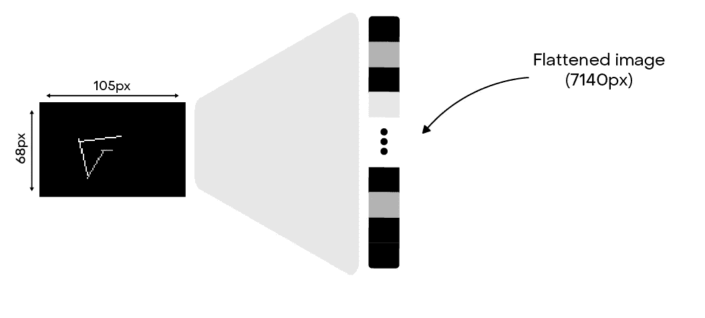
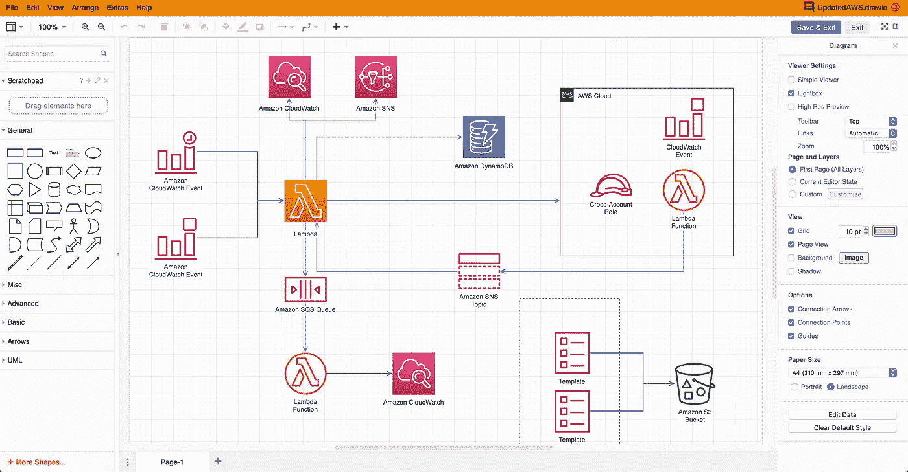
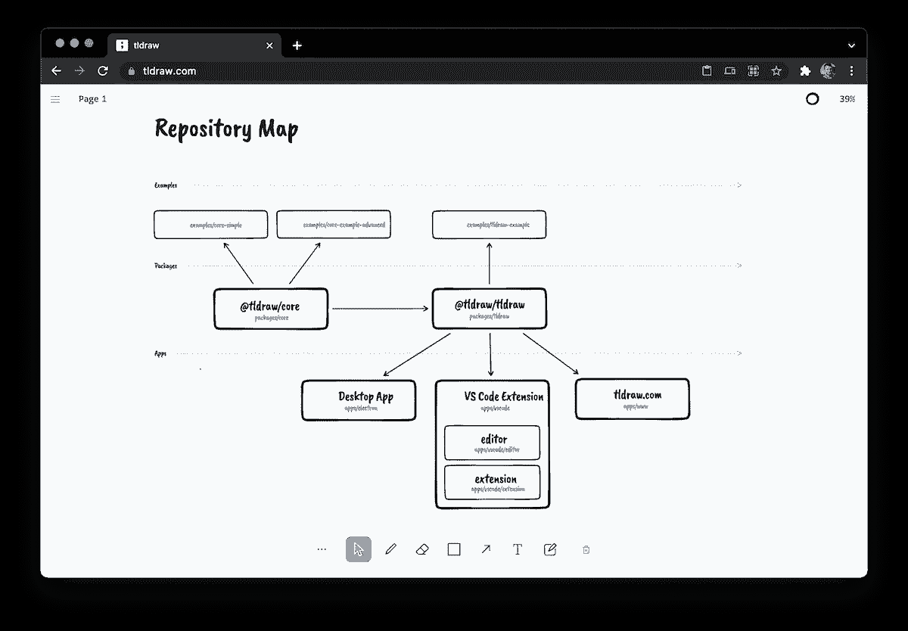

# 如何创建优秀的模式

> 原文：<https://towardsdatascience.com/how-to-make-great-schemas-4940e4951a44>

## 创建精心制作的模式的技巧和诀窍

来自作者的架构

解释数据资产很难。有很多工具、技术细节和术语。

然而，所有底层的工程和科学系统通常尊重某种建筑——某种设计。

这就是我们创建模式的原因。

**解释机器学习模型。分享软件架构。记录我们的管道。**

创建模式是采用系统的一个重要标志。你将在文档中、在卡片组中使用它，或者支持进一步想法的发展。

然而，将大型系统总结成一个图形资产并不容易。创建具有良好美感的精心制作的模式绝对是一项技能。

让我们深入了解一些设计有用且漂亮的模式的技巧吧！

# 拿起笔和纸

在深入研究软件、颜色或形状之前，最好先离开。

先拿一支笔和一张纸。

你不需要专注于某件特定的事情。第一步是把你的思维地图写在纸上。

如果有些东西看起来很奇怪，不要擦掉它。在另一张纸上开始新的草稿。

保留你所有的草稿。事后记录你的过程会是很好的材料。

当你认为你有一个好的计划时，开始把这些部分组织起来。写一份清晰的草稿，所有的元素都要有条理。

您是否拥有概述您的系统所需的所有项目？

您需要将您的模式分成许多部分吗？

我自己的一份草稿——描述 Google Cloud Run 服务和用例。

# 关注关键项目

人类的思维在看图像时肯定更专注。

这就是我们制作模式的原因，不是吗？

为了增强我们的模式，我们应该使用适当的图形资产。

有时我们的系统依赖于一个子系统:一个数据库，一个工具，或者一个我们想要抽象的复杂元素。使用徽标或简单的图像来描述这些子系统是很有用的。

为了制作一个好的图表，我们应该使用分辨率高、背景透明的标志。

这会让你的图表更加流畅，更容易理解。

花点时间来选择图像。不要使用拙劣的通用标志…

根据重要性使用不同的元素大小也是一个好主意。如果子系统细节很重要，请创建另一个模式。不要超载的东西。你的观众注意力有限。

想想你想展示的“尺度”。是不是一个全局图式，概括一个大系统？还是需要纹路细节的东西？支持技术文档？

在这个例子中有很多不同的资产。使用适当的徽标(来自 AWS 资产)有助于目标受众了解该工具，并带来每个子元素的上下文信息。(来源于作者:[你不需要管弦](/you-dont-need-an-orchestrator-6517b243dece))。

# 关注细节

伟大的模式是详细的。

以下是一些可以添加到模式的不同元素中的详细信息:

👉**上下文框**

添加灯箱可能是增强模式的良好开端。使用虚线将元素组合在一起也是一个好主意。它带来了背景。

你可能更喜欢使用浅灰色或浅色，因为这里的目的只是为了帮助元素区分。

作者图片

👉**填充**

在方框和箭头之间添加空格！你的模式将更容易阅读。

作者图片

👉**圆角(可选)**

根据你想要的设计，你应该喜欢把你的元素的角弄圆一点。

这可能只是当今的一种趋势，但由于这个小技巧，大画面往往会变得柔和。

作者图片

👉**颜色**

花点时间在颜色上。

太多的颜色和你的计划是失败的。

不够，根本不会看…

通常最多保留两三种颜色就很好了。你可以用精心挑选的颜色来强调某些部分。保持二阶元素为黑色或浅灰色。

🖇️是信息图表中色彩的绝佳指南。

👉**上下文注释**

有时，您可能希望添加一些注释，以方便读者理解。仅仅添加一个小箭头和一些文本通常就能达到目的。

来源于作者—[raw stats 之后:用数据嵌入探索控球风格。](/after-raw-stats-exploring-possession-styles-with-data-embeddings-d3ebef718abf)

👉**对准**

这是基本的。

确保所有元素都相互对齐。你计划的中心。

在你的模式周围留一些空白。

👉**背景**

这可能取决于最终的支持，但你会喜欢使用白色背景或透明的。

不要使用背景图片。

👉**导出格式**

有不同的导出格式。以下是一些基本注意事项:

*   JPEG:如果你不需要透明背景和低文件大小。
*   PNG:如果需要透明背景。
*   SVG:如果您希望以后能够编辑和调整您的模式——没有损失。

👉**字体**

最多保持一到两种字体。但是，可以随意使用不同的大小来扩展您的模式。不要犹豫加粗你的重要文本。

[🖇️我把我喜欢的字体保存在 GitHub 上](https://github.com/Ben8t/fonts)。

👉**字幕**

总是在你的模式中添加标题，或者引用一个源，或者描述整个系统。它帮助读者理解上下文。

# 工具作业

通常，一支笔和一张纸是你要使用的第一个工具。它们是开始构建模式的最便宜、最简单的工具。

我个人用的是一款[卓越平板](https://remarkable.com/)。它是电子墨水，具有云同步和分层等强大功能。我可以在任何地方工作，更容易地制作不同的草稿版本。

我非凡的平板电脑

当你有了初稿，你就可以去软件世界了。有许多工具可以创建模式。以下是一些最好的例子:

👉 [**draw.io**](https://www.draw.io/) :大概是我最喜欢的一个。您可以轻松地编辑您的模式，以不同的格式导出，并同步到 GitHub。有许多形状和功能可以将你的元素组合在一起。

[https://www.draw.io/](https://www.draw.io/)

👉[**tldraw.com**](https://www.tldraw.com/):比 draw.io 简单一点，但你只需点击几下就能做出漂亮的模式。

它具有创建不同风格的灵活模式的强大功能。

[https://www.tldraw.com/](https://www.tldraw.com/)

👉 [**Figma**](https://www.figma.com/) :这个工具更多的是用于设计用户界面，但是它有很大的特性可以创建模式。

一大优点:可以添加交互性和动作(制作 gif？).

👉[**Adobe Photoshop/Illustrator**](https://www.adobe.com/fr/products/photoshop.html)**:**如果想要完全定制，使用合适的图形工具会是一个不错的选择。你想做什么都可以。时间是唯一的限制。

我希望这些技巧能帮助您深入了解如何制作精心制作的模式。

这些都是简单的技巧，但这就是优秀模式的不同之处:

*   先拿一支笔和一张纸！
*   考虑你的受众和你的方案的上下文。
*   按照一些简单的指导方针，用一些软件来设计和创建模式，使你的模式流畅易懂。

如果你有任何问题或者只是想聊聊天，请不要犹豫联系我👋。

我是一名数据运营工程师，曾在新闻、零售、职业体育和音乐等多个行业工作过。我明白了，分享我们自己的经历是帮助他人和发展自己的一种强有力的方式。如果你也有这种想法，并且你正在寻找伟大的数据资源，请 [*订阅我的简讯*](https://fromanengineersight.substack.com/welcome)*——从工程师的角度。*