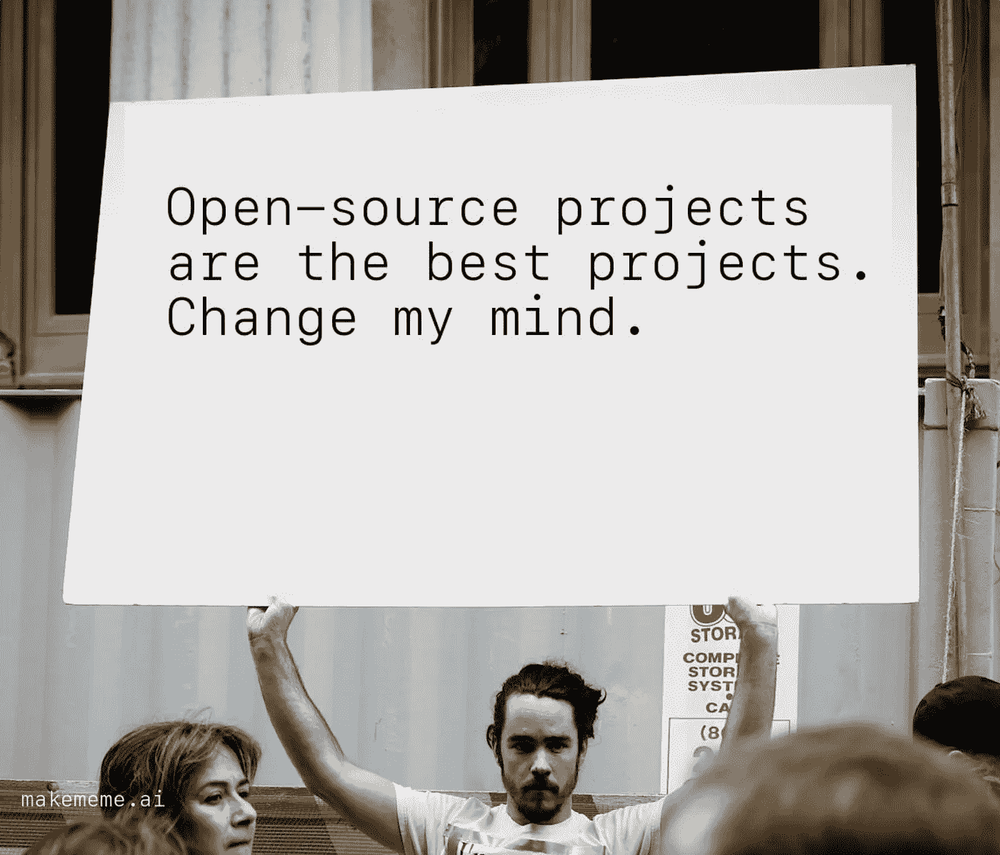
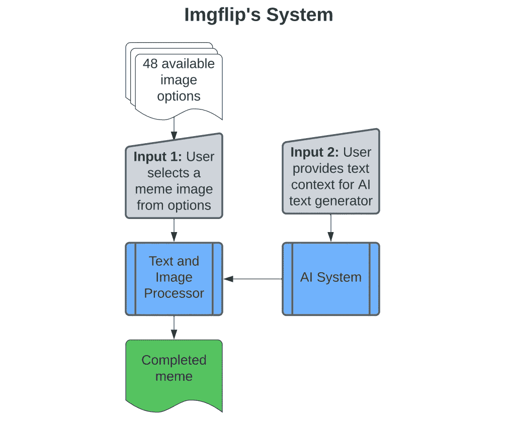
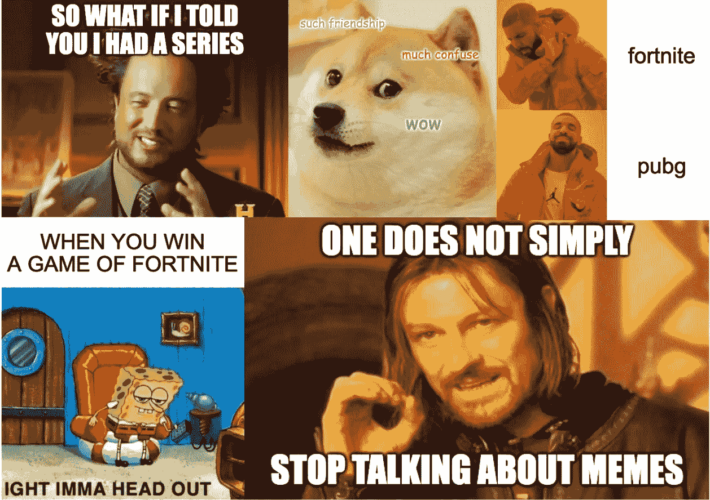
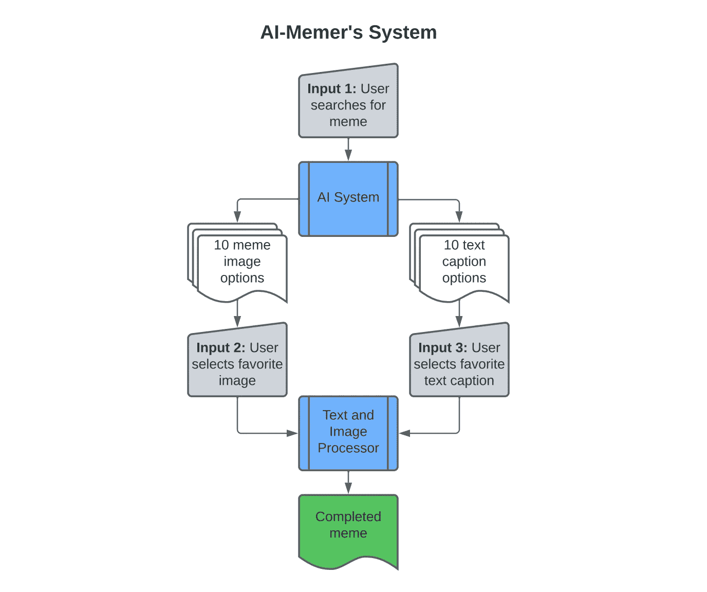
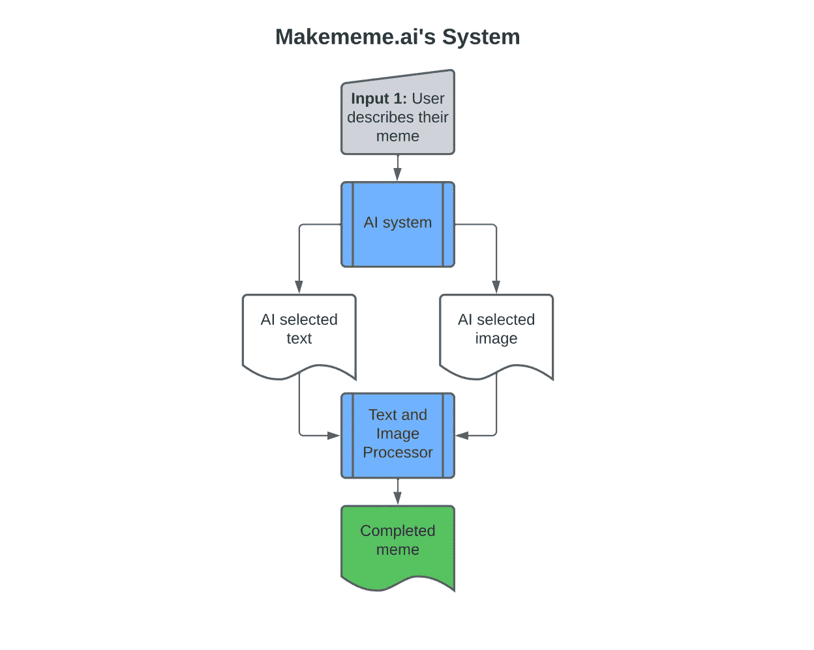
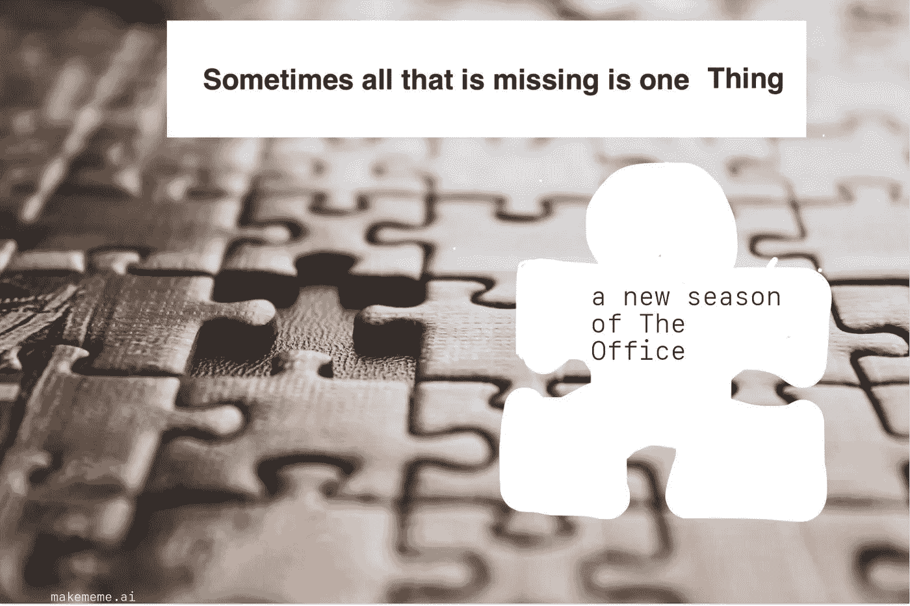
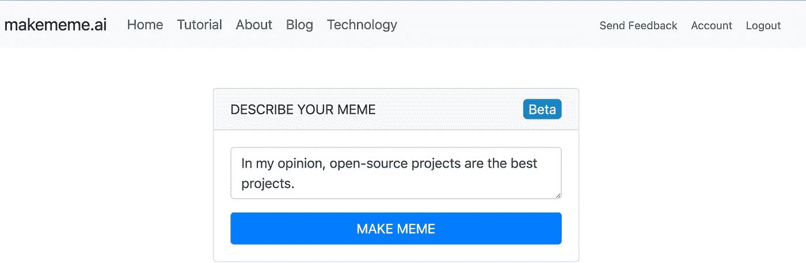
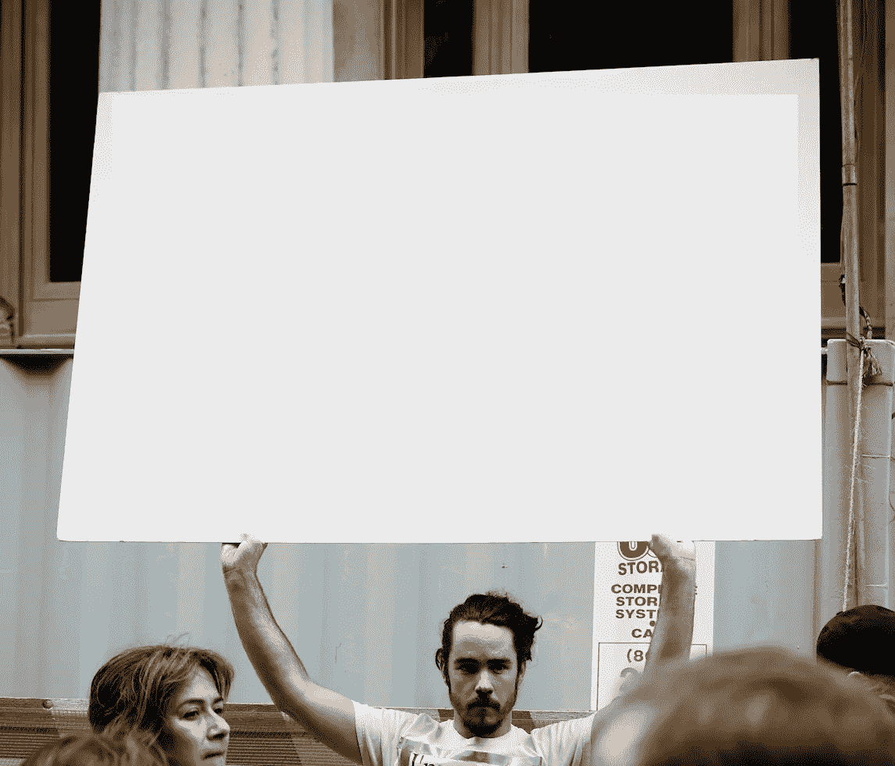
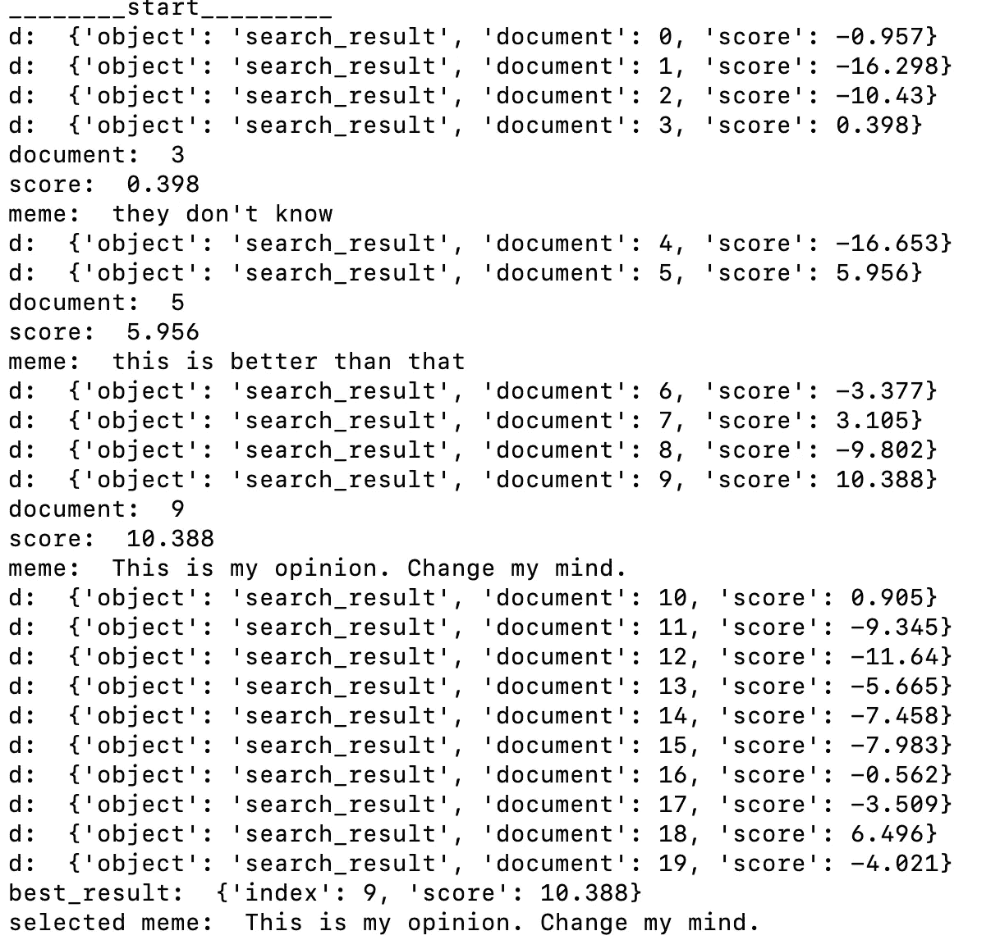

# 如何用 Python 制作带 AI 的迷因

> 原文：<https://towardsdatascience.com/how-to-make-memes-with-ai-in-python-986944bce5b4>



制作于 [makememe.ai](http://makememe.ai/) 。[图片](https://unsplash.com/photos/QARM_X5HWyI)由 [Felix Koutchinski](https://unsplash.com/@koutchinski) 根据 [Unsplash 许可](https://unsplash.com/license)

最近 [Makememe.ai](http://makememe.ai/) 是[产品搜索日](https://www.producthunt.com/posts/makememe-ai)的产品。用户提供一个简单的描述，应用程序将其转化为一个可以与朋友分享的快速笑声。

[Makememe.ai](http://makememe.ai/) 使用 [OpenAI 的 GPT-3](https://openai.com/blog/gpt-3-apps/) ，来执行自然语言任务，将用户的文本转换成 meme。我们将通过 Python 代码和高级人工智能系统来学习如何用人工智能创造迷因！

该项目现在在 Github 上开源。随意叉回购，并尝试建立在它之上。如果你想投稿，你需要[注册](https://openai.com/api/)获得 OpenAI API 访问权限，并且在分叉或克隆库之前请阅读 OpenAI 的[上线政策](https://beta.openai.com/docs/going-live)。

# 先验模因创新

Imgflip 的创始人 Dylan Wenzlau 创造了一个人工智能系统来生成模因。迪伦从 Imgflip 用户的 1 亿条公共迷因说明中提取信息，构建了一个用于文本生成的深度卷积网络。在应用程序中，用户从 48 个可用的迷因中选择一个迷因，人工智能会生成文本覆盖在迷因上。这款应用只需点击几下就能创造出有趣的迷因。用户可以提供一些上下文(迷因的主题等)。)供人工智能用来创造迷因。



Imgfip 系统的高级示意图。由 Josh Bickett 在 lucid.app 上创建。*图片由作者提供。*



迪伦·温兹劳开发的人工智能创造的迷因

[罗伯特·a·冈萨维斯](https://robgon.medium.com/)创造了一个人工智能迷因系统，叫做[人工智能迷因](/ai-memer-using-machine-learning-to-create-funny-memes-12fc1fe543e4)。他让任何人都可以在 colab 笔记本上获得代码。

用户输入一个搜索查询，会收到 10 个与搜索匹配的 meme 图片选项。用户从 10 幅图像中选择一幅。然后，人工智能系统生成 10 个可能的字幕，用户选择他们最喜欢的。



AI-Memer 系统的高层图。由 Josh Bickett 在 [lucid.app](https://lucid.app/documents) 上创建。*图片由作者提供。*

# Makememe.ai 的方法——“提示一个模因”

该应用采取了一种不同的方法，可以被描述为“促进一种模因”。用户提供**一个输入**——关于他们想要的模因是什么的描述。然后，用户按下“制作迷因”按钮。用户没有选择图像或文本。人工智能系统选择一幅图像，并将描述修改成迷因标题。然后将标题覆盖在图片上，形成最终的迷因。



[Makememe.ai](http://makememe.ai/) 的系统高层图。由 Josh Bickett 在 [lucid.app](https://lucid.app/documents) 上创建。*图片由作者提供。*

**示例用户输入** : *“但愿办公室有新一季”*

**例子模因:**



制作于 [makememe.ai](http://makememe.ai/) 。[图片](https://unsplash.com/photos/B-x4VaIriRc)由 [Sigmund](https://unsplash.com/@sigmund) 在 [Unsplash 许可](https://unsplash.com/license)下拍摄

# 它是如何工作的

我们将一步一步地走下去，一路上检查迷因。

*   [获取迷因描述](#8d0f) [(](http://8d0f) [用户输入](#8d0f))
*   [选择一个符合描述的迷因](#3496)
*   [将描述修改成符合](#5fac)的迷因标题
*   [在选中的图片上叠加 meme 标题](#9782)

这里讨论的所有 Python 代码都在 [**Github 库**](https://github.com/joshbickett/makememe_ai) 中，代码主要驻留在[**make . py**](https://github.com/joshbickett/makememe_ai/blob/main/makememe/make.py)**文件中。如果你想在本地运行这个项目并亲自尝试，克隆代码并查看[的自述文件](https://github.com/joshbickett/makememe_ai/blob/main/README.md)了解如何在你的电脑上运行它。**

**该项目建立在 Python 的 [Flask 框架](https://flask.palletsprojects.com/en/2.0.x/)之上。我们不会涉及技术栈，所以如果概念不熟悉，我强烈推荐[科里·谢弗的](https://www.youtube.com/channel/UCCezIgC97PvUuR4_gbFUs5g) Youtube 系列 [Python Flask 教程:全功能 Web 应用](https://www.youtube.com/watch?v=MwZwr5Tvyxo)。**

## **获取迷因描述(用户输入)**

**第一步是从网页上抓取模因描述。下面是网站描述的一个例子。**

****

**带有用户描述的 [makememe.ai](http://makememe.ai/) 主页图片。*图片由作者提供。***

**当用户按下“**Make Meme”**按钮时，python 代码触发`make()`函数并传入参数`description` — *在我看来，开源项目是最好的项目。***

```
def make(description):
    user_input = description
```

## **选择一个与描述相符的迷因**

**人工智能需要选择一个最符合描述的迷因。目前在项目目录中有 20 个图像选项供人工智能选择— `[./static/meme_pics](https://github.com/joshbickett/makememe_ai/tree/main/makememe/static/meme_pics)`**

****语义搜索****

**为了选择最好的模因，我们需要找到一个模因的意义与用户在描述中试图传达的内容相一致的模因。为此，我们使用一种叫做 [**语义搜索**](https://beta.openai.com/docs/guides/search) 的方法。OpenAI 有一个端点进行语义搜索。OpenAI 在下面描述了它的工作原理。**

> **搜索端点( [/search](https://beta.openai.com/docs/api-reference/searches) )允许您对一组文档进行语义搜索。这意味着您可以提供一个查询，比如一个自然语言问题或一个语句，并且所提供的文档将根据它们与输入查询的语义相关程度进行评分和排序。**

**语义学是语言学和逻辑学的一个分支，研究意义。因此**语义搜索**发现两个短语或文档在意义上有多接近。**

**每个迷因图像都有自己的描述，可以与用户的描述进行比较。**语义搜索**比较两个短语。**

****短语一—用户描述:** *在我看来，开源项目是最好的项目***

****短语二——每个模因被贴上**标签的描述**

**在我们的例子中，当使用**语义搜索**时，人工智能将选择下面的模因模板。这个模因被贴上了描述标签— *“这是我的观点。*改变主意**。**能看出和用户描述的相似度吗？我们将仔细检查代码，看看它是如何被选中的。**

****

**用来创造迷因的图像。[图片](https://medium.com/r?url=https%3A%2F%2Funsplash.com%2Fphotos%2FQARM_X5HWyI)由 [Felix Koutchinski](https://unsplash.com/@koutchinski) 根据 [Unsplash 许可证](https://unsplash.com/license)拍摄。**

**对于**语义搜索**，我们创建了一个名为`documents`的`array`来保存对迷因的 20 个描述。注意这个描述——`"This is my opinion. Change my mind."`——在数组中是第 11 位。变量`documents`使用 OpenAI 的命名约定作为其 [**语义搜索**](https://beta.openai.com/docs/guides/search) 端点。搜索可以在更长的文本字符串上执行，比如文档，这就是命名约定的原因。**

```
documents = ["sad", "indifferent", "waiting", "they don't know", "pompous", "this is better than that", "poor fix", "no responsibility", "ineffective solution", **"This is my opinion. Change my mind."**, "accurate depiction", "equal", "distracting", "three levels increasing", "stay away from", "ruin", "scary", "The subject has a strong preference for one option over another", "something is missing and I wish it was still here", "when not good"]
```

**既然 meme 的描述已经设置在`document`变量中，我们可以将它们与用户的描述进行比较，以选择最合适的图像。**

**下面的函数传入三个参数。在**语义搜索** API 请求中发送`documents`数组和`user_input`。该搜索根据用户输入评估所有 20 个模因描述，并提供得分字典。高分意味着短语之间的语义相似度高。`user_id`是为了 OpenAI 进行的 AI 安全研究而传入的。**

```
response = GPT.search_request(documents, user_input, user_id)
```

**现在,`response`有了一个分数字典，索引与`documents`数组中的模因相匹配。**

**接下来，我们创建一个名为`best_result`的 python 字典来保存我们的结果，因为我们要寻找得分最高的迷因。**

```
best_result = {
    "index": -1,
    "score": 0
}
```

**我们使用一个`for`循环来遍历`response`中的每个`key-value`对，并将最佳得分保存在我们之前创建的`best_result`字典中。当我们循环通过`response`时，如果新分数比前一循环周期保存的分数更好，我们将保存新分数。在`for`循环完成后，我们就有了在`best_result`字典中得分最高的迷因。在我们的例子中，这个模因叫做**这是我的看法。改变主意****。******

```
**for d in response['data']:
     if d["score"] > best_result["score"]:
          best_result["score"] = d["score"]
          best_result["index"] = d["document"]**
```

****下面是`for`循环代码运行时 Mac 终端的截图。我们为`response`打印`key-value`对，并找到最佳的**语义搜索**分数。评分`10.388`最高所以带有描述的 meme——“*这是我的看法。改变我的想法”——*被选中。****

********

****在 [http://127.0.0.1:5000/](http://127.0.0.1:5000/) 本地运行项目时来自我终端的截图。*图片由作者提供。*****

****我们将从`best_result`中选择的迷因保存在一个名为`meme_description`的变量中。现在，我们已经选择了一个迷因图片来使用！****

```
**meme_description = documents[best_result["index"]]**
```

## ****将描述修改成合适的迷因标题****

****现在我们已经选择了迷因，我们需要添加一些文本，以确保它能够发出笑声。我们将介绍 GPT-3 **提示**和**完成**是如何帮助我们的。以下是 OpenAI 在他们的[文档](https://beta.openai.com/docs/introduction/key-concepts)中所说的。****

> ****完成点是我们 API 的中心。它为我们的模型提供了一个非常灵活和强大的简单接口。您输入一些文本作为**提示**，模型将生成一个文本**完成**，试图匹配您给它的任何上下文或模式。****

****我们浏览了为这个项目创建的一个提示，以及我们如何通过一种叫做“少量学习”的方法获得迷因所需的标题。****

****[Makememe.ai](https://makememe.ai/) 在一个名为`generate_meme()`的函数中调用**完成**端点。该函数采用`user_input`和`meme_description`变量。这里`user_id`再次被传递到**完成**端点，用于 OpenAI 的 AI 安全研究。****

```
**meme = generate_meme(user_input, meme_description, user_id)**
```

****让我们研究一下这个函数，看看发生了什么。我们有一个数组，看起来类似于我们之前看到的`documents`数组，但是有一点小小的不同。`memes`数组包含 20 个类，而不是我们之前在`documents`中看到的字符串。我创建了每个类，所以它有一个人工智能提示与之相关联。如果选择了一个迷因(在我们的例子中是`[Change_My_Mind](https://github.com/joshbickett/makememe_ai/blob/main/makememe/generator/prompts/types/change_my_mind.py)`)，自定义提示将帮助解析`user_input`以适应迷因的固有设计(并且有趣)。当我们查看提示时，这将更有意义。****

```
****def generate_meme(user_input, meme_description, user_id):** memes = [They_Dont_Know, Indifferent, Poor_Fix, Sad, Waiting,   
        Is_Better, Three_Levels_Increasing, Pompous,     
        No_Responsibility, Ineffective_Solution, **Change_My_Mind**, 
        Accurate_Depiction, Equal, Distracting, Stay_Away_From,     
        Ruin, Scary, Strong_Preference, Missing_Something, 
        When_Not_Good]**
```

****我们循环遍历这个数组中的每个迷因。每个类都有一个名为`description`的静态变量，它对应于我们之前看到的`documents`数组。例如，`[Change_My_Mind](https://github.com/joshbickett/makememe_ai/blob/main/makememe/generator/prompts/types/change_my_mind.py)`类有一个对`"This is my opinion. Change my mind."`的描述。相比之下，我们之前选择的`meme_description`具有相同的值。通过将`meme_description`与这些类中的描述进行比较，我们可以发现它们何时相等。如果类描述`meme.description`与所选的 meme `meme_description`匹配，那么我们将输入这个`if`语句，并使用该特定`meme`类的提示。****

```
**for meme in memes:
    if meme_description == meme.description:**
```

****现在我们在`if`语句中，并且在作用域中有了正确的`meme`类，我们将创建这个类的一个实例。我们用该类的一个实例覆盖了我们的`meme`变量(可以很容易地创建一个新变量)。这里的`f-string`将追加`[Change_My_Mind](https://github.com/joshbickett/makememe_ai/blob/main/makememe/generator/prompts/types/change_my_mind.py)`和`()`，这样语句就变成了`eval('Change_My_Mind()')`，它将创建这个类的一个实例。****

```
**meme = eval(f'{meme.name}()')** 
```

******GPT-3 提示******

****接下来，我们使用 OpenAI 的**完成**端点。我们发送一个自定义提示，GPT 3 将完成它，将用户的文本输入修改成适合迷因的迷因标题。下面是我们选择的迷因的提示示例。我们将逐步介绍提示符如何解析用户的文本。****

```
**###
**Message:** Chocolate chip cookies are the best cookies. Try to change my mind.
**Meme:**{"opinion":" Chocolate chip cookies are the best cookies. Change my mind."}
###
**Message:** Learning to code is one of the most rewarding experiences. Change my mind.
**Meme:**{"opinion":"Learning to code is one of the most rewarding experiences. Change my mind."}
###
**Message:** In my opinion, Daft Punk is the greatest electronic band to exist.
**Meme:**{"opinion":"Daft Punk is the greatest electronic band to ever exist. Change my mind."}
###**
```

****在提示中，我们使用一种叫做**少量学习**的方法，为给定的文本输入(消息:)提供我们想要的输出(模因:)的例子。示例为模型提供了我们目标的上下文。当模型看到`Message: ~put our text here~`时，它将尝试完成文本`meme: ~some json here~`。****

****让我们发送从用户输入中获得的新示例。在我们的代码中，我们在提示后面添加了`append_example()`。****

```
**meme.append_example(user_input)**
```

****我们提示的底部现在在`Message:`之后有了我们的例子。该模型将在`Meme:`之后基于从少数镜头示例中学习到的内容来完成文本。****

****`###`有两个用途。首先，这三个字符作为`stop`令牌。基本上，人工智能需要知道何时停止提供新文本。其次，它给出了新示例开始和结束的模型上下文。****

```
**...
###
Message: In my opinion, open-source projects are the best projects
Meme:**
```

****我们现在将提示发送到`**completion**` API 端点，并从模型获得响应。****

```
**response = GPT.completion_request(prompt, user_id)**
```

****下面是我们可能会收到的**完成**的示例。****

```
**{"opinion":"Open-sourced projects are the best project. Change my mind."}**
```

****我选择 JSON 格式让 AI 来完成，因为它很容易用 Python 来解析。这在后面的步骤中会更有意义。我们可以很容易地不使用 JSON，响应可以简单地是文本，比如`Open-sourced projects are the best project. Change my mind`。****

****模型注意到所有的例子都以`Change my mind`结尾，并且它正确地遵循了这个模式。****

****注意这里没有`###`字符。这是因为我们告诉 API 在到达`###`时停止生成。模型用 JSON 文本进行响应，其中包含下一步要使用的 meme 标题。****

****如果你还没有使用过提示，我推荐[注册](https://beta.openai.com/signup)open ai 并尝试操场环境。****

## ****将迷因标题覆盖在所选图像上****

****我们现在将上一步中的迷因标题文本覆盖在我们从**语义搜索**中选择的图片上。我们使用一个名为`Pillow`的 Python 库，它可以编辑图像并在图像上绘制文本。****

****`json.loads()`方法将来自 API 的文本转换成我们可以使用的 JSON 对象。****

****我们之前实例化的`meme`对象有一个将文本绘制到 meme 上的`create()`方法。****

```
**response = json.loads(response)                
image_name = meme.create(response)**
```

****我们示例中的`create()`方法可以在`[Change_My_Mind](https://github.com/joshbickett/makememe_ai/blob/main/makememe/generator/prompts/types/change_my_mind.py)[.py](https://github.com/joshbickett/makememe_ai/blob/main/makememe/generator/prompts/types/they_dont_know.py)`中找到。首先，该方法用`Pillow`库的`Image`类打开`[change_my_mind.jpg](https://github.com/joshbickett/makememe_ai/blob/main/makememe/static/meme_pics/change_my_mind.jpg)`。我们将图像定义为`base`，因为它是绘制文本的基础。****

```
**Image.open(f"makememe/static/meme_pics/{self.name.lower()}.jpg").convert("RGBA") as base:**
```

****我们使用我的自定义类`Image_Manager`将文本添加到带有`add_text()`的图像中。我们传递将要写入文本的`base`图像。我们传递附加信息，如`text`、`position,`和`font_size`。对于每一个定制类，比如`Change_My_Mind`，文本`position`和`font_size`与特定 meme 的格式对齐。对于我们选择的迷因，`position=(190,200)`。`190`是`x`文本位置，`200`是`y`文本位置。如果文本放在错误的地方，迷因可能没有意义或不好笑，所以每个迷因类都向`add_text()`发送特定的细节。****

```
**overlay_image = Image_Manager.add_text(base=base, text=meme_text['opinion'], position=(190,200), font_size=60, text_color="black", wrapped_width=22)**
```

****前一步给了我们一个`overlay_image`，它有一个透明的背景，但包含了迷因文本。我们在原始的`base`迷因图像上添加了透明的`overlay_image`。`Image`类有一个名为`alpha_composite()`的函数来做覆盖。叠加步骤的输出图像我们称之为`out`，这就是最终的模因！****

```
**out = Image.alpha_composite(base, overlay_image)**
```

****我们为网站创建了一个`image_name`来引用和展示迷因。我们将用户创建的所有模因保存在`makememe/static/creations`目录下。最后，我们将名为`out`的模因图像保存到`file_location`。****

```
**image_name = f'{date}.jpg'                
file_location = f'makememe/static/creations/{image_name}'
out.save(file_location)**
```

****我们做到了！我们使用**语义搜索**来选择符合用户描述的模因图像。然后，我们使用 **GPT-3 提示完成**将用户的描述修改成一个幽默的迷因标题，并与我们选择的迷因保持一致。最后，我们给迷因图片添加了迷因标题。下面是我们最后的创作！****

********

****制作于 [makememe.ai](http://makememe.ai/) 。[图片](https://unsplash.com/photos/QARM_X5HWyI)由 [Felix Koutchinski](https://unsplash.com/@koutchinski) 根据 [Unsplash 许可](https://unsplash.com/license)****

# ****你如何参与这个项目****

****为开源项目做贡献是了解软件开发和人工智能系统的好方法。我鼓励任何感兴趣的人尝试改进 Github 上的项目。实现你的想法，玩得开心！****

****有一个喜欢的迷因，但在项目的 [20 个支持的迷因](https://github.com/joshbickett/makememe_ai/tree/main/makememe/static/meme_pics)下没有看到？欢迎大家叉库加迷因。一旦你为一个新的迷因准备好代码，做一个拉请求(PR)。我将查看拉取请求，并确认该 meme 是否可以添加到网站。如果你对添加一个 meme 的指导方针有疑问，请联系我，邮箱: **josh@makememe.ai** 或[**DM 我上 Twitter**](https://twitter.com/josh_bickett) **。******

****将 AI GIF memes 等创意带入生活！****

****如果您有任何技术或一般问题，请随时通过 **josh@makememe.ai** 联系我。如果您在代码中遇到任何问题，我很乐意帮助您解决它并提供想法！****

# ****项目更新****

****通过[在 Twitter](https://twitter.com/josh_bickett) 上关注我来了解项目的最新进展，我在 Twitter 上发布人工智能迷因并从事其他有趣的人工智能项目！****

# ****感谢****

****我要感谢奥斯汀·Damiani 和乌达拉·阿贝塞克拉对这个项目的帮助！****