# 如何在 VSCode 中充分利用 Python 调试器

> 原文：<https://towardsdatascience.com/how-to-make-most-of-your-python-debugger-in-vscode-9e05dfce533f>

## PYTHON 调试

## 在处理大型项目时，观察变量、使用条件断点、调用堆栈、异常断点等

*快速脉冲检查—还在使用* `*print()*` *语句调试您的代码吗？嘿，承认你知道也没什么丢人的。如果有效，就有效(特别是对于较小的脚本)！*

话虽如此，但在处理较大的项目时，这不是一个可持续的解决方案——涉及大量第三方包、实用程序文件夹、目录、子目录——很容易失去对代码流的跟踪。

这是学习 VS 代码必须为调试代码提供的所有细节背后的主要动机。在这里与你分享相同的！

# VSCode 调试器的基础

为了简洁起见，我将保持事情简单，并讨论足够的细节，让你开始。要了解更多信息，请随时查看他们的官方文档。

## 虚拟项目

我们将进行一个虚拟项目。目前，它包含一个`hello.py`脚本和一个包含 5 个音频文件的小型虚拟`audio_data` 数据集。你可以在 Github 的这里找到[。](https://github.com/V-Sher/medium_debugger)

 [## GitHub - V-Sher/medium_debugger:如何充分利用 VSCode 调试器

### 此时您不能执行该操作。您已使用另一个标签页或窗口登录。您已在另一个选项卡中注销，或者…

github.com](https://github.com/V-Sher/medium_debugger) 

作为健全性检查，运行脚本以查看终端中的输出。

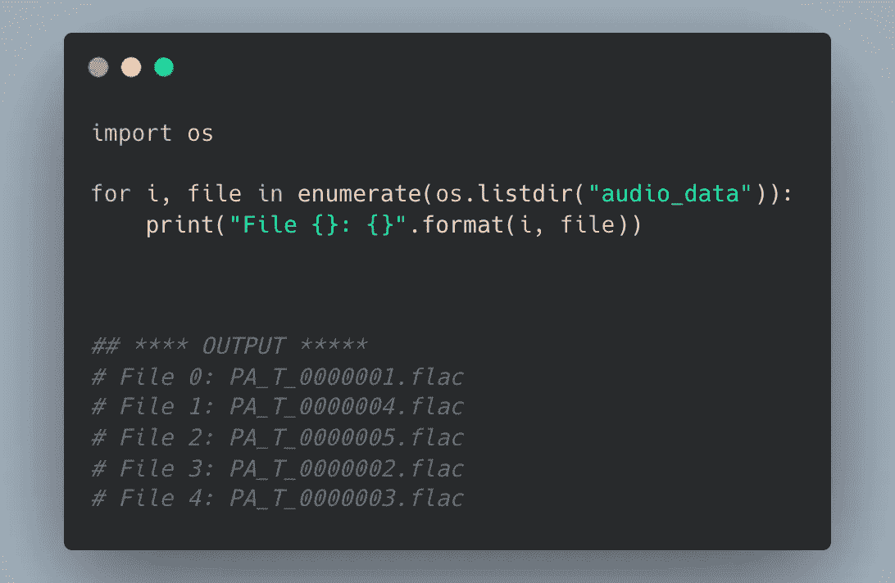

hello.py

## 启动配置

让我们继续创建一个`launch.json`文件。详细步骤请参考此处的文档[。](https://code.visualstudio.com/docs/editor/debugging#_launch-configurations)

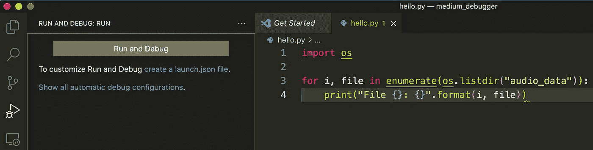

启动配置

这将在您的项目中创建一个新的`.vscode`文件夹，并将包含`launch.json`文件，登记所有的调试设置细节。现在，我们将使用默认值。

## 让我们开始调试

要检查特定行的代码状态，我们必须向它添加一个断点。这些通常会在编辑器页边空白处显示为红色实心圆圈。例如，我在`for`循环中添加了一个断点(见下图)。

> 在脚本的第 X 行添加一个断点将会执行所有代码，直到第 X 行，代码执行将会在第 X 行停止，以便您检查代码的状态。换句话说，直到您点击[调试工具栏](https://code.visualstudio.com/docs/editor/debugging#_debug-actions)中的继续(或任何其他)按钮，X 行的代码才会被执行。

在 hello.py 中的 for 循环处添加断点

现在，我们可以通过点击绿色的 play 按钮开始调试脚本了(上图中的`Python:Current File`)。这将弹出一个浮动的[调试工具栏](https://code.visualstudio.com/docs/editor/debugging#_debug-actions)(见下图)。

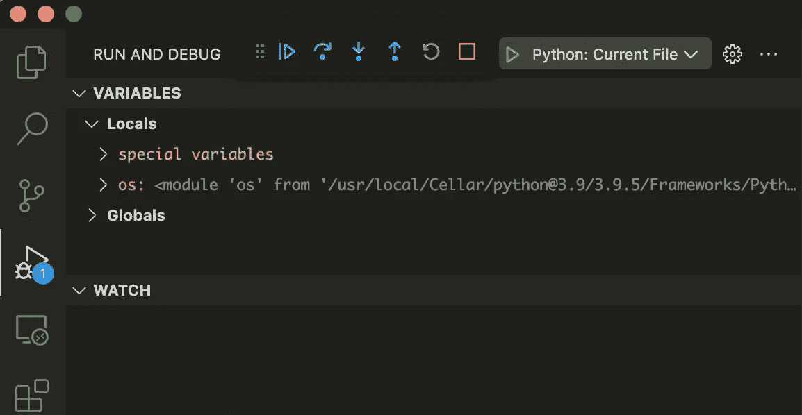

浮动调试工具栏

*Pro 提示:在开始调试之前，确保在编辑器中打开了正确的文件，因为默认情况下，调试器将开始调试当前活动的文件。*

开始调试过程后，您将看到以下内容:

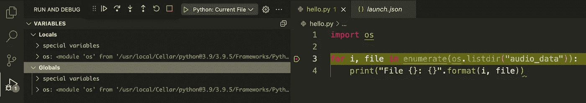

需要注意的几件事:

*   在左边,`Variables`选项卡填充了一些局部和全局变量。
*   在右边，脚本中添加第一个断点的那一行用黄色突出显示。
*   调试器**尚未**处理添加断点的那一行。(到目前为止的一切都已经处理完毕，这就是为什么你会看到`os`模块是`Variables`选项卡的一部分。)

从现在开始，作为调试工具栏的一部分，您有几个调试选项:

*   **继续**按钮将调试器从当前断点(或红色填充圆)带到下一个红色填充圆(因为在我们的例子中有一个`for`循环，下一个断点将再次在`for`循环)。
*   **Step Over** 按钮将调试器从代码的当前行带到下一行(在我们的例子中，是`print`语句)。
*   **单步执行**按钮将带您进入当前断点中定义的任何功能(在我们的例子中是`enumerate()`和`listdir()`)。
*   **重启**和**停止**按钮非常直观。

## **继续按钮**

点击调试工具栏中的**继续**按钮将执行所有操作，直到下一个断点。由于我们在 for 循环中，下一个断点实际上将与当前断点相同。

让我们尝试这样做，看看我们会得到什么！

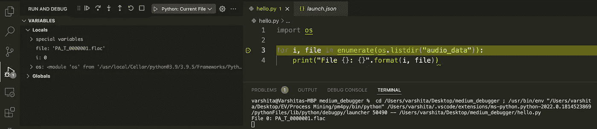

*注意:如果我们在 for 循环的* `*print*` *语句中添加了一个断点，调试器接下来将会在这里停止。)*

需要注意的几件事:

*   在左边，`local`变量已经被更新，现在我们可以在`*for*` *循环中看到当前迭代的`i`和`file`的值。你甚至可以将鼠标悬停在脚本中的这些变量上来查看它们的值。*
*   调试器现在突出显示脚本中的下一个断点*(与上面讨论的`for`循环相同)。*
*   在终端中，我们可以从`print`语句中看到*部分*结果(来自迭代`i=0`)。

现在，我们可以继续点击**继续**选项，我们将看到`local`变量`i`和`file`更新为各自的值，以及相关的`print`语句。但是，如果`for`循环本身相当复杂，我们想要深入研究并调试它，该怎么办呢？

为了进行试验，我们必须暂时停止调试器(使用 debug 工具栏中的 stop 按钮)，并对脚本本身进行一些更改。我们现在将使用`os.path.abspath()`打印绝对路径，而不是打印文件名，我已经将它打包到一个名为`get_abspath()`的(无用)函数中。此外，还将从文件名中提取发言者 id。

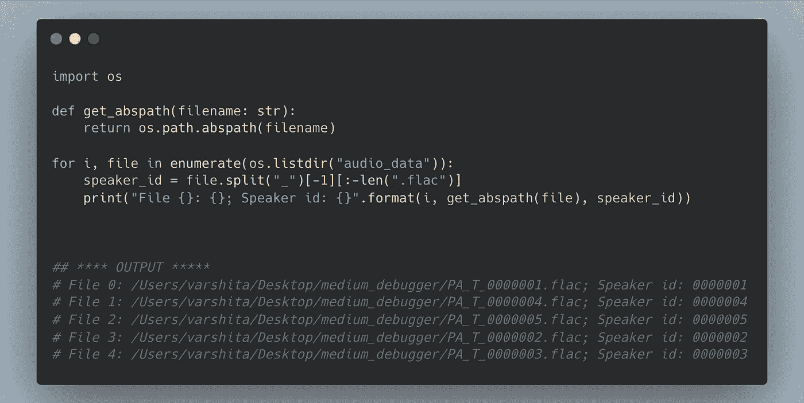

hello.py

如前所述:

*   我们在`for`循环处设置断点。
*   启动调试器，点击继续按钮**一次**以查看本地和全局变量更新到`0`和`PA_T_0000001.flac`以及终端中的单个`print`语句。

现在，假设我们想要检查`for`循环内部发生了什么。一种方法是设置另一个断点，或者我们可以(而不是点击**继续**按钮)选择调试工具栏中的**跳过**按钮。

## 跳过按钮

顾名思义，调试器已经单步执行到断点后的下一行(用黄色突出显示)。

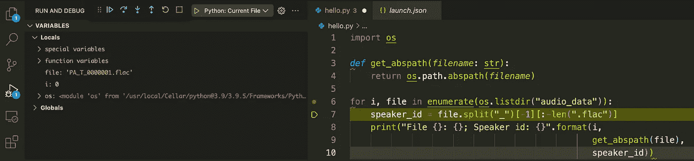

需要注意的几件事:

*   终端中不会有任何`print`语句。*为什么？*因为该行代码还没有被调试器处理！您必须点击**继续**(或**前进** **越过**)按钮才能看到输出。
*   为了检查这个迭代的`speaker_id`的值，我们可以再次点击**跳过**按钮，你会看到一个名为`speaker_id`的新的局部变量被创建(调试器会跳到下一行并高亮显示它——见下图)。

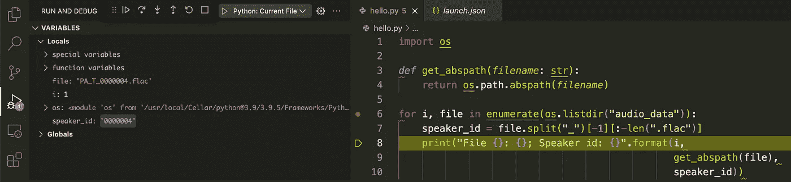

*   我们仍然无法检查由`get_abspath()`方法返回的内容。*解决方案*:设置断点！
    *注意:不要在* `*def get_abspath()*` *行设置断点，而是在函数定义内设置断点(见下图)。*

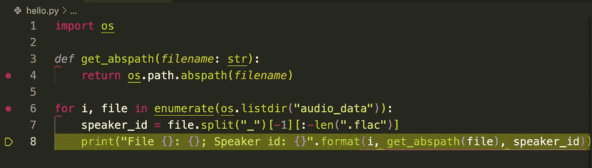

一旦设置了断点，您可以再次单击**跳过**按钮，调试器现在将停留在函数内的`return`语句处(见下图)。我们可以看到**局部**变量现在已经更新为*，只有*反映了函数接收到的`filename`参数。先前的变量如`i`、`file`和`speaker_id`现在已经成为**全局**变量的一部分。

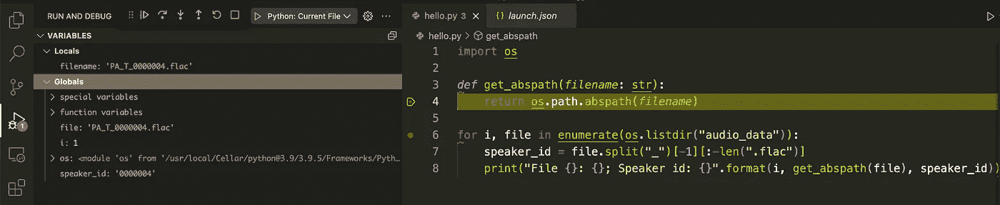

这是检查函数定义是否接收正确参数的好方法。然而，我们仍然不知道`get_abspath()`将返回的实际值。

这是以前的我在代码中使用`print`语句的地方！

相反，我们可以利用调试器中的**观察**功能。输入要观察/获取其值的表达式，然后按 Enter 键(见下图)。瞧，你可以看到表达式的实际值！

> Watch 功能通常用于观察变量值在整个代码中如何变化，因此得名 watch。例如，您可以使用它来跟踪`64x64x3`输入图像如何通过卷积(和其他层)以在典型的卷积神经网络(CNN)中给出单个输出。

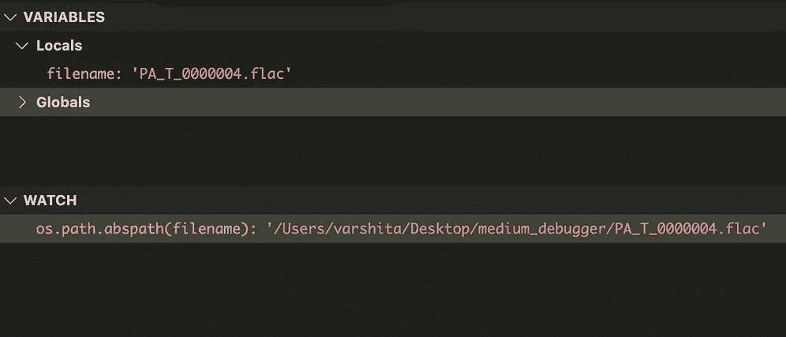

从现在开始，您可以使用 Continue 和 Step Over 按钮以及 Watch 功能来完成代码导航/调试。

一旦完成，就该对代码做更多的修改了。我们将重组代码并将`get_abspath()`从`hello.py`移到新的`abs.py` 脚本中，该脚本将驻留在新创建的`utils`文件夹中。断点仍将保留在函数内的`return`语句处。

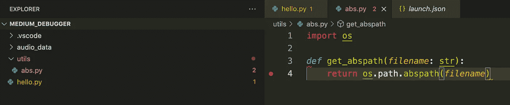

快速更新代码以在`hello.py`内导入方法(如果您对来回导入模块感到紧张，请随意查看[我的 python 导入文章](/understanding-python-imports-init-py-and-pythonpath-once-and-for-all-4c5249ab6355))。

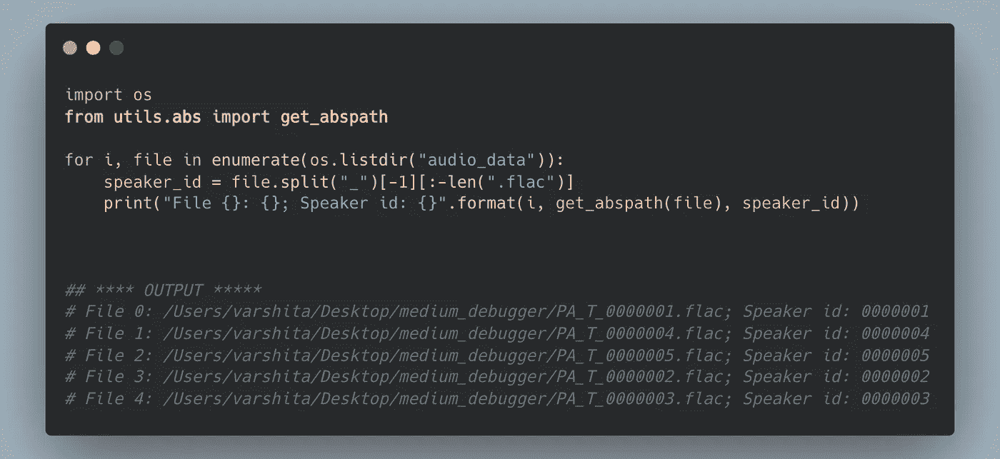

hello.py

现在尝试以通常的方式调试`hello.py`脚本，即使第二个断点(在`abs.py`内)不在当前活动的脚本中(即`hello.py`，调试器仍将工作。

## 步入/退出按钮

一旦进入`abs.py`的断点，出于好奇，你也会对检查标准库函数`os.path.abspath()`的内部工作感兴趣。这意味着你必须*进入*这个功能，我们可以使用调试工具栏中的**进入**按钮。

理想情况下，这应该将调试器引入到`os`模块内的函数定义中。然而，你会看到它不会发生？
*为什么？* —默认情况下，调试仅限于用户编写的代码！

为了能够调试非用户编写的代码，在`launch.json`中描述的配置内将`justMyCode`设置为`False`。

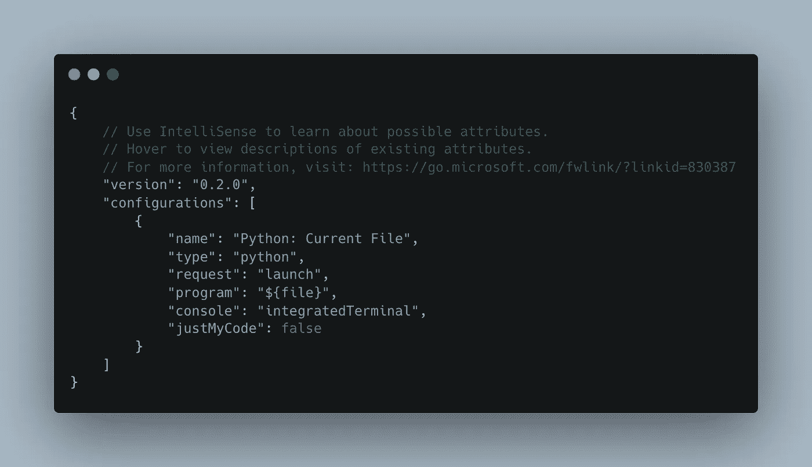

启动. json

现在尝试重启调试器，当调试器到达`return`断点时，使用**进入**按钮来探索`abspath()`。一旦进入，您可以随时使用**步出**按钮——比方说，您认为您不想进一步探索了——调试器将返回到您进入之前的位置，在我们的例子中是`abs.py`中的`return`语句。

## 条件断点

假设您已经通过查看最初的几个`for`循环迭代理解了调试器是如何工作的。显然，等待它完成所有迭代没有多大意义。相反，我们可以让它在不碰到断点的情况下运行，比如说，直到它到达最后一次迭代。

这就是条件断点发挥作用的地方！让我们看看如何做到这一点。(为了简单起见，我们将禁用`abs.py`中的断点。)

*   右键单击`for`循环中的断点，选择编辑断点。
*   从下拉菜单中选择**表达式**并设置为`i == len(os.listdir(“audio_data”)) — 1`。
*   按回车键。

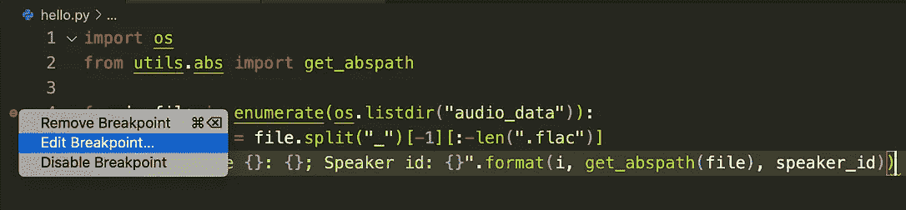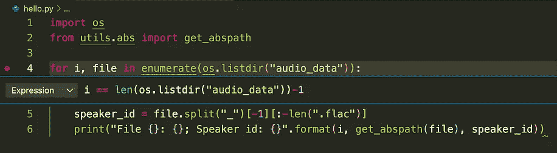

现在，当您重新启动调试器时，它将自动跳过前四次迭代，并在`i=4`处触发断点，如下图所示。

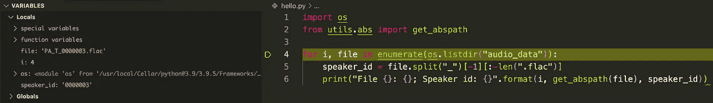

*Pro 提示 1:您还可以根据命中次数指定要触发的断点。*

> 命中次数是指调试器命中特定断点的次数。

*例如，您可能想只为最后几个文件触发断点(可能是因为您想详细检查它们)。您可以从下拉菜单中选择* ***点击次数*** *(而不是* ***表达式*** *)并将其设置为* `*>3*` *。这意味着断点仅在前三次出现后触发，因此我们在终端中看到三个打印语句，分别对应于* `*i=0*` *、* `*i=1*` *和* `*i=2*` *。*

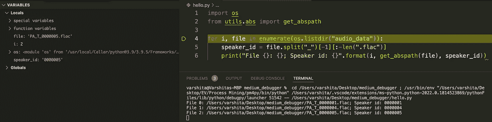

专家提示 2:我们甚至可以在每次遇到断点时记录一条消息(到调试控制台)。为此，从下拉菜单中选择 ***日志消息*** *(而不是* ***表达式*** *)并将其设置为要在花括号内评估的一些纯文本和/或表达式。举个简单的例子，我们将通过设置日志消息为* `*Updated i. i = {i}*` *来记录断点被命中时* `*i*` *的更新值。*

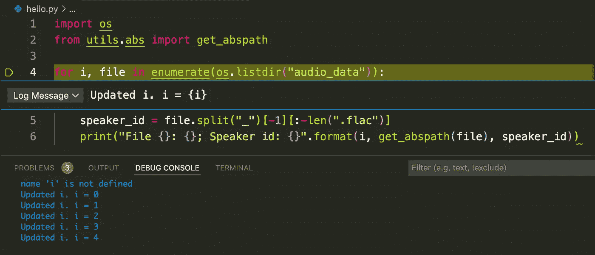

## 调用栈

通常，在处理大型项目时，很容易忘记代码流。由于有很多断点，您可能会奇怪自己是如何出现在这个文件中的，更重要的是，*您是从哪里*出现在这里的！

> 由于堆栈遵循**先进后出**的顺序，VSCode 的调用堆栈非常适合在调试期间跟踪断点。

使用显示调用层次结构的调用堆栈窗口，VSCode 调试器可以在这方面提供一些帮助。

为了展示该实用程序，我们将通过在`utils`目录中引入`upper.py`来使当前项目稍微大一点。

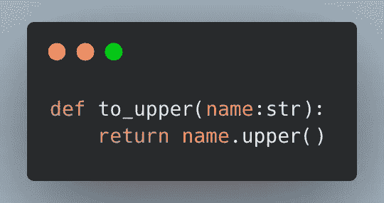

upper.py

让我们快速更新`abs.py`以使用`to_upper()`功能:

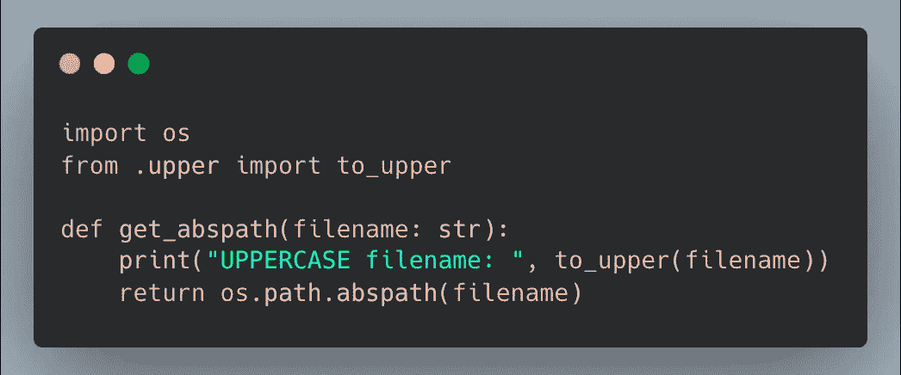

abs.py

总而言之，我们将在项目中设置四个断点(见下图):

*   在`hello.py`的第四行
*   在`abs.py`的第 5 行和第 6 行
*   在`upper.py`的第 2 行

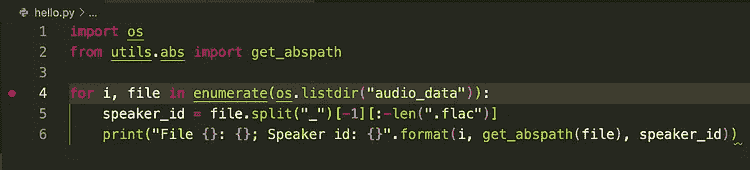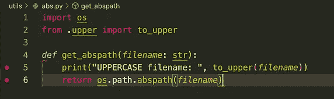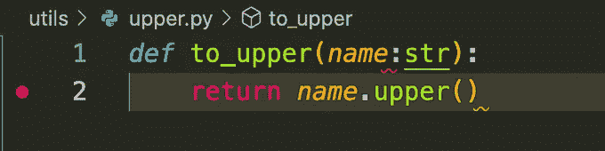

展示 VSCode 中调用堆栈功能的示例

尽管这看起来像是一个微不足道的例子，但我们可以通过以下方式来了解呼叫层次结构:

*   启动调试器(确保活动屏幕包含`hello.py`)并点击**继续**按钮，直到到达`upper.py`中的断点。
*   看一下**调用堆栈**窗口(见下图):

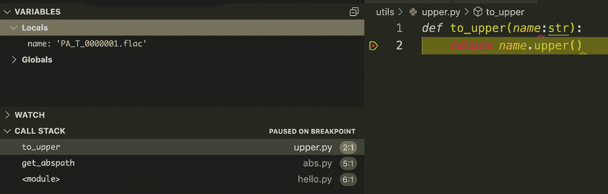

需要注意的几件事:

*   在调用栈的最顶端是模块(即`to_upper()`)和文件名(`upper.py`)以及包含当前断点的行号(在我们的例子中是第 2 行)。
*   第二个位置是调用当前断点的文件/行号(在我们的例子中是`abs.py`，第 5 行)。
*   第三个位置是初始模块(`hello.py`在第 6 行)，它调用了`abs.py`中的`get_abspath()`，后者调用了当前模块(`upper.py)`中的`to_upper()`)。

希望这是有意义的，不会成为那种*我知道你知道我知道你知道…*东西！

# 额外收获:异常断点

良好的编程实践使用 try-catch 块强制使用错误处理。因此，调试器可能会跳过它们，代码不会中断。但是，如果您想在抛出和/或引发异常时显式停止调试器，该怎么办呢？

> 调试期间的异常断点有助于突出显示任何可能因为在 catch 块中被捕获而未被注意到的错误。

为了演示这一点，让我们最后一次修改代码，并加入一些 try-except 块。

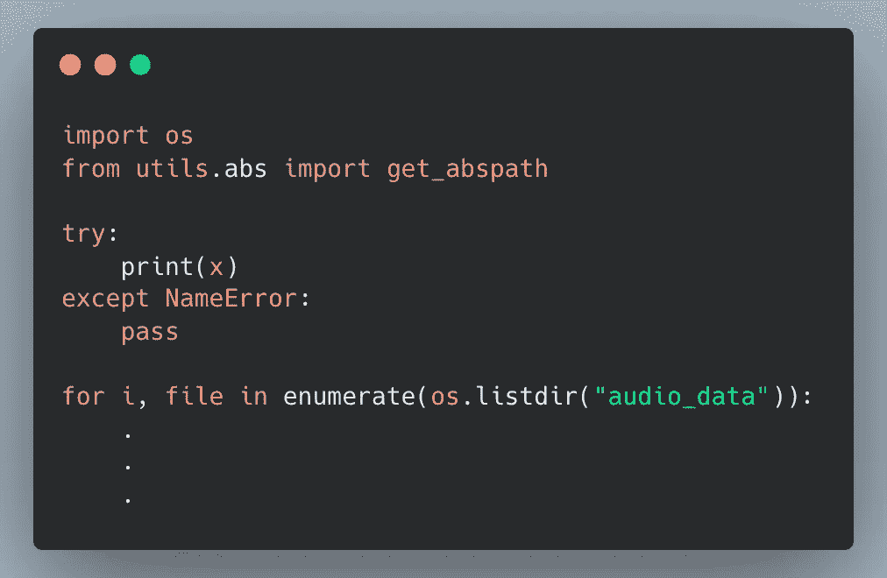

hello.py

如果您运行这个独立的脚本(没有调试器)，它将运行得很好，没有任何错误！即使在没有找到`x`时遇到问题，也会因为 except 块中的`pass`而被静默处理。

话虽如此，在这种情况下破解 VSCode 似乎还是有用的。为此，请转到断点窗口，确保勾选了**引发的异常**旁边的复选框(默认情况下会触发未捕获的异常)。

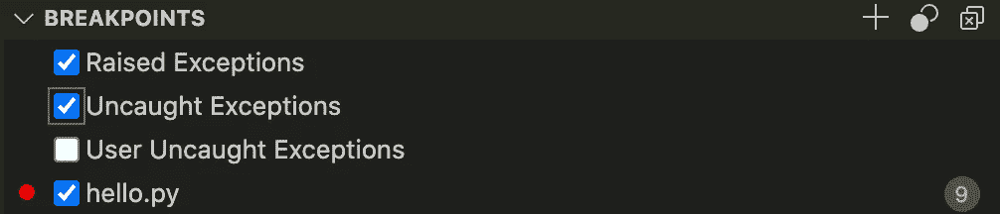

断点异常

现在，当您尝试在调试模式下运行`hello.py`时，代码将在 try 块处中断。

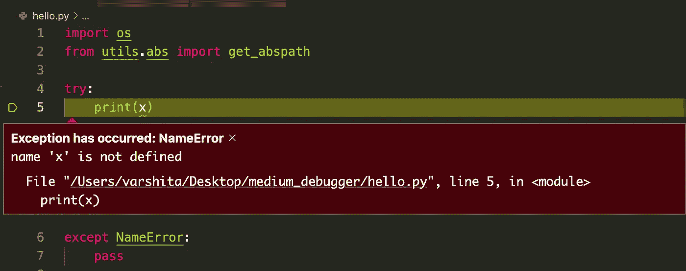

断点异常

# 结论

调试是我根据帕累托 80:20 法则学到的技能之一。学习它的各个方面可能需要一段时间，但是一旦掌握了，它就可以应用到你将要从事的所有项目中。需要注意的一点是，在调试器运行时，我们可以设置/编辑任意多的断点，但是，我们不能改变代码本身。我们必须首先停止调试器，进行更改，然后再次启动调试器。

一如既往，如果有更简单的方法来做/解释本文中提到的一些事情，一定要让我知道。一般来说，避免不请自来的破坏性/垃圾/敌意评论！

直到下一次✨

我喜欢写循序渐进的初学者指南、操作指南、面试问题、ML/AI 中使用的解码术语等。如果你想完全访问我的所有文章(以及其他媒体上的文章)，那么你可以注册使用 [***我的链接***](https://varshitasher.medium.com/membership)**这里* ***。****

* [## 使用 Huggingface 微调 HuBERT 用于定制音频数据中的情感识别

### 构建自定义数据加载器、实验日志、改进指标的技巧和 GitHub repo，如果您想了解…

towardsdatascience.com](/fine-tuning-hubert-for-emotion-recognition-in-custom-audio-data-using-huggingface-c2d516b41cd8)  [## 使用 Scikit、Pandas 和 Numpy 进行时间序列建模

### 直观地利用季节性来提高模型准确性。

towardsdatascience.com](/time-series-modeling-using-scikit-pandas-and-numpy-682e3b8db8d1)  [## 端到端深度学习项目:第 1 部分

### 用 Keras 实现迁移学习的高效网络图像分类模型

towardsdatascience.com](/end-to-end-deep-learning-project-part-1-930af1e1e191)  [## 在数据科学面试中解释你的 ML 项目的逐步指南。

### 在结尾有一个额外的样本脚本，让你谨慎地展示你的技术技能！

towardsdatascience.com](/step-by-step-guide-to-explaining-your-ml-project-during-a-data-science-interview-81dfaaa408bf)*