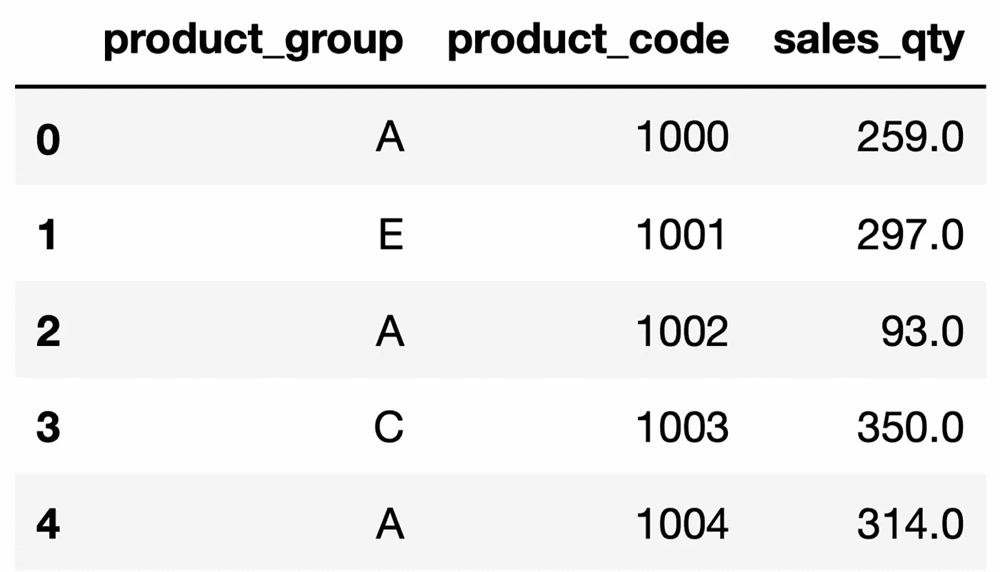
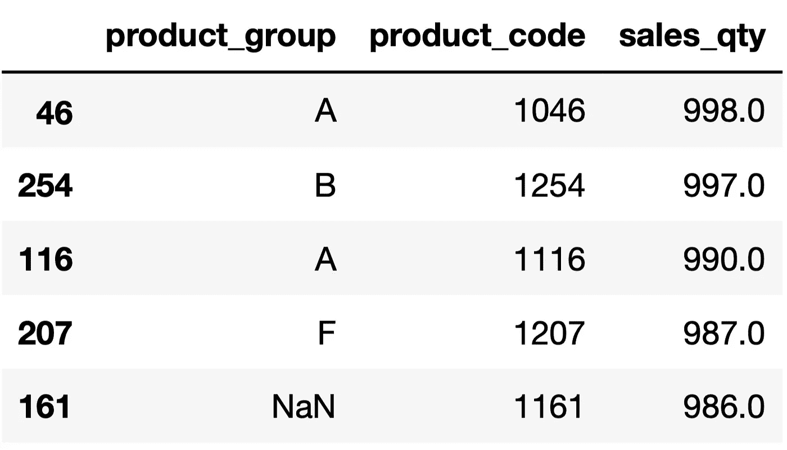
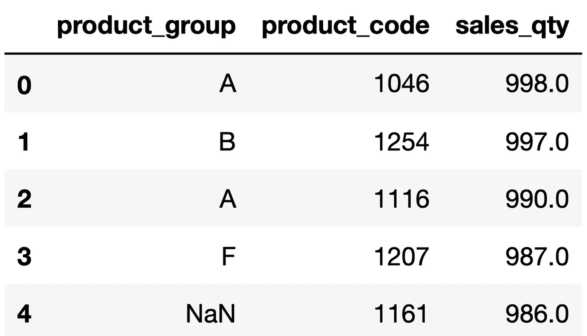
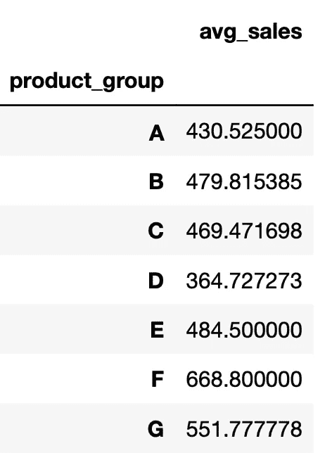
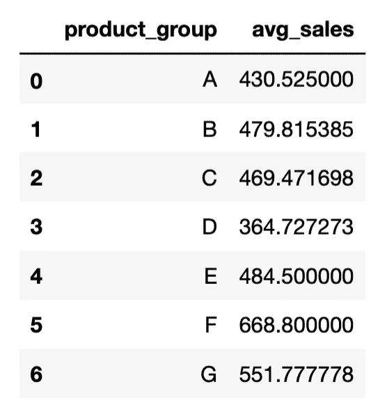

# 如何让熊猫的功能更有用

> 原文：<https://towardsdatascience.com/how-to-make-pandas-functions-more-useful-25649f71cc21>

## 充分利用它。


亚历杭德罗·皮涅罗·阿梅里奥在 [Unsplash](https://unsplash.com/s/photos/useful?utm_source=unsplash&utm_medium=referral&utm_content=creditCopyText) 上的照片

Pandas 可以说是数据科学生态系统中最常用的库。它的功能使复杂的数据清理和分析任务变得简单易行。

然而，我们经常使用熊猫功能的默认设置，这使我们无法充分利用它们。在大多数情况下，参数使函数更灵活或更强大。

此外，通过正确使用参数，我们可以在一个步骤中完成一个包含多个步骤的任务。因此，我们的代码变得更加高效和干净。

在本文中，我们将通过一些例子来展示使用参数的额外好处。让我们从导入库和创建示例数据帧开始。

```
import pandas as pd
import numpy as np
import random# create a DataFrame with mock data
pg = ["A","B","C","D","E","F","G"]
sales = np.arange(1,1000)df = pd.DataFrame({"product_group":random.choices(pg, weights=[12,10,8,5,1,1,1],k=300),
"product_code":np.arange(1000,1300),
"sales_qty":random.choices(sales, k=300)})# add some missing values
df.loc[150:170, "product_group"] = np.nan
df.loc[210:230, "sales_qty"] = np.nan
```



df 前五行(图片由作者提供)

DataFrame 包含一些产品及其产品组，以及随机生成的销售数量值。

假设我们想要计算每组中产品的数量。最简单的方法是 value_counts 函数。

```
df["product_group"].value_counts()**# output**
A    88
B    69
C    56
D    37
F    11
E     9
G     9
Name: product_group, dtype: int64
```

product group 列中应该有一些缺失的值，但是我们在输出中看不到它们。原因是 value_counts 函数默认情况下会忽略缺失的值。

在某些任务中忽略缺失值可能会产生误导。我们总是可以使用 isna 函数来检查丢失的值。然而，value_counts 函数能够为我们提供关于缺失值的信息。我们只需要使用 **dropna** 参数。

```
df["product_group"].value_counts(dropna=False)**# output**
A      88
B      69
C      56
D      37
NaN    21
F      11
E       9
G       9
Name: product_group, dtype: int64
```

有 21 种产品的产品组信息缺失。

让我们快速看一下上一个例子的输出。a 组有 88 个产品。

A 组拥有最多的产品，但是 A 在整个数据框架中的百分比份额是多少？我们可以用一个简单的数学运算来计算它，但是有一个更简单的方法:**规范化**参数。

```
df["product_group"].value_counts(normalize=True, dropna=False)**# output** A      0.293333
B      0.230000
C      0.186667
D      0.123333
NaN    0.070000
F      0.036667
E      0.030000
G      0.030000
Name: product_group, dtype: float64
```

A 组占整个产品系列的 29%。

normalize 参数对于许多任务来说很方便。假设我们正在处理一项任务，并且希望只包含产品组，以涵盖整个产品系列的 75%。通过使用 value_counts 和 cumsum 函数，我们可以轻松找到范围内的产品组，如下所示:

```
df["product_group"].value_counts(normalize=True).cumsum()**# output** A    0.315412
B    0.562724
C    0.763441
D    0.896057
F    0.935484
E    0.967742
G    1.000000
Name: product_group, dtype: float64
```

所有产品中的 76%属于产品组 A、B 或 c。您可能已经注意到百分比份额与上一个示例不同。原因是我们这次忽略了缺失的值。

根据数量对观察值(即行)进行排序是一项非常常见的任务，可以使用 Pandas 的 sort_values 函数来完成。让我们根据销售量对行进行降序排序。

```
df = df.sort_values(by="sales_qty", ascending=False)df.head()
```



df 前五行(图片由作者提供)

行被排序，但是它们的索引保持与原始数据帧中的相同。在许多情况下，这可能不是问题，但是有一个合适的索引总是更好。我们可以使用 reset_index 函数更新索引，但是 sort_values 函数有一个用于此任务的参数: **ignore_index** 。

```
df = df.sort_values(by="sales_qty", ascending=False, ignore_index=True)df.head()
```



df 前五行(图片由作者提供)

现在看起来好多了。

> 组合多个数据帧的 concat 函数也有 ignore_index 参数。

groupby 是数据分析中最常用的 Pandas 函数之一。它根据给定列中的不同值对行进行分组。然后，我们可以计算每个组的合计值。

例如，我们可以计算每组的平均销售量，如下所示:

```
df.groupby("product_group").agg(avg_sales=("sales_qty","mean"))**# output**
```



(图片由作者提供)

输出是数据帧，组显示为索引。但是，将组作为数据帧中的一列更好也更实用。当我们有嵌套组时(即，当按多列分组时)，这尤其有用。

我们可以使用 reset_index 函数将索引中的组移到新列中。但是，groupby 函数为此提供了一个参数: **as_index** 。

```
df.groupby("product_group", as_index=False).agg(avg_sales=("sales_qty","mean"))**# output**
```



(图片由作者提供)

我觉得现在好多了。稍后我们可能需要使用 group 列。

我们已经看到了一些改变函数行为的参数。它们帮助我们调整功能以更好地满足我们的需求或添加新功能。

有几个参数使函数更加灵活、实用和有用。我强烈建议在使用函数之前检查参数。

*你可以成为* [*媒介会员*](https://sonery.medium.com/membership) *解锁我的全部写作权限，外加其余媒介。如果你已经是了，别忘了订阅*<https://sonery.medium.com/subscribe>**如果你想在我发表新文章时收到电子邮件。**

*<https://sonery.medium.com/membership>  

感谢您的阅读。如果您有任何反馈，请告诉我。*