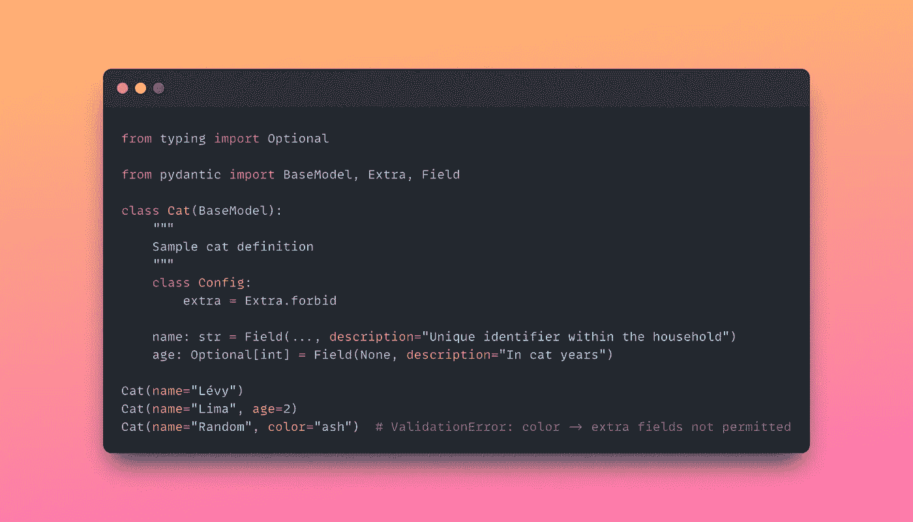
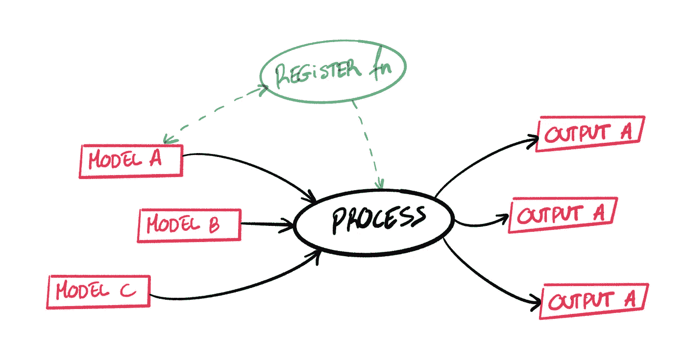

# 如何充分利用 Pydantic

> 原文：<https://towardsdatascience.com/how-to-make-the-most-of-pydantic-aa374d5c12d>

## 探索数据契约验证技术、与 JSON 模式更高的互操作性以及简化的数据模型处理。

Pydantic 已经成为定义和使用数据类型的规则改变者。这使得代码更加**可读**和**健壮**，同时感觉像是语言的自然扩展。

它是一个易于使用的工具，帮助开发人员**验证**并基于给定的定义解析数据，所有这些都与 Python 的**类型提示**完全集成。主要的用例包括读取应用程序配置、检查 API 请求以及创建任何可能需要作为内部构建块的数据结构。



pydantic 模型的示例。图片由作者提供。

虽然有些读者可能已经熟悉这些定义，但我们将探索不同的技术来:

*   通过正确持有数据契约，使我们对 Pydantic 的使用更安全、更易于调试。
*   利用 JSON 模式实现更高的互操作性。
*   使用 Python 的内置函数简化数据模型处理。

# 以安全的方式解析数据

JSON 是网络语言。大多数数据科学家和工程师偶然发现了一个文件或 API，他们希望在安全地处理其数据之前从该文件或 API 获得一致的结构。

让我们想象一下，我们正在从一个 API 中检索数据，这个 API 作为一个目录。然后，对于特定的端点，我们期望数据契约如下:

```
{
    "name": string,
    "age": integer,
    "address": {
        "city": string,
        "zip_code": string,
        "number": integer
    }
}
```

该结构用地址的嵌套定义定义了一个 *cat* 条目。因此，定义一个 Pydantic 模型来解决这个问题可能看起来像下面的代码:

请注意，我们很容易就能找到几款与我们的**合同**相符的车型。在这个场景中，定义只需要一个嵌套层次，但是 Pydantic 允许任何数量的模型的直接组合。

下一步是使用这些模式解析给定的数据，将原始 JSON 转换成我们可以快速使用的特定 Python 对象。

所有字段都被转换成 Python 解释器和 ide 已知的属性，这是一个巨大的帮助。

到目前为止，我们已经走上了幸福的道路。然而，经验丰富的开发人员计划得更远。如果 API 开始发送**不同的**数据怎么办？当一切都自动化时，团队需要确保他们能够快速发现问题并安全地对它们做出反应。让我们看看，如果在没有更新定义的情况下合同破裂会发生什么:

Pydantic 来救援了！由于`age`字段被定义为一个`int`，但是我们收到了一个`str`，这个代码片段将引发一个`ValidationError`。对于其他类型的不一致，也将抛出相同的验证异常，比如缺失字段(如果没有定义为`Optional`)。

## 违反合同

如果发生完全相反的情况呢？如果 API 开始添加越来越多的不属于合同的字段，并且这种情况没有得到正确的监控，我们可能会遗漏一些隐藏的错误。

该代码片段将完美运行，并且`data`对象将只包含已定义的字段，尽管这隐藏了一些不一致。但是仅仅因为在一段特定的代码中没有异常或日志，就不能保证整个过程按预期工作。

虽然这是 Pydantic 中的默认行为，但我们可以调整配置，禁止将任何额外的字段发送到类定义:

当解析带有额外字段的数据时，类配置的这个小变化现在会抛出一个`ValidationError`:

```
ValidationError: 2 validation errors for CatRequest
key
  extra fields not permitted (type=value_error.extra)
key2
  extra fields not permitted (type=value_error.extra)
```

# 互用性

那些研究数据网格的人应该已经接触过这个术语了。当把我们孤立的平台和团队分解成更小的领域时，我们必须在不同的系统之间共享全局数据定义。

由于技术上的实施可能是不可能的，治理团队需要确保多语言架构能够安全地共享并从构建单一事实来源的集中且唯一的模式发展而来。

实现**语言无关**解决方案的一种方式是将数据结构定义为 [JSON 模式](https://json-schema.org/)。幸运的是，这并没有把 Pydantic 从等式中去掉，因为有一个很棒的[项目](https://github.com/koxudaxi/datamodel-code-generator)可以帮助开发人员将 JSON 模式直接转换成 Pydantic 模型。

让我们重复上面的例子，并用它构建一个 JSON 模式:

```
{
    "$id": "[https://catz.org/schema/api/data/catRequest.json](https://catz.org/schema/api/data/catRequest.json)",
    "$schema": "[http://json-schema.org/draft-07/schema#](http://json-schema.org/draft-07/schema#)",
    "title": "CatRequest",
    "description": "Cat API request definition.",
    "type": "object",
    "definitions": {
      "address": {
        "description": "Defines the city, code and number.",
        "type": "object",
        "properties": {
            "city": {
                "description": "Cat's city",
                "type": "string"
            },
            "zip_code": {
                "description": "Postal code",
                "type": "string"
            },
            "number": {
                "description": "House number",
                "type": "integer"
            }
        },
        "additionalProperties": false
      }
    },
    "properties": {
      "name": {
        "description": "Cat's name.",
        "type": "string"
      },
      "age": {
        "description": "Cat's age, in cat years.",
        "type": "integer"
      },
      "address": {
        "description": "Where does the cat live.",
        "$ref": "#/definitions/address"
      }
    },
    "required": ["name"],
    "additionalProperties": false
}
```

这里我们定义了我们的`CatRequest`模式，不仅提供了它的属性:`name`、`age`和`address`，还提供了一次性写下嵌套定义的能力。

JSON 模式的两个重要特征是:

*   能够通过传递一组`required`字段名来选择哪些字段是强制的和可选的。为了便于说明，我们只选择了`name`作为必备。
*   使用`additionalProperties`，开发人员可以很容易地控制这些定义不会变成键值转储。定义一个契约只有在我们能确保它成立时才有帮助。

现在让我们使用`datamodel-codegen` CLI 将模式转换成 Pydantic 类:

```
$ pip install datamodel-code-generator$ datamodel-codegen --input cat.json --input-file-type jsonschema --output cat.py
```

它将模型的定义存储在`cat.py`中，不仅添加了配置，还在`Optional`和字段描述中进行了适当的输入。

JSON 模式是我们在 OpenMetadata 的集中式模式的关键。有了像 [datamodel-codegen](https://koxudaxi.github.io/datamodel-code-generator/) 这样的工具，我们就可以在用多种语言构建的代码的不同模块中使用相同的定义。

# 单一调度

通常只有一种处理方法，管道必须为每个数据模型运行不同的逻辑。然后，开发人员经常陷入 if-else 狂潮，使得代码触发所有的**复杂性**警报。

如果有更好的方法呢？如果内置到 Python 里呢？`singledispatch`室内装潢师和皮丹蒂奇是天造地设的一对。该函数是 [functools](https://docs.python.org/3/library/functools.html) 模块中的一个强大工具，通过注册每种数据类型的特定行为，帮助维护一个更具可伸缩性的代码库。



作者图片

单个调度是 Python 实现函数重载的方式，即调用单个函数，该函数将根据它接收的参数知道运行哪个内部逻辑。但是，注意`singledispatch`只考虑第一个参数的类型。幸运的是，我们可以通过使用 Pydantic 模型将所有需要的数据打包到这个参数中。

使用这种方法，我们可以快速创建和测试响应特定数据需求的单个功能，轻松地将新模型集成到循环中，并有一个清晰直接的方法来处理多个数据源。

# 结论

Pydantic 是在 Python 生态系统中创建了 before 和 after 的工具之一。它不仅通过极大地提高代码质量和可读性使开发人员的生活变得更加轻松，而且它还是现代框架的基础，如 [FastAPI](https://fastapi.tiangolo.com/) 。

在本帖中，我们看到了以下最佳实践:

*   能够跟踪数据契约中添加或缺少字段的任何变化。
*   使用 JSON 模式在分布式系统中集成数据定义，同时仍然使用 Pydantic for Python 代码库。
*   应用`singledispatch`装饰器来设计更容易阅读、测试和缩放的处理流水线。