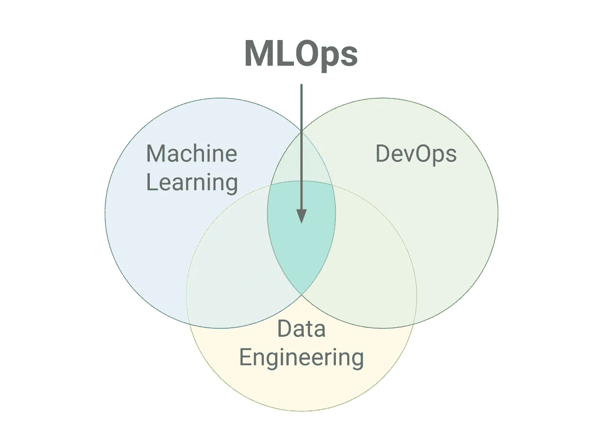
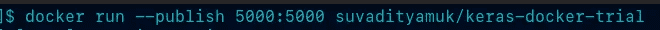
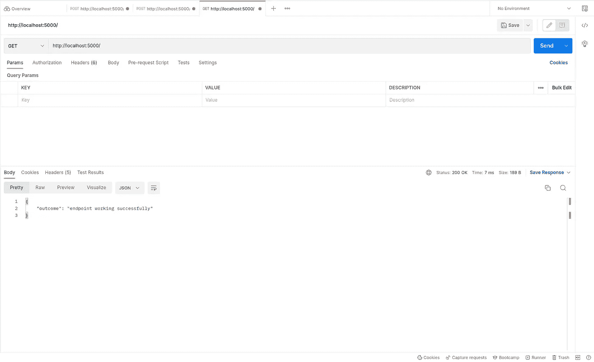
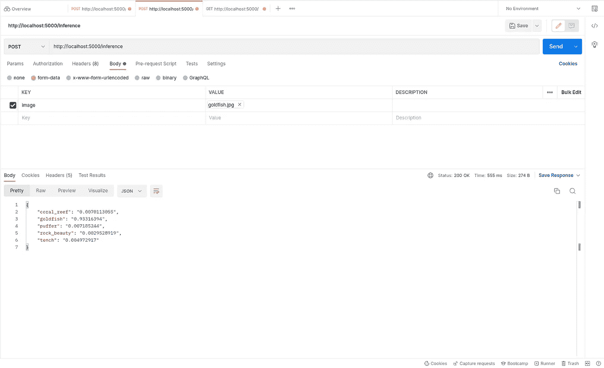

# 如何向公众展示你的模型

> 原文：<https://towardsdatascience.com/how-to-make-your-models-available-to-the-public-be782dcb9942>

## 解释如何使用 Docker、Flask 和 Gunicorn 在线部署您的模型



MLOps 作为交叉文氏图[ [CC BY-SA 4.0](https://creativecommons.org/licenses/by-sa/4.0) ]

# 介绍

端到端的机器学习解决方案是将人工智能带入生产并使其可供大众消费和使用的重要方式。但今天，大多数人工智能从业者只是简单地做预处理，训练，评估和调优阶段，并将剩下的部分留给 DevOps 工程师。

因此，一个名为 [MLOps](https://blogs.nvidia.com/blog/2020/09/03/what-is-mlops/) 的新开发领域已经成为主流。重点已经从简单的培训和评估转移到将信息技术引入并整合到生产流程中。

在个人层面上，知道如何将你的模型公之于众是人工智能从业者技能组合中的一个重要工具。

在本文中，我们将探索如何使用 **Keras、Flask、Gunicorn** 和 **Docker** 以简单高效的方式执行 **MLOps** 循环的一小部分。

如果你想跳过并直接进入代码，点击这里进入 GitHub 库。

# 本教程涵盖了哪些内容？

1.  使用`Keras`及其现成组件创建一个定制模型
2.  准备推理管道
3.  开发一个简单的`Flask`应用程序来公开用于推理的模型
4.  使用`Gunicorn`定义一个`Dockerfile`
5.  建立我们的形象
6.  定义一个简单的 Github Actions 工作流，在每次将图像推送到存储库时构建图像

# 1)使用 Keras 创建自定义模型

例如，我们将使用 Keras Functional API 和 ImageNet 上预训练的`keras.applications`的现成`MobileNetV2`模型创建一个简单的模型。

# 导入标题

本教程需要`tensorflow`、`keras`、`Flask`、`PIL`和`os`。如果使用虚拟环境，您可以使用下面的`requirements.txt`文件来准备您的 env。

*   `tensorflow`:用于矩阵运算和 keras 后端
*   `keras`:用于高级深度学习建模 API，获取预训练模型
*   `Flask`:用于构建简单的 API 进行推理
*   `PIL`:用于处理图像
*   `os`:用于设置环境变量

```
import tensorflow **as** tf
from tensorflow import keras
from flask import Flask
from flask import request**,** jsonify
from PIL import Image
import os
```

# 设置选项

由于 GPU 是一种很难获得的资源，我们设置了一个 Tensorflow 标志，以便首先使任何 CUDA 设备不可见。*如果你能在 GPU 上运行你的容器，请随意跳过这一行。*

```
os**.**environ**[**'CUDA_VISIBLE_DEVICES'**]** **=** '-1'
```

# 模型定义

这个模型是使用 Keras Functional API 制作的。我们用一个简单的`keras.Input`来接受任何大小的彩色(RGB)图像。
输入通过以下层传递:

*   `keras.layers.Resizing`:用于将图像张量大小调整为 224x224x3 张量。
*   `keras.layers.Rescaling`:用于将图像张量值从[0，255]范围重新缩放到[0，1]范围。
*   `keras.applications.MobileNetV2`:用于从 Keras 导入 MobileNetV2 实例(在 ImageNet 上预训练)。

```
image_input **=** keras**.**Input**(**shape**=(None,None,**3**))**x **=** keras**.**layers**.**Resizing**(**height**=**224**,** width**=**224**,** interpolation**=**'lanczos3'**,** crop_to_aspect_ratio**=False)(**image_input**)**x **=** keras**.**layers**.**Rescaling**(**scale**=**1.**/**255**,** offset**=**0.0**)(**x**)**mobilenet **=** keras**.**applications**.**MobileNetV2**(**
    alpha**=**1.0**,**
    include_top**=True,**
    weights**=**"imagenet"**,**
    input_tensor**=**image_input**,**
    classes**=**1000**,**
    classifier_activation**=**"softmax"
**)**model_output **=** mobilenet**(**x**)**model **=** keras**.**Model**(**inputs**=**image_input**,** outputs**=**model_output**)**
```

# 需求文件

`Gunicorn`用于将 API 部署到多个工作线程上，以增加计算消耗为代价降低延迟。使用 Gunicorn 是因为它实现了 WSGI。在生产环境中，像 [NGINX](https://www.nginx.com/) 或 [Apache Web Server](https://httpd.apache.org/) 这样的前端服务器用于托管静态网页和负载平衡器，Gunicorn 在该层后面运行以实现功能。

```
Flask**==**2.0**.**3
Pillow**==**9.2**.**0
tensorflow**==**2.9**.**1
gunicorn**==**20.1**.**0
```

# 2)准备推理管道

我们定义了一个简单的函数，它接受一个`tf.Tensor`，并在模型中运行它，以返回一个最终的前 5 名预测字典结果。

# 推理功能

使用之前准备好的函数来推断作为`tf.Tensor`接受的图像。然后提取张量的`numpy`值，以获得每个类别的所有置信度得分。
这个 numpy 数组然后被传递到`keras.applications.imagenet_utils.decode_predictions`以获得前 5 个预测。

```
**def** **inference(**image**:** tf**.**Tensor**):**
    y **=** model**(**image**).**numpy**()**
    preds **=** keras**.**applications**.**imagenet_utils**.**decode_predictions**(**y**,** top**=**5**)**
    result **=** **{**i**[**1**]** **:** *str***(**i**[**2**])** **for** i **in** preds**[**0**]}**
    result **=** **{**k**:** v **for** k**,** v **in** *sorted***(**result**.**items**(),** key**=lambda** item**:** item**[**1**])}**
    **return** result
```

# 3)制作一个简单的 Flask 应用程序来公开模型以进行推理

现在，我们在路线`/`和`/inference`上定义两个简单的端点。

*   `/` (GET):第一个端点充当健康检查，以确保 API 启动并运行。
*   `/inference` (POST):第二个端点接受一个图像作为带有参数名`image`的表单字段，并返回一个带有置信度得分和 ImageNet 类名的字典。

# 烧瓶应用程序定义

`app`是稍后将由 Gunicorn 使用的 WSGI callable 的名称。要了解 WSGI 是什么，请查看下面有趣的链接部分。

```
app **=** Flask**(***__name__***)**
```

# 健康检查端点的定义

为了测试 API 是否启动并运行，我们只需在这个端点上点击一个 GET 请求来获得预期的输出。

```
@app**.**route**(**"/"**,** methods**=[**'GET'**])**
**def** **health_check():**
    result **=** **{**
        'outcome'**:**'endpoint working successfully'
    **}**
    **return** jsonify**(**result**)**
```

# 推理端点的定义

这里，我们接受一个`POST`请求，从请求中发送的文件中提取`image`参数。这以文件流格式存储，然后传递到`PIL.Image.open`以准备图像。最后，我们执行一些简单的预处理，将`PIL`图像转换为`tf.Tensor`图像，并准备一批 1 个图像传递给我们的推理函数。然后，返回的结果被传递到`jsonify`中进行响应准备和执行。

```
@app**.**route**(**"/inference"**,** methods**=[**'POST'**])**
**def** **perform_inference():**
    image **=** request**.**files**[**'image'**]**
    pil_img **=** Image**.**open**(**image**.**stream**)**
    tensor **=** keras**.**preprocessing**.**image**.**img_to_array**(**pil_img**)**
    tensor **=** tf**.**expand_dims**(**tensor**,** axis**=**0**)**
    result **=** inference**(**tensor**)**
    **return** jsonify**(**result**)**
```

# 4)定义一个使用 Gunicorn 进行部署的 Dockerfile

现在，我们已经完成了模型的定义，并使用一个简单的 Flask 应用程序为推断做好了准备。这里，我们开始编写一个`Dockerfile`和一个`.dockerignore`来构建一个定制的 Docker 映像。

```
FROM ubuntu**:**20.04RUN apt**-**get update **&&** apt**-**get install **-**y \
git \
curl \
ca**-**certificates \
python3 \
python3**-**pip \
sudo \
**&&** rm **-**rf **/**var**/**lib**/**apt**/**lists**/***RUN useradd **-**m docker_runnerRUN chown **-**R docker_runner**:**docker_runner **/**home**/**docker_runnerCOPY **--**chown**=**docker_runner ***.*** **/**home**/**docker_runner**/**flask_app**/**keras**-**docker**-**trial**/**USER docker_runnerWORKDIR **/**home**/**docker_runner**/**flask_app**/**keras**-**docker**-**trialENV PATH**=**"${PATH}:/home/docker_runner/.local/bin"RUN pip install **--**no**-**cache**-***dir* **-**r requirements**.**txtENTRYPOINT **[**"gunicorn"**,** "--bind"**,** "0.0.0.0:5000"**,** "--workers=4"**,** "app:app"**]**EXPOSE 5000
```

# Dockerfile 文件

*   第一行从 Docker Hub 中提取`ubuntu:20.04`图像，准备一个容器，其中包含库存 Ubuntu 20.04 Focal Fossa。
*   第一个`RUN`命令下载并安装我们稍后需要的几个基本包。
*   下一个`RUN`命令添加一个名为 docker_runner 的用户，并为该用户创建一个主目录(使用-m 选项)。
*   下一个`RUN`命令更改目录所有权，并以递归方式为所有文件和子目录指定 docker_runner 作为其主目录的所有者(使用-R 选项)。
*   `COPY`命令将 Dockerfile 所在的当前存储库中的所有文件移动到容器的目标目录中。
*   `USER`命令用于将当前活动用户更改为`docker_runner`
*   `WORKDIR`命令用于将当前活动目录更改为`/home/docker_runner/flask_app/keras-docker-trial`
*   `ENV`命令用于设置 PATH 环境变量，并将我们用户的`/.local/bin`目录添加到其中。
*   `RUN`命令现在用于安装所有的需求，并且在安装时不使用任何缓存的目录或它们的 SHA 散列。
*   `ENTRYPOINT`命令用于使用`gunicorn`开始 API 部署。我们绑定本地主机的端口 5000，并为此任务启动 4 个 workers。我们将 WSGI callable 指定为`app:app`左侧的`app`。如果你在步骤 3 中更改了 Flask 应用程序的名称，那么你应该将这部分更改为`{your_app_name}:app`
*   `EXPOSE`命令用于让容器监听端口 5000。

# 。dockerignore

我们只是忽略了`__pycache__/`目录，因为它从 CPython 生成中间文件。

```
__pycache__**/**
```

# 5)建立我们的形象

我们现在构建我们的图像，并给它分配一个标签`keras-docker-trial`。

```
docker build **.** **-**t keras**-**docker**-**trial **--**file Dockerfile
```

# 6)定义一个简单的 GitHub Actions 工作流，以便在每次将图像推送到存储库时构建它

在这里，作为一个额外的步骤，我们使用 GitHub Actions 来构建我们的映像，作为每次对任何分支进行推送或者如果 PR 被合并到存储库中的测试。只有当您在 GitHub 上为您的模型准备一个存储库时，才需要添加这个。

*   `name`:为工作流程指定一个名称。
*   `on`:定义何时使用工作流的触发器。
*   `env`:设置环境变量。
*   `jobs`:定义作为当前工作流的一部分运行的不同命令和工作流动作。
*   `runs-on`:定义哪个 GitHub 托管的 runner 用于执行工作流。
*   `actions/checkout@v3`:用于从仓库中签出代码。
*   `Build Docker Image`:从存储库中存在的 Dockerfile 文件构建映像。

```
name**:** Docker CIon**:**
  push**:**
  pull_request**:**
    types**:** **[**'opened'**,** 'reopened'**]**env**:**
  BUILD_CONFIGURATION**:** Releasejobs**:**
  job1**:**
    runs**-**on**:** ubuntu**-**latest
    steps**:**
      **-** name**:** Check**-**out the pushed code
        uses**:** actions**/**checkout@v3 **-** name**:** Build Docker image
        run**:** docker build **.** **-**t keras**-**docker**-**trial **--**file Dockerfile
```

# 测试管道

上面，我们已经定义了模型，并使用 Docker 和 Gunicorn 部署了它。您可以通过下面的 Postman API Explorer 找到一些部署及其预测的示例截图。



终端命令



获取健康检查请求



获取推理请求


通过邮递员请求发送的金鱼图像(根据 [CC BY-SA 4.0](https://creativecommons.org/licenses/by-sa/4.0) 许可)

# 结论

上面，我们已经完成了一个简单的 Keras 模型的开发，它通过 Docker 的部署和一个用于 CI(持续集成)的 GitHub Actions 工作流。

# 未来范围

这只是作为一个简单的 MLOps 管道的一部分可以完成的工作的一小部分。CML(连续机器学习)和 DVC(数据版本控制)是两个重要的概念，是每个自我维持的机器学习工作流的一个组成部分，可以进一步探索。有趣的链接部分提供了相关资源。

# 参考

1.) [Docker Hub 文档](https://docs.docker.com/docker-hub/)
2。) [Keras 应用文档](https://keras.io/api/applications/mobilenet/#mobilenetv2-function)
3。) [Gunicorn 文档](https://docs.gunicorn.org/en/stable/configure.html)

# 有趣的链接

1.)[什么是 CML？](https://cml.dev/)
2。)[什么是 DVC？](https://dvc.org/doc/user-guide/what-is-dvc)
3。)[什么是 WSGI (Web 服务器网关接口)？](https://wsgi.readthedocs.io/en/latest/what.html)
4。)[详细博客什么是 MLOps？](https://neptune.ai/blog/mlops)