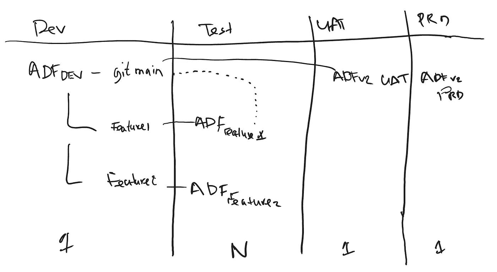
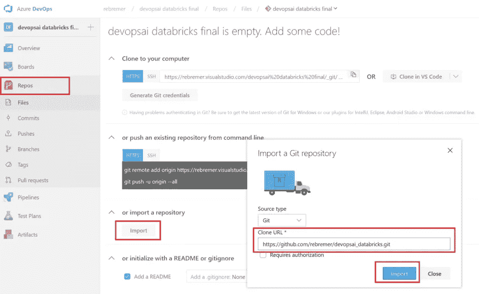
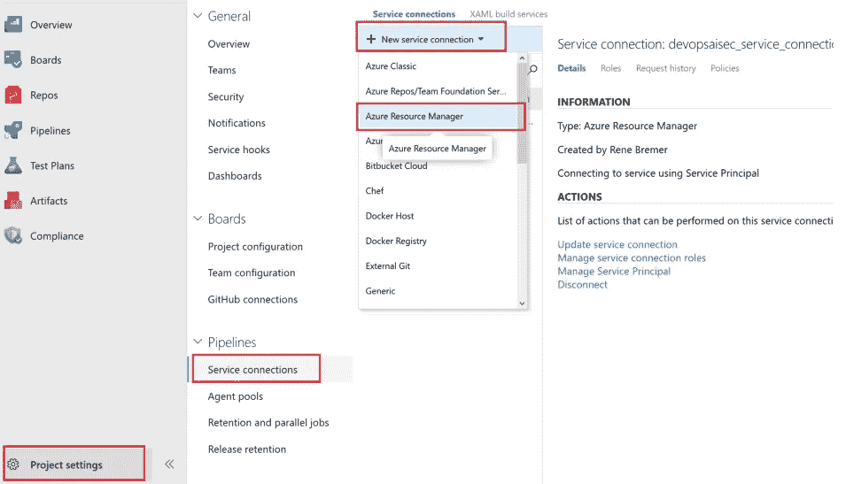
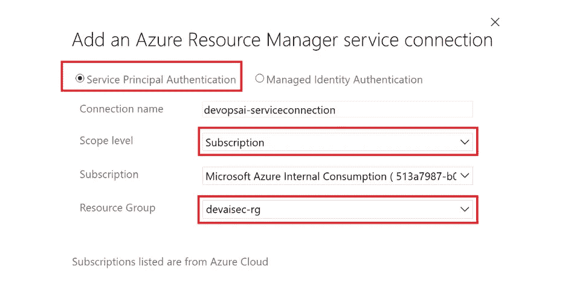
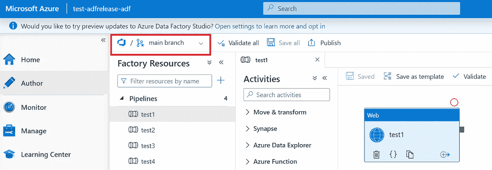
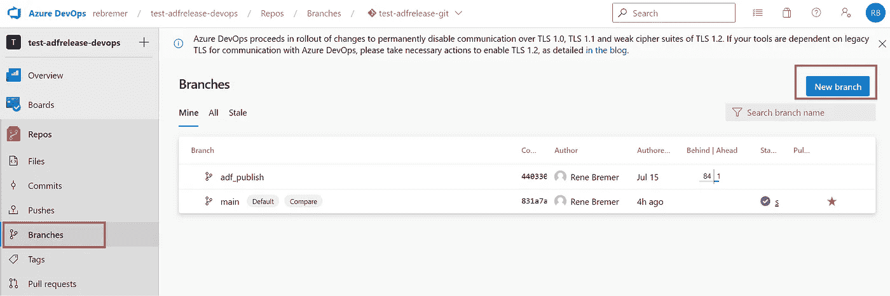
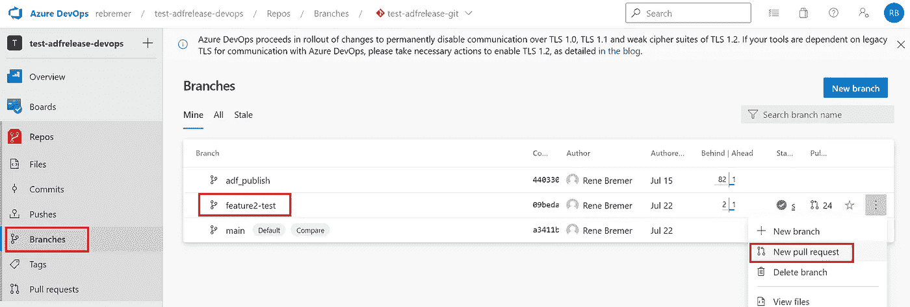
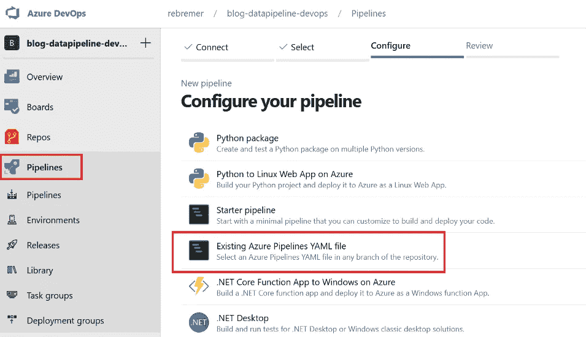
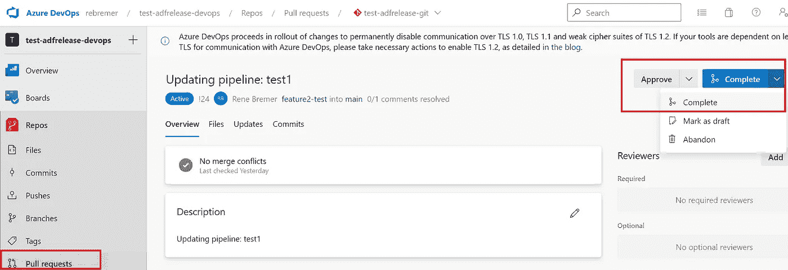

# 如何从 DEV 到 PRD 管理 Azure 数据工厂

> 原文：<https://towardsdatascience.com/how-to-manage-azure-data-factory-from-dev-to-prd-ab7c8a2d10ae>

## 使用 Azure DevOps 和 Azure Data Factory CI/CD 实用程序


管理从 DEV 到 PRD 的数据工厂管道—照片由 [Ricardo Gomez Angel](https://unsplash.com/@rgaleriacom) 在 [Unsplash](https://unsplash.com/) 上拍摄

# 1.介绍

在软件项目中，[开发/TST/UAT](https://en.wikipedia.org/wiki/Development,_testing,_acceptance_and_production) 环境被用来开发和测试代码。之后，代码被发布到 PRD 环境中。Azure 数据工厂(ADF)项目遵循相同的分阶段方法。但是，需要注意以下 ADF 挑战:

*   ADF 项目只能作为一个整体部署，而不是部署单个管道。在这种情况下，应该防止未经测试的代码最终进入生产环境。
*   ADF 支持分支和拉请求，但是很难检查 JSON 中的变化。审查变更只能在 ADF 本身中完成，要么使用 DEV 中的不同分支，要么在 TST 中运行
*   ADF 管道不能孤立测试，但是，通过固定数据源和 pytest 库，可以实现单元和集成测试。见我之前的[博客](/how-to-build-unit-tests-for-azure-data-factory-3aa11b36c7af)。

在这篇 blogpost 和 git repo `[azure-data-factory-cicd-feature-release](https://github.com/rebremer/azure-data-factory-cicd-feature-release)`中，讨论了如何优化 ADF 的发布周期，以防止未经测试的代码最终进入生产，另请参见下面的概述。



1.从 DEV 到 PRD 管理 ADF 按作者分类的图片

在此，主要观点如下:

*   多个开发人员使用 1 个 ADF 实例来创建功能。每个功能都有自己的分支。如果有太多的开发人员在同一个 ADF 实例上工作(> 10)，可以决定为一组开发人员创建一个新的实例。
*   一旦一个特性准备好进行测试，它就会使用 ARM 模板部署到自己的 ADF 实例中。如果需要测试 N 个特性，这将导致 N 个 ADF 实例。这样，一个新的特性可以被孤立地测试，而不必先合并到主分支中。
*   一旦一个特性成功，它就被合并到主分支，随后，主分支被自动部署到 UAT 环境中。在 UAT 环境中，可以进行集成测试。也可以决定合并到一个专用的 UAT(预发布)分支，即在 UAT 测试成功后合并到 main。
*   一旦集成测试成功，主分支将部署到 PRD。请注意，部署到 PRD 总是发生在主分支，而不是特性分支。这是为了防止在 PRD 部署之后发生合并冲突，在最坏的情况下，这会导致撤销 PRD 中已经存在的特性。

在这篇博客的剩余部分，我们将讨论部署到不同环境的详细过程。最后，注意这篇博客遵循了 MSFT 推荐的[新 ADF CI/CD 流程](https://docs.microsoft.com/en-us/azure/data-factory/continuous-integration-delivery-improvements#the-new-cicd-flow)。在这个流程中，[NPM Azure Data Factory utilities](https://www.npmjs.com/package/@microsoft/azure-data-factory-utilities)库而不是 ADF publish 按钮被用来传播到不同的环境。

# 2.偏差

在本博客的剩余部分，使用以下步骤部署项目:

*   2.1 先决条件
*   2.2 设置 Azure DevOps 项目
*   2.3 设置 ADF 开发实例
*   2.4 在 ADF 开发中创建特征分支

## 2.1 先决条件

本教程需要以下资源:

*   [蔚蓝账户](https://azure.microsoft.com/en-us/free/)
*   [天蓝色 DevOps](https://azure.microsoft.com/en-us/services/devops/)
*   [Azure CLI](https://docs.microsoft.com/en-us/cli/azure/install-azure-cli?view=azure-cli-latest) (推荐，也用于故障排除)

随后，转到 Azure 门户并创建一个资源组，所有 Azure 资源都将部署在该资源组中。这也可以使用以下 Azure CLI 命令来完成:

```
az group create -n <<your resource group>> -l <<your location>>
```

## 2.2 创建 Azure DevOps 项目

Azure DevOps 是一个工具，可以持续地构建、测试和部署你的代码到任何平台和云。创建新项目后，单击存储库文件夹并选择导入以下存储库:

*   [https://github . com/rebremer/azure-data-factory-cicd-feature-release](https://github.com/rebremer/azure-data-factory-cicd-feature-release)

另见下图，其中使用本博客的 git repo 创建了一个 devops repo:



2.2.1 将存储库添加到您的 Azure DevOps 项目，image by author

随后，需要服务连接来访问资源组 fom Azure DevOps 中的资源。转到项目设置，服务连接，然后选择 Azure 资源管理器，另见下图。



2.2.2 将存储库添加到您的 Azure DevOps 项目，image by author

选择服务主体身份验证，并将范围限制到您之前创建的资源组，另请参见下图。



2.2.3 按作者将范围限制到资源组、图像

## 2.3 设置 ADF 开发实例

在这一段中，创建了用于开发的 Azure 数据工厂。此 ADF 开发实例应使用在步骤 2.2 中创建的 Azure DevOps git repo。

*   在这个[链接](https://docs.microsoft.com/en-us/azure/data-factory/quickstart-create-data-factory-portal#create-a-data-factory)中，解释了如何在门户中创建 Azure 数据工厂实例
*   在这个[链接](https://docs.microsoft.com/en-us/azure/data-factory/source-control#configuration-method-1-home-page)中，解释了如何将代码库添加到 ADF 中。确保添加了 devops 项目 git repo 2.2。

或者，Azure CLI 也可以用来创建数据工厂，包括添加代码库，见[这里](https://docs.microsoft.com/en-us/cli/azure/datafactory?view=azure-cli-latest#az-datafactory-create)。请参见下面链接到 Azure DevOps git repo 的成功部署的 ADF 实例:



2.3 Azure 数据工厂实例链接到 Azure DevOps

## 2.4 在 ADF 开发中创建特征分支

一切就绪后，就可以开始开发了。软件开发的最佳实践是从主分支创建开发分支。在这个开发分支中，特性是由开发人员创建的。

在这篇博客中，关键是新的分支是在 Azure DevOps 中创建的，而不是 ADF 本身。这是因为 Azure DevOps Pipeline yml 文件也应该包含在新分支中(ADF 不会这样做)。转到您的 Azure DevOps 项目，选择分支并创建新分支，另请参见下文。



2.4 在 Azure DevOps 中创建新分支

开发人员现在也可以在 ADF 中找到分支，并可以在分支中开始编码。当一个开发人员完成他的代码后，他的分支将被其他开发人员审查和测试。这将在下一小节中讨论。

# 3.测验(test)

在这一章中，检查了一个特性分支，并将其部署到 ADF 实例中进行测试。执行以下步骤:

*   3.1 创建拉动式请求(PR)
*   3.2 将功能分支部署到新的 ADF TST 实例

## 3.1 创建拉动式请求(PR)

在开发人员完成其分支后，应创建一个 PR，以便其他人可以查看。转到 Azure DevOps 项目，转到分支，选择您的功能分支，然后选择新的拉请求，见下文



4.1 创建拉式请求

填写表格，并填写负责审查变更的开发人员的姓名。将向这些开发人员发送一封电子邮件通知他们。

## 3.2 将功能分支部署到新的 ADF TST 实例

正如介绍中所讨论的，很难从 JSON 中回顾 ADF 管道的变化。请购单应始终在 ADF 实例中审查。有三种不同的方法可以做到这一点，如下所示:

*   转到 ADF 开发实例，选择分支并查看更改。测试可能是一个挑战，因为分支机构仍然处于开发环境中
*   将更改部署到现有的通用 ADF TST 实例。将代码部署到现有管道将覆盖现有 ADF 实例。
*   将更改部署到具有功能分支名称的新的专用 ADF TST 实例。变更也可以单独测试。

本小节采用了新的专用 ADF TST 实例方法。转到你的 Azure DevOps 项目，转到你的 repo，找到`[azure-pipelines-release.yml](https://github.com/rebremer/azure-data-factory-cicd-feature-release/blob/main/azure-pipelines-feature.yml)`并修改值以指向你的工作区，也见下文。

```
variables:
  adfdev : "<<your dev ADF instance>>"
  adftst : $(Build.SourceBranchName)
  subiddev: "<<your dev subscription id>>"
  subidtst: "<<your tst subscription id>>"
  rgdev : "<<your dev resource group>>"
  rgtst : "<<your tst resource group>>"
  location : "<<your location>>"
  AzureServiceConnectionId: "<<your AzureServiceConnectionId>>"
```

现在，在 DevOps 项目中选择管道，然后单击“新建管道”。转到向导，选择您之前创建的 Azure Repos Git 和 git repo。在“配置”选项卡中，选择“现有的 Azure Pipelines YAML 文件”,然后选择可以在 git repo 中找到的`[azure-pipelines-release.yml](https://github.com/rebremer/azure-data-factory-cicd-feature-release/blob/main/azure-pipelines-feature.yml)`,也见下文。



一旦创建了管道，它就会立即运行，当运行成功时，一个新的数据工厂实例就会以特性分支的名称创建。在一个特征分支被正确地检查和测试之后，可以决定再次将它合并到主分支。这将在下一段讨论。

# 4.UAT 和珠三角

在本博客的剩余部分，使用以下步骤部署项目:

*   4.1 将特征分支合并到主分支
*   4.2 将主要分支部署到 UAT 民主同盟军
*   4.3 将主要分支部署到 ADF PRD

## 4.1 将特征分支合并到主分支

在特征分支被审查和测试正确后，它将再次与主分支合并。选择拉动请求，添加备注并将 PR 标记为完成，另请参见下图。



4.1 关闭 PR，将特征分支合并到主分支

特征分支现在合并到主分支。下一步，将在主要分支机构的 UAT 环境中运行回归测试。那将在下一段讨论。

## 4.2 将主要分支部署到 UAT 民主同盟军

主要分支始终是部署到珠三角。这样做是为了确保只有一个代码库在生产中使用。然而，在将一个特性合并到 main 之后，首先要运行几个回归测试，以确保 main 分支不包含冲突的变更。在这一段中，主要分支部署到了 UAT。

转到你的 Azure DevOps 项目，转到你的 repo，找到`[azure-pipelines-release.txt](https://github.com/rebremer/azure-data-factory-cicd-feature-release/blob/main/azure-pipelines-main.txt)`,调整值指向你的工作区，也见下文

```
variables:
  adfdev : "<<your dev ADF instance>>"
  adfuat : "<<your uat ADF instance>>"
  subiddev: "<<your dev subscription id>>"
  subiduat: "<<your uat subscription id>>"
  rgdev : "<<your dev resource group>>"
  rguat : "<<your uat resource group>>"
  location : "<<your location>>"
AzureServiceConnectionId: "<<your AzureServiceConnectionId>>"
```

现在采取第 3.2 节中描述的类似步骤来创建和运行管道。另外两点意见:

*   `[azure-pipelines-release.yml](https://github.com/rebremer/azure-data-factory-cicd-feature-release/blob/main/azure-pipelines-feature.yml)` 包含以下代码片段:`trigger: main`。这意味着每当主分支中有变化时(例如，当一个特征分支被合并时)，流水线就运行，并且测试可以被执行。
*   创建 Azure DevOps 管道以部署到 UAT 只需一次

当测试成功执行后，代码就可以部署到 PRD 中了。这将在下一章讨论

## 4.3 将主要分支部署到 ADF PRD

当回归测试在 UAT 成功时，主分支机构准备在珠三角部署。这可以简单地通过在 4.2 中部署的管道中添加一个`[deploy ADF to PRD](https://github.com/rebremer/azure-data-factory-cicd-feature-release/blob/main/azure-pipelines-feature.yml#L72)` 任务来完成。关于回归测试和部署到 PRD 的两个附加备注:

*   自动测试 ADF 可能是一个挑战。在我之前的博客[如何为 Azure 数据工厂](/how-to-build-unit-tests-for-azure-data-factory-3aa11b36c7af)构建单元测试中，广泛讨论了如何使用 DevOps 和 pytest 建立测试框架
*   为了防止版本自动部署到 PRD，可以在管道中添加一个[手动验证步骤](https://docs.microsoft.com/en-us/azure/devops/pipelines/tasks/utility/manual-validation?view=azure-devops&tabs=yaml)。这在我之前的博客中也讨论过，可以在附带的 [azure 管道示例](https://github.com/rebremer/blog-adfv2unittest-git/blob/adf_publish/azure-pipelines.yml#L148)中找到

# 5.结论

在一个典型的软件项目中， [DEV/TST/UAT](https://en.wikipedia.org/wiki/Development,_testing,_acceptance_and_production) 环境被用来开发和测试代码。之后，它被释放到珠江三角洲环境中。Azure 数据工厂(ADF)管道遵循相同的发布周期。然而，ADF 项目只能作为一个整体进行部署，并且存在未经测试的代码被部署到生产环境中的风险。在这个博客和 git repo `[azure-data-factory-cicd-feature-release](https://github.com/rebremer/azure-data-factory-cicd-feature-release)`中，描述了如何管理 ADF 发布，另请参见下面的概述。


5.从 DEV 到 PRD 管理 ADF 按作者分类的图片