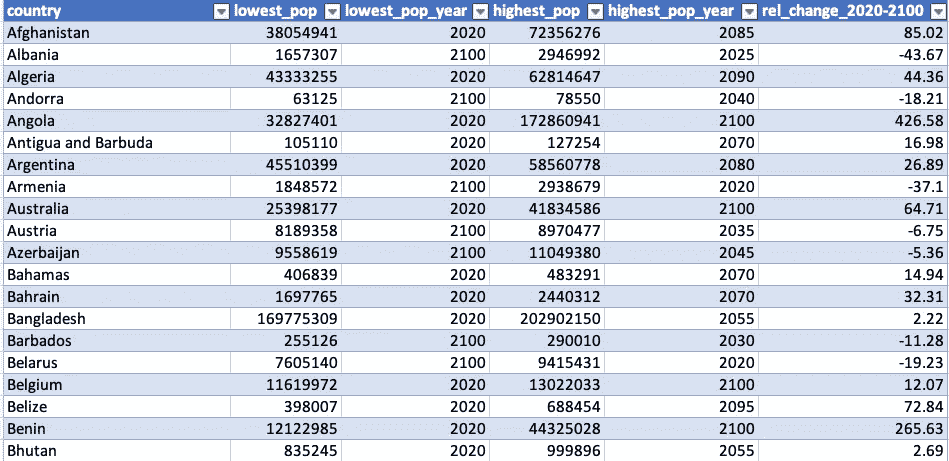
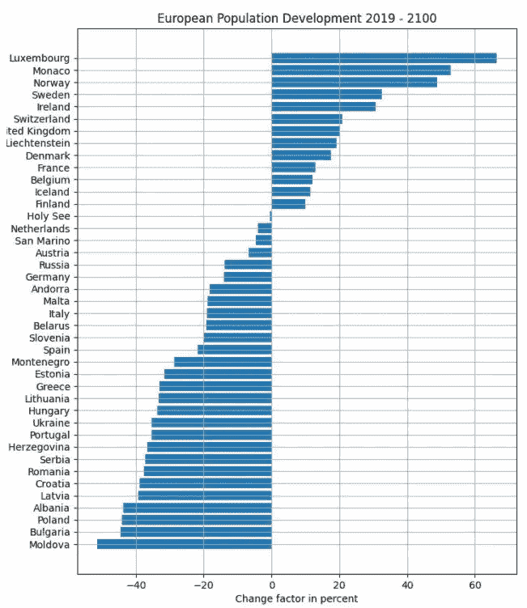
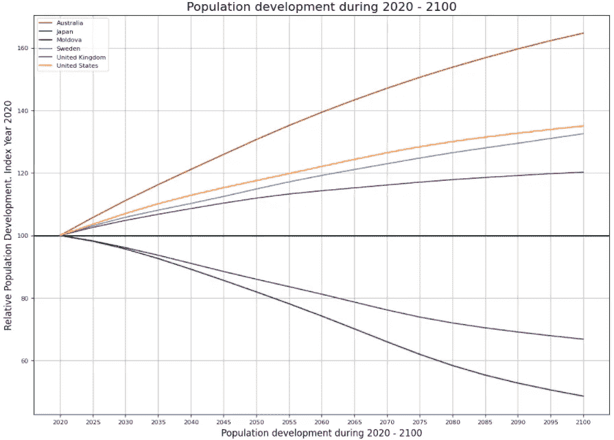

# 如何在不使用熊猫的情况下在 Python 中操作和分析数据

> 原文：<https://towardsdatascience.com/how-to-manipulate-and-analyze-data-in-python-without-using-pandas-f22e0788c471>

## 使用基本的内置 Python 函数分析未来人口增长

照片由[贾科莫·卡拉](https://unsplash.com/@giacomocarra?utm_source=medium&utm_medium=referral)在 [Unsplash](https://unsplash.com?utm_source=medium&utm_medium=referral) 拍摄

如果你正在使用 Python 并且想要做数据分析，你可能会使用 Pandas 库。这是有原因的，因为 Pandas 是一个快速灵活的数据处理和分析工具。然而，对于刚接触 python 的人来说，我发现回到 Python 的基本构建块进行数据分析是有用的，可以帮助我更好地学习 Python 进行基本的数据讨论。所以作为一个 Python 练习，我将在不使用 Pandas 库的情况下用 Python 做数据分析。我们将根据联合国提供的数据分析未来的人口增长。

我们将分析表格数据，这意味着我们将处理存储在二维列表中的数据。为了操作 2D 列表，我们将大量使用简单的嵌套 for 循环、索引和内置 python 函数，如 min()、max()、sort()和 append()。您将在使用 Pandas 或其他库的工作流程中使用的工具。

数据*是从 [Gapminder](https://www.gapminder.org/data/documentation/gd003/) 下载的。完整的数据集包含了 197 个国家从 1800 年到 2100 年的年度预测。我使用了从 2020 年到 2100 年所有 197 个国家的数据子集，时间间隔为 5 年。

数据集和代码可以在这个 [Github repo](https://github.com/TalkingDataScience/analyze_data_without_pandas) 中找到。

# 导入数据

正如您在结果中看到的，数据存储在一个二维列表中，其中每一行都是列表中的一个元素。该表采用宽格式，其中每一“行”是一个国家，每一年是一“列”。这意味着列表中的每个列表都包含每个国家的所有人口信息。

# 创建汇总表

我们将通过创建一个汇总表来开始分析人口数据集，该表包含每个国家的最高和最低预期人口信息，以及从现在到 2100 年的相对人口变化。我们将创建一个名为`pop_exp_dev`的表，其中包含以下各列:

*   国家
*   最低预测人口
*   最低预测人口年份
*   最高预测人口
*   最高预测人口年份
*   2020 年至 2100 年人口的相对变化

我们通过几个步骤创建这个表。

*   首先，我们需要将人口数据转换为整数值。我们通过使用嵌套的 for 循环来实现这一点。外部循环遍历每一行，内部循环遍历行中的每一项，并将每一项从字符串转换为整数。我们从索引 1 开始外部循环，因为我们不需要转换包含列名的第一行。我们还从索引 1 开始内部循环，因为每行的第一个值包含国家名称。
*   我们创建一个空列表`pop_exp_dev`，在其中存储新的值。
*   为了找到新值，我们使用 for-loops 来遍历行，以找到最高和最低值，并将它们追加到新表中。我们还找到了它们的索引值，这样我们就可以识别和附加这些值的年份。
*   最后，我们希望找到 2020-2100 年期间以百分比表示的预期人口变化。我们用公式*pop _ 2100-pop _ 2020/pop _ 2020 * 100*来计算

作者图片

我们现在有一个表格，其中有一些人口数据的摘要。在 2D 列表中查看数据看起来不是很舒服，所以为了便于说明，我展示了如果您以表格形式查看我们创建的表时的样子。

作者图片

# 可视化子集列表

从这张表中，我们可以画出几幅图来显示预期的人口数量。把 197 个国家都标在一个情节里很快会让情节太长，很难读懂。相反，我们可以将表格的一部分分成子集，绘制更小的图。在这里，我们将把人口增长最快和人口下降最快的国家划分为一个图，将所有欧洲国家划分为另一个图。

## 最大人口增长和最大人口下降子集

对于第一个图，我们简单地按照相对变化的值对 2D 列表进行排序，该值存储在列 6(索引 5)中。我们使用 sorted()来做到这一点，并将一个 lambda 函数传递给 key 参数。

作者图片

该图显示，我们可以预期看到非洲国家人口增长最多，欧洲国家人口下降最多，但牙买加除外，它将是所有国家中人口下降最多的国家。

作者图片

## 欧洲的子集国家

为了创建欧洲国家的子集，我们手动创建一个包含欧洲所有国家的列表，并循环遍历`pop_exp_dev`列表，以查找与 Europ 列表中的国家相匹配的任何元素。

作者图片

创建一个水平柱状图，我们可以看到大多数欧洲国家预计到 2100 年人口会下降。

作者图片

# 将表格标准化，以比较国家之间的人口发展

由于一些国家人口多，一些国家人口少，很难比较它们的人口发展情况。我们可以通过归一化人口值来解决这个问题。为此，我们将 2020 年设定为一个指数年，所有其他年份都将与该指数年相关联。每一年的人口数除以指数年的人口数，再乘以 100。

作者图片

正如您在结果中看到的，2020 年被设置为索引年，值为 100。其他年份的人口以相对于 2020 年人口的百分比变化表示。

人口数据标准化后，我们可以通过对列表进行子集化来选择要绘制的国家，如前所示。这里，我们绘制了澳大利亚、日本、摩尔多瓦、瑞典、英国和美国的人口发展图。在这些国家中，澳大利亚预计将出现最大的人口增长，其次是美国、瑞典和英国。日本和摩尔多瓦的人口预计都将下降。

作者图片

# 结论

对于处理杂乱的数据或进行更高级的分析，我无疑会使用熊猫。事实上，我不建议任何人在实际工作流程中采用这种变通方法，因为这远不是分析数据的最佳方式。例如，为了编写高效的代码，最好是[避免 For 循环并对](/why-you-should-vectorize-your-code-in-r-d7df86ebc9b7)操作进行矢量化。尽管如此，我发现对人口数据进行这种简单的分析有助于我更好地掌握 python 的基本功能，比如如何通过使用简单的或嵌套的 for 循环来访问二维列表中的某些项目和元素。以及如何使用 for-loops 创建项目并将其追加到新的二维列表。我希望这些例子对你有用！

**本文使用的数据基于联合国通过*[*【GAPMINDER.ORG*](https://www.gapminder.org/)*、CC-BY LICENSE* 提供的免费资料

      

如果你喜欢阅读这样的故事，并想支持我成为一名作家，可以考虑报名成为一名媒体成员。每月 5 美元，你可以无限制地阅读媒体上的故事。如果你注册使用我的链接，我会赚一小笔佣金。

 