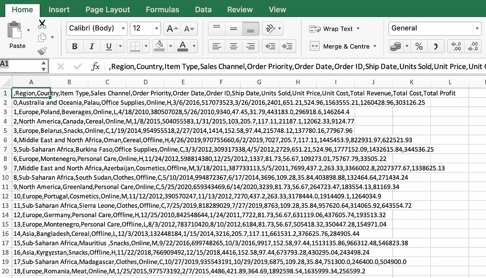
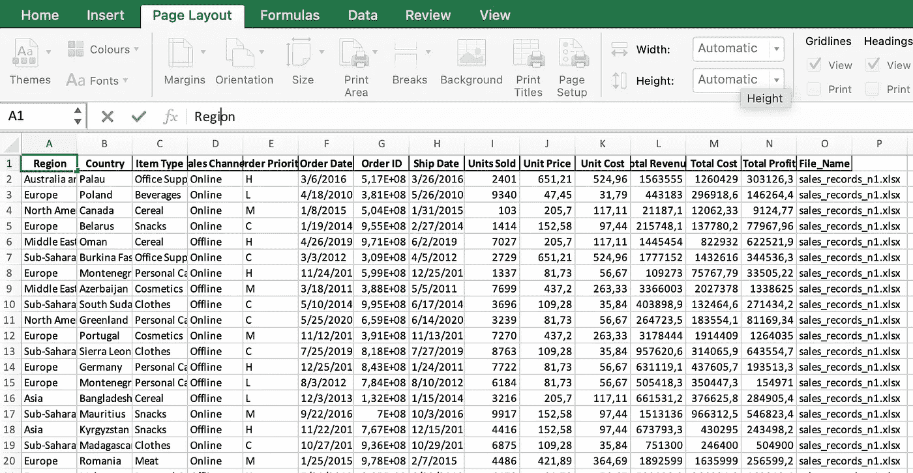

# 如何用 Python 将大型 CSV 文件合并成单个文件

> 原文：<https://towardsdatascience.com/how-to-merge-large-csv-files-into-a-single-file-with-python-c66696f595ff>

## 深入 Python，学习如何使用几行代码自动完成合并大块 CSV 或 Excel 文件等任务。


照片由 [Pexels](https://www.pexels.com/photo/woman-in-white-bikini-lying-on-rock-formation-near-body-of-water-4736967/?utm_content=attributionCopyText&utm_medium=referral&utm_source=pexels) 的 Adriano Brodbeck 拍摄

## 建议的点播课程:

*你们中的许多人联系我，询问用 Python 自动化 Excel(以及一般的电子表格)任务的宝贵资源。* *下面我分享四门我会推荐的课程:*

*   [**中级 Python(纳米级)**](https://imp.i115008.net/RyDyO2) **或** [**数据分析师| Python + SQL(纳米级)**](https://imp.i115008.net/6byNXm) *非常高质量的课程，适合致力于学习更高级 Python 的人！* **→** [***通过此环节获得七折优惠***](https://imp.i115008.net/jWWEGv)
*   [**Excel 用户 Python 编程(Numpy &熊猫)**](https://www.udemy.com/course/python-for-excel-users/?ranMID=39197&ranEAID=533LxfDBSaM&ranSiteID=533LxfDBSaM-FRyMvWbI6NiH2cJsbi.CCw&LSNPUBID=533LxfDBSaM&utm_source=aff-campaign&utm_medium=udemyads)
*   [**Python 面向电子表格用户(熊猫&其他)**](https://datacamp.pxf.io/JrYrJe)
*   [**用于数据分析的 Python&可视化(Pandas，Matplotlib，Seaborn)**](https://click.linksynergy.com/deeplink?id=533LxfDBSaM&mid=47900&murl=https%3A%2F%2Fwww.udemy.com%2Fcourse%2Flearning-python-for-data-analysis-and-visualization%2F)

希望你也会发现它们有用！现在欣赏:D 的文章

# 介绍

信不信由你，在 2022 年仍然有公司雇佣外部数据顾问使用小的 Python 脚本来执行需要最小努力的任务(*甚至对于新手*)。

> “…到 2022 年，仍然会有公司雇佣外部数据顾问来执行任务，这些任务只需使用一个小的 Python 脚本就能轻松完成。”

有趣的是，同样的顾问假装使用一些黑魔法来完成简单的工作，并收取令人难以置信的高费用。这笔钱绝对可以更明智地投资。

例如，想象一下这个场景:**一个大型销售团队每个月必须合并来自不同部门的多个 CSV 或 Excel 文件，以创建一个统一的绩效报告。**

尽管这些文件通常具有相似的格式，但有时它们非常大，以至于手动复制和粘贴甚至不是一个选项，还可能导致错误或丢失数据。

如果这听起来很熟悉，并且您希望学习如何使用 Python 来自动化这些任务，那么您就来对地方了！

实际上，在这个简短的教程中，我将向您展示如何用最少的 Python 代码将大型 CSV 或 Excel 文件合并成一个文件，甚至不用打开任何原始文件。

所以请继续关注，在这篇文章的结尾，我将与您分享一些额外的内容。

# 资料组

在[文件夹](https://github.com/anbento0490/code_tutorials/tree/master/sales_csv)中，您将找到 CSV 格式的 ***5 个模拟销售文件*** ，我将在本教程的下一步中使用它们。

每个文件都正好包括一百万行，并且具有相同数量的列。例如，如果您打开`sales_recors_n1.csv`文件，您将会遇到以下格式:



`sales_records_n1.csv file.`中前 20 行的示例

一旦你将文件下载到你的笔记本电脑上的一个特定目录，它的内容可以使用`os` Python 包中的`listdir()`方法列出。

这个方法，要求你把准确的`path`传递到目录，如下所示:

```
import ospath = “/Users/anbento/Documents/sales/sales_csv/”os.listdir(path)**Out[1]:**['sales_records_n5.csv',
 'sales_records_n4.csv',
 'sales_records_n1.csv',
 'sales_records_n3.csv',
 'sales_records_n2.csv']
```

注意这个方法如何返回一个 Python 列表，其中包含了`sales_csv`目录中的所有文件。这是有利的，因为对象可以用于迭代读取文件。

# # 1 合并多个 CSV 文件

第一步的目标是使用 Python 将 5 个 CSV 文件合并到一个包含 500 万行的独特数据集中。为了做到这一点，我将利用`os`和`pandas`包。

实现这一点的完整 Python 脚本如下:

现在，让我一步一步地解释代码中发生了什么:

**1。**首先，我正在导入所需的 Python 包，并将`path`指定给 CSV 文件。我建议您将所有想要合并的 CSV 文件保存在同一个文件夹中。这会让你的生活更轻松。

**2。**然后，我通过将`path`附加到每个遵循特定命名约定的文件上来创建一个`file_list`(在本例中是所有以 `sales_records_n`开头的文件*)。根据名称选择文件有时很重要，因为您的工作目录可能还包含许多不相关的文件。注意列表理解是如何被用来生成`file_list`的。*

这是我打印`file_list`内容时得到的结果:

```
print(file_list)**Output:**['/Users/anbento/Documents/sales/sales_csv/sales_records_n5.csv', '/Users/anbento/Documents/sales/sales_csv/sales_records_n4.csv', '/Users/anbento/Documents/sales/sales_csv/sales_records_n1.csv', '/Users/anbento/Documents/sales/sales_csv/sales_records_n3.csv', '/Users/anbento/Documents/sales/sales_csv/sales_records_n2.csv']
```

现在，所有文件都附带了路径，可以解析了。

然而，请记住这个列表是无序的，所以如果用来合并文件的顺序对你来说很重要，你将需要在遍历列表时使用函数。

**3。**此时，我首先创建一个空的`csv_list`。然后，我用 pandas 的`read_csv()`方法迭代解析`file_list`中的每个 CSV 文件，并将这些数据集附加到`csv_list`。

请注意，当`read_csv()`用于解析 CSV 时，数据集被自动转换为 pandas df，因此`csv_list`现在包括 5 个单独的 pandas df。但是，在解析文件的同时，我还链接了以下命令:

```
assign(File_Name = os.path.basename(file))
```

这是在每个 DF 中创建了一个新的列，其中的**包含了原始 CSV 文件**的名称，这样，一旦文件被合并，您将确切地知道哪个文件来自哪个文件。

**4。**通过在`csv_list`上应用`concat()`方法，文件最终被合并成一个唯一的`csv_merged`熊猫 DF。添加`ignore_index = True`意味着将为`csv_merged`生成一个全新的有序索引。

**5。**最后一步是将`csv_merged`从 pandas DF 转换回 CSV 文件(名为`sales_records_full.csv`)，该文件位于同一目录。这是通过`to_csv()`命令实现的。在这种情况下，`index=False`意味着不应添加包含索引的列。

这就是了！你现在应该看到合并后的文件(*包括附加栏* `File_Name`)出现在目录中:

```
os.listdir(path)**Output:**['sales_records_full.csv',
 'sales_records_n1.csv',
 'sales_records_n2.csv',
 'sales_records_n3.csv',
 'sales_records_n4.csv',
 'sales_records_n5.csv']
```

除去包导入，只需要 7 行代码和几秒钟的运行时间就可以达到这个结果。

# # 2 **合并多个 Excel 文件**

但是如果您希望合并大的 Excel 文件呢？

代码的差异很小:您只需在解析文件时用`read_excel()`替换方法`read_csv()`，在将`sales_records_full.xlsx`写回目录时用`to_excel()`替换`to_csv()`。

包括上述变化的完整 Python 脚本如下:

如果你想边做边学，我建议你下载[其他文件夹](https://github.com/anbento0490/code_tutorials/tree/master/sales_xlsx)中的文件。运行代码后，您应该会获得类似于以下内容的合并文件:



`sales_records_full.xlsx file`中前 20 行的示例

正如你所看到的，独立于你的文件的扩展名，过程是完全一样的，只要你能把文件转换成 pandas DFs。

# # 3 好处:将大文件分割成小文件

如果你一直读到教程的这一点，你应该得到一些额外的内容！

例如，现在让我们假设你正面临着与目前所描述的相反的问题:

*您正在处理一个包含 500 万行的非常大的 CSV 或 Excel 文件，并且您希望将它拆分成多个较小的文件，这样您就可以更快地打开它们并显示它们的内容。怎么做呢？*

这是另一个简单的任务，因为您可以简单地用`read_csv()`方法读取原始 CSV 文件，以 dataframe 格式(`df`)保存它，然后对行索引使用切片——比方说——将第一个 1M 行选择到一个更小的`df_1` DF 中。

可以重复该过程以生成多个较小的文件，如下所示:

# 结论

在这篇简短的教程中，我展示了使用 Python 将多个大文件合并成一个唯一文件是多么直观。

一种可能的策略(*本文中描述的策略*)是简单地将它们转换成 pandas 文件，然后将它们连接起来，生成一个独特的文件。

这个过程是与扩展名无关的，前提是文件可以用 pandas 解析，并且总共只需要 7 行代码，这使得它成为刚刚学习用 Python 编程的人自动化的绝佳候选。

但是你呢？你知道在 Python 中合并多个文件的其他更有效的方法吗？欢迎在评论中分享你的知识，:D

# 你可能也喜欢

</10-algorithms-to-solve-before-your-python-coding-interview-feb74fb9bc27>  </3-ways-to-compute-a-weighted-average-in-python-4e066de7a719>  </3-ways-to-iterate-over-python-dictionaries-using-for-loops-14e789992ce5>  

# 给我的读者一个提示

*这个帖子包括附属链接，如果你购买的话，我可以免费给你一点佣金。*