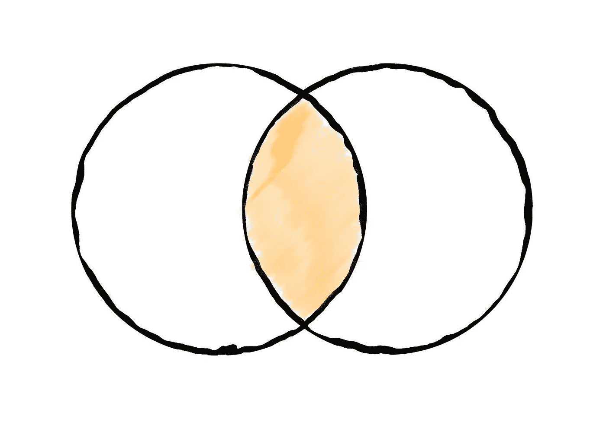
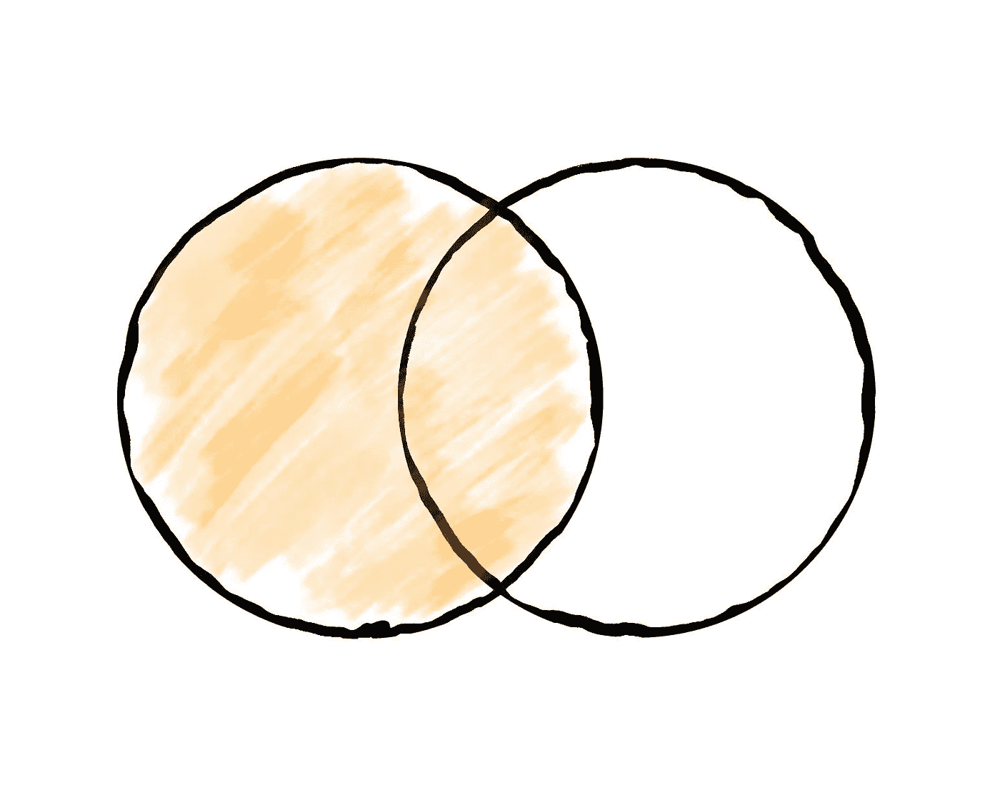
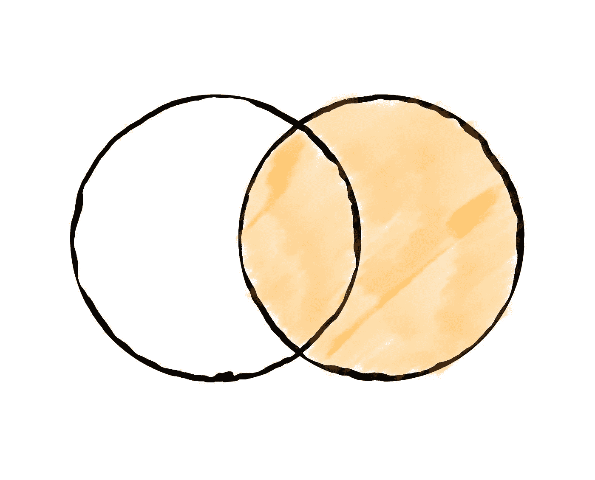
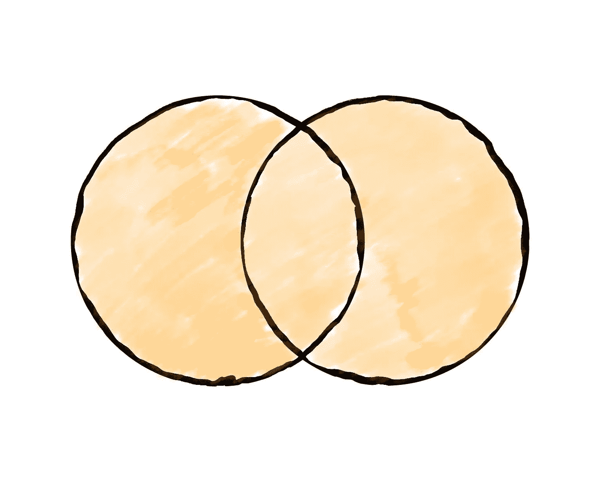
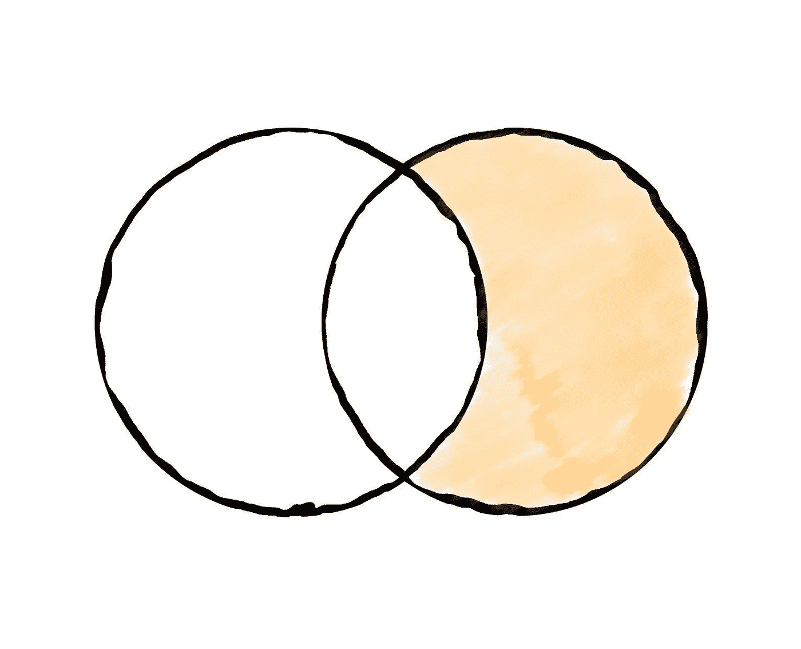
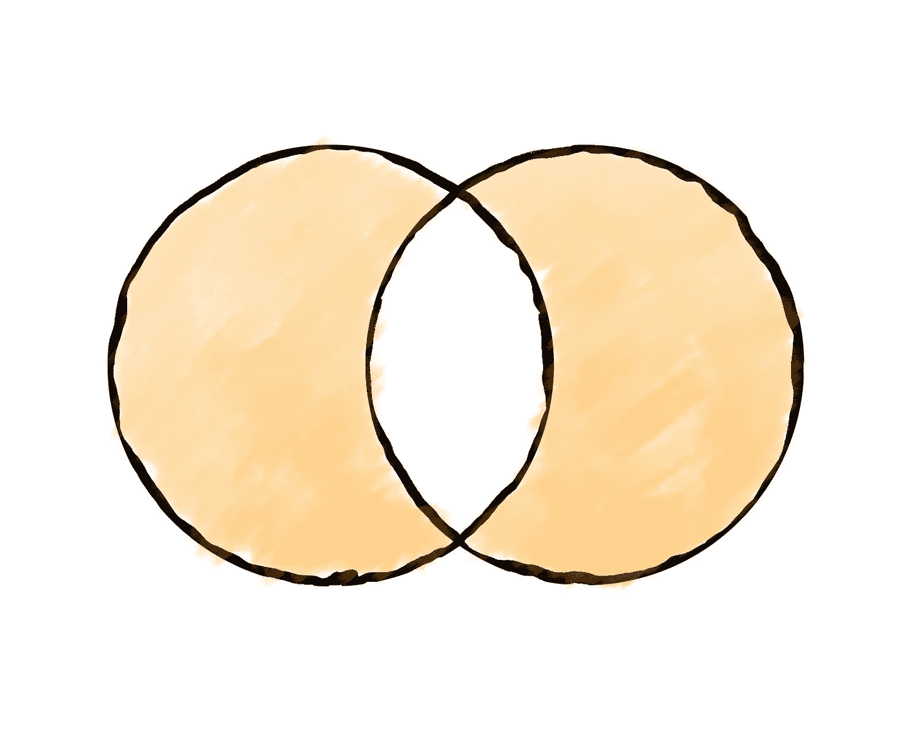

# 如何合并熊猫数据帧

> 原文：<https://towardsdatascience.com/how-to-merge-pandas-dataframes-221e49c41bec>

## 对熊猫数据帧执行左、右、内和反连接


安德斯·吉尔登在 [Unsplash](https://unsplash.com/s/photos/smoke-grenade?utm_source=unsplash&utm_medium=referral&utm_content=creditCopyText) 上拍摄的照片

## 介绍

通常，我们可能必须将 pandas 数据帧合并在一起，以便基于最终服务于我们正在进行的任务的目的的一些逻辑，构建包含来自相关方的列和行的新数据帧。

在今天的文章中，我们将展示如何合并熊猫数据帧，并执行`LEFT`、`RIGHT`、`INNER`、`OUTER`、`FULL`和`ANTI`连接。Pandas 合并相当于 SQL 中的连接，我们将采用 SQL 风格的方法来解释合并，因为这将有助于新来者跟上。更具体地说，我们将展示如何表演

*   左连接(也称为左外连接)
*   右连接(也称为右外连接)
*   内部连接
*   完全外部连接
*   左反连接(又名左排除连接)
*   右反联接(又名右排除联接)
*   完全反联接

除了不同的连接/合并类型，在下面的部分中，我们还将介绍如何

*   在单个列上合并(在两个 dfs 上具有相同的名称)
*   在多列上合并
*   合并不同名称的列
*   重命名联接中使用的共有列名
*   仅从联接所涉及的数据框架中选择一些列

首先，让我们创建几个将在本教程中使用的数据框架，以演示我们今天将讨论的各种连接类型。

```
import pandas as pd df1 = pd.DataFrame(
    [
       (1, 345, 'B', True),
       (2, 100, 'C', False),
       (3, 300, 'B', False),
       (4, 151, 'A', False),
       (5, 212, 'A', True),
       (6, 121, 'C', False),
       (7, 333, 'B', True),
       (8, 456, 'C', True),
    ],
    columns=['id', 'value', 'colC', 'colD']
)df2 = pd.DataFrame(
    [
       (1, 111, 10.1, 3),
       (9, 56, 3.33, 10),
       (10, 17, 18.0, 8),
       (3, 567, 19.1, 4),
       (11, 98, 2.1, 1),
       (6, 31, 3.14, 12),
    ],
    columns=['id', 'value', 'colE', 'colF']
)print(df1)
 ***id  value colC   colD*** *0   1    345    B   True
1   2    100    C  False
2   3    300    B  False
3   4    151    A  False
4   5    212    A   True
5   6    121    C  False
6   7    333    B   True
7   8    456    C   True*print(df2)
 ***id  value   colE  colF*** *0   1    111  10.10     3
1   9     56   3.33    10
2  10     17  18.00     8
3   3    567  19.10     4
4  11     98   2.10     1
5   6     31   3.14    12*
```

## 内部连接

两个 pandas 数据帧之间的内部连接将产生一组记录，这些记录在指定的连接列中具有共同的值。

> 内部连接:使用两个帧的关键点的交集



对两个数据帧执行内部连接时选择的记录—来源:作者

为了使用单个列在两个数据帧之间执行内部连接，我们只需要在调用`merge()`时提供`on`参数。

```
df1.merge(df2, on='id')
```

注意，默认情况下，`[merge()](https://pandas.pydata.org/pandas-docs/stable/reference/api/pandas.DataFrame.merge.html)`方法执行内部连接(`how='inner'`)，因此您不必显式指定连接类型。输出将包含在`df1`和`df2`中具有共同 id 的所有记录:

```
 ***id  value_x colC   colD  value_y   colE  colF*** *0   1      345    B   True      111  10.10     3
1   3      300    B  False      567  19.10     4
2   6      121    C  False       31   3.14    12*
```

## 左连接(也称为左外连接)

左联接(或左外联接)将在指定的联接列上，从左数据帧中取出所有记录，以及从右数据帧中取出与左数据帧具有匹配值的记录。

结果中包含的右侧数据帧记录中的任何缺失值将被替换为`NaN`。

> 左侧外部连接:仅使用左侧帧中的关键点



对两个数据帧执行左连接时选择的记录-来源:作者

要在两个熊猫数据帧之间执行左连接，现在需要在调用`merge()`时指定`how='left'`。

```
df1.merge(df2, on='id', how='left')
```

如上所述，得到的数据帧将包含左侧数据帧中的每条记录，以及右侧数据帧中与连接列匹配的这些记录的相应值。这些记录的结果中与右侧数据帧中的记录不匹配的其余列值将被替换为`NaN` s。

```
 ***id  value_x colC   colD  value_y   colE  colF*** *0   1      345    B   True    111.0  10.10   3.0
1   2      100    C  False      NaN    NaN   NaN
2   3      300    B  False    567.0  19.10   4.0
3   4      151    A  False      NaN    NaN   NaN
4   5      212    A   True      NaN    NaN   NaN
5   6      121    C  False     31.0   3.14  12.0
6   7      333    B   True      NaN    NaN   NaN
7   8      456    C   True      NaN    NaN   NaN*
```

## 右连接(也称为右外连接)

右联接(或右外联接)将在指定的联接列上，从右数据帧中取出所有记录，以及从左数据帧中取出与右数据帧具有匹配值的记录。

包含在结果中的左侧数据帧记录中的任何缺失值将被替换为`NaN`。

> 右侧外部连接:仅使用右侧帧中的关键点



对两个数据帧执行右连接时选择的记录-来源:作者

要在两个熊猫数据帧之间执行左连接，现在需要在调用`merge()`时指定`how='right'`。

```
df1.merge(df2, on='id', how='right')
```

`df1`和`df2`数据帧之间右连接的结果如下所示。

```
 ***id  value_x colC   colD  value_y   colE  colF*** *0   1    345.0    B   True      111  10.10     3
1   9      NaN  NaN    NaN       56   3.33    10
2  10      NaN  NaN    NaN       17  18.00     8
3   3    300.0    B  False      567  19.10     4
4  11      NaN  NaN    NaN       98   2.10     1
5   6    121.0    C  False       31   3.14    12*
```

## 完全外部连接

完整的外部连接基本上包括来自左右数据帧的所有记录。这种类型的连接将使用两个帧中的键——对于任何缺失的行，将插入`NaN`值。

> 完全外部连接:使用两个帧的键的联合



对两个数据帧执行完全外部连接时选择的记录—来源:作者

要在两个 pandas 数据帧之间执行完整的外部连接，现在需要在调用`merge()`时指定`how='outer'`。

```
df1.merge(df2, on='id', how='outer')
```

使用我们的两个示例框架的完整外部连接的输出如下所示。

```
 ***id  value_x colC   colD  value_y   colE  colF*** *0    1    345.0    B   True    111.0  10.10   3.0
1    2    100.0    C  False      NaN    NaN   NaN
2    3    300.0    B  False    567.0  19.10   4.0
3    4    151.0    A  False      NaN    NaN   NaN
4    5    212.0    A   True      NaN    NaN   NaN
5    6    121.0    C  False     31.0   3.14  12.0
6    7    333.0    B   True      NaN    NaN   NaN
7    8    456.0    C   True      NaN    NaN   NaN
8    9      NaN  NaN    NaN     56.0   3.33  10.0
9   10      NaN  NaN    NaN     17.0  18.00   8.0
10  11      NaN  NaN    NaN     98.0   2.10   1.0*
```

## 左反连接(又名左排除连接)

左反连接将包含左框架中键没有出现在右框架中的所有记录。

> 左侧反连接:仅使用左侧帧中不出现在右侧帧中的关键点


对两个数据帧执行左反连接时选择的记录—来源:作者

熊猫的左反加入可以分两步进行。第一步，我们需要用`indicator=True`执行一个**左外连接**:

> **指标** `*bool*` *或* `*str*` *，默认* `*False*`
> 
> 如果是`True`，在输出数据帧中添加一个名为`'_merge'`的列，其中包含每行的源信息。通过提供字符串参数，可以为该列指定一个不同的名称。对于合并键仅出现在左侧数据帧中的观察，该列将具有值为`'left_only'`的`Categorical`类型；对于合并键仅出现在右侧数据帧中的观察，该列将具有值为`'right_only'`的类型；如果观察的合并键同时出现在两个数据帧中，则该列将具有值为`'both'`的类型。
> 
> — Python 文档

```
df1.merge(df2, on='id', how='left', indicator=True) ***id  value_x colC   colD  value_y   colE  colF     _merge*** *0   1      345    B   True    111.0  10.10   3.0       both
1   2      100    C  False      NaN    NaN   NaN  left_only
2   3      300    B  False    567.0  19.10   4.0       both
3   4      151    A  False      NaN    NaN   NaN  left_only
4   5      212    A   True      NaN    NaN   NaN  left_only
5   6      121    C  False     31.0   3.14  12.0       both
6   7      333    B   True      NaN    NaN   NaN  left_only
7   8      456    C   True      NaN    NaN   NaN  left_only*
```

在第二步中，我们只需要`query()`上一个表达式的结果，以便只保留来自左侧框架的行，并过滤掉那些也出现在右侧框架中的行。

如果我们将这两个步骤结合在一起，得到的表达式将是

```
df1.merge(df2, on='id', how='left', indicator=True) \
    .query('_merge == "left_only"') \
    .drop('_merge', 1)
```

以及相应的结果

```
 ***id  value_x colC   colD  value_y  colE  colF*** *1   2      100    C  False      NaN   NaN   NaN
3   4      151    A  False      NaN   NaN   NaN
4   5      212    A   True      NaN   NaN   NaN
6   7      333    B   True      NaN   NaN   NaN
7   8      456    C   True      NaN   NaN   NaN*
```

## 右反联接(又名右排除联接)

类似地，右反连接将包含右框架的所有记录，这些记录的键没有出现在左框架中。

> 右侧反连接:仅使用右侧帧中不出现在左侧帧中的关键点



对两个数据帧执行右反连接时选择的记录—来源:作者

熊猫的右反加入可以分两步进行。第一步，我们需要用`indicator=True`执行一个**右外连接**:

> **指示器** `*bool*` *或* `*str*` *，默认* `*False*`
> 
> 如果是`*True*`，则向输出数据帧添加一个名为`*'_merge'*`的列，其中包含每行的源信息。通过提供字符串参数，可以为该列指定一个不同的名称。对于合并关键字只出现在左侧数据帧中的观察，该列将具有值为`*'left_only'*`的`Categorical`类型；对于合并关键字只出现在右侧数据帧中的观察，该列将具有值为`*'right_only'*`的类型；如果观察的合并关键字同时出现在两个数据帧中，则该列将具有值`*'both'*`。
> 
> — Python 文档

```
df1.merge(df2, on='id', how='right', indicator=True) ***id  value_x colC   colD  value_y   colE  colF      _merge*** *0   1    345.0    B   True      111  10.10     3        both
1   9      NaN  NaN    NaN       56   3.33    10  right_only
2  10      NaN  NaN    NaN       17  18.00     8  right_only
3   3    300.0    B  False      567  19.10     4        both
4  11      NaN  NaN    NaN       98   2.10     1  right_only
5   6    121.0    C  False       31   3.14    12        both*
```

在第二步中，我们只需要`query()`上一个表达式的结果，以便只保留来自右帧的行，并过滤掉那些同时出现在左帧中的行。

如果我们将这两个步骤结合在一起，得到的表达式将是

```
df1.merge(df2, on='id', how='right', indicator=True) \
  .query('_merge == "right_only"') \
  .drop('_merge', 1)
```

使用我们的示例数据帧得到的帧将是

```
 ***id  value_x colC colD  value_y   colE  colF*** *1   9      NaN  NaN  NaN       56   3.33    10
2  10      NaN  NaN  NaN       17  18.00     8
4  11      NaN  NaN  NaN       98   2.10     1*
```

## 完全反联接

完整的反连接将包含没有任何公共键的左帧和右帧的所有记录。

> 完全反连接:取两帧密钥的对称差



对两个数据帧执行完全反连接时选择的记录—来源:作者

同样，这可以像我们讨论的前两种反连接类型一样分两步执行。

```
df1.merge(df2, on='id', how='outer', indicator=True) \
  .query('_merge != "both"') \
  .drop('_merge', 1)
```

使用我们的示例帧的结果如下所示。

```
 ***id  value_x colC   colD  value_y   colE  colF*** *1    2    100.0    C  False      NaN    NaN   NaN
3    4    151.0    A  False      NaN    NaN   NaN
4    5    212.0    A   True      NaN    NaN   NaN
6    7    333.0    B   True      NaN    NaN   NaN
7    8    456.0    C   True      NaN    NaN   NaN
8    9      NaN  NaN    NaN     56.0   3.33  10.0
9   10      NaN  NaN    NaN     17.0  18.00   8.0
10  11      NaN  NaN    NaN     98.0   2.10   1.0*
```

## 更改同名列的后缀

还要注意如何分别使用`_x`和`_y`自动重命名同名的列。您可以通过向`suffixes`参数提供所需的值来更改默认值。举个例子，

```
df1.merge(df2, on='id', **suffixes=('_df1', '_df2'**))
```

现在，参与连接的左右数据帧中的每一列都将具有指定的后缀。

```
 **id  value_df1 colC   colD  value_df2   colE  colF** *0   1        345    B   True        111  10.10     3
1   3        300    B  False        567  19.10     4
2   6        121    C  False         31   3.14    12*
```

## 合并不同的列名

现在让我们考虑另一个用例，其中我们想要合并两个 pandas 数据帧的列没有相同的名称。在这种情况下，我们不提供`on`参数，而是必须提供`left_on`和`right_on`参数来指定在将左右数据帧合并在一起时要考虑的列。

作为一个例子，假设我们想要分别基于`id`和`colF`列合并`df1`和`df2`。以下命令将完成这一任务:

```
df1.merge(df2, left_on='id', right_on='colF')
```

得到的数据帧如下所示

```
 ***id_x  value_x colC   colD  id_y  value_y  colE  colF***
*0     1      345    B   True    11       98   2.1     1
1     3      300    B  False     1      111  10.1     3
2     4      151    A  False     3      567  19.1     4
3     8      456    C   True    10       17  18.0     8*
```

## 在多列上合并

如果您想要合并多个列，您可以简单地将所有想要的列作为一个列表传递到`on`参数中:

```
df1.merge(df2, on=['colA', 'colB', ..])
```

如果左框架和右框架中的列有不同的名称，那么您可以再次使用`right_on`和`left_on`参数:

```
df1.merge(df2, left_on=['colA', 'colB'], right_on=['colC', 'colD])
```

## 从所涉及的数据帧中仅选择一些列

现在假设我们想使用左外连接将框架`df1`和`df2`合并在一起，选择`df1`中的所有列，但只选择`df2`中的列`colE`。

为此，在将帧传递给`merge()`方法时，可以简单地使用`df2`列的子集。

```
df1.merge(df2[['id', 'colE']], on='id')
```

这将从右侧框架中排除除`colE`之外的所有列:

```
 ***id  value colC   colD   colE*** *0   1    345    B   True  10.10
1   3    300    B  False  19.10
2   6    121    C  False   3.14*
```

## 最后的想法

在本教程中，我们讨论了合并熊猫数据帧以及如何执行**左外、右外、内、全外、左反、右反**和**全反**连接。

此外，我们还讨论了一些其他用例，包括如何连接不同名称的列，甚至是多个列。此外，我们还展示了如何更改具有相同名称的列名的后缀，以及如何在执行合并后只从左侧或右侧数据帧中选择列的子集。

每当你想在熊猫数据帧之间执行一些连接时，你可以使用这篇文章作为备忘单，因此可以自由地保存这篇文章或在你的浏览器上创建一个书签！

[**成为会员**](https://gmyrianthous.medium.com/membership) **阅读介质上的每一个故事。你的会员费直接支持我和你看的其他作家。你也可以在媒体上看到所有的故事。**

<https://gmyrianthous.medium.com/membership>  

**相关文章你可能也喜欢**

</apply-vs-map-vs-applymap-pandas-529acdf6d744>  </how-to-efficiently-convert-a-pyspark-dataframe-to-pandas-8bda2c3875c3>  </loc-vs-iloc-in-pandas-92fc125ed8eb> [## 熊猫中的 loc 与 iloc

towardsdatascience.com](/loc-vs-iloc-in-pandas-92fc125ed8eb)