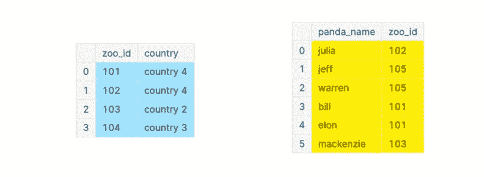
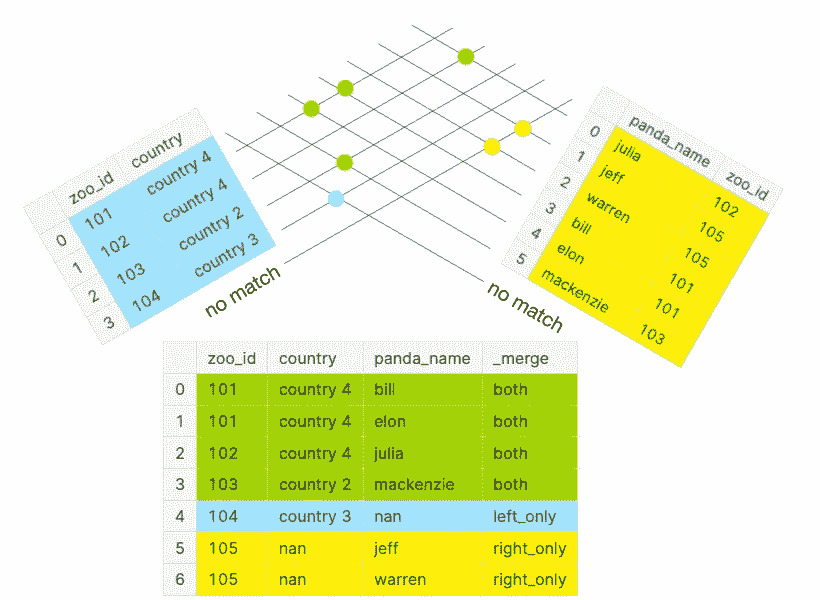
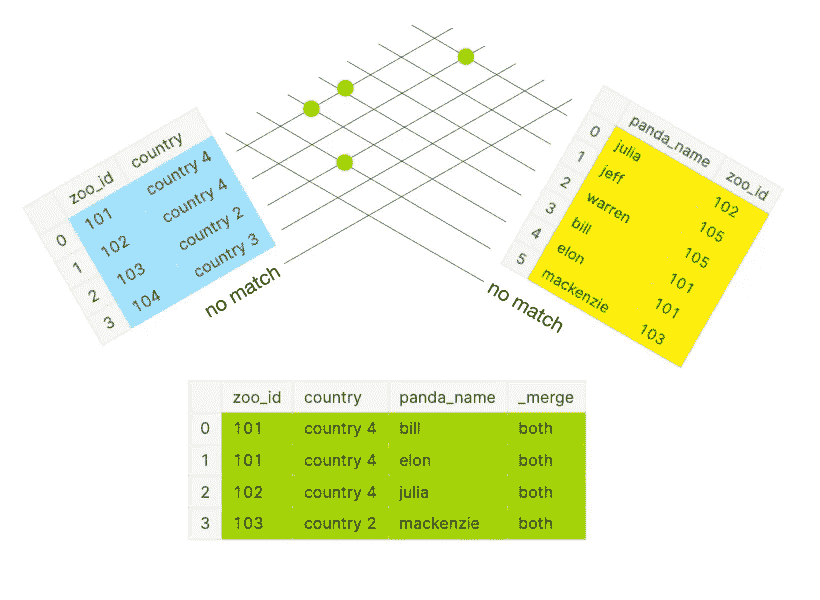
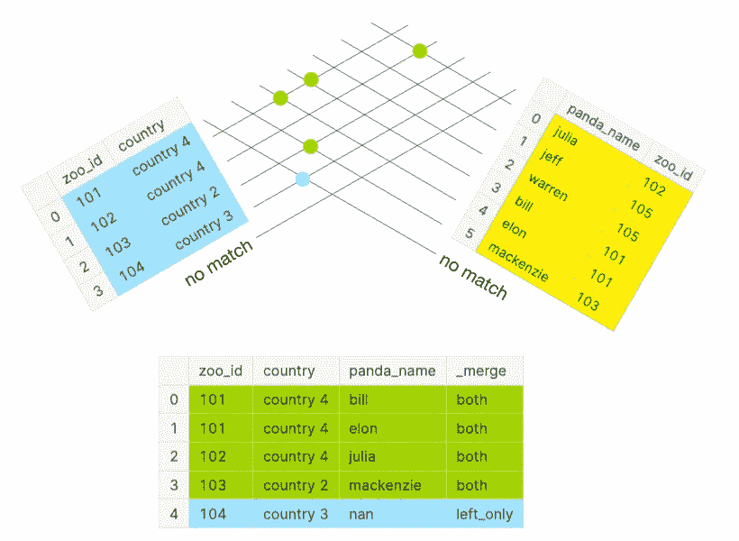
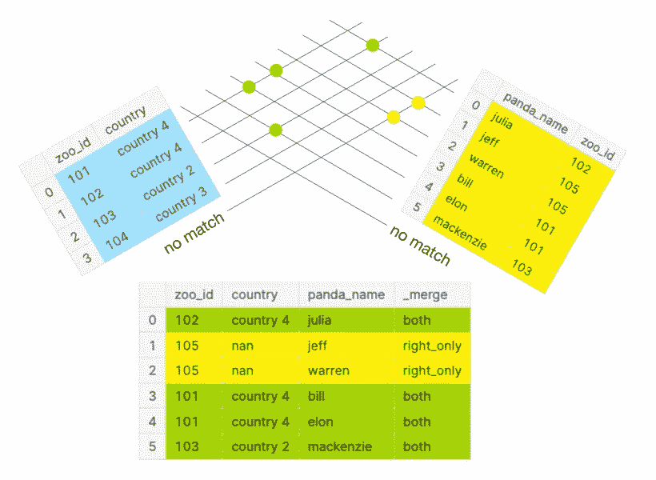
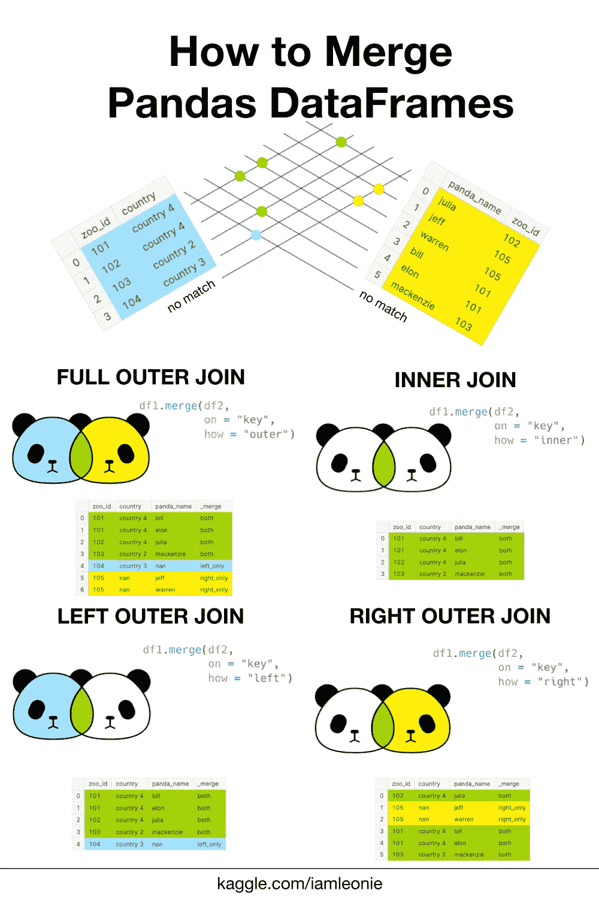

# 如何合并熊猫数据帧

> 原文：<https://towardsdatascience.com/how-to-merge-pandas-dataframes-35afe8b1497c>

## 如何避免丢失有价值的数据点(包括备忘单)


合并的熊猫(图片由作者提供)

合并两个数据帧时的一个常见陷阱是无意中丢失了有价值的数据点。有时，您需要用第二个数据集中的附加信息来扩展您的初始数据集。为此，您可以将两个数据集读入 pandas 数据帧，然后用`.merge()`方法将它们组合成一个数据帧。但是，根据您合并它们的方式，您最终可能会得到比预期更少或更多的数据点。

> 但是，根据您合并它们的方式，您最终可能会得到比预期更少或更多的数据点。

本文将介绍合并两个数据帧的四种最常见的方法。由于合并 pandas 数据帧类似于 SQL 连接，我们将使用它们作为类比[1]。也就是说，我们将展示如何进行:

*   左外部联接(熊猫:“左”)
*   右外部联接(熊猫:“右”)
*   完全外部连接(熊猫:“外部”)
*   内部联接(熊猫:“内部”)

此外，我们将向您展示如何验证您的结果。

# 基本原则

为了解释这些概念，我们将使用下面两个最小的虚构数据集。在这个例子中，我们为动物园中的熊猫准备了两张桌子。第一个表包含动物园的位置信息。第二个表包含关于哪只熊猫在哪个动物园的信息。



左侧数据帧 df1(蓝色)和右侧数据帧 df2(黄色)(图片由作者提供)

在下面的例子中，数据帧被着色以说明哪个条目来自哪个数据帧。当合并两个数据帧时，您将它们称为“左”和“右”数据帧。在本例中，`df1`是左边的数据帧，颜色为蓝色。`df2`是右边的数据框，用黄色标出。如果合并的数据帧中的一个条目来自两个数据帧，它将用绿色行背景指示。

*   左侧数据框:`df1`，以**蓝色**着色
*   右侧数据框:`df2`，用**黄色**着色
*   关键列:合并`df1`和`df2`的公共列。在本例中，键列是“zoo_id”。
*   合并的数据帧:`df_merged`，左边的**行为蓝色**，右边的**行为黄色**，右边的**行为绿色**

让我们来看看`.merge()`方法及其必要参数。这种方法比下面讨论的参数更多。然而，我们将只涉及与本文相关的内容。您可以参考文档[2]了解更多参数。

```
DataFrame.merge(right, 
                how = "...", 
                on = None, 
                indicator = False,
                ...)
```

首先，从左边的数据帧`df1`调用`.merge()`方法，第一个参数是右边的数据帧`df2`。

```
df_merged = df1.merge(df2)
```

您也可以合并两个数据帧，如下所示，其中第一个参数是左侧数据帧，第二个参数是右侧数据帧:

```
df_merged = pd.merge(df1, df2)
```

虽然`.merge()`方法足够智能，可以找到要合并的公共键列，但我建议用参数`on`显式定义它。**这不仅让你的代码可读性更好，还加快了执行时间。**

```
df_merged = df1.merge(df2,
                      on = "zoo_id")
```

如果键列在两个数据帧中没有相同的名称，可以使用参数`on_left`和`on_right`代替`on`。

```
df_merged = df1.merge(df2,
                      on_left = "key1",
                      on_right = "key2")
```

为了指示合并的数据帧中的一行来自哪个数据帧，我们将使用参数`indicator = True`。该选项将在合并的数据框架中创建一个新列“_merge”，如下例所示。**对于合并数据帧的常规用法，可以省略** `**indicator**` **参数。**

# 完全外部连接(熊猫:“外部”)

如果你想拍下每只熊猫和每个动物园的全景，该怎么办？


完全外部连接(图片由作者提供)

为此，您可以在 SQL speak [1]中使用完整的外部连接。

```
SELECT *
FROM df1
**FULL OUTER JOIN** df2
  ON df1.zoo_id = df2.zoo_id;
```

在熊猫身上，你可以使用`how = "outer"`【2】。

```
df_merged = df1.merge(df2, 
                      on = "zoo_id", 
                      how = **"outer"**,
                      indicator = True)
```

下面，您可以看到通过键列匹配两个数据框中每一行的各种可能性。值 101、102 和 103 出现在两个数据帧的两个键列中。如果两个数据帧都匹配，则在两个数据帧的相交处会出现一个绿点。

然而，值 104 仅出现在左侧数据帧的关键字列中，而值 105 仅出现在右侧数据帧的关键字列中。不匹配的行在与称为“不匹配”的线的相交处分别用蓝色或黄色点表示。

完整的外部联接包含下图中的所有点。

> 如果你想拍下每只熊猫和每个动物园的全景，该怎么办？



DataFrame 与“外部”合并(图片由作者提供)

作为健全性检查，合并数据帧的预期长度应该大于或等于较长数据帧的长度。合并的数据帧`df_merged`总共有七行:如列`_merge`所示，两个都有四行，一个只从左边，两个只从右边。

绿色行不包含空值，而蓝色和黄色行包含缺失值。由于绿色行来自两个数据帧，因此每列都有一个值。然而，因为左边的数据帧`df2`不包含任何与`zoo_id = 104`一起生活在动物园中的熊猫，所以第 4 行的列`panda_name`是 nan。黄色的第 5 行和第 6 行也是如此，因为`df1`不包含任何关于带有`zoo_id = 105`的动物园的信息。

# 内部联接(熊猫:“内部”)

但是，如果你只想看看饲养熊猫的动物园呢？


内部连接(图片由作者提供)

为此，您可以在 SQL speak [1]中使用内部连接。

```
SELECT *
FROM df1
**INNER JOIN** df2
  ON df1.zoo_id = df2.zoo_id;
```

在熊猫身上，你会用`how = "inner"`【2】。

```
df_merged = df1.merge(df2, 
                      on = "zoo_id", 
                      how = **"inner"**,
                      indicator = True)
```

在下图中，您可以再次看到完全外部连接所描述的匹配。但是，内部连接只考虑绿点，这表示两个数据帧的两个键列中都存在一个值。不匹配的值(完全外部连接中的蓝色和黄色点)被排除在外，如上图所示。

> 但是，如果你只想看看饲养熊猫的动物园呢？



DataFrame 与“inner”合并(图片由作者提供)

作为健全性检查，合并数据帧的预期长度应该**长于或等于较短数据帧的长度。**合并的数据帧`df_merged`总共有四行:如列`_merge`中所示，两者都有四行。

# 左外部联接(熊猫:“左”)

现在，假设您想知道每个动物园都有哪些熊猫。有了这些信息，你可以计算出每个动物园有多少只熊猫。


左外部连接(图片由作者提供)

为此，您可以在 SQL speak [1]中使用左外连接。

```
SELECT *
FROM df1
**LEFT OUTER JOIN** df2
  ON df1.zoo_id = df2.zoo_id;
```

在熊猫身上，你可以用`how = "left"`【2】。

```
df_merged = df1.merge(df2, 
                      on = "zoo_id", 
                      how = **"left"**,
                      indicator = True)
```

在下图中，您可以再次看到完全外部连接所描述的匹配。然而，左外连接只考虑绿点和蓝点，如上图所示。右侧数据框中不匹配的值(完全外部连接中的黄点)将被排除。

> 假设您想要计算每个动物园有多少只熊猫。



DataFrame 与“左”合并(图片由作者提供)

作为健全性检查，合并数据帧的预期长度应**长于或等于左侧数据帧的长度。**合并的数据帧`df_merged`总共有 5 行:如列`_merge`所示，两边各 4 行，左边 1 行。

# 右外部联接(熊猫:“右”)

最后，假设您想知道每只熊猫生活在哪个动物园。


右外部连接(图片由作者提供)

为此，您可以在 SQL speak [1]中使用右外连接。

```
SELECT *
FROM df1
**RIGHT OUTER JOIN** df2
  ON df1.zoo_id = df2.zoo_id;
```

在熊猫身上，你可以用`how = "right"`【2】。

```
df_merged = df1.merge(df2, 
                      on = "zoo_id", 
                      how = **"right"**,
                      indicator = True)
```

在下图中，您可以再次看到完全外部连接所描述的匹配。然而，一个右外连接只考虑绿色和黄色的点，如上面的 panda Venn 图所示。左侧数据框中不匹配的值(完全外部连接中的蓝点)将被排除。

> 假设您想知道每只熊猫生活在哪个动物园。



DataFrame 与“右”合并(图片由作者提供)

作为健全性检查，合并的数据帧的预期长度应该比右数据帧的长度长或等于右数据帧的长度**。**合并后的数据帧`df_merged`总共有六行:如`_merge`列所示，四行来自两边，两行仅来自右边。

# 结论

这篇文章(字面上)演示了如何用`.merge()`方法合并两个熊猫数据帧。也就是说，我们研究了如何在 pandas 中执行最常见的 SQL 连接类型:全外部连接、内部连接、左外部连接和右外部连接。

下面你可以找到这篇文章的直观摘要:



如何合并熊猫数据帧的备忘单(图片由作者提供)

# 喜欢这个故事吗？

要阅读更多来自我和其他作家的故事，请在 Medium 上注册。报名时可以用我的 [*推荐链接*](https://medium.com/@iamleonie/membership) *支持我。我将收取佣金，不需要你额外付费。*

<https://medium.com/@iamleonie/membership>  

*在*[*LinkedIn*](https://www.linkedin.com/in/804250ab/)*和* [*上找我 Kaggle*](https://www.kaggle.com/iamleonie) *！*

# 参考

[1]“熊猫 1.4.2 文档”，“与 SQL 的比较。”pandas.pydata.org。[https://pandas . pydata . org/docs/getting _ started/comparison/comparison _ with _ SQL . html # join](https://pandas.pydata.org/docs/getting_started/comparison/comparison_with_sql.html#join)(2022 年 7 月 13 日访问)

[2]“pandas 1 . 4 . 2 文档”，“pandas . data frame . merge .”pandas.pydata.org。[https://pandas.pydata.org/docs/reference/api/pandas.DataFrame.merge.html](https://pandas.pydata.org/docs/reference/api/pandas.DataFrame.merge.html)(2022 年 7 月 13 日访问)