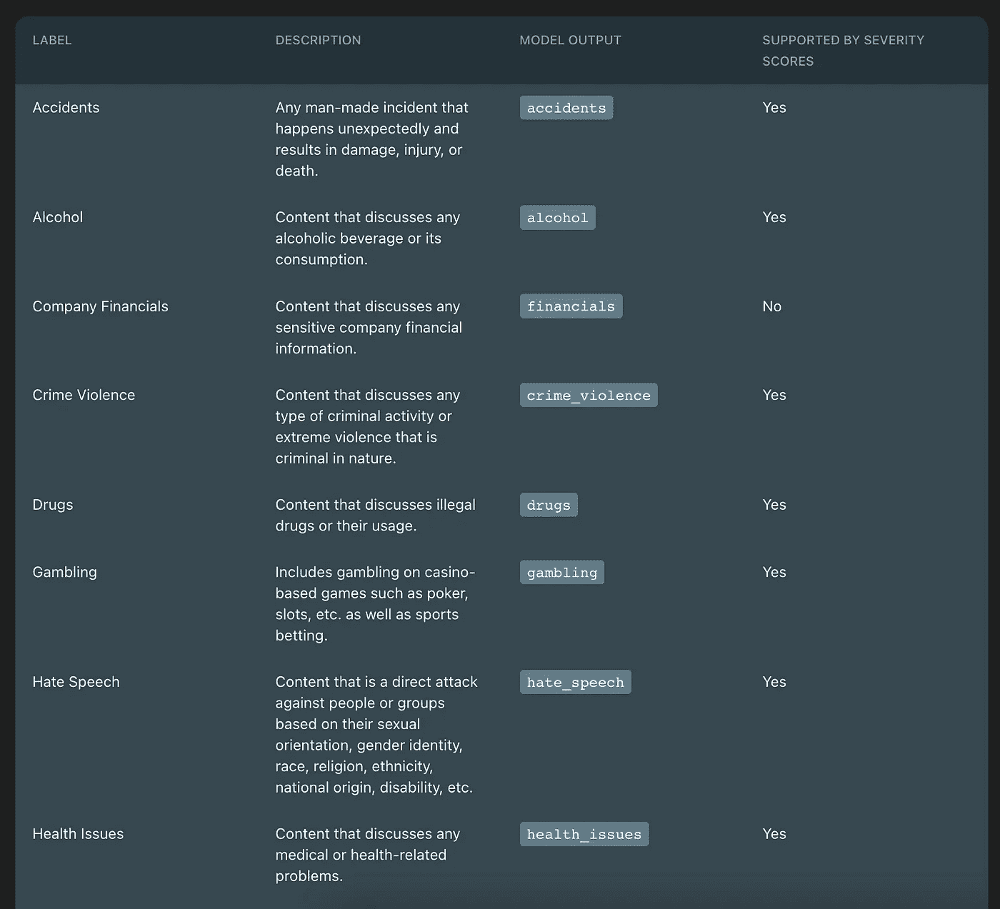
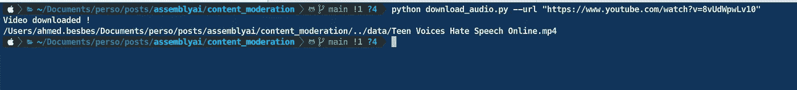
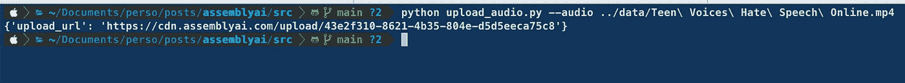
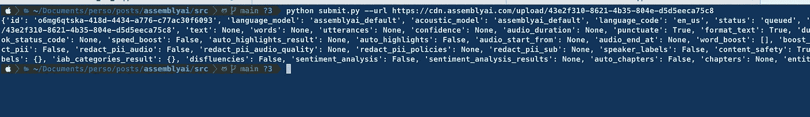
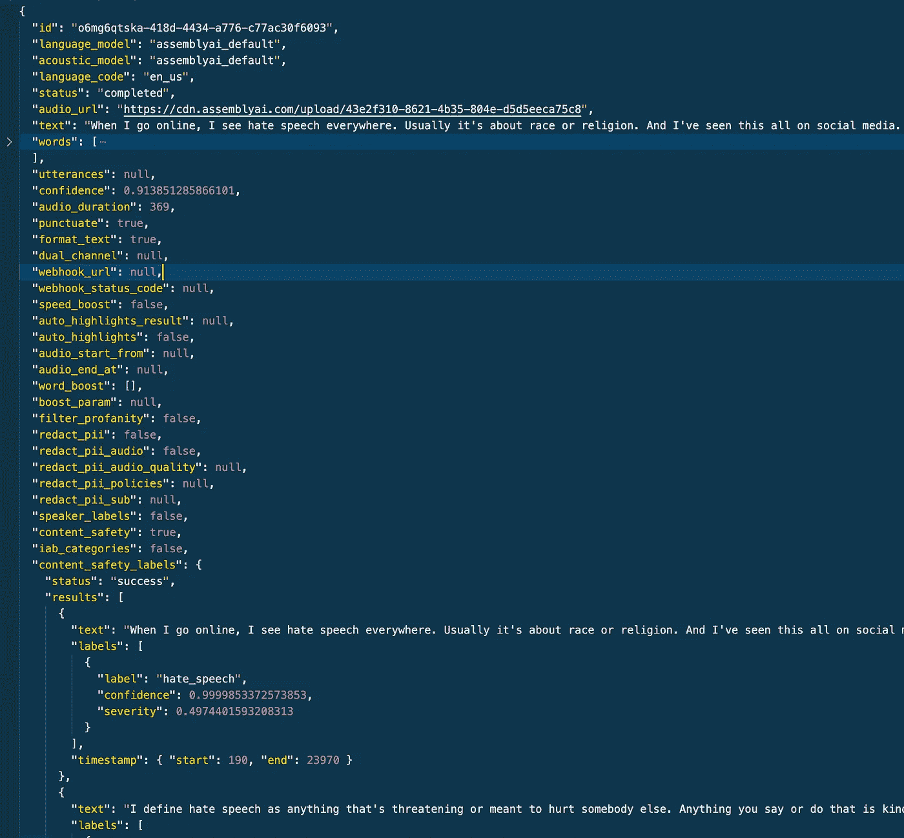
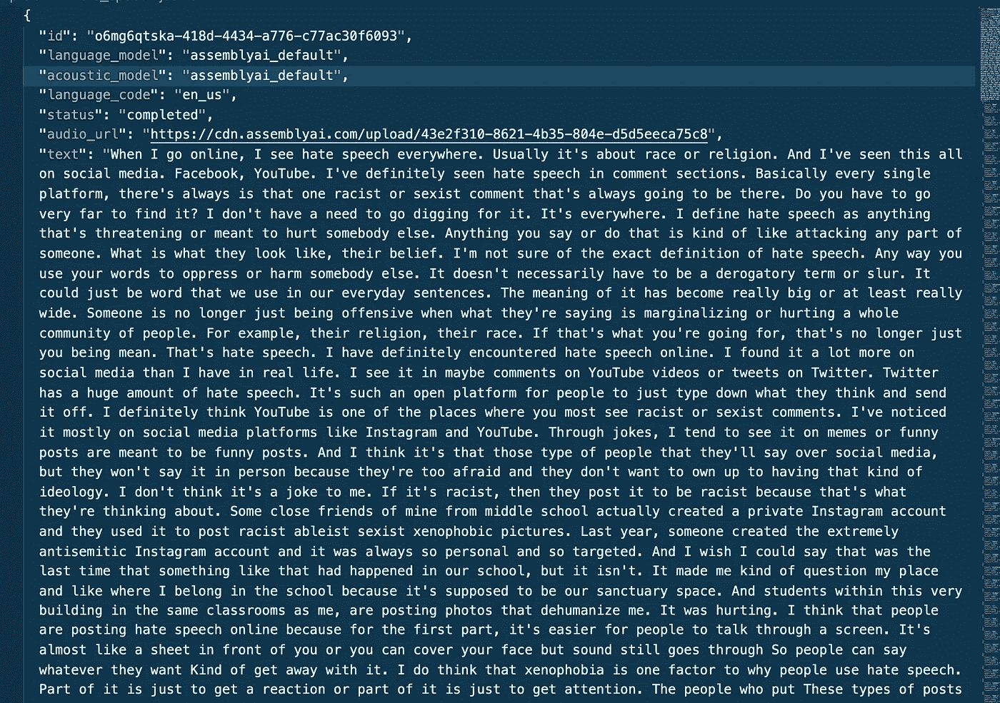
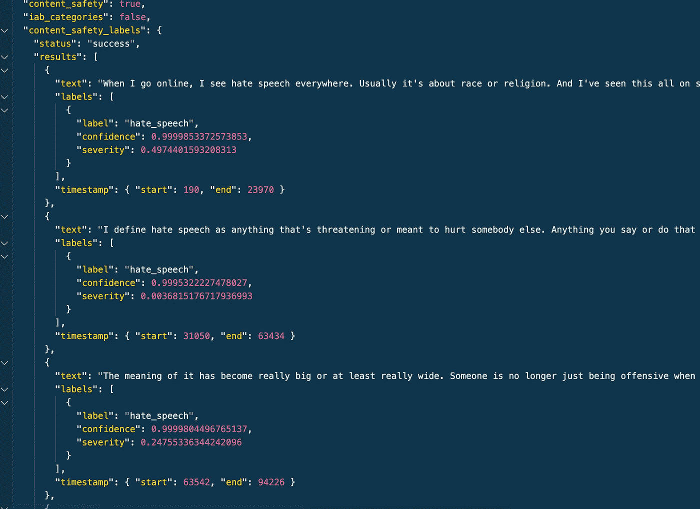

# 如何使用 Python 和 AssemblyAI 调节音频数据

> 原文：<https://towardsdatascience.com/how-to-moderate-audio-data-using-python-and-assemblyai-a5eab9910730>

## 一个超越转录的特征


杰森·罗斯韦尔在 [Unsplash](https://unsplash.com?utm_source=medium&utm_medium=referral) 上的照片

在我之前的[博客文章](/how-to-transcribe-and-analyze-audio-files-with-python-and-assemblyai-22660dbf8e66)中，我浏览了 AssemblyAI API，涵盖了它的一些有趣特性，并展示了如何将其嵌入到 Streamlit 应用程序中，以便转录 Youtube 视频并自动检测其中的关键时刻(感兴趣吗？代码可在 [Github](https://github.com/ahmedbesbes/assemblyai) 上获得。

如果你不熟悉 AssemblyAI，我鼓励你看看这篇文章。

但用几句话概括一下，AssemblyAI 是一个最先进的语音到文本 API，它不仅转录音频文件，还提供人工智能驱动的算法来理解转录本并从中获得洞察力。

> ***在本帖中，我们将把*音频内容调节*作为这些人工智能支持的功能之一。***
> 
> 我们会明白适度意味着什么，以及为什么它对互联网公司真的很重要。然后，我们将看到 AssemblyAI 如何从音频的角度解决这个问题:我们将检查代码，并一如既往地将其应用于特定的用例。

事不宜迟，让我们开始吧！🏊

# 内容适度—为什么很重要？

随着互联网不断增加用户生成的内容，如脸书帖子、Youtube 视频、抖音短片等，控制和调节这些数据的需求对于保护用户变得至关重要。

内容审核是每个平台都要处理的一项严肃任务，有时还会遇到困难:从检测 Youtube 视频中的色情内容，到检测 Twitter 上的仇恨言论，再到发现论坛中的脏话。

但内容审核可能更加微妙，因此可能适用于其他环境:确保视频在政治上中立，删除儿童节目中的酒精或赌博等敏感话题，监管教育平台的内容，评估客户和公司之间的互动，检测广告，显然还有更多。

如果你管理一个内容平台，无论是社交网络、儿童教育网站、企业论坛还是客户支持渠道，你都可能希望以某种形式使用内容审核。

如果您希望调节的数据是音频或视频格式，AssemblyAI 可以帮助您解决这个问题。

# AssemblyAI 如何处理内容审核？

如果您想使用内容审核特性，您必须将 `**content_safety**`参数添加到 POST 请求的头中，并将其值设置为`**True**`。不要担心，我们将在下面的代码部分介绍这一点。

将此标志设置为`**True**`将告诉 API 检查是否提到了以下一些话题。



作者截图

该列表实际上更长，甚至包括以下主题:

*   恐怖主义和武器
*   敏感的社会问题
*   亵渎
*   NSFW 内容

当 AssemblyAI 在音频文件中发现其中一个主题时，它会赋予它一个**置信度得分**和**严重性得分**，以及原始文件中相应的时间戳。

这里有一个例子:

*   一个**置信度得分**是一个介于 0 和 1 之间的浮点数。它表示算法在检测给定对象时的置信度。可以解释为概率得分。高置信度表示该算法对其预测非常有把握。
*   严重性分数**也是一个介于 0 和 1 之间的浮点数。反映出讨论的话题有多严肃和激烈。例如，自行车撞车和飓风都是事故，但前者远没有后者严重。**

# 内容适度和严重性分数的实际使用案例

如果你关注美国和世界最近发生的事情，你可能已经注意到仇恨言论和仇恨犯罪充斥着新闻。

由于已经创建了许多 Youtube 内容来讨论这一全球性问题，我认为挑选一个视频示例并通过 AssemblyAI 来检查内容审核算法的行为会很有趣。

在这篇文章中，我决定分析下面这个视频，在这个视频中，青少年分享了他们在互联网上被仇恨言论和骚扰的经历。

AssemblyAI 可能会很容易地用仇恨言论标记这个视频。

但是它赋予每个标记部分的严重性分数是多少呢？它提供了一些见解吗？

这就是有趣的地方。让我们开始吧。

> *如果你想重现下面的步骤，你需要一个 AssemblyAI 账户。无需输入信用卡，您可以免费创建一个*<https://app.assemblyai.com/signup>**。**

*我将把这一节分成几个小部分，这样您就可以理解并轻松地重新运行代码。*

## *👉从 Youtube 视频下载音频*

*我们首先从下载 Youtube 视频的音频文件开始。我们可以通过编程的方式做到这一点，所以没有必要去网上使用一些可疑的网站。*

*你可以通过安装 **Pytube 包非常容易地做到这一点。***

```
***pip install git+**[**https://github.com/baxterisme/pytube**](https://github.com/baxterisme/pytube)*
```

*接下来你要做的就是导入`Youtube`类，给它传递视频的 URL，提取音频流并通过提供输出文件夹调用下载方法。*

*如果您运行这个脚本，您将得到以下输出:*

**

*作者截图*

## *👉上传音频文件到 AssemblyAI*

*在转录之前，AssemblyAI 需要通过 URL 访问音频文件。我们可以上传我们在 S3 的文件并提供一个链接，但是为了这个教程，我们将直接上传文件到 AssemblyAI 服务器。*

*为了能够上传一个音频文件到 AssemblyAI，我们需要使用 API 密匙。*

*但是首先，让我们把它从代码中隐藏起来，放在一个`.env`文件中。*

```
***API_KEY=<YOUR API KEY GOES HERE>***
```

*然后我们将使用`**python-dotenv**`包将其作为环境变量加载。*

```
***pip install python-dotenv***
```

*现在，要上传一个文件，推荐的方法是首先将它分成每个 5MB 的块，并将这些块放入一个生成器中，我们将这些块作为数据负载传递给查询:这就是下面的脚本所做的。*

*`**read_file**` 函数负责分割文件，`**upload**`函数负责发送 POST 请求。*

*如果您运行此代码，您将获得上传 URL。*

**

*作者截图*

## *👉提交转录作业*

*一旦获得上传 URL，就可以用它向 AssemblyAI 提交转录作业。*

***激活内容审核发生在这一步。***

*为此，您必须将`**content_safety**`参数设置为`**True**`，并将其作为 JSON 有效负载传递给查询。*

*提交作业后，它将通过一个队列，您将获得一个重新传输 id。*

*您不会立即得到结果，因为转录是一个 ***异步任务。****

**

*作者截图*

## ***👉获取转录***

*一旦转录完成(您可以随时从[界面](https://app.assemblyai.com/processing-queue)检查处理队列)，您可以使用转录 id 并获取结果。*

*这是一个稍微不同的端点上的简单 GET 请求。*

*如果您运行这段代码，您将获得以下 JSON 输出——您可以查看 AssemblyAI [文档](https://docs.assemblyai.com/)来了解这些字段。*

**

*这是输出文本。你可以自己查一下:转录质量惊人。*

**

*现在，如果你仔细观察，你会注意到一个`**content_safety_labels**`键，它包括视频中被标记为`hate_speech`的不同部分。*

*每个部分都由相应的文本、分类标签以及置信度和严重性分数来表示。*

**

## *👉解释严重性分数*

*我并不惊讶 AssemblyAI 在整个文本中发现了仇恨言论。这显然是视频的中心话题。*

*然而，我发现有趣的是严重性分数。让我们来看看。*

*下面是音频中被标记为**高严重性分数**的部分:*

*这是另一个被标记为**低严重性分数的问题。***

*在两个片段中，置信度得分都很高。*

*但是，由于讨论主题的方式不同，严重性分数也不同。*

*   *第一部分(高度严重)分享了一些青少年在网上面临反犹太主义和仇恨言论时的痛苦和苦难的戏剧性个人经历。*
*   *第二部分(低严重性)更加中性。发言的少年给出了他所看到的仇恨言论的正式定义。*

*严重性分数是一个有趣的指标，您可以使用它来确定您希望分析和管理的部分的优先级。它帮助你放大关键的部分，丢弃那些更中性的部分。*

*如果你想玩代码，可以在 [Github](https://github.com/ahmedbesbes/assemblyai) 上找到。*

# *参考资料:*

*   *[https://www.assemblyai.com/blog](https://www.assemblyai.com/blog)*
*   *[https://docs.assemblyai.com/](https://docs.assemblyai.com/)*

# *感谢阅读🙏*

*如果您已经做到这一步，我想感谢您的时间，并希望我已经阐明了 AssemblyAI 的内容审核特性。*

*您可以在不同的上下文中使用内容审核来管理数据，也可以通过将它用作主题建模工具来重新调整它的用途。*

*今天就这些了。下次见！👋*

# *新到中？您可以每月订阅 5 美元，并解锁各种主题的无限文章(技术、设计、创业……)。您可以通过点击我的推荐链接[来支持我](https://ahmedbesbes.medium.com/membership)*

*<https://ahmedbesbes.medium.com/membership>  

由 [Unsplash](https://unsplash.com?utm_source=medium&utm_medium=referral) 上的 [Karsten Winegeart](https://unsplash.com/@karsten116?utm_source=medium&utm_medium=referral) 拍摄*