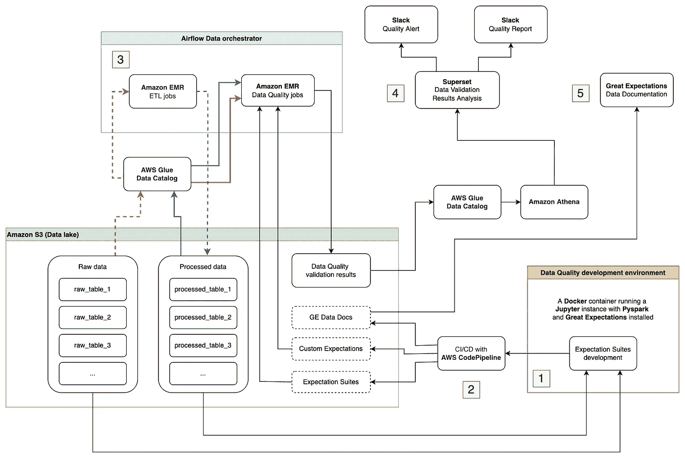
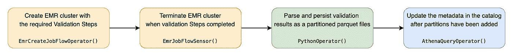
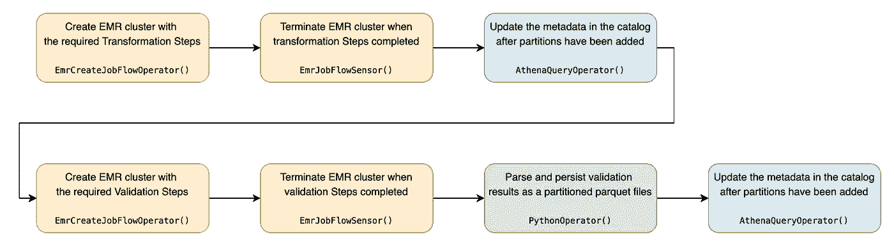
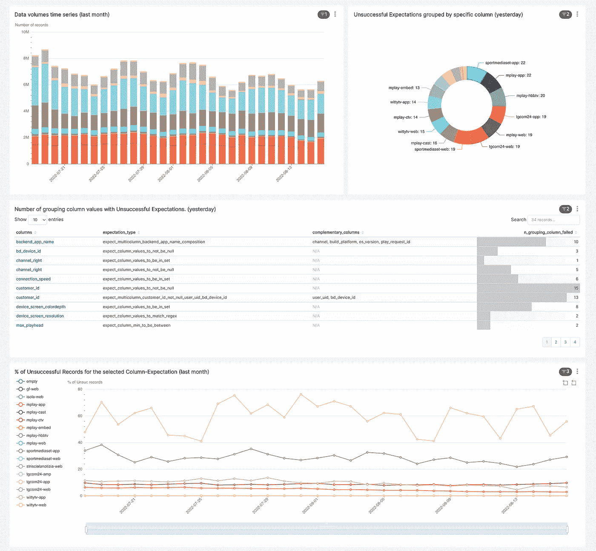

# 如何大规模监控数据湖的健康状况

> 原文：<https://towardsdatascience.com/how-to-monitor-data-lake-health-status-at-scale-d0eb058c85aa>

## 配套的 GitHub 库:【Spark 手把手的远大前程

## 带着巨大的期望和火花构建数据质量工作流

由[马库斯·温克勒](https://unsplash.com/@markuswinkler)在 [Unsplash](https://unsplash.com/) 上拍摄

## 介绍

在 [Mediaset](https://www.mfemediaforeurope.com/en/) ，数据湖是每个想要获得一些公司见解或激活数据的人日常使用的基本工具。

根据定义，**数据湖**是"*一个集中的存储库，可以存储任何规模的所有结构化和非结构化数据。您可以本地存储来自源的数据，而不必在运行时转换它们。这允许您保留大量的原始数据，您可以在以后使用不同类型的分析来激活这些数据。*

访问数据湖的 Mediaset 员工数量正在上升，随着数据湖的增长，我们接收和保存的产品和数据的数量也在增加。随着用户和归档数据量的增加，管理数据湖的复杂性也在增加。

这是一个关键点，事实上，如果没有实现数据质量和数据治理系统，数据湖可能会变成一个**数据沼泽**:*一个没有组织和精确元数据的数据存储，以使检索变得容易* " ( [Integrate.io](https://www.integrate.io/blog/turning-your-data-lake-into-a-data-swamp/#:~:text=A%20data%20swamp%20is%20essential,gathered%20and%20dumped%20into%20storage.) )。

数据沼泽可能会很快出现，并给希望实施高级分析解决方案的数据驱动型公司带来问题。如果对数据进行严密管理，并执行持续的数据健康状态检查，Data Lake 有可能为公司提供一个准确的、改变游戏规则的业务洞察工具。

> 全面控制数据湖中的持久数据，并知道会从数据湖中得到什么，以防止它变成数据沼泽，变得越来越重要和相关。

为此，我们实施了数据质量工作流，以支持不同的业务部门完成数据验证的高要求任务，跟踪数据运行状况、漂移和异常情况。这有助于人们不断评估摄取的和转换的数据，增强数据的可靠性和数据驱动产品的总体质量。

该工作流是围绕开源框架 [Great Expectations](http://helps data teams eliminate pipeline debt, through data testing, documentation) (GE)构建的，该框架将自己定义为“*一个共享的、开放的数据质量标准，帮助数据团队始终知道对新数据有什么期望。*“GE 是一个 python 包，它使我们能够编写测试并评估数据质量。它的简单性和可定制性允许我们轻松地将其与 ETL 管道集成，以验证我们从输入和输出数据中期望的得到满足。

在本文中，我们介绍了 Mediaset 的数据质量工作流的体系结构。我们列出了促使我们构建它的关键点以及整个涉及的技术堆栈。

# Mediaset 的数据湖:一个实际的用例

Mediaset 是意大利和西班牙领先的私营电视出版商，是真正的观众领导者，拥有五个公共网络和 30 多个免费和付费主题频道。

每天，数百万人观看视频点播和直播，阅读文章，收听 Mediaset 服务提供的广播节目。人们通过不同的设备与媒体集属性进行交互:智能手机、网络浏览器、智能电视和互联网电视。所有这些视频浏览量、页面浏览量和点击量都来自 Mediaset 系统，以了解我们的客户(*那些接受简介的客户*)喜欢看、读和听什么，并提高产品的总体质量。

在过去几年中，Mediaset 决定投入资源设计和构建一个数据湖，以存储用户通过公司提供的几个平台和服务与其设备进行交互时产生的所有数据。

为了勾勒出 Mediaset 工作的总体环境和数量级，我们提供了由*Mediaset Business Digital(MBD)*提供的摘要信息，该业务部门负责客户开发、数据接收和第一层数据转换的提供:

*   媒体集数据湖每天存储约 100 千兆字节的客户端生成的原生数据及其与媒体集属性和平台(流媒体平台、新闻网站、博客和电台)的交互；
*   获取几种类型的数据:点击流、页面浏览量、视频浏览量、视频播放器互动、营销活动结果、服务台票证、社交媒体反馈等等；
*   数据湖存储从客户端获取的原始数据和 ETL 管道的输出，由业务和数据分析师用于数据探索任务，由数据科学家用于机器学习模型训练；
*   从第一天起，当一个新的平台、服务或资产出现时，数据就存储在数据湖中，以后当业务需求精确时再激活它们。

## 大数据，大责任

随着数据湖的发展，存储数据量的增加，以及每天查询和激活数据的人数的增加，控制数据湖健康状态的必要性开始出现。

更具体地说，*遇到的临界点有四个*:

1.  验证已发布的客户端(移动应用程序、智能电视应用程序和网站)正在正确跟踪所有事件(点击、查看和操作)，因此存储在数据湖中的所有数据都是正确和可信的。否则，必须将任何发现的问题通知开发团队，以便尽快解决。
2.  扩展 ETL 管道单元测试，检查实现的转换是否返回您期望的输出。
3.  监控所有管道或所有服务是否启动并运行，跟踪每天的数据量变化。
4.  检测机器学习模型中涉及的数据集中的数据漂移或数据退化，防止错误预测或误导性预测。

> 这些要点促使 Mediaset 业务数字部门开发了一个能够监控数据湖健康状态的数据质量工作流程。

这个过程中涉及的主要工具是 [Great Expectations](https://greatexpectations.io/) (GE)，它提供了采用 Spark 作为执行引擎的可能性，非常适合当前的 Mediaset 数据堆栈。GE 也是一个开源项目，拥有巨大的社区支持，被设计成可扩展和完全可定制的。

# 数据质量工作流概述

> **注意**:这不是一个“远大前程简介”教程，而是我们实现的监控数据湖健康状态的架构的概述，以及我们如何使用 GE 来完成这项任务。

该工作流已经开发并与基于 Amazon Web Services (AWS)的当前媒体集数据堆栈集成。涉及的主要服务有:

*   ***亚马逊 S3:“***一种对象存储服务，提供业界领先的可扩展性、数据可用性、安全性和性能***”(***[AWS](https://docs.aws.amazon.com/AmazonS3/latest/userguide/Welcome.html))***)。这是中央数据湖存储器，所有接收和转换的数据都存储在这里。***
*   ***AWS Glue Data Catalog:“***提供了跨多种数据源和数据格式的统一元数据库。它提供了与亚马逊 S3、亚马逊雅典娜和亚马逊 EMR 的开箱即用集成”( [AWS](https://docs.aws.amazon.com/athena/latest/ug/glue-faq.html#faq-benefits) )。
*   ***亚马逊 EMR:“***一个托管集群平台，简化在 AWS 上运行大数据框架，如 Apache Spark，以处理和分析海量数据”( [AWS](https://docs.aws.amazon.com/emr/latest/ManagementGuide/emr-what-is-emr.html) )。Amazon EMR 代表了 MBD 单元所采用的 ETL 工作的领先 AWS 服务；这与作为数据协调器的 Airflow 相结合，使我们能够开发和安排日常转换例程。
*   ***亚马逊 Athena:*** “一种交互式查询服务，可以使用标准 SQL 轻松分析存储在亚马逊 S3 的数据”( [AWS](https://docs.aws.amazon.com/athena/latest/ug/what-is.html) )。

数据质量工作流架构(图片由作者提供)

实施的数据质量工作流程(参见上述架构)包括五个步骤。

## **1。数据质量套件开发**

一切都从这里开始，从本地开发环境开始，这允许你开发 GE 称之为 [*的期望套件*](https://docs.greatexpectations.io/docs/reference/expectations/#expectation-suites) ，一组规则([期望](https://docs.greatexpectations.io/docs/reference/expectations/))描述你对数据集的期望。该环境由一个 Docker 映像组成，该映像运行一个带有 PySpark 的 Jupyter notebook 实例和您需要的所有 python 包。一旦您获得了想要评估的数据子集(原始数据或经过处理的数据)，您就可以在笔记本上编写数据必须满足的所有期望，并以 JSON 文件的形式生成期望套件。

基于 docker 的开发环境也在[定制期望](https://docs.greatexpectations.io/docs/terms/custom_expectation)开发期间支持你；您可以使用 Docker 映像作为远程 python 解释器，在您最喜欢的 IDE 中对所有期望进行编码和测试。

开发定制期望的可能性代表了 GE 为我们的工作流程提供的最重要的特征之一。这些类型的期望确实允许我们测试甚至是最复杂的多列条件，给予细致的数据验证。

> **奖金**:检查[仓库](https://github.com/MDS-BD/hands-on-great-expectations-with-spark/tree/master/data_quality/custom_expectations)中三个定制期望类型的代码:单列、对列和多列。它还包括单元测试以及使用 PyCharm 使用所提供的 Docker 映像运行它们的步骤。

## **2。套件部署**

一旦套件准备就绪(*文档化和测试*)，提交到 git 存储库的主分支将触发一个持续集成管道，该管道将编译好的期望套件和所有定制的期望 python 模块复制到一个 S3 桶中。CI 管道还负责生成最新的 GE 数据文档，并将其存储在专用的 S3 存储桶中。

## **3。数据验证运行**

是时候真正评估这些数据有多好了。如上所述，我们采用 Airflow 作为数据编排器，其中我们实现了几个数据质量 Dag。详细来说，*对于原始数据，我们有专门运行验证作业*的专用 DAG(这种 DAG 涉及的`Operators`和`Sensors`的顺序见下图)；

验证原始数据质量的气流 DAG 结构(图片由作者提供)

在*处理数据时，我们将验证气流任务附加到转换任务*(见下图)以使整个处理层保持一致:如果转换生成质量较差的数据，我们会收到警报，以便我们可以中断所有后续任务(见步骤 4)。

验证处理数据质量的气流 DAG 结构(图片由作者提供)

验证作业获取先前开发和部署的期望套件和定制期望作为输入。数据验证输出是一个 JSON 文件，在 S3 上以原始格式存储后，通过气流`PythonOperator`进行解析，并作为分区的拼花文件保存在数据湖中。最后，AWS Glue 数据目录中的元数据用新的分区进行了更新，使得数据质量验证结果可以用 Amazon Athena 进行查询。

> **额外收获**:在配套的[资源库](https://github.com/MDS-BD/hands-on-great-expectations-with-spark/tree/master/data_quality)中，你可以找到一个现成的“验证你的数据”作业，你可以快速**运行它来模拟我们在这一步用 Amazon EMR** 实现的东西(即 Docker 容器运行一个`spark-submit`命令来执行数据验证 python 模块)。

## **4。数据验证结果分析**

我们决定将 [Apache 超集](https://superset.apache.org/)集成到数据质量工作流中，以探索验证结果，并使其可视化尽可能有影响力。Superset 是一个开源的数据探索和可视化平台，能够连接到现代数据库(包括 Amazon Athena)，易于掌握，内置丰富的可视化情节。由于其简单性，超集使我们能够专注于核心任务，例如设计定制指标和通过交互式仪表板可视化见解来评估我们的数据质量，而不是工具本身(参见下面的截图以获得样本超集数据质量仪表板)。

用于评估数据的指标示例如下:

*   数据量
*   不成功的期望百分比
*   至少有一个不成功预期的所有列的列表
*   每列的*错误*记录的百分比
*   第一个 *n* 预期不成功的每列的意外值。

超集最后提供了两个对工作流有用的关键特性:

*   ***警报*** 在达到 SQL 条件时被触发，发送一个关于 Slack 的通知或电子邮件。您可以为您想要监控的 KPI 设置阈值(*，例如，“今天和昨天运行之间的不成功预期数的变化必须低于 10%”，*，当条件不满足时，将发送通知警报。
*   ***报告*** *按计划发送，允许您分析与上周*相关的验证结果，以更有条理、更清晰的方式传达结果。

“超集数据质量仪表板”的示例—仪表板由以下部分组成:a) *左上角的*数据量直方图，按媒体集属性分组；b)在右上角的环形图上，显示每个媒体集属性的不成功预期数；c)对于每个数据集列，列出不成功的期望、用于评估被检查列的补充列(在多列期望的情况下)以及有问题的属性的数量的表格；d)折线图，按属性分组，显示所选列的每日(上个月)不成功记录的百分比-期望值。(图片由作者提供)

## **5。数据文件**

该工作流程的最后一步是发布数据文档网站，该网站之前由 Great Expectations 通过 CI pipeline 触发器生成。Data Docs 包含属于每一列的所有期望的完整列表，以及由表和套件组织的已实现规则的描述。除了为每个期望套件提供文档外，【Great Expectations Data Docs 还允许我们与非技术人员分享为每个表开发的检查，从而更容易讨论可能的和未来的套件增强。

## 结论

在本文中，我们向您展示了基于 Great Expectations 实现的工作流，它赋予 Mediaset 持续监控数据湖健康状态的能力。这防止了数据湖变成数据沼泽，保持了数据的高可靠性，提高了所有涉及数据的项目的质量。

一旦部署了数据质量工作流程，不同 Mediaset 业务部门的开发人员只需专注于 Expectation Suites 开发和(*显然是*)数据质量警报和报告分析。

本地开发环境为所有业务单元提供了一个舒适的地方来开发它们的套件，因此，在监视它们权限内的数据时是独立的。每个业务单位都能够拒绝自己的需求，并通过本地和定制的期望使它们达到更高的期望。

开发环境结合了云的能力和弹性，以及 EMR 等服务，允许在任何规模上应用期望，包括原始数据和处理后的数据，主动监控我们每天摄取并保存在我们心爱的数据湖中的内容。在这种情况下，EMR 集群的成本将取决于您想要评估的数据集的大小、套件中包含的预期数量以及已经实现的自定义预期的复杂性。

*套件中所有控件的组织-每表*，以及数据文档的自动生成，为所有用户提供了一种简单的方式来检查期望套件所覆盖的表的列表，并查阅为每一列实现的逻辑。

最后，可视化工具允许数据验证结果分析民主化，使得那些希望在使用数据之前对表或数据湖进行状态检查的非技术人员也可以访问这些结果。

感谢您阅读我们的作品！
如果您有问题或反馈，请随时给我发送[连接](https://www.linkedin.com/in/davideromano90/)。

## 承认

感谢来自 Mediaset 的 [Nicola](https://www.linkedin.com/in/nicola-saraceni-9228b0127/) 、 [Daniele](https://www.linkedin.com/in/daniele-c-367b904/) 、 [Fabio](https://www.linkedin.com/in/fabiomelen/) 、来自 Coveo 的 [Jacopo](https://www.linkedin.com/in/jacopotagliabue/) 和来自 Tecton 的 [Danny](https://www.linkedin.com/in/danny-chiao/) 对本文和 Github 资源库的评论和建议。

## 参考

*   什么是数据湖？—亚马逊网络服务(AWS)。[https://AWS . Amazon . com/big-data/data lakes-and-analytics/what-a-data-lake/](https://aws.amazon.com/big-data/datalakes-and-analytics/what-is-a-data-lake/)
*   把你的数据湖变成数据沼泽| integrate . io .[https://www . integrate . io/blog/turning-Your-Data-Lake-Into-a-Data-Swamp/](https://www.integrate.io/blog/turning-your-data-lake-into-a-data-swamp/)
*   什么是亚马逊 S3？—亚马逊网络服务(AWS)。
    [https://docs . AWS . Amazon . com/Amazon S3/latest/user guide/welcome . html](https://docs.aws.amazon.com/AmazonS3/latest/userguide/Welcome.html)
*   升级到 AWS Glue 数据目录— Amazon Athena。[https://docs.aws.amazon.com/athena/latest/ug/glue-faq.html](https://docs.aws.amazon.com/athena/latest/ug/glue-faq.html)
*   什么是亚马逊 EMR？—亚马逊网络服务(AWS)。
    [https://docs . AWS . Amazon . com/EMR/latest/management guide/EMR-what-is-EMR . html](https://docs.aws.amazon.com/emr/latest/ManagementGuide/emr-what-is-emr.html)
*   亚马逊雅典娜是什么？—亚马逊网络服务(AWS)。
    [https://docs.aws.amazon.com/athena/latest/ug/what-is.html](https://docs.aws.amazon.com/athena/latest/ug/what-is.html)