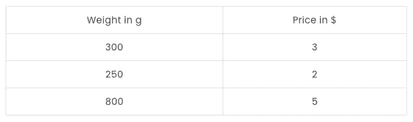
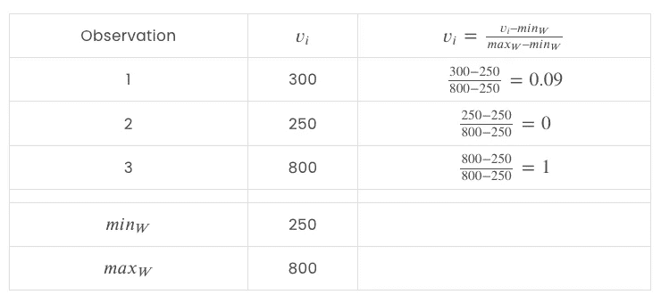
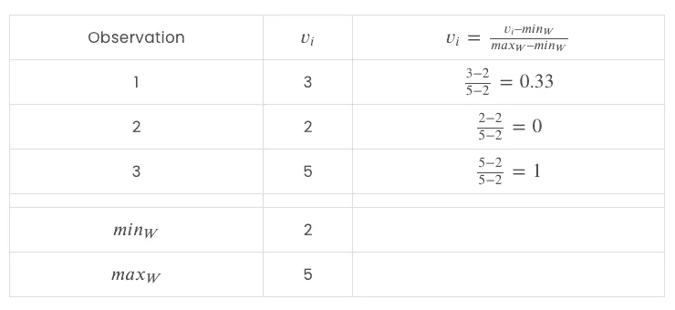
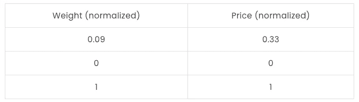
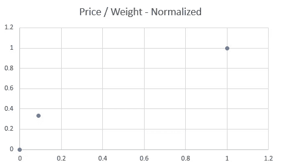

# 如何在 Python 中规范化数据

> 原文：<https://towardsdatascience.com/how-to-normalize-data-in-python-bfde370ca4b6>

## 在本文中，我们将探索如何在 Python 中规范化数据


[Marcin Jozwiak](https://unsplash.com/@marcinjozwiak?utm_source=unsplash&utm_medium=referral&utm_content=creditCopyText) 在 [Unsplash](https://unsplash.com/s/photos/distribution?utm_source=unsplash&utm_medium=referral&utm_content=creditCopyText) 上拍摄的照片

**目录**

*   介绍
*   什么是正常化
*   标准化示例
*   如何在 Python 中规范化数据
*   结论

# 介绍

许多机器学习模型的特征工程的第一步是确保数据被适当地缩放。

一些模型，如线性回归、KNN 和 SVM，会受到不同比例要素的严重影响。

而诸如决策树、bagging 和 boosting 算法之类的其他算法通常不需要任何数据缩放。

特征比例对上述模型的影响程度较高，并且具有较大范围值的特征将在算法决策中发挥更大的作用，因为它们产生的影响对输出具有更大的影响。

在这种情况下，我们转向特征缩放，以帮助我们找到所有这些特征的共同水平，以便在训练模型时平等地评估。

两种最流行的特征缩放技术是:

1.  [Z 分数标准化](https://pyshark.com/how-to-standardize-data-in-python/)
2.  最小-最大归一化

在本文中，我们将讨论如何使用 Python 执行数据的最小-最大规范化。

为了继续学习本教程，我们需要以下两个 Python 库:sklearn 和 pandas。

如果您没有安装它们，请打开“命令提示符”(在 Windows 上)并使用以下代码安装它们:

```
pip install sklearn
pip install pandas
```

# 什么是正常化

在统计学和机器学习中，数据的最小-最大归一化是将原始数据范围转换为 0 到 1 之间的范围的过程。

产生的归一化值代表 0-1 范围内的原始数据。

这将允许我们一起比较多个特征，并获得更多相关信息，因为现在所有数据将处于相同的比例。

在最小-最大归一化中，对于每个要素，其最小值被转换为 0，最大值被转换为 1。基于相对于要素的最小值和最大值的原始值，介于两者之间的所有值都被缩放到 0-1 范围内。

假设你有一个数字数组 *A = [v_1，v_2，…，v_i]* 。

我们先来求数组的最小值和最大值: *min(A)* 和 *max(A)* 。

然后，使用最小值和最大值，我们将使用以下公式将每个原始值 *v_i* 转换为最小-最大归一化值*v’_ I*:


图像由

# 标准化示例

在这一节中，我们将看一个简单的数据规范化的例子。

考虑以下具有不同苹果价格的数据集:



作者图片

绘制数据集应该是这样的:


作者图片

在这里，我们看到重量与价格相比有更大的变化，但看起来是这样，因为数据的不同尺度。

价格范围在 2 美元到 5 美元之间，而重量范围在 250 克到 800 克之间。

让我们将这些数据正常化！

从重量特征开始:



作者图片

并对价格功能进行同样的操作:



作者图片

并将这两个特征组合成一个数据集:



作者图片

我们现在可以看到，数据集中要素的比例非常相似，并且在可视化数据时，点之间的分布会更小:



作者图片

该图看起来几乎相同，唯一的区别是每个轴的比例。

现在让我们看看如何使用 Python 重现这个例子！

# 如何在 Python 中规范化数据

让我们首先创建一个我们在上面的例子中使用的数据帧:

您应该得到:

```
 weight  price
0     300      3
1     250      2
2     800      5
```

一旦我们准备好数据，我们就可以使用 **MinMaxScaler()** 类及其方法(来自 sklearn 库)来规范化数据:

您应该得到:

```
[[0.09090909 0.33333333]
 [0\.         0\.        ]
 [1\.         1\.        ]]
```

如您所见，上面的代码返回了一个数组，所以最后一步是将其转换为 dataframe:

您应该得到:

```
 weight     price
0  0.090909  0.333333
1  0.000000  0.000000
2  1.000000  1.000000
```

这与我们手动计算的示例中的结果相同。

# 结论

在本教程中，我们讨论了如何在 [Python](https://www.python.org/) 中规范化数据。

数据标准化是许多机器学习算法中数据预处理的重要步骤。

这通常是一个必需的预处理步骤，用于缩放输入数据中要素的范围，以确保范围较大的要素不会通过影响距离度量来消除模型的所有可解释性。

是否对数据进行规范化的决定主要取决于您正在构建的模型，因为有些模型很容易受到数据范围的影响(OLS、SVM 等)，而有些模型则不受影响(逻辑回归、基于树的模型等)。

如果你有任何问题或对一些编辑有建议，请随时在下面留下评论，并查看更多我的[机器学习](http://pyshark.com/category/machine-learning)文章。

*原载于 2022 年 5 月 5 日 https://pyshark.com**的* [*。*](https://pyshark.com/how-to-normalize-data-in-python/)