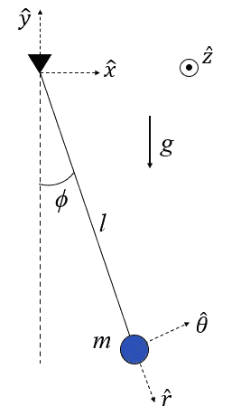
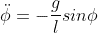
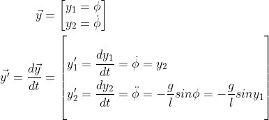
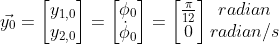
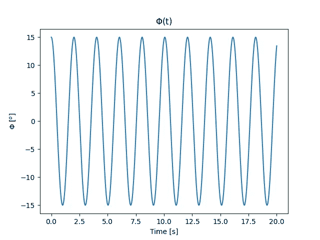
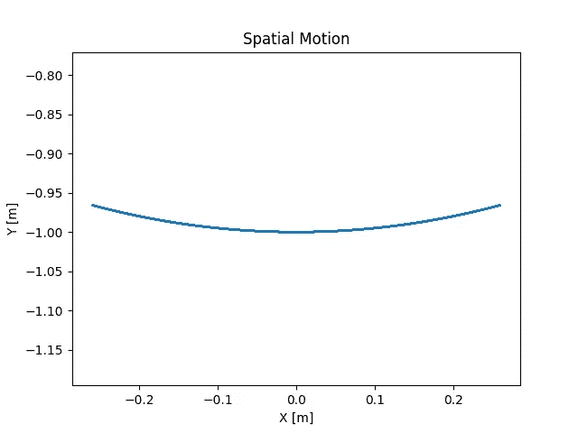

# 使用 Python 进行数值积分

> 原文：<https://towardsdatascience.com/how-to-numerically-integrate-dynamics-problems-w-python-85d9783aa088>

## Python 中数值积分方程和可视化结果的简单方法


阿诺·弗朗西斯卡在 [Unsplash](https://unsplash.com?utm_source=medium&utm_medium=referral) 上的照片

无论你是工程师、物理学家，还是一个动力学爱好者，你都有可能接触过常微分方程形式的运动方程。对于那些不熟悉的人来说，常微分方程是由一个独立变量的一个或多个函数及其导数组成的方程。在动力学问题中，独立变量通常是时间，或 *t* ，方程通常与目标质量的位置、速度和加速度相关。

虽然解析求解具有挑战性，而且通常是不可能的，但使用数值方法可以以很高的精度近似求解常微分方程。在计算机时代之前，这是一项艰巨的任务，但我们已经走过了漫长的道路，所以不要担心。现在，大多数编程语言都有可用的 ODE 解算器。通常，他们甚至有不止一个解算器，所以不缺少选项。Python 本身有许多选项可供选择，但是在本演示中我们将集中讨论其中一个。



单摆问题[图片由作者提供]

在整篇文章中，我们将使用单摆作为例子来指导我们完成这个过程。质量 *m* (见下面的方程)的运动方程相对简单，所以它可以作为一个很好的例子。然而，代码的原理对于所有的运动方程都是一样的，所以你可以用它来解决各种各样的问题。



如果你对这个方程是如何推导出来的感兴趣，请阅读下面的链接。

[](https://medium.com/@zackfizell10/using-lagrangian-mechanics-to-solve-dynamics-problems-663460cbf94e) [## 如何利用拉格朗日力学解决动力学问题

### 一个优雅简单的一步一步的过程来解决保守动力学问题

medium.com](https://medium.com/@zackfizell10/using-lagrangian-mechanics-to-solve-dynamics-problems-663460cbf94e) 

在我们深入研究代码之前，最好先了解一下 ode 求解器是如何工作的。在这个特殊的例子中，我们要解决一个初值问题，或者说 IVP。对于 IVP，ODE 求解器从初始时间和初始条件开始(稍后将介绍)，逐步通过一个时间间隔，并在每个时间步长计算一个解。这是一个高层次的解释，所以如果你想了解更多，我鼓励你做你的研究。

常微分方程求解器要求我们的运动方程建立为一个一阶微分方程系统。在当前状态下，由于对 *ϕ* 的二阶时间导数，我们的运动方程是二阶微分方程。为了改变这一点，我们对 *y₁* 和 *y₂* 进行了“变量改变”,将得到两个一阶微分方程。我们的新方程组是:



现在我们有了新的微分方程组，下一步是定义一个起点，或者初始条件。它们采用上述等式中的 *y* 向量的形式。我们还不需要*y’*向量；我们稍后会用到它。我们的初始条件通常是起始位置和速度。在我们的例子中，它是我们的初始角度， *ϕ* ，以及它的角速度。

我们可以任意将角度设置为 15 或π/12 弧度，将角速度设置为 0 弧度每秒(您可以更改这些值，但您的结果将与文章底部的图不同)。我们的 *y* 向量上的下标 0 表示初始时间。



从代码开始，我们需要从 Python 导入必要的包。NumPy 是一个非常强大的 Python 包，用于科学计算。为了便于调用，我们将其定义为 *np* 。此外，我们需要来自 *SciPy* 包的 *odeint* 函数。这将用于对我们的 ode 进行数值积分。最后，我们需要从 *Matplotlib* 中包含 *Pyplot* 来可视化我们解决的系统。和 *NumPy* 一样，为了方便调用，我们将 *Pyplot* 定义为 *plt* 。

```
# Importing Packages
import numpy as np
from scipy.integrate import odeint
import matplotlib.pyplot as plt
```

接下来，我们需要为 *odeint* 函数定义几个参数。在我们的代码中，它有三个输入:模型(或者我们新的一阶微分方程，*y’*向量)，初始条件，以及我们想要积分的时间数组。先定义我们的模型函数， *model(t，y)* 。下面是我们代码中的内容:

*   *g* =重力常数(9.81 米/秒)
*   *l* =无质量杆的长度(1 米)
*   *y* =当前时间步长下我们的角度和角速率的向量(在文章前面定义)
*   *dydt* =矢量 *y* 的时间导数(在文章前面有定义)

```
# Model
def model(y,t):
    g = 9.81
    l = 1 phi = y[0]
    phi_dot = y[1]
    phi_ddot = -g/l*np.sin(phi)
    dydt = [phi_dot, phi_ddot]
    return dydt
```

我们的 *odeint* 函数需要的第二项是我们的初始条件。我们已经说明了这些是什么，所以让我们也说明我们感兴趣的时间间隔。假设我们想观察摆的质量在 20 秒内的表现。我们可以使用来自 *NumPy* ( *np* )的 *linspace* 函数来创建一个从 0 到 20 秒的时间点数组。我使用了 1000 的增量来确保我从 ODE 解算器得到一个平滑的输出。使用的增量越多，结果就越精确。在某种程度上，增量的数量不会带来什么好处，所以在未来的项目中使用它时，请使用您的最佳判断。

```
# Initial Conditions
y0 = [np.pi/12, 0]# Time Array
t = np.linspace(0, 20, 1000)
```

最后，我们只需要用我们的模型、初始条件和时间数组运行 ODE 求解器。我们应该将它设置为等于另一个变量， *sol* ，这样我们就可以使用 *Pyplot* ( *plt* )来操纵可视化数据。我们可以通过索引 *sol* 的第一和第二列的整体(例如，对于第一列 sol[:，0])，来提取我们的角度和角速率时间历史。历史是以弧度为单位的，所以为了更好的理解，我们可以把它转换成度数。

```
# Solving ODE
sol = odeint(model, y0, t)
phi_radians = sol[:, 0]
phidot_radians_s = sol[:, 1]# Converting Radians to Degrees
phi_degrees = phi_radians*180/np.pi
phidot_degrees_s = phidot_radians_s*180/np.pi
```

为了可视化数据，我们可以使用 *plt* 来创建我们感兴趣的数据的图表。使用 *Pyplot* 有很多定制选项，所以如果你不喜欢默认设置，你可以很容易地改变你的线条和绘图的外观。

```
# Plotting Results
plt.plot(t, phi_degrees)
plt.title('$\Phi$(t)')
plt.xlabel('Time [s]')
plt.ylabel('$\Phi$ [$^o$]')
plt.show()

X = np.sin(phi_radians)
Y = -np.cos(phi_radians)
plt.plot(X, Y)
plt.title('Spatial Motion')
plt.xlabel('X [m]')
plt.ylabel('Y [m]')
plt.axis('equal')
plt.show()
```

运行完所有代码后，您的绘图应该如下所示:



角度时间历程[图片由作者提供]



钟摆质量的运动[图片由作者提供]

我们的两个图显示了我们的质量如何在选定的时间间隔内移动。第一张图显示了ϕ在我们的时间间隔内是如何演变的。因为我们看到的是一个没有摩擦力的支点，我们期望质量在最大角度的+/-之间振荡，这个角度恰好是我们的起始角度 15 度(因为我们没有初始角速度)。第二个图显示了质量在 20 秒间隔内的轨迹。直觉上，这个运动是有意义的，所以我们可以合理地假设我们的 ODE 求解器和方程设置正确。

这就是这个例子的全部内容。如果你有任何问题，请随时评论。我非常乐意帮忙。如果这以任何方式帮助了你，请给它一个赞并跟随。谢谢大家！