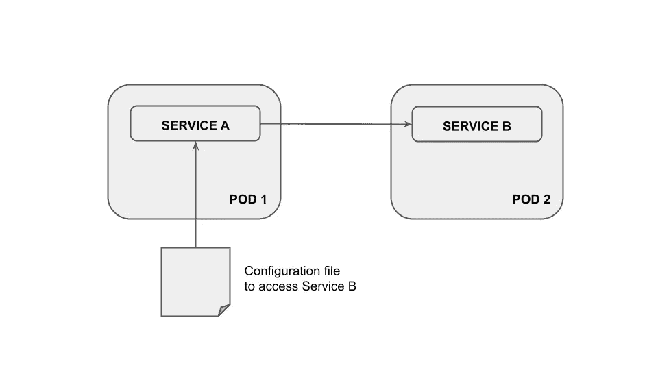

# 如何将配置文件传递给 Kubernetes Pod

> 原文：<https://towardsdatascience.com/how-to-pass-a-configuration-file-to-a-kubernetes-pod-61c1bcd286a5>

## 数据工程

## 使用 Kubernetes ConfigMap 和 Secrets 来存储整个配置文件以在运行时传递给 pod，从而改进您的 DevOps 和 MLOps 项目


照片由[卡里姆·曼吉拉](https://unsplash.com/@karim_manjra?utm_source=medium&utm_medium=referral)在 [Unsplash](https://unsplash.com?utm_source=medium&utm_medium=referral) 上拍摄

Kubernetes 是一个帮助管理容器化应用程序的系统。它可以帮助您扩展应用程序，并确保它们平稳运行。您甚至可以使用 Kubernetes 来改进管理和部署数据科学项目的方式。

使用 Kubernetes 时可能遇到的一个问题是如何在运行时将配置文件传递给 pod。例如，您的 pod 包含一个通过某些凭据连接到外部服务的服务，这些凭据存储在一个文件中，如下图所示:



作者图片

问题是您希望在运行时将配置文件保存到 Pod 1，而不是每次都重建映像。

在本教程中，我将通过一个`ConfigMa` p 或一个`Secret`向你展示如何做到这一点。

文章组织如下:

*   库伯内特斯的`ConfigMap`是什么
*   如何使用`ConfigMap`将配置文件传递给 pod
*   库伯内特斯有什么秘密
*   如何使用`Secret`将配置文件传递给 pod。

# 1 Kubernetes 中的配置图是什么

ConfigMap 是一个 Kubernetes 资源，它允许您将特定于环境的配置数据从容器映像中分离出来。

这确保了您的应用程序可以轻松地在环境之间移动，而不必重新构建容器映像。

此外，使用`ConfigMap`可以帮助您避免在容器映像中硬编码敏感信息，比如数据库密码。

您可以在`.yaml`文件中定义自己的`ConfigMap`，如下所示:

```
apiVersion: v1
kind: ConfigMap
metadata:
  name: my-config-map
data:
  key1 : value1
  key2 : value2
```

您可以使用部署的`.yaml`文件中`ConfigMap`的值。关于`ConfigMap`的更多细节，可以参考 [Kubernetes 官方文档](https://kubernetes.io/docs/concepts/configuration/configmap/)。

# 2 如何使用配置映射将配置文件传递给 pod

您可以使用一个`ConfigMap`来存储一个完整的配置文件，它可以作为一个文件挂载到您的 pod 中。您可以按如下方式进行。

首先，将配置文件添加到您的`ConfigMap` `.yaml`文件中:

```
**apiVersion**: v1
**kind**: ConfigMap
**metadata**:
  **name**: my-config-map
**data**:
  **file.conf**: |
     param1=value1
     param2=value2
     paramN=valueN
```

在前面的例子中，我们已经添加了`file.conf`，它可以存储连接到服务 b 所需的所有参数

现在，您可以在部署中使用`ConfigMap`，如下所示。

```
**apiVersion**: v1
**kind**: Deployment
**metadata**:
  **name**: my-deployment
**spec**:
  **containers**:
     ...
     **volumeMounts**:
     - **name**: config
       **mountPath**: "path/in/the/pod/where/to/mount/the/file"
       **subPath**: file.conf**volumes**:
  - **name**: config
  **configMap**:
    **name**: my-config-map
    **items**:
    - **key**: "file.conf"
    **path**: "file.conf"
```

在`volumeMounts`部分，我们指定了 pod 中挂载文件的路径。我们还可以指定子路径，它只包含要挂载的文件。如果我们省略这一部分，我们可以挂载整个目录。

在 volumes 部分，我们指定了`ConfigMap`使用的细节。`key`标识`ConfigMap`中的名称，而`path`标识要在 pod 中创建的文件的名称。

# 3 库伯内特斯有什么秘密

Kubernetes 中的一个`Secret`是一个包含敏感信息的对象，比如密码、API 密钥和证书。机密用于存储和管理这些敏感信息。

秘密是加密的，只能由需要使用它们的 pod 解密。这确保了只有需要访问敏感信息的 pod 才能这样做。秘密是保持 Kubernetes 集群安全的重要部分。

Kubernetes secrets 使用加密的值，您可以在命令行终端中创建这些值，如下所示:

```
**echo** -n "my_secret" | **base64**
```

然后，您可以将前面操作的结果复制到。`yaml`储存你秘密的文件。您可以在`.yaml`文件中定义自己的`Secret`,如下所示:

```
**apiVersion**: v1
**data**:
  **username**: my_encoded_username
  **password**: my_encoded_password
**kind**: Secret
**metadata**:
  **name**: my_secret
**type**: Opaque
```

您可以使用部署的`.yaml`文件中`ConfigMap`的值。关于`Secret`的更多细节，可以参考 [Kubernetes 官方文档](https://kubernetes.io/docs/concepts/configuration/secret/)。

# 4 如何使用`Secret`将配置文件传递给 pod

传递给 pod 的配置文件可能包含一些敏感的信息，比如用户名和密码。在这种情况下，您不能使用`ConfigMap`来存储数据。相反，你可以使用一个`Secret`。

其原理与`ConfigMap`相同:首先将整个配置文件作为一个秘密存储，然后将其作为一个卷挂载到 pod 中。

这是秘密的代码:

```
---**apiVersion**: v1
**stringData**:
  **file.conf**: |-
     username=demo
     password=my_plain_password
**kind**: Secret
**metadata**:
  **name**: my_secret
**type**: Opaque
```

您会注意到密码没有加密。然而，当你创建这个秘密时，Kubernetes 会为你加密，并以加密对象的形式分发。

当您想要在部署中使用该密码时，请按以下步骤操作:

```
**apiVersion**: v1
**kind**: Deployment
**metadata**:
  **name**: my-deployment
**spec**:
  **containers**:
     ...
     **volumeMounts**:
     - **name**: secret-file
       **mountPath**: "path/in/the/pod/where/to/mount/the/file"
       **subPath**: file.conf**volumes**:
  - **name**: secret-file
  **secret**:
     **secretName**: my_secret
```

# 摘要

恭喜你！您刚刚学习了如何在运行时将配置文件传递给 Kubernetes pod。您可以同时使用配置映射和密码。

当您想要传递通用参数时，配置映射非常有用。相反，如果你想传递明智的信息，你可以使用一个秘密。

如果你读到这里，对我来说，今天已经很多了。谢谢！你可以在这里阅读更多关于我的信息。

# 您可能也对解决以下问题感兴趣:

*   如何删除 Docker 中的图像
*   从基础映像重建映像
*   将一些配置文件传递给 Docker 容器
*   在 linux/arm64 架构上运行 linux/amd64 镜像。

阅读[这篇文章](https://medium.com/syntaxerrorpub/4-docker-options-you-may-not-know-fef301a5ce03)来学习如何进行。

# 您想从媒体社区探索 DevOps 上的其他内容吗？

你可以阅读我的精选列表:


[当归罗杜卡](https://alod83.medium.com/?source=post_page-----61c1bcd286a5--------------------------------)

## DevOps

[View list](https://alod83.medium.com/list/devops-a5077feaa1b5?source=post_page-----61c1bcd286a5--------------------------------)5 stories

# 保持联系！

*   跟着我上[媒](https://medium.com/@alod83?source=about_page-------------------------------------)
*   注册我的[简讯](https://medium.com/subscribe?source=about_page-------------------------------------)
*   在 [LinkedIn](https://www.linkedin.com/in/angelicaloduca/?source=about_page-------------------------------------) 上连接
*   在推特上关注我
*   跟着我上[脸书](https://www.facebook.com/alod83?source=about_page-------------------------------------)
*   在 [Github](https://github.com/alod83?source=about_page-------------------------------------) 上关注我

# 离开前…

你有没有想过用**实验平台**来改进你的 DevOps 系统？你可以在这里学习怎么做:)