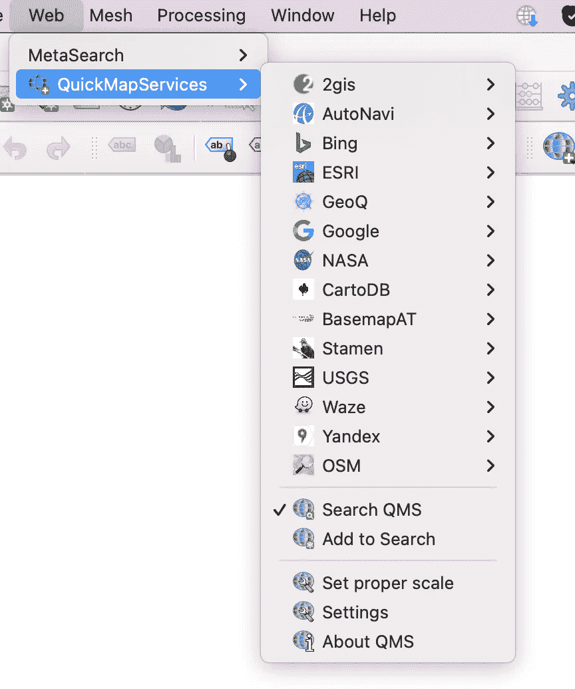
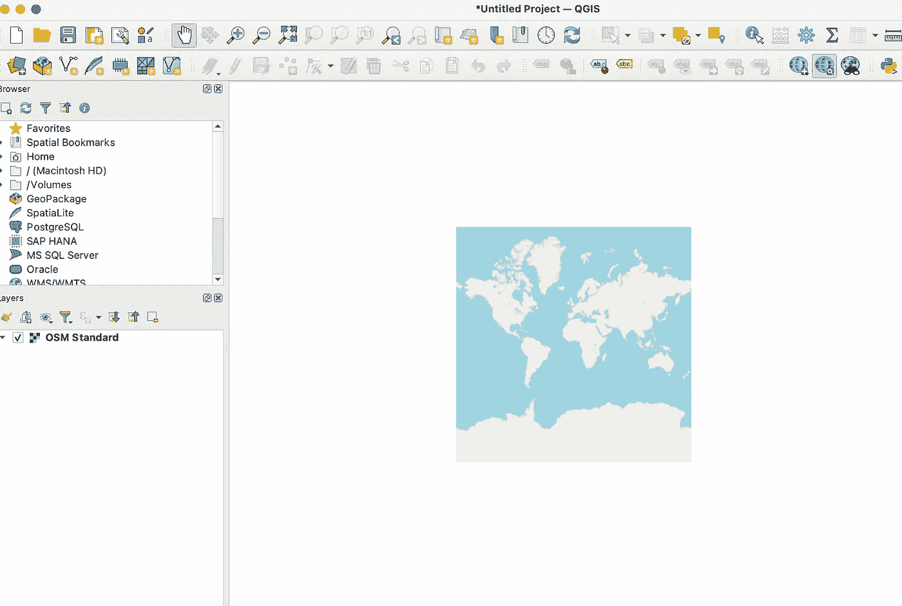
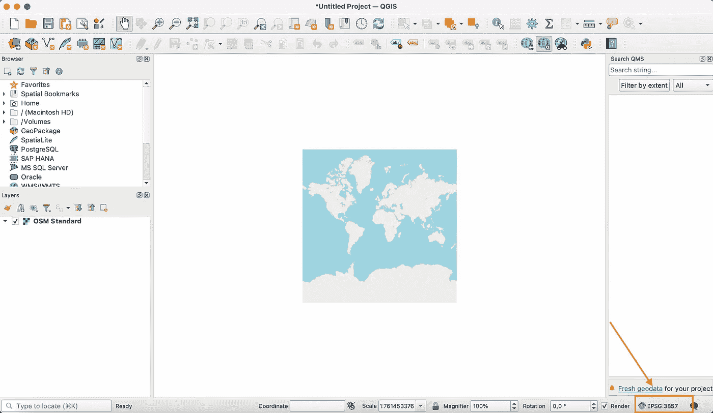
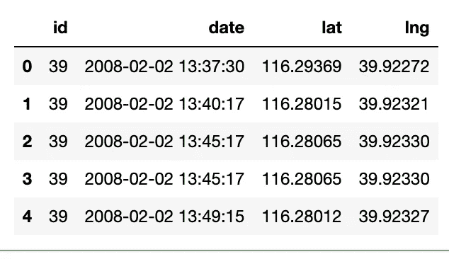
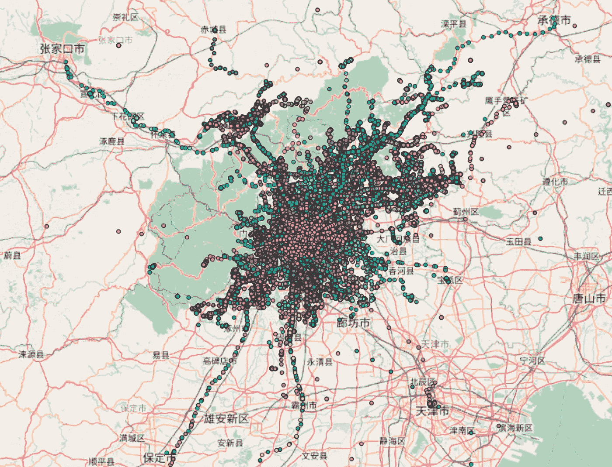
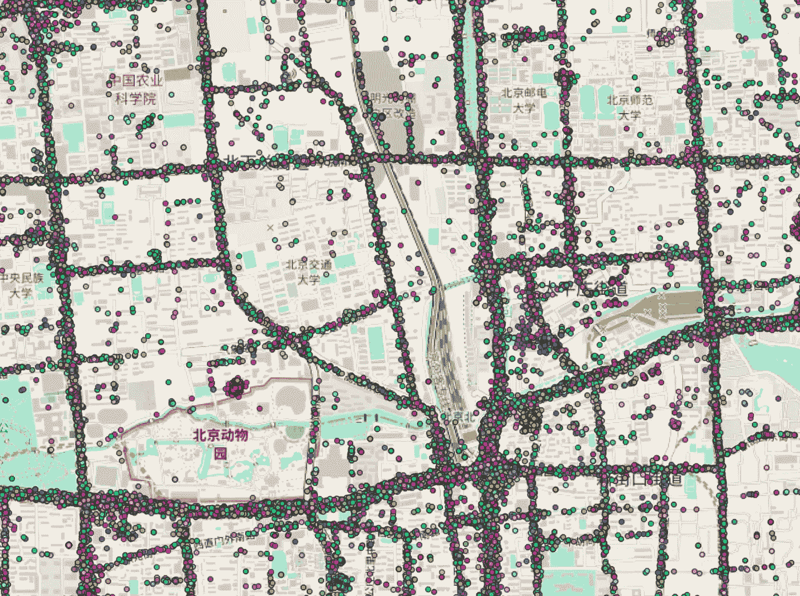
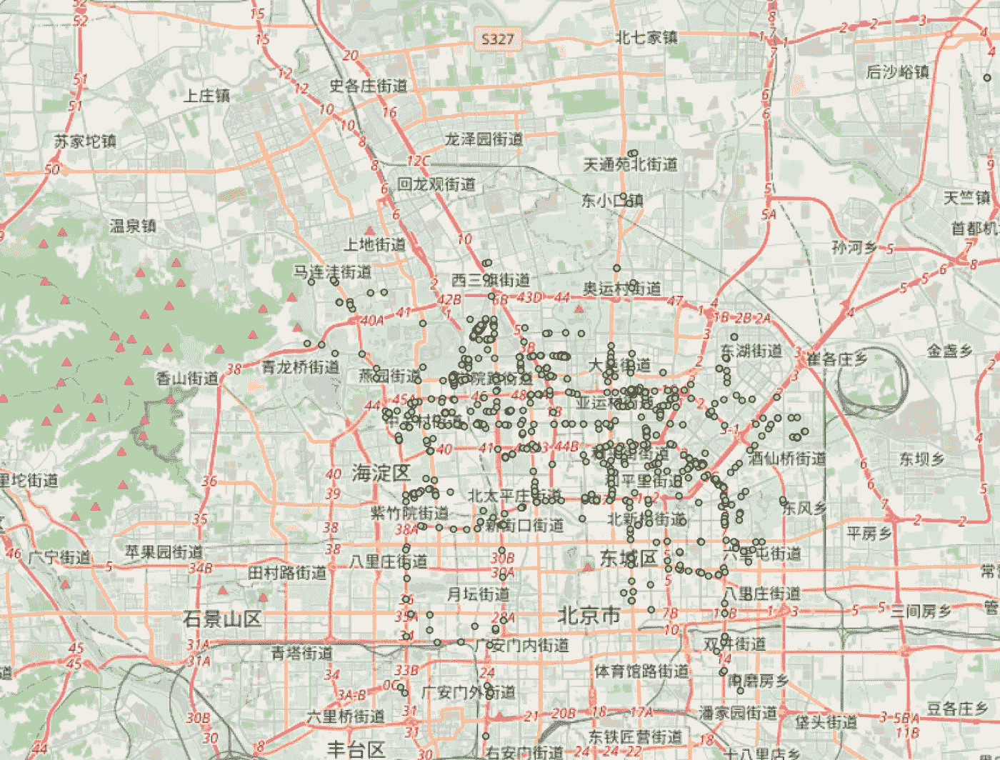
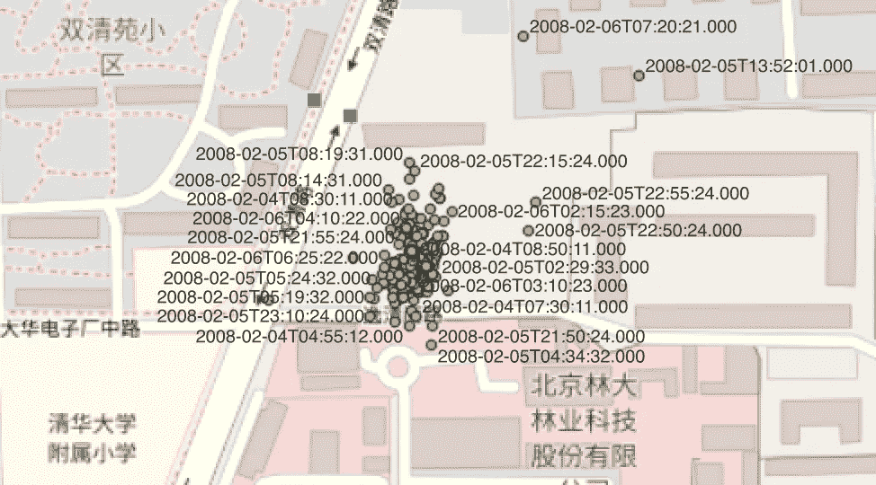

# 如何在 QGis 中执行探索性数据分析

> 原文：<https://towardsdatascience.com/how-to-perform-exploratory-data-analysis-in-qgis-8333731b9dfa>

## 地理数据，探索性数据分析

## 关于如何使用 QGis 执行地理数据 EDA 的教程，以 CSV 格式提供。


安妮·斯普拉特在 [Unsplash](https://unsplash.com?utm_source=medium&utm_medium=referral) 上的照片

数据科学家可能不得不处理地理数据。在这种情况下，除了传统的数据浏览方法，您还可以使用特定的工具来管理地理数据。

在这篇文章中，**我描述了如何使用 QGis 对地理数据集**进行初步探索。作为一个例子，我使用的数据集与出租车司机的流动性有关，可在[链接](https://www.microsoft.com/en-us/research/publication/t-drive-trajectory-data-sample/)获得，并由【1，2】发布。

文章组织如下:

*   安装和配置 QGis
*   加载 T-Drive 数据集
*   在 QGis 中执行 EDA。

# 1 安装和配置 QGis

QGis 是一个非常流行的处理地理数据的开源工具。你可以从[的官方网站](https://qgis.org/en/site/)下载，然后按照步骤安装。请注意，安装需要硬盘上大约 1GB 的可用空间。

安装后，您可以启动它。您应该会看到如下图所示的窗口:


作者图片

现在，您可以**启用快速地图服务插件，它允许您在地图上可视化数据**。单击插件菜单→管理和安装插件。在搜索栏中，编写 QuickMapServices，然后单击安装它。

安装后，您可以在 Web 菜单→ QuickMapServices 下访问它，如下图所示:



作者图片

例如，您可以选择开放街道地图(OSM) → OSM 标准。QGis 窗口的中央部分应该会出现一幅地图:



作者图片

您可以通过传统的缩放按钮缩放图像，如下所示:


作者图片

您可以通过点击屏幕右下方的按钮来更改系统的当前地理坐标，如下图所示:



作者图片

单击它后，会打开一个窗口，允许您选择系统。如果您的数据集包含经度和纬度的地理坐标，您应该选择 **WGS 84 EPSG:4326** 。

# 2 加载 T-Drive 数据集

T-Drive 数据集包含大约 10K 出租车的一周轨迹。该数据集中的总点数约为 1500 万。在这个例子中，我使用了这个数据集的一个摘录，大约有 1M 的点。我已经提取了[这个链接](https://privamov.github.io/accio/docs/datasets.html)提供的样本:从第 6 部分到第 14 部分。结果，我下载了 551 个文件，涉及 551 辆出租车。

首先，我将 551 个文件合并成一个 CSV 文件，作为 QGis 的输入。为了合并文件，我使用 Python 熊猫库。

首先，我加载所需的库:

```
import pandas as pd
import glob
import os
```

我将使用`glob`和`os`库来检索要合并的文件列表。我把所有的文件合并到一个名为`source`的目录中。

我加载了一个样本数据集，以查看它的结构。由于数据集不包含任何标题，我还设置了标题:

```
df = pd.read_csv('source/39.txt', names=['id', 'date', 'lat', 'lng'])
df.head()
```



作者图片

我在源目录中检索文件列表:

```
files = os.path.join("source/", "*.txt")
files = glob.glob(files)
```

现在，我读取每个文件，并将其添加到一个列表中:

```
li = []
for file in files:
    df = pd.read_csv(file, index_col=None, names=['id', 'date', 'lat', 'lng'])
    li.append(df)
```

我将列表中的所有文件连接起来，构建一个 Pandas 数据帧:

```
df = pd.concat(li, axis=0, ignore_index=True)
```

数据帧包含 985，972 行。我把它保存到一个文件中:

```
df.to_csv('source/merged.csv')
```

数据集已准备好导入 QGis！

# 3 在 QGis 中执行 EDA

要在 QGis 中加载数据集，我选择图层菜单，然后添加图层→添加分隔文本图层。一个窗口打开。在文件名文本输入下，我选择了`merged.csv`文件。

在几何图形定义下，我选择 X 字段(纬度)和 Y 字段(经度)。我还确保几何图形 CRS 是 EPSG-4326 WG84。

我点击添加→关闭。

您应该会看到地图上的点，如下图所示:


作者图片

图中显示**有很多错误！**数据集应该包含北京的点，但有些点在非洲，有些在欧洲，还有北京以外的其他地方。对于一个假设性的分析，我应该去掉那些点。

我在地图上执行以下操作:

*   按颜色显示出租车
*   显示一辆出租车。

## 3.1 按颜色显示出租车

在窗口的左侧，有一个已加载层的列表。我右键单击 merged，然后选择 Properties。在符号系统菜单下，我单击单个符号，然后分类。在值文本输入中，我选择 id。然后，我单击分类按钮→应用→确定。

如果我缩放地图，应该会看到类似下图的内容:



作者图片

如果我进一步放大地图，我会看到分布在道路上的出租车:



作者图片

## 3.2 显示一辆出租车

我右键单击合并层，并选择过滤器。一个窗口打开，我选择 id = 2034，然后测试，检查是否有任何结果。我点击确定。

如果我更改地图的缩放和平移级别，我应该可以看到这些点:



作者图片

我可以为每个点添加一个标签，方法是右键单击合并的层，然后选择属性→标签→无标签→单个标签→值。我选择了日期字段，以标签的形式查看日期。然后，我单击应用→确定。

现在我看到每个点附近的日期:



作者图片

通过添加另一个过滤器，我可以继续按日期对点进行分组的分析。在这种情况下，我应该更新标签部分，如前所述。我应该选择一个日期，而不是 id。

# 摘要

恭喜你！您刚刚学习了一些关于如何开始使用 QGis 的基本概念，并使用它对地理数据执行非常初步的探索性数据分析。

QGis 很强大，你只要测试一下，试试其他功能就行了！

如果你读到这里，对我来说，今天已经很多了。谢谢！你可以在[这个链接](https://alod83.medium.com/my-most-trending-articles-4fbfbe107fb)阅读我的趋势文章。

# 参考

[1]袁静，郑宇，谢星，和孙广忠.用物理世界的知识驾驶。2011 年美国纽约州 KDD 市第 17 届 ACM SIGKDD 知识发现和数据挖掘国际会议。ACM。【2】、、、、谢、、邢、、。T-drive:基于滑行轨迹的驾驶方向。第 18 届 SIGSPATIAL 地理信息系统进展国际会议论文集，GIS '10，第 99-108 页，纽约，纽约州，美国，2010 年。ACM。

# 相关文章

[](/an-overview-of-visual-techniques-for-exploratory-data-analysis-in-python-d35703d43faf) [## Python 中探索性数据分析的可视化技术概述

### 关于如何在 seaborn 和 matplotlib 中为 Visual EDA 绘制最常见图形的教程

towardsdatascience.com](/an-overview-of-visual-techniques-for-exploratory-data-analysis-in-python-d35703d43faf) [](/how-to-convert-a-shapefile-to-a-dataframe-in-python-a6ca9a893504) [## 如何在 Python 中将 Shapefile 转换为 DataFrame

### GeoPandas Python 库概述，附带一个分步示例

towardsdatascience.com](/how-to-convert-a-shapefile-to-a-dataframe-in-python-a6ca9a893504) [](/how-to-transform-data-extracted-from-wikipedia-into-a-map-in-python-8325dce0710b) [## 如何将从维基百科提取的数据转换成 Python 中的地图

### 一个现成的代码，用于在通过 Selenium、GeoPy 和 leav 从维基百科提取的条目列表上创建地图

towardsdatascience.com](/how-to-transform-data-extracted-from-wikipedia-into-a-map-in-python-8325dce0710b) 

# 您想从头开始构建地图吗？

阅读[这篇文章](https://medium.datadriveninvestor.com/getting-started-with-d3-js-maps-e721ba6d8560)。