# 如何使用 FFT 进行快速乘法运算

> 原文：<https://towardsdatascience.com/how-to-perform-fast-multiplications-in-science-using-the-fft-b751fafc2bac>

## 当前的深度学习工作流依赖于成千上万的整数乘法，因此获得高效的乘法性能现在至关重要。

照片由 [Unsplash](https://unsplash.com?utm_source=medium&utm_medium=referral) 上的 [Gsightfotos](https://unsplash.com/es/@vandehei?utm_source=medium&utm_medium=referral) 拍摄

乘法运算是许多科学和数据科学应用中的核心。这种操作的复杂性不是线性的，因此在时间上对其进行缩放可能是一项难以实现的任务。当前的深度学习工作流依赖于成千上万的整数乘法，并且这个数字随着 DL 架构的复杂性或训练模型的可用数据而增长。因此，如今获得高效的乘法性能至关重要。本文展示了如何使用 20 世纪最重要的信号发现快速傅立叶变换来执行整数乘法。

不仅深度学习卷积依赖于整数乘法，其他科学和计算应用，如高倍渲染分形图像和公钥密码学，都依赖于整数乘法。经典的向量乘法复杂度为 O(N)，其中 *N* 是位数。几乎可以说，O(logN)以上的任何复杂度都很难在众核平台上扩展，这意味着尽管我们的云基础设施中的计算单元数量增加了，但它将成为我们计算的瓶颈。任何编译器优化，以及其他性能技术，如平铺或缓存策略，都是无用的，除非降低二次复杂度。有可能降低传统乘法运算的复杂性吗？是的，它是。

# 一切都是关于多项式的

在解释如何降低乘法运算的复杂度之前，我先给大家演示一下**任意一个基数为 *x* 的整数都可以分解成一个多项式系数向量**。生成的多项式由一组系数描述，原始整数通过计算基数为 *x:* 的多项式来构建

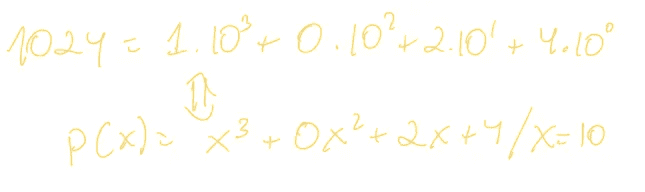

作者图片

系数的个数等于位数；也就是多项式的大小。这被称为**系数表示**。请记住，在数学课中，两个多项式的乘积会产生第三个大小为 *2N、*的多项式，这个过程称为矢量卷积。

上面我声称任何具有 N 位数的整数都可以分解成一个大小为 *N、*的多项式，并且两个大小为 *N* 的多项式的乘积是另一个大小为 *2N* 的多项式。下一个问题是知道如何执行多项式乘法:

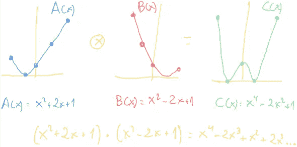

作者图片

正如我在上面的图片中指出的，卷积两个多项式的自然方法是利用分配特性，逐项相乘，然后通过添加相同多项式次数的系数来减少冗余项。这就是我之前提到的经典乘法，有 O(N)步。然而，看看我在图像上标记的点。每个点都有坐标(I，P(i))，其中 P(i)是 x=i 时 P(x)的值。任何次数为 *d* 的多项式都由平面上的 *d+1* 个点定义，这称为**值表示**。FFT 乘法背后的思想是对至少 *d+1* 个点(x_i，A(x_i))和(x_i，B(x_i))的 A(x)和 B(x)进行采样，然后简单地将函数值一个接一个地相乘(成对乘积)，以便获得两个多项式的值表示:

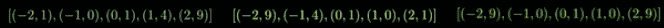

与系数表示乘法相比，值表示乘法大大减少了所执行的运算的数量。因此，想法是从系数表示变为值表示，以成对的方式执行乘法，并且将值表示变换回系数表示。在理解如何做之前，我们需要更多的概念。

# **虚拟离散傅立叶变换**

好了，在更新了我们的多项式知识之后，我们现在能够深入信号世界了。如果你从来没有听说过傅立叶变换，你只需要知道信号可以分解为其他信号的总和。时域图显示信号幅度如何随时间变化，而频域图显示信号如何位于一个频率范围内的每个频带内:

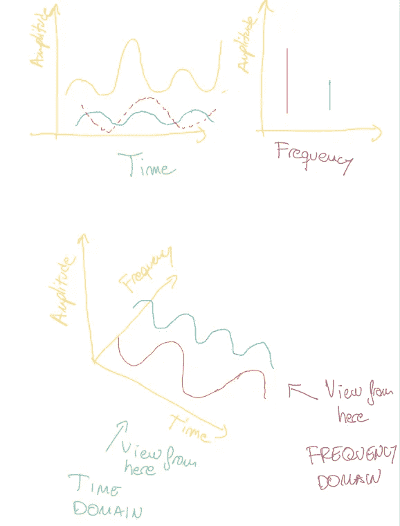

作者图片

**傅立叶变换将任何信号分解成复杂的正弦和余弦波的总和**。虽然它可以应用于连续波和离散波，但我在本文中只关注离散波，也就是离散傅立叶变换(DFT)。DFT 是允许从一个域转换到另一个域的函数，FFT 是一种非常高效地计算 DFT 的算法，但我们将在稍后讨论。

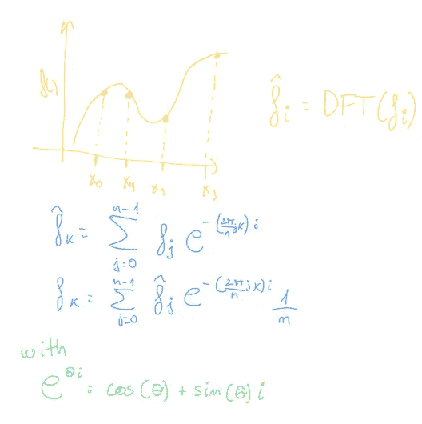

作者图片

现在我们对多项式和 DFT 有了一个整体的概念，所以我们可以继续我们的乘法问题。我们说过:

> 因此，想法是从系数表示变为值表示，以成对的方式执行乘法，并且将值表示变换回系数表示。

# 理解 FFT 的直观方法

也许你在想，DFT 可以帮助你从一种表示转换到另一种表示。你是对的，让我们看看为什么。我们说过，我们至少需要对 *d+1* 个点进行采样，以获得精确定义多项式的多项式值。有一些技巧可能有助于进一步减少样本评估的数量:

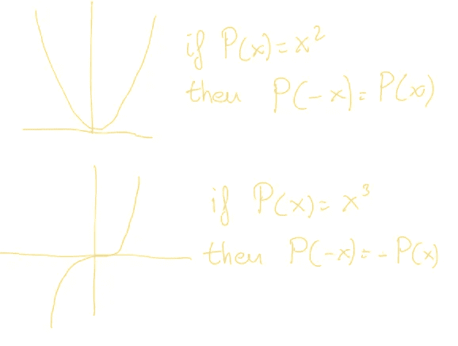

作者图片

如果我们能够应用一些多项式性质，我们可以减少我们需要的样本评估的数量。请记住，在偶数多项式中，P(-x)=P(x)是正确的，这意味着它关于 y 轴对称。让我们把多项式 P(x)分解成偶数多项式:P(x)=P_e(x) + x*P_o(x):

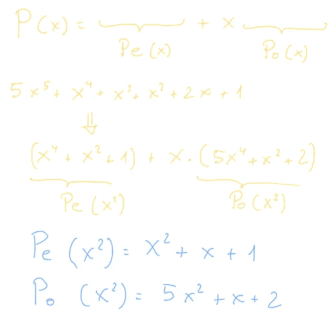

作者图片

在这种情况下，点 *-k* 的多项式求值重用了 *k* 的多项式求值:

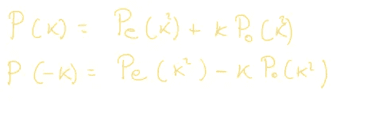

作者图片

这意味着我们可以改为评估 *n/2* 点(互补的 *n/2* 点是即时获得的)，这进一步减少了运算次数。在这一点上，你可能在考虑一个递归过程，你是对的。我们可以如下直观地构建这个过程。对于给定的多项式 *P(x)* 和 *n* 个点(实际上是 *n/2* 个成对点)，我们一方面变换 P(x)=P_e(x )+x*P_o(x)并在 *n/2* 个正点上递归求 P_e 多项式；并且还在相同的 *n/2* 正点上递归地评估 P_o。在得到他们的结果后，很容易得到对剩余的 *n/2* 负面点的 P(x)评价:

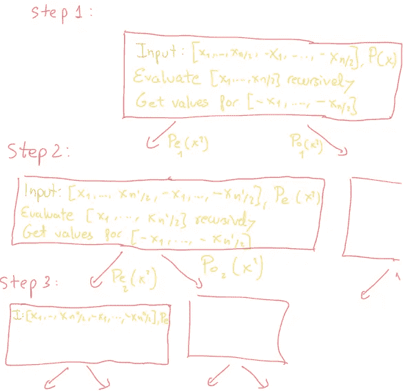

作者图片

下一个要回答的问题是我们选择哪 n 个点来评估我们的多项式。我们能选择任意一组对数吗？不，我们不能:

1.  我们将一半的点传递到下一个递归层次。该算法假设多项式在每次递归调用时都有正负成对的求值点。但是，每个点都是平方的，最后都是正的。有没有一个数即使在平方时也能保持符号不变？答案是复数 *i* 。
2.  除此之外，每一个递归层次都依赖于这样一个事实，即接收点的后一半与前一半相等，但符号相反。这最终成为一个方程组，递归的底层将有一个值为 1 的单点。有不同的方法可以解决这个问题，但是最直接的方法是使用单位的 N 次方根(找到当被提升到某个正整数 N 次幂时产生 1 的)。

假设我们的 *n* 等于 12，求解单位的 12 次方根给出以下几点来评价:

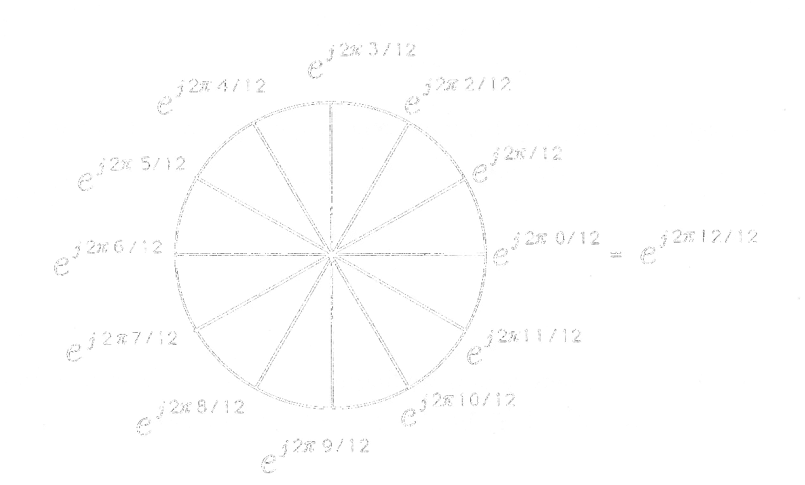

[来源 aski tians](https://www.askiitians.com/iit-jee-algebra/complex-numbers/nth-roots-of-unity.aspx)

请注意，我们将有 2 的幂级递归，因此很容易找到 *n* 作为大于 *d+1，*的 2 的最小幂，即使我们只计算其中的 *n/2* 。好消息是，我们刚刚完成了最重要的信号处理算法！**这种算法被称为快速傅立叶变换**。

让我们将所有这些放入一个伪代码中:

[可还原的 Youtube 频道](https://www.youtube.com/watch?v=h7apO7q16V0&t=813s)

由于 FFT，我们已经获得了应用离散傅立叶变换的每个多项式的值表示，并且这是在仅仅 *O(logN)* 复杂度下完成的。为了将两个多项式在值表示中相乘，我们只需对每个点上的函数求值进行成对乘法，其中成对乘法意味着将向量成对地、逐个元素地相乘，这在计算上来说是非常便宜的。

# 大整数乘法的 Strassen FFT 算法

这个算法是由 Strassen 和 Schö nhage 在 1971 年发明的，但是在本文的这一点上，你将能够很容易地理解它。

如果我们想将两个大整数 *A* 和 *B* 相乘，大小为 *N，*我们首先将它们转换成以 *x 为基数的多项式系数表示。我们将得到的系数分别存储到矢量 *a* 和 *b* 中。根据卷积定理，如果 *c* 是两个输入向量 *a* 和 *b* ， *c = a b* ，那么 *c* 的离散傅里叶变换(DFT)等于每个输入向量的 DFT 变换的两两两相乘， *DFT(c) = DFT(a)DFT(b)* 。*

> 因此， *c* 向量也可以作为该成对乘法的离散傅立叶逆变换(IDFT)来获得， *c = IDFT(DFT(a)DFT(b))。*

如果输入向量不具有相同的长度， *M < N* ，则最短的一个用零填充，直到 *M = N* 。最后，系数必须归一化到与表示整数的基数相同的基数，这一步通常称为“T4”，称为进位传播。这很重要，因为由于成对乘法的性质，在逆 FFT 之后， *c* 的每个元素将容纳比基数 *x* 大的整数。下图显示了进位传播方法*、*的一个示例，其中元素最终保留在基数为 10 的*中。*

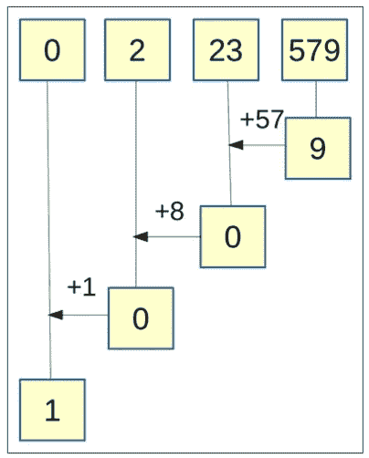

作者图片

# **计算方法**

在实现 Strassen 算法时，大多数现有库不使用复数域中的 FFT。在复数域中，整数系数被转换成复数。在执行逆 FFT 运算后，最终得到类似于 *14.999878* 的值，而不是 *15* 。相比之下，大多数实现使用有限域 *Z=pZ* ，其中素数 *p.* 在这种情况下，希望使用一个 *p* 数来最小化模运算的延迟，并且在大多数情况下为此选择*费马素数*。

然而，除了找到单位的第 n 个根之外，有限域还有几个重要的限制:

-最大值必须适合该字段，即 *(n/2)(x-1) < p* 。
-乘入 *Z=pZ* 必须取模 *p* ，因此快速取模 *p* 运算符的存在是可取的(就像*蒙哥马利约简算法*)。

传统上，有限域上的实现不如复数域上的实现有效，因为需要不同的模运算。[在最近的这篇论文](https://journals.sagepub.com/doi/10.1177/10943420221077964)中，我们已经证明了 Strassen 算法和 FFT 在复数域上的运行比其他方法更好，并且它非常适合 GPU 架构。我们还从数学上证明了对少于 50 万位数的整数使用它是安全的(尽管是在复数上工作)。

这里要理解的重要主题是，尽管经典乘法对于小尺寸运算可以执行得很好，但其复杂性从不存在。当增加位数时，尽管进行了平铺等优化，性能还是会下降，因为它的 *O(N)。*取而代之的是 Strassen 算法，wit *h O(Nlog N (log log N))* 在统计所有涉及的运算时，要快得多。下图描绘了实/复 FFT Strassen 实现(通过两个不同的库 ID/CuFFT)与经典算法的基于平铺的实现的性能对比:

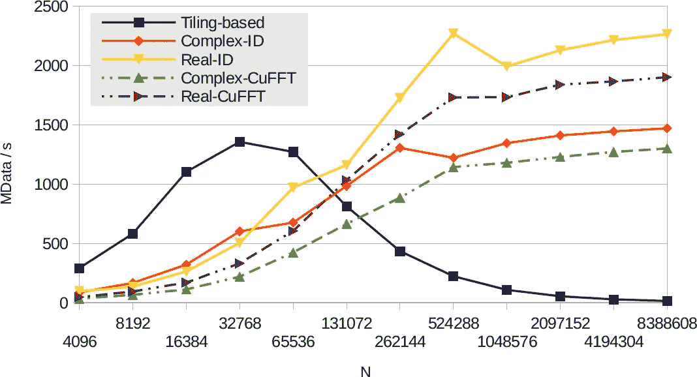

作者图片

*Adrian Perez 在伯克利实验室从事研究，拥有超级计算并行算法的博士学位。你可以在他的* [*中简介*](https://adrianpd.medium.com/) *中查看更多关于他的西班牙语和英语内容。*

**参考书目**

*迭格斯等人*。GPU 上高效的高精度整数乘法。*国际高性能计算应用杂志* (2022)。