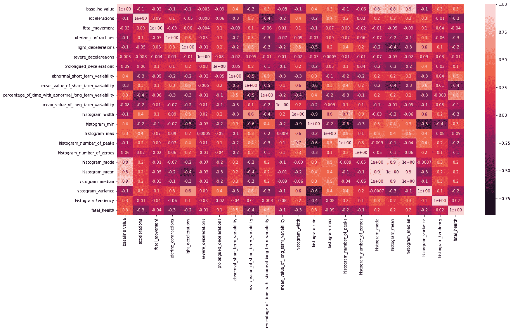
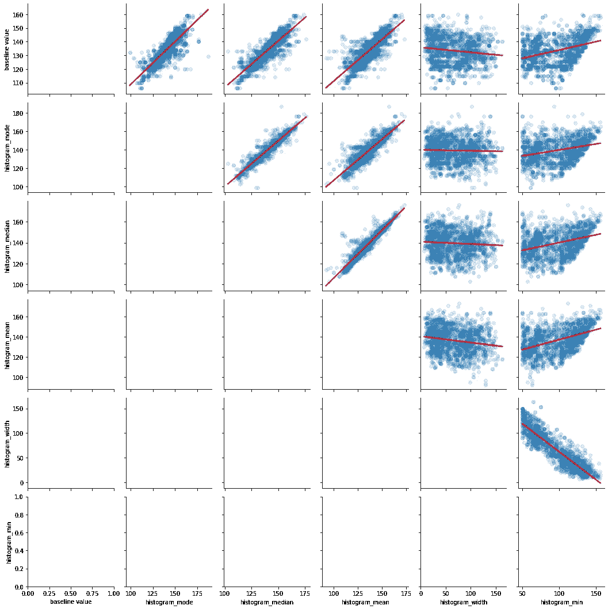
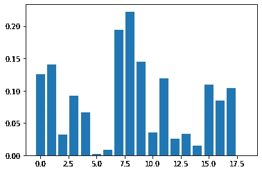
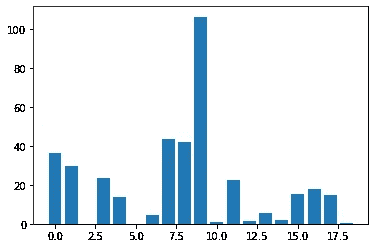

# 如何在数据科学项目中执行功能选择

> 原文：<https://towardsdatascience.com/how-to-perform-feature-selection-in-a-data-science-project-591ba96f86eb>

## 特征选择的四种方法和整个过程，并附有 Python 示例


弗拉季斯拉夫·巴比延科在 [Unsplash](https://unsplash.com/s/photos/selection?utm_source=unsplash&utm_medium=referral&utm_content=creditCopyText) 上的照片

特征选择是数据科学项目的重要组成部分。当您处理(非常)大的数据集时，您应该始终问自己两个问题:

1.  这些特征代表什么？
2.  这些特性都重要吗？

第二个问题的答案将我们引向特性选择；事实上，您不希望在数据框中包含无意义的要素:这是对计算的浪费。

在这篇文章中，我们将看到四种功能选择的方法，我还将描述一个功能选择的过程(一般来说，你很难只应用下面的方法之一来做功能选择的工作)。

# 1.相关矩阵

相关矩阵帮助我们找到特征和标签之间的线性关系，甚至特征本身之间的线性关系。当一些特征高度相关时，我们可以决定丢弃它们，因为当两个特征高度相关时，它们对结果有相同的影响。

那么，让我们看看我们能做些什么，用相关矩阵。下面，一个取自我的一个项目的例子；假设我们有一个数据框架“df”(数据集细节无关紧要)；让我们创建它的相关矩阵:

```
import matplotlib.pyplot as plt
import seaborn as sns#figure size
plt.figure(figsize=(20, 10))#heat map for correlation coefficient
sns.heatmap(df.corr(), annot=True, fmt="0.1")
```



相关矩阵。图片作者。

有许多相关的特征；例如:

*   基线值和直方图模式
*   基线值和直方图中值
*   直方图模式、istogram 均值和直方图中值
*   直方图 _ 宽度和直方图 _ 最小值

让我们只关注相关性，而不是这些特征(和标签)代表什么；我想看看这些变量之间可能的相关性的图示:

```
#creating a subtdataframe
a = df[['baseline value', 'histogram_mode', 'histogram_median', 'histogram_mean', 'histogram_width', 'histogram_min']]#creating a unique plot with the regressions
g = sns.PairGrid(a)
g = g.map_upper(sns.regplot, scatter_kws={'alpha':0.15}, line_kws={'color': 'red'})
```



具有上述特征回归线的散点图。作者图片，

因此，从图表中可以看出，上述特征确实是高度相关的；所以，我可以选择删除一部分。例如，通过交叉各种图形，我选择消除以下特征
(消除更多特征会导致一些数据丢失，因为它们都是相互交叉的):

*   直方图 _ 最小值
*   直方图 _ 平均值

# 2.套索回归

如果您正在处理线性回归问题，执行**特征选择的另一种方法是应用套索正则化模型**。

在这种类型的正则化中，与线性模型相关的一些系数可以变为零，并且可以从模型中消除。这意味着 Lasso 回归模型也执行要素选择。如果你想知道更多的细节，我已经在这里写了一篇专门的文章。

# 3.互信息方法

前面看到的方法是在整个数据集上执行的。这个和下面的方法必须在分割数据集上执行(你可以在这里看到关于主题[的有趣讨论)。最后一条评论是最重要的一条)。](https://stackoverflow.com/questions/56308116/should-feature-selection-be-done-before-train-test-split-or-after)

让我们考虑一下本教程第 1 点中看到的数据集，并考虑我们刚刚分割了数据集。现在，我们有:

```
#mutual information selecting all features
mutual = SelectKBest(score_func=mutual_info_classif, k='all')#learn relationship from training data
mutual.fit(X_train, y_train)# transform train input data
X_train_mut = mutual.transform(X_train)# transform test input data
X_test_mut = mutual.transform(X_test)#printing scores of the features
for i in range(len(mutual.scores_)):
    print('Feature %d: %f' % (i, mutual.scores_[i]))------------------->>>Feature 0: 0.124999
Feature 1: 0.139990
Feature 2: 0.031640
Feature 3: 0.092322
Feature 4: 0.066883
Feature 5: 0.002289
Feature 6: 0.008455
Feature 7: 0.194067
Feature 8: 0.222438
Feature 9: 0.144378
Feature 10: 0.034891
Feature 11: 0.118958
Feature 12: 0.025970
Feature 13: 0.033416
Feature 14: 0.015075
Feature 15: 0.108909
Feature 16: 0.085122
Feature 17: 0.103669
Feature 18: 0.000000
```

因此，这种方法利用评分方法，在某种程度上赋予特征以重要性。让我们用图表来看一下:

```
#plot the scores
plt.bar([i for i in range(len(mutual.scores_))], mutual.scores_)
plt.show()
```



互信息法评分。图片作者。

在结论中，我们将讨论何时使用这种方法。

# 4.方差分析 f 检验

让我们考虑和以前一样的数据集；我们刚刚拆分了数据，因此可以直接应用该方法:

```
# configure to select all features
an = SelectKBest(score_func=f_classif, k='all')# learn relationship from training data
an.fit(X_train, y_train)# transform train input data
X_train_an = an.transform(X_train)# transform test input data
X_test_an = an.transform(X_test)#printing scores of the features
for i in range(len(an.scores_)):
    print('Feature %d: %f' % (i, mutual.scores_[i]))------------------->>>Feature 0: 0.117919
Feature 1: 0.176444
Feature 2: 0.006887
Feature 3: 0.089149
Feature 4: 0.064985
Feature 5: 0.054356
Feature 6: 0.090783
Feature 7: 0.144446
Feature 8: 0.191335
Feature 9: 0.200292
Feature 10: 0.081927
Feature 11: 0.096509
Feature 12: 0.000000
Feature 13: 0.042977
Feature 14: 0.105467
Feature 15: 0.027062
Feature 16: 0.072015
Feature 17: 0.198037
Feature 18: 0.018785
```

甚至在这里用图形显示:

```
# plot the scores
plt.bar([i for i in range(len(an.scores_))], an.scores_)
plt.show()
```



方差分析 f 检验法得分。图片作者。

如你所见，这种方法和互信息方法在特征重要性方面的结果确实不同；我们将在下一段中看到何时选择一个，何时选择另一个。

# 特征选择和结论的过程

要选择特征，您可以遵循以下过程:

1.  绘制**相关矩阵，对整个数据集**进行计算，并决定是否有一些可以消除的特征(我们说的是高度相关的特征。用回归线画一个散点图来确定线性路径，就像我上面做的那样)。
2.  仅当问题是回归时，才选择套索回归变量。要使用的模型是线性的，并且存在“大量”要素。
3.  **将数据集分成训练集和测试集，然后在互信息和 Anova f-test 之间选择一种方法。**
    Anova f-test 能够“感觉到”特征之间的线性相关性，而互信息“感觉到”任何类型的相关性，特别是“感觉到”非线性相关性(也可在此处阅读文档)。在上面看到的情况下，考虑到使用相关矩阵获得的结果以及随后使用线性回归图消除两个特征，那么，一致地，互信息比 Anova f-test 指示更好，这是对于这种类型的问题真正重要的特征。

*我们一起连线吧！*

[*中等*](https://federicotrotta.medium.com/)

[*LINKEDIN*](https://www.linkedin.com/in/federico-trotta/) *(向我发送连接请求)*

*如果你愿意，你可以* [*订阅我的邮件列表*](https://federicotrotta.medium.com/subscribe) *这样你就可以一直保持更新了！*

考虑成为会员:你可以免费支持我和其他像我一样的作家。点击 [*这里的*](https://federicotrotta.medium.com/membership) *成为会员。*