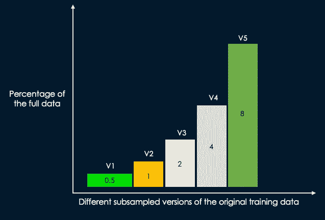
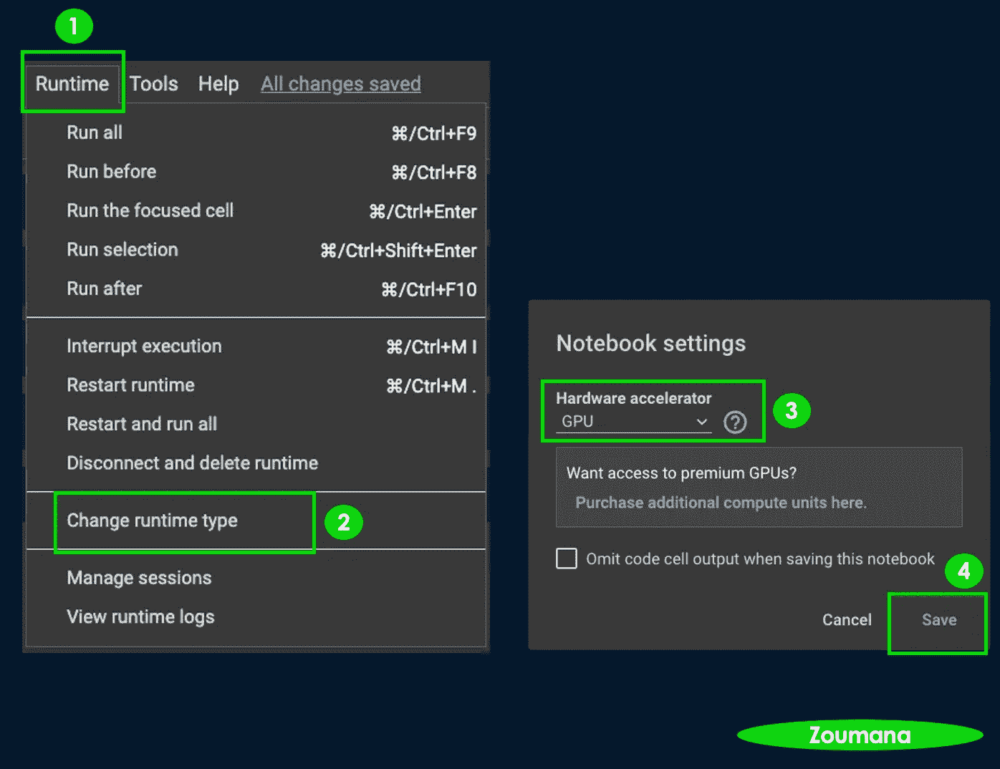
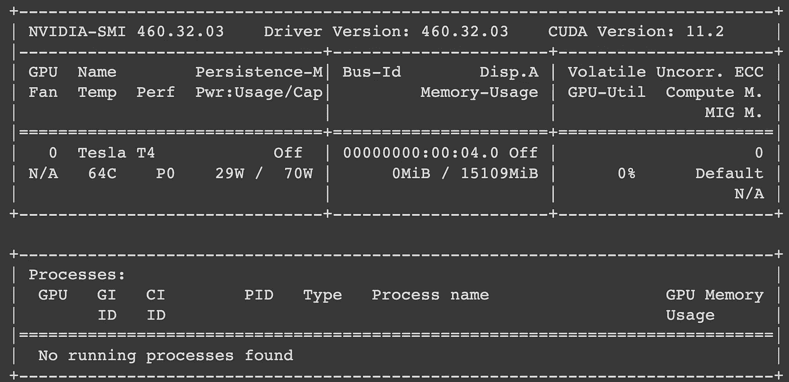
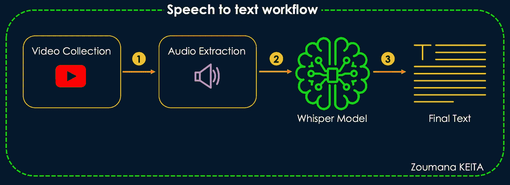

# 如何使用 OpenAI 的 Whisper 执行语音到文本转换并将任何语音翻译成英语

> 原文：<https://towardsdatascience.com/how-to-perform-speech-to-text-and-translate-any-speech-to-english-with-openais-whisper-50e3a366cbca>

## 如何使用前沿的 NLP 模型进行音频转录到文本和机器翻译。

# 介绍

OpenAI 是人工智能领域的纯粹玩家，并向社区提供了许多人工智能模型，包括、 [CLIP](https://www.pinecone.io/learn/clip-image-search/) 等。

由 OpenAI 开源的 Whisper 模型被认为在英语语音识别中已经接近人类水平的鲁棒性和准确性。

本文将尝试向您介绍使用 **HugginFaces Transformers** 框架，通过 OpenAI 的 Whisper 将长段音频转换成文本信息的所有步骤。

在这篇文章的结尾，你将能够把英语和非英语的音频翻译成文本。

# OpenAI 的耳语— Kézako？

已经开发了耳语模型来研究用于语音识别和翻译任务的语音处理系统的能力。他们有能力将语音音频转录成文本。

根据 680，000 小时的标记音频数据进行训练，作者[报告称这是监督语音识别领域有史以来最大的一次训练。此外，通过对一系列中等大小的模型进行训练来评估模型的性能，这些模型基于对应于完整数据集大小的 0.5%、1%、2%、4%和 8%的二次抽样版本的数据，如下所示。](https://cdn.openai.com/papers/whisper.pdf)



原始训练数据的 5 个不同的二次抽样版本(图片由作者提供)

# 逐步实施

本节涵盖了从安装和导入相关模块到实施音频转录和翻译案例的所有步骤。

## 安装和初始化

首先，您需要在计算机上安装 [Python](https://www.python.org/downloads/) 和 Whisper 库，最新的稳定版本可以使用 Python 包管理器`pip`安装，如下所示:

```
!pip install git+https://github.com/openai/whisper.git 
```

现在，我们需要安装并导入用于音频和视频处理的`ffmpeg`模块。根据您的操作系统，安装过程可能有所不同。

由于我用的是 MAC，下面是相应的流程:

```
# Installation for MAC
brew install ffmpeg
```

请参考适合您情况的正确代码片段

```
# on Ubuntu or Debian
sudo apt update && sudo apt install ffmpeg

# on Windows using Chocolatey (https://chocolatey.org/)
choco install ffmpeg

# on Windows using Scoop (https://scoop.sh/)
scoop install ffmpeg
```

> 如果您不想为所有这些配置费心，该怎么办呢？

→在这种情况下，Google collab 可以拯救你的生命，它还提供了一个免费的 GPU，你可以按如下方式访问:



在 Google Colab 上使用 GPU 的运行时配置(图片来自作者)

使用`nvidia-smi`我们可以有关于分配给你的 GPU 的信息，这是我的。

```
!nvidia-smi
```



我的 Google Colab 上的 GPU 信息(图片由作者提供)

一旦您安装了所有的东西，您就可以导入模块并加载模型了。在我们的例子中，我们将使用具有 1550M 参数的大型模型，并且需要大约 10g 字节的 VRAM 存储器。无论您使用的是 CPU 还是 GPU，处理时间都可能会更长或更快。

```
# Import the libraries 
import whisper
import torch
import os

# Initialize the device
device = "cuda" if torch.cuda.is_available() else "cpu"

# Load the model 
whisper_model = whisper.load_model("large", device=device)
```

*   在`load_model()`函数中，我们使用了之前行中初始化的`device`。默认情况下，如果没有另外指定，新创建的张量是在 CPU 上创建的。

现在是开始提取音频文件的时候了…

## 音频转录

本节说明了 Whisper 在录制不同语言的音频方面的优势。

这一部分的一般工作流程如下。



文章的语音转文本工作流(图片由作者提供)

前两步是用下面的助手函数执行的。但在此之前，我们需要使用下面的`pip`语句安装`[pytube](https://pytube.io/en/latest/)`库，以便从 YouTube 下载音频。

```
# Install the module
!pip install pytube

# Import the module
from pytube import YouTube
```

然后，我们可以如下实现助手函数:

```
def video_to_audio(video_URL, destination, final_filename):

  # Get the video
  video = YouTube(video_URL)

  # Convert video to Audio
  audio = video.streams.filter(only_audio=True).first()

  # Save to destination
  output = audio.download(output_path = destination)

  _, ext = os.path.splitext(output)
  new_file = final_filename + '.mp3'

  # Change the name of the file
  os.rename(output, new_file)
```

该函数有三个参数:

*   `video_URL`YouTube 视频的完整网址。
*   `destination`保存最终音频的位置。
*   `final_filename`最终音频的名称。

最后，我们可以使用功能下载视频并将其转换为音频。

## 英语转录

这里使用的视频是来自激励 Quickie 的 [YouTube 上的 30 秒激励演讲。只有前 17 秒对应于真实的语音，而语音的其余部分是噪声。](https://www.youtube.com/watch?v=E9lAeMz1DaM)

```
# Video to Audio
video_URL = 'https://www.youtube.com/watch?v=E9lAeMz1DaM'
destination = "."
final_filename = "motivational_speech"
video_to_audio(video_URL, destination, final_filename)

# Audio to text
audio_file = "motivational_speech.mp3"
result = whisper_model.transcribe(audio_file)

# Print the final result
print(result["text"])
```

*   `videoURL`是励志演讲的链接。
*   `destination`是我当前文件夹对应的``.``吗
*   `motivational_speech`将是音频的最终名称。
*   `whisper_model.transcribe(audio_file)`将模型应用于音频文件以生成转录。
*   `transcribe()`功能通过滑动 30 秒窗口对音频进行预处理，并执行[自回归序列到序列](https://arxiv.org/abs/1909.07063)方法对每个窗口进行预测。
*   最后，`print()`语句生成以下结果。

```
I don't know what that dream is that you have. 
I don't care how disappointing it might have been as you've 
been working toward that dream. 
But that dream that you're holding in your mind that it's possible.
```

下面是相应的视频，你可以播放来检查之前的输出。

## 非英语转录

除了英语，Whisper 还可以处理非英语语言。让我们来看看 YouTube 上对阿拉萨内·德拉马纳·瓦塔拉的采访。

与前面的方法类似，我们获取视频，将其转换为音频并获取内容。

```
URL = "https://www.youtube.com/watch?v=D8ztTzHHqiE"
destination = "."
final_filename = "discours_ADO"
video_to_audio(URL, destination, final_filename)

# Run the test
audio_file = "discours_ADO.mp3"
result_ADO = whisper_model.transcribe(audio_file)

# Show the result
print(result_ADO["text"])
```

**→视频讨论:**

阿拉萨内总统在 YouTube 上关于法郎 CFA [的讨论](https://www.youtube.com/watch?v=D8ztTzHHqiE)

→来自`print()`语句的模型结果。

下面是最终的结果，结果是令人兴奋的🤯。唯一被拼错的信息是“法郎 CFA ”,而模型将其识别为“前线 CFA”😀。

```
Le Front CFA, vous l'avez toujours défendu, bec et ongle, est-ce que vous 
continuez à le faire ou est-ce que vous pensez qu'il faut peut-être changer 
les choses sans rentrer trop dans les tailles techniques? Monsieur Perelman, 
je vous dirais tout simplement qu'il y a vraiment du n'importe quoi dans ce 
débat. Moi, je ne veux pas manquer de modestie, mais j'ai été directeur des 
études de la Banque Centrale, j'ai été vice-gouverneur, j'ai été gouverneur 
de la Banque Centrale, donc je peux vous dire que je sais de quoi je parle. 
Le Front CFA, c'est notre monnaie, c'est la monnaie des pays membres et nous 
l'avons acceptée et nous l'avons développée, nous l'avons modifiée. J'étais 
là quand la reforme a eu lieu dans les années 1973-1974, alors tout ce débat 
est un nonsense. Maintenant, c'est notre monnaie. J'ai quand même eu à 
superviser la gestion monétaire et financière de plus de 120 pays dans le 
monde quand j'étais au Fonds Monétaire International. Mais je suis bien placé 
pour dire que si cette monnaie nous pose problème, écoutez, avec les autres 
chefs d'État, nous prendrons les décisions, mais cette monnaie est solide, 
elle est appropriée. Les taux de croissance sont parmi les plus élevés sur le 
continent africain et même dans le monde. Le Côte d'Ivoire est parmi les dix 
pays où le taux de croissance est le plus élevé. Donc c'est un nonsense, 
tout simplement, de la démagogie et je ne souhaite même pas continuer ce débat 
sur le Front CFA. C'est la monnaie des pays africains qui ont librement 
consenti et accepté de se mettre ensemble. Bien sûr, chacun de nous aurait pu 
avoir sa monnaie, mais quel serait l'intérêt? Pourquoi les Européens ont 
décidé d'avoir une monnaie commune et que nous les Africains ne serons pas en 
mesure de le faire? Nous sommes très fiers de cette monnaie, elle marche bien, 
s'il y a des adaptations à faire, nous le ferons de manière souveraine.
```

## 非英语翻译成英语

除了语音识别、口语识别和语音活动识别之外，`Whisper`还能够执行从任何语言到英语的语音翻译。

在这最后一部分，我们将生成以下喜剧法语视频的英语转录。

来自 [YouTube](https://www.youtube.com/watch?v=hz5xWgjSUlk) 的漫画视频

这个过程与我们上面看到的没有太大的变化。主要变化是在`transcribe()`功能中使用了`task`参数。

```
URL = "https://www.youtube.com/watch?v=hz5xWgjSUlk"
final_filename = "comic"
video_to_audio(URL, destination, final_filename)

# Run the test
audio_file = "comic.mp3"
french_to_english = whisper_model.transcribe(audio_file, task = 'translate')

# Show the result
print(french_to_english["text"])
```

*   `task=’translate’`意味着我们正在执行一项翻译任务。下面是最终结果。

```
I was asked to make a speech. I'm going to tell you right away, 
ladies and gentlemen, that I'm going to speak without saying anything. 
I know, you think that if he has nothing to say, he would better shut up. 
It's too easy. It's too easy. Would you like me to do it like all those who 
have nothing to say and who keep it for themselves? Well, no, ladies and 
gentlemen, when I have nothing to say, I want people to know. I want to make 
others enjoy it, and if you, ladies and gentlemen, have nothing to say, well, 
we'll talk about it. We'll talk about it, I'm not an enemy of the colloquium. 
But tell me, if we talk about nothing, what are we going to talk about? Well, 
about nothing. Because nothing is not nothing, the proof is that we can 
subtract it. Nothing minus nothing equals less than nothing. So if we can find 
less than nothing, it means that nothing is already something. We can buy 
something with nothing by multiplying it. Well, once nothing, it's nothing. 
Twice nothing, it's not much. But three times nothing, for three times nothing,
we can already buy something. And for cheap! Now, if you multiply three times 
nothing by three times nothing, nothing multiplied by nothing equals nothing, 
three multiplied by three equals nine, it's nothing new. Well, let's talk 
about something else, let's talk about the situation, let's talk about the 
situation without specifying which one. If you allow me, I'll briefly go over 
the history of the situation, whatever it is. A few months ago, remember, 
the situation, not to be worse than today's, was not better either. Already, 
we were heading towards the catastrophe and we knew it. We were aware of it, 
because we should not believe that the person in charge of yesterday was more 
ignorant of the situation than those of today. Besides, they are the same. 
Yes, the catastrophe where the pension was for tomorrow, that is to say that 
in fact it should be for today, by the way. If my calculations are right, 
but what do we see today? That it is still for tomorrow. So I ask you the 
question, ladies and gentlemen, is it by always putting the catastrophe that 
we could do the day after tomorrow, that we will avoid it? I would like to 
point out that if the current government is not capable of taking on the 
catastrophe, it is possible that the opposition will take it.
```

# 结论

恭喜🎉！您刚刚学习了如何执行语音到文本转换，并且已经应用了机器翻译！从这个模型中可以解决很多用例。

如果你喜欢阅读我的故事，并希望支持我的写作，考虑[成为一个媒体成员](https://zoumanakeita.medium.com/membership)。每月支付 5 美元，你就可以无限制地阅读媒体上的故事。

欢迎在 [Medium](https://zoumanakeita.medium.com/) 、 [Twitter](https://twitter.com/zoumana_keita_) 和 [YouTube](https://www.youtube.com/channel/UC9xKdy8cz6ZuJU5FTNtM_pQ) 上关注我，或者在 [LinkedIn](https://www.linkedin.com/in/zoumana-keita/) 上跟我打招呼。讨论人工智能、人工智能、数据科学、自然语言处理和人工智能是一种乐趣！

# 附加材料

[GitHub 之私语](https://github.com/openai/whisper)

[通过大规模弱监督的鲁棒语音识别](https://cdn.openai.com/papers/whisper.pdf)