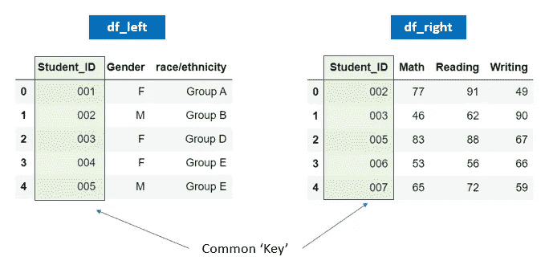
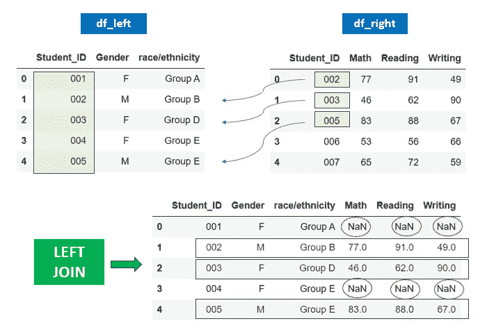
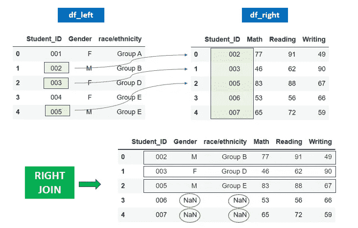
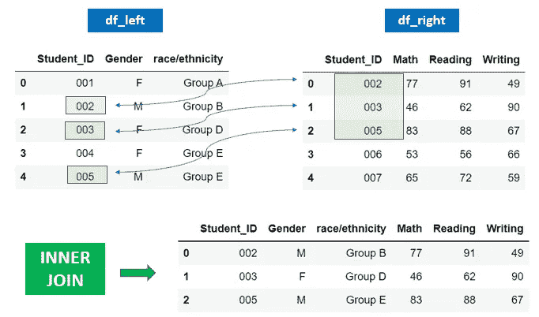
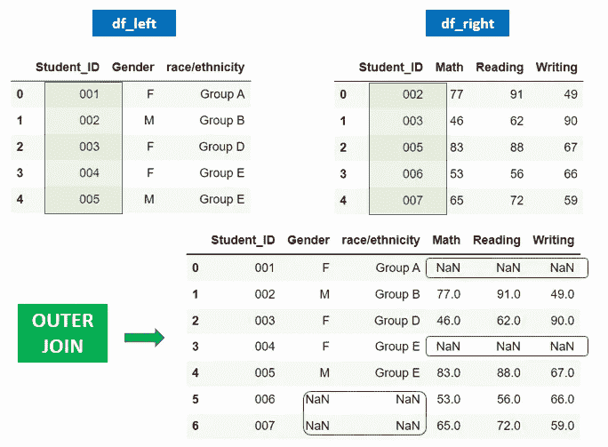
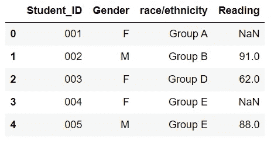
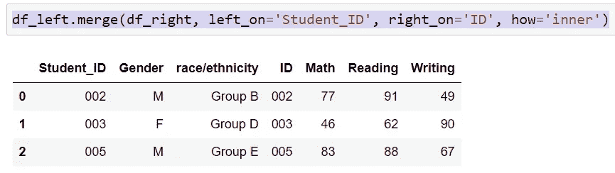

# 如何在 Pandas 中执行 SQL 风格的左|右|内|外连接

> 原文：<https://towardsdatascience.com/how-to-perform-sql-flavored-left-right-inner-outer-join-in-pandas-8cc1ea2f622c>

## SQL 到 Pandas 翻译初学者指南:连接


图片来自 [Pixabay](https://pixabay.com//?utm_source=link-attribution&utm_medium=referral&utm_campaign=image&utm_content=2777620) 的 [Alexa](https://pixabay.com/users/alexas_fotos-686414/?utm_source=link-attribution&utm_medium=referral&utm_campaign=image&utm_content=2777620)

在数据分析领域，我们很少遇到幸运的情况，我们需要的所有数据都驻留在一个表中，并且是现成的格式。相反，我们经常需要从多个表中获取数据，并将它们放入一个数据集中进行分析。这种数据管理过程通常被称为数据合并/连接/串联。

如果您来自 SQL 领域，您可能已经熟悉处理数据合并的 SQL 概念。具体来说，SQL 将两个或多个表**横向**合并为‘join’，纵向**合并为‘union’的过程。在这篇文章中，我们将专门讨论如何使用 pandas 的`pandas.DataFrame.merge`方法在 python 中执行 SQL 风格的‘join’。我们将在另一篇文章中讨论如何在 pandas 中执行 SQL 的' union '查询。**

使用公共键水平合并/连接两个数据集有四种基本方法:左连接、右连接、内连接和外连接。让我们使用以下两个样本数据集进行演示。

```
import pandas as pd
import numpy as npdf_left = pd.DataFrame({'Student_ID': ['001', '002', '003', '004','005'],
        'Gender': ['F', 'M','F', 'F','M'],
        'race/ethnicity': ['Group A', 'Group B','Group D', 'Group E','Group E']})df_right = pd.DataFrame({'Student_ID': ['002', '003', '005', '006','007'],
        'Math': [77, 46,83, 53,65],
        'Reading': [91, 62,88, 56,72],
        'Writing': [49, 90 ,67, 66,59]})
```

这里我们有两个数据帧，分别称为“df_left”和“df_right”。“df_left”数据帧有一个 Student_ID 列和每个学生的性别和种族/民族信息。“df_right”数据框架还有一个“Student_ID”列，以及每个学生的数学、阅读和写作成绩。我们希望合并这两个表(水平方向),这样我们就可以在一个数据集中拥有关于一个学生的所有信息，以便进行后续分析。



作者图片

# 左连接

**left join** 操作保留左表(df_left)中的所有记录，并且只引入右表中与公共关键字(‘Student _ ID’)匹配的记录。对于右表中没有公共关键字匹配的记录，合并后的表中这些记录的值为“NaN”。



作者图片

为了在 python 中执行左连接，我们可以使用 Pandas 的`dataframe.merge()`方法。`on`参数接受键列，`how`参数接受连接的类型(左、右等。)

`df_left.merge(df_right, on='Student_ID', how='left')`

# 右连接

与左连接相反，**右连接**操作保留右表(df_right)中的所有记录，并且只引入左表中通过公共键匹配的记录。对于左表中没有与公共关键字匹配的记录，合并后的表中这些记录的值将为“NaN”。



作者图片

我们可以通过将`how`参数指定为`how='right'`，使用下面的代码在 python 中执行右连接:

`df_left.merge(df_right, on='Student_ID', how='right')`

# 内部连接

与 left join 和 right join 不同， **inner join** 仅通过公共键(Student_ID)获取两个表的交集。任何没有公共 Student _ IDs 的记录都将从合并的表中删除，如下所示。



作者图片

我们可以使用下面的代码在 python 中执行内部连接:

`df_left.merge(df_right, on='Student_ID', how='inner')`

# 外部连接

**外部连接**(也称为完全外部连接)，从两个表中获取所有的 Student _ IDs，并为没有公共关键字匹配的字段插入 NaN(缺失值)。



我们可以使用下面的代码在 python 中执行完整的外部连接:

`df_left.merge(df_right, on='Student_ID', how='outer')`

# 仅在列的子集中合并

默认情况下，上面显示的代码片段将通过您选择的任何类型的连接合并左表和右表，并包括两个表中的所有列。如果您只想在合并时包含右表中的“阅读”列，该怎么办？

嗯，在合并之前，您总是可以对表的列进行子集化。例如，如果我们想用一个左连接从右表中引入“Reading”列，我们可以这样做。很简单，不是吗？

```
df_left.merge(df_right[['Student_ID','Reading']], on='Student_ID', how='left')
```



作者图片

# 用不同的“键列”名称联接

在前面的例子中，您可能已经注意到，两个表中的公共键列具有完全相同的列名“Student_ID”。如果两个表中的键列有不同的名称会怎样？

那么，您可以选择重命名其中一个表的键列，使其与另一个表同名，并使用上面所示的相同代码片段。用不同的键列名执行连接的另一种方法是使用`left_on`和`right_on`作为参数而不是`on`来显式指定键列的名称。

例如，假设左边表的键列名是“Student_ID ”,而右边表的键列名是“ID”。若要执行内部联接，可以使用以下代码:

```
df_left.merge(df_right, left_on='Student_ID', right_on='ID', how='inner')
```



作者图片

# 在多个键上合并

有时您可能需要在多个键上连接两个表。您可以简单地在`on`参数中指定一个您想要用来连接两个表的键列表:

```
df_left.merge(df_right, on=['key1', 'key2'...],how='left')
```

或者，如果键列有不同的名称，可以使用`left_on`和`right_on`参数:

```
df_left.merge(df_right, left_on=['leftkey1', 'leftkey2'], right_on=['rightkey1', 'rightkey2'],how='left')
```

合并表格是数据分析领域中最常见的数据管理任务之一。我希望本教程有助于理解 SQL 风格的连接的基本类型以及如何使用`Pandas`来实现它们。如前所述，本教程只教你如何基于一个或多个公共键水平合并两个表。为了垂直合并/堆叠表(相当于 SQL 中的‘UNION’操作)，我们需要使用不同的`pandas`函数，我们将在另一篇文章中讨论这个主题。感谢阅读，我希望你喜欢这个简短的教程。

**数据源**:本教程中使用的样本数据集是作者创建的。

你可以通过这个[推荐链接](https://medium.com/@insightsbees/membership)注册 Medium 会员(每月 5 美元)来获得我的作品和 Medium 的其他内容。通过这个链接注册，我将收到你的一部分会员费，不需要你额外付费。谢谢大家！