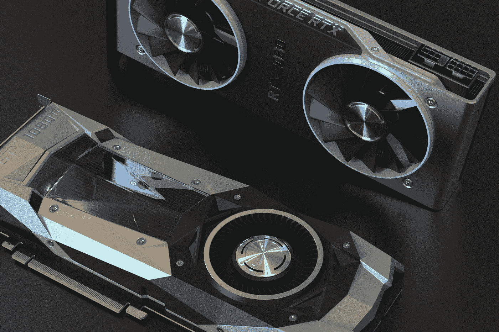
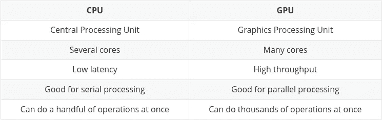
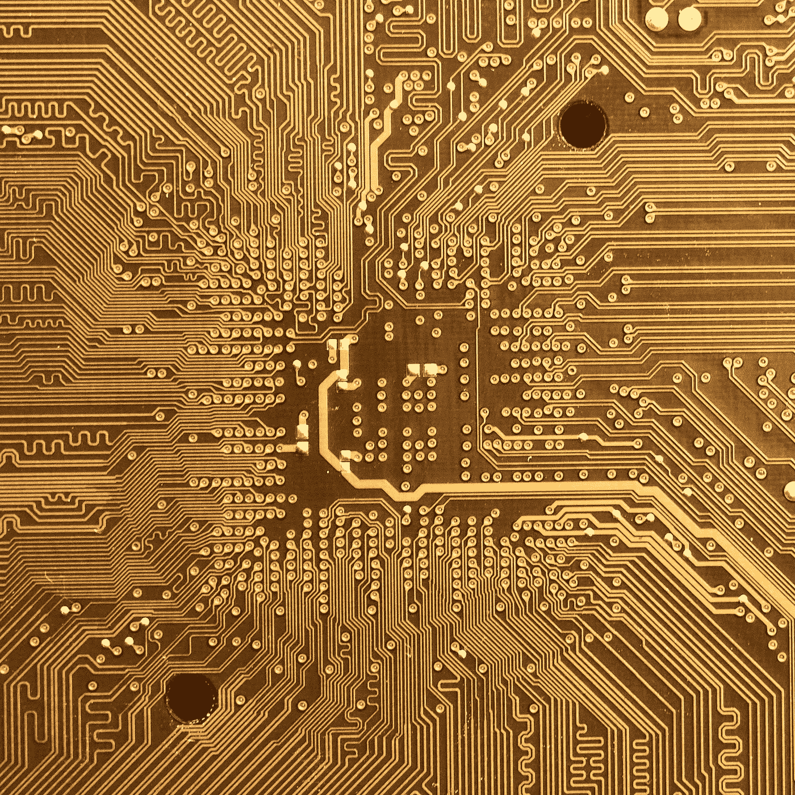
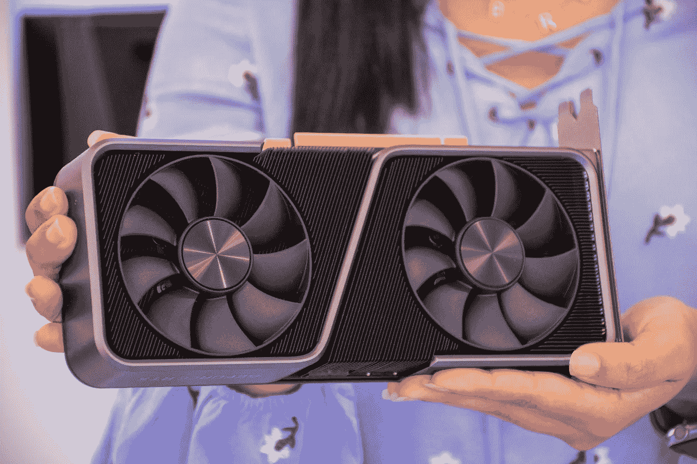
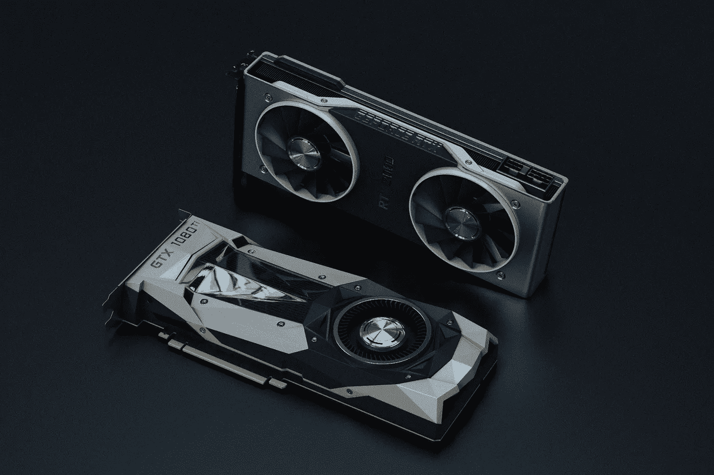
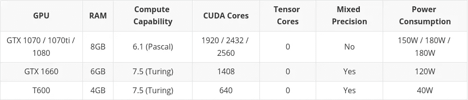
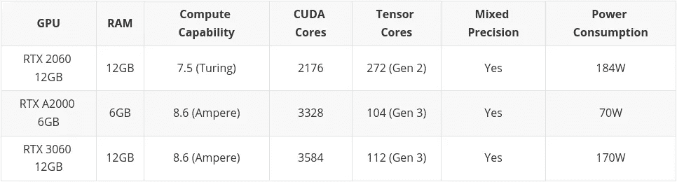
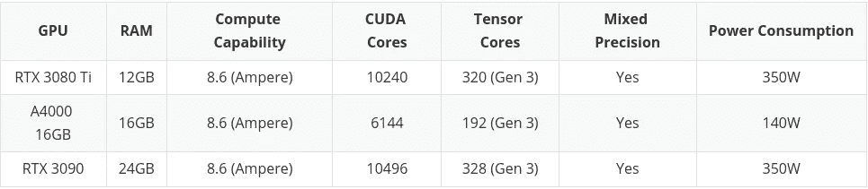
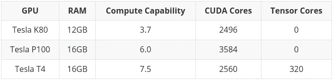

# 机器学习如何挑选最好的显卡

> 原文：<https://towardsdatascience.com/how-to-pick-the-best-graphics-card-for-machine-learning-32ce9679e23b>

## 五金器具

## 加快你的训练，更快地迭代

在 [Unsplash](https://unsplash.com/s/photos/gpu?utm_source=unsplash&utm_medium=referral&utm_content=creditCopyText) 上由[娜娜杜瓦](https://unsplash.com/@nanadua11?utm_source=unsplash&utm_medium=referral&utm_content=creditCopyText)拍摄的照片

**在处理机器学习时，尤其是在处理深度学习和神经网络时，最好使用显卡来处理，而不是 CPU。当涉及到神经网络时，即使是非常基本的 GPU 也会胜过 CPU。**

**但是应该买哪个 GPU 呢？有很多选择，它可以很快变得混乱和昂贵。因此，我将尝试指导您考虑相关因素，以便您可以根据您的预算和特定的建模要求做出明智的选择。**

# 为什么 GPU 比 CPU 更适合机器学习？

CPU(中央处理器)是计算机的主力，重要的是它非常灵活。它可以处理来自各种程序和硬件的指令，而且处理速度非常快。为了在这种多任务环境中脱颖而出，CPU 拥有少量灵活快速的处理单元(也称为核心)。

GPU(图形处理单元)更专业一点，在多任务处理方面没有那么灵活。它旨在并行执行大量复杂的数学计算**，从而提高吞吐量。这是通过拥有更多更简单的内核来实现的，有时是数千个，以便可以同时处理许多计算。**

****

**图片由 [Ahmed Gad](https://pixabay.com/users/ahmedgad-9403351/?utm_source=link-attribution&utm_medium=referral&utm_campaign=image&utm_content=3501528) 来自 [Pixabay](https://pixabay.com//?utm_source=link-attribution&utm_medium=referral&utm_campaign=image&utm_content=3501528)**

**这种并行执行多个计算的要求非常适合:**

*   ****图形渲染** —移动的图形对象需要不断计算其轨迹，这需要大量不断重复的并行数学计算。**
*   ****机器和深度学习** —大量矩阵/张量计算，使用 GPU 可以并行处理。**
*   **任何可以拆分并行运行的数学计算类型。**

**我认为我见过的最好的总结是在 Nvidia 自己的[博客](https://blogs.nvidia.com/blog/2009/12/16/whats-the-difference-between-a-cpu-and-a-gpu/)上:**

****

**表格作者，灵感来自 nvidia.com**

## **张量处理单元(TPU)**

**随着人工智能和机器/深度学习的蓬勃发展，现在甚至有了更专业的处理核心，称为张量核心。这些在执行张量/矩阵计算时更快更有效。机器/深度学习所涉及的数学类型到底需要什么。**

**虽然有专用的图形处理器，但一些最新的图形处理器也包括许多张量核，这一点您将在本文后面看到。**

# **英伟达 vs AMD**

**这将是一个很短的部分，因为这个问题的答案肯定是:**英伟达****

**你可以使用 AMD GPUs 进行机器/深度学习，但在撰写本文时，Nvidia 的 GPU 具有更高的兼容性，并且通常更好地集成到 TensorFlow 和 PyTorch 等工具中。**

**我从自己的经验中知道，试图将 AMD GPU 与 TensorFlow 一起使用需要使用额外的工具( [ROCm](https://github.com/RadeonOpenCompute/ROCm) )，这往往有点复杂，有时会留给你一个不是最新版本的 TensorFlow/PyTorch，这样你就可以让卡工作了。**

**这种情况可能会在未来得到改善，但如果你想要一个没有麻烦的体验，最好现在就坚持使用 Nvidia。**

# **GPU 特性**

**挑选一款既符合您的预算，又能够完成您想要的机器学习任务的 GPU，基本上可以归结为四个主要因素的平衡:**

1.  **GPU 有多少 RAM？**
2.  **GPU 有多少个 CUDA 和/或张量核？**
3.  **卡采用什么芯片架构？**
4.  **您的功耗要求是什么(如果有)？**

**接下来的小节将会研究这些领域中的每一个，希望能让你更好地理解对你来说什么是重要的。**

## **GPU RAM**

**这个问题的答案是，多多益善！我知道这很有帮助…**

**这实际上取决于你在建模什么，以及那些模型有多大。例如，如果您正在处理图像、视频或音频，那么根据定义，您将处理相当大量的数据，GPU RAM 将是一个极其重要的考虑因素。**

**总是有办法解决内存不足的问题(例如，减少批处理大小)。但是，您希望限制为了避开内存需求而在代码上花费的时间，因此很好地平衡您的需求是至关重要的。**

****

**图片来自 [Pixabay](https://pixabay.com//?utm_source=link-attribution&utm_medium=referral&utm_campaign=image&utm_content=152655)**

**作为一般经验法则，我建议如下:**

****4GB**——我会考虑的绝对最小值，只要你不处理过于复杂的模型，或者大量的图像、视频或音频，这在大多数情况下都会很好。如果你刚刚起步，想在不倾家荡产的情况下尝试一下，那就太棒了。对 CPU 的改进仍然是日以继夜的。**

**8GB —我会说这是一个很好的中间地带。您可以在不触及 RAM 限制的情况下完成大部分任务，但在处理更复杂的图像、视频或音频模型时会遇到问题。**

**12GB —我认为这是最理想的，但并不荒谬。您可以处理大多数较大的模型，甚至是那些处理图像、视频或音频的模型。**

****12GB+** —越多越好，您将能够处理更大的数据集和更大的批量。然而，超过 12GB 后，价格才真正开始上涨。**

**以我的经验来看，如果成本相同，一般来说，最好是选择一个“更慢”的内存更大的卡。请记住，GPU 的优势是高吞吐量，这在很大程度上依赖于可用的 RAM 来通过 GPU 馈送数据。**

## **CUDA 核心和张量核心**

**这真的很简单。CUDA 核心/张量核心越多越好。**

**其他项目，如 RAM 和芯片架构(见下一节)，可能应该首先考虑，然后从缩小的选择中查看具有最高数量 CUDA/tensor 内核的卡。**

**对于机器/深度学习，张量核比 CUDA 核更好(更快、更高效)。这是因为它们是为机器/深度学习领域所需的计算而精确设计的。**

**事实上，这并不重要，CUDA 内核已经足够快了。如果你能得到一张也包含张量核的卡片，那是一个很好的加分项，只是不要太在意它。**

**接下来，您会看到“CUDA”被频繁提及，这可能会让人感到困惑，因此总结如下:**

*   **CUDA 内核 —这些是显卡上的物理处理器，通常有数千个。**
*   ****CUDA 11** —数字可能会改变，但这是指为使显卡工作而安装的软件/驱动程序。新版本定期发布，它可以像其他软件一样安装。**
*   ****CUDA 世代(或计算能力)** —这描述了图形卡在其世代特征方面的能力。这在硬件中是固定的，因此只能通过升级到新卡来改变。它通过数字和代号来区分。例子:3 . x[开普勒]，5 . x[麦克斯韦]，6 . x[帕斯卡]，7 . x[图灵]和 8 . x[安培]。**

## **芯片架构**

**这实际上比你想象的更重要。正如我前面提到的，在这一点上，我们基本上放弃了 AMD，所以在几代芯片架构方面，我们只有 Nvidia。**

****

**[Manuel](https://unsplash.com/es/@manueljota?utm_source=unsplash&utm_medium=referral&utm_content=creditCopyText) 在 [Unsplash](https://unsplash.com/s/photos/computer-chip?utm_source=unsplash&utm_medium=referral&utm_content=creditCopyText) 上拍照**

**要注意的主要是芯片组的“[计算能力](https://developer.nvidia.com/cuda-gpus)，有时被称为“CUDA 一代”。这对于每张卡来说是固定的，所以一旦你买了卡，你就被卡的计算能力所束缚。**

**了解卡的计算能力非常重要，原因有两个:**

1.  **显著的功能改进**
2.  **反对**

## **显著的功能改进**

**让我们从一个显著的特性改进开始。**混合精度训练**:**

> ***使用精度低于 32 位浮点的数字格式有很多好处。首先，它们需要更少的内存，能够训练和部署更大的神经网络。其次，它们需要更少的内存带宽，从而加快了数据传输操作。第三，在精度降低的情况下，数学运算运行得更快，尤其是在支持该精度的张量核 GPU 上。混合精度训练实现了所有这些好处，同时确保*与全精度训练相比，不会损失*特定任务的精度。它通过识别需要完全精度的步骤，并仅对这些步骤使用 32 位浮点，而对其他所有步骤使用 16 位浮点来实现这一点。***
> 
> **[*-Nvidia 学习性能文档*](https://docs.nvidia.com/deeplearning/performance/mixed-precision-training/index.html)**

**如果您的 GPU 具有 7.x(图灵)或更高的计算能力，则只能使用混合精度训练。这基本上是 RTX 20 系列或更新，或 RTX，“T”或“A”系列台式机/服务器。**

**当考虑新的显卡时，混合精度训练是如此有利的主要原因是它降低了 RAM 的使用，所以通过使用稍微新一点的卡，可以降低对 RAM 的要求。**

## **贬值**

**然后，我们转向天平的另一端。**

**如果你有特别高的内存需求，但没有足够的钱买高端卡，那么你可能会选择二手市场上的旧型号 GPU。**

> **然而，这也有相当大的负面影响……这张牌是生命的终结。**

**这方面的一个主要例子是特斯拉 K80，它有 **4992 个 CUDA 内核**和 **24GB 内存**。它最初在 2014 年的零售价约为 7000.00 美元。我刚刚在英国的 e-bay 上看了一下，它的价格从 130.00 英镑(150 美元/欧元)到 170.00 英镑(195 美元/欧元)不等！这么小的价格却有这么多内存。**

**然而，也有相当大的负面影响。K80 的计算能力为 3.7(开普勒)，从 CUDA 11 开始(当前的 CUDA 版本为 11)，该功能已被弃用。这意味着该卡已经寿终正寝，不能在未来的 CUDA 驱动程序中使用。真的很遗憾，但是要记住，因为这很诱人。**

# **显卡与工作站/服务器卡**

**Nvidia 基本上把他们的卡分成两部分。有[消费级显卡](https://www.nvidia.com/en-eu/geforce/graphics-cards/compare/)，然后是针对[台式机/服务器](https://www.nvidia.com/en-gb/design-visualization/desktop-graphics/)的卡(即专业卡)。**

**这两个部分之间显然存在差异，但要记住的主要一点是，对于相同的规格(RAM、CUDA 内核、架构)，消费级显卡通常会更便宜。然而，专业卡通常具有更好的构建质量和更低的能耗。**

****

**图片由 [Elias Gamez](https://www.pexels.com/@elias-gamez-2002621/) 在[像素](https://www.pexels.com/photo/person-holding-a-graphics-card-10558582/)上拍摄**

**看看更高端(也非常贵)的专业卡，你也会注意到它们有很多内存(例如，RTX A6000 有 48GB，A100 有 80GB！).这是因为它们通常直接针对 3D 建模、渲染和机器/深度学习专业市场，这些市场需要高水平的 RAM。同样，如果你有这样的需求，你可能不需要建议该买什么！**

**总的来说，你可能最好坚持消费图形市场，因为你会得到更好的交易。**

# **建议**

**最后，我想我会根据预算和需求提出一些建议。我把它分成三个部分:**

*   **低预算**
*   **中等预算**
*   **高预算**

**请记住，高预算不考虑任何超出高端消费显卡的东西。如果你真的有很高的预算，你应该考虑专业卡系列，如 Nvidia [A 系列](https://www.nvidia.com/en-us/data-center/a100/)卡，其成本可能高达数千美元。**

**我已经在低预算部分包括了一张卡，它只能在二手市场上买到。这主要是因为我认为在低预算部分，值得考虑二手卡。**

****

**[娜娜杜瓦](https://unsplash.com/@nanadua11?utm_source=unsplash&utm_medium=referral&utm_content=creditCopyText)在 [Unsplash](https://unsplash.com/s/photos/gpu?utm_source=unsplash&utm_medium=referral&utm_content=creditCopyText) 上的照片**

**我还在组合中加入了专业桌面系列卡(T600、A2000 和 A4000)。你会注意到，有些规格比同类消费显卡稍差，但功耗明显更好，这可能是一些人关心的问题。**

## **低预算(低于 220 英镑—250 欧元/美元)**

****

## **中等预算(低于 440 英镑—500 欧元/美元)**

****

## **高预算(低于 1050 英镑—1200 欧元/美元)**

****

# **其他选项**

**如果你认为获得显卡的费用和麻烦不适合你，你可以随时利用 [Google Colab](https://colab.research.google.com/) ，它让你免费使用 GPU。**

**请记住，这是有时间限制的，如果你使用 GPU 太长时间，他们会把你踢出去，回到 CPU 上。如果 GPU 不活动的时间太长，可能在你写代码的时候，它也会把 GPU 收回来。GPU 也是自动分配的，所以你不能挑选你想要的确切的 GPU。**

**在撰写本文时，以下 GPU 可通过 Colab 获得:**

****

****注意:**我在文章的前面提到 K80 有 24GB 的 RAM 和 4992 个 CUDA 内核，确实如此。然而，K80 是一个不寻常的野兽，因为它基本上是两个 K40 卡栓在一起。这意味着，当您在 Colab 中使用 K80 时，您实际上可以访问一半的卡，因此只有 12GB 和 2496 个 CUDA 核心。**

# **结论**

**有很多选择，这可能会非常混乱。希望您在阅读完这篇文章后，对什么适合您的特定需求有了更好的了解。**

**你认为有没有特别值得一提的显卡？请在评论中告诉我。**

**如果你觉得这篇文章有趣或有用，记得关注我，或者[注册我的简讯](https://medium.com/@maclayton/subscribe)获取更多类似的内容。**

**如果你还没有，你也可以考虑[订阅媒体](https://medium.com/@maclayton/membership)。你的会员费不仅直接支持我，也支持你所阅读的其他作家。你还可以完全不受限制地访问媒体上的每个故事。**

**使用我的推荐链接注册会给我一点回扣，对你的会员资格没有影响，所以如果你选择这样做，谢谢你。**

**<https://medium.com/@maclayton/membership> **