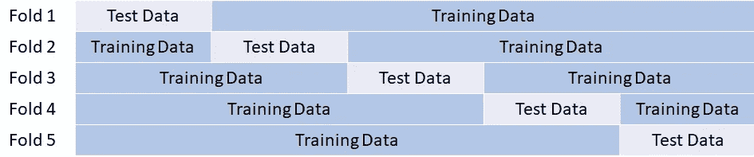
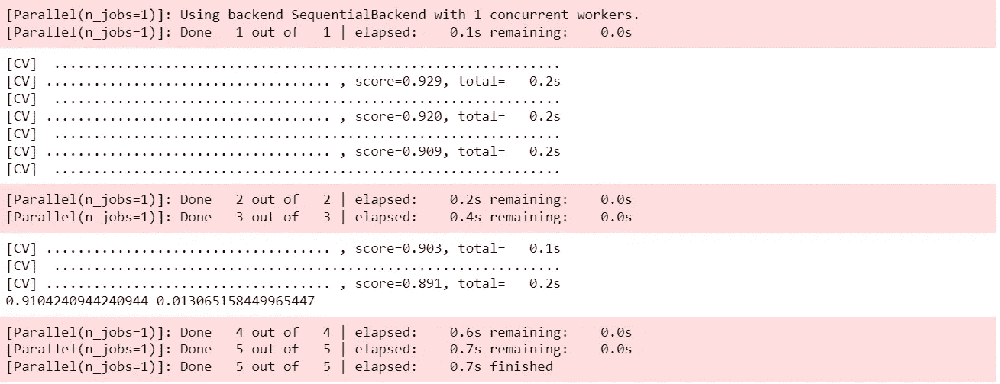
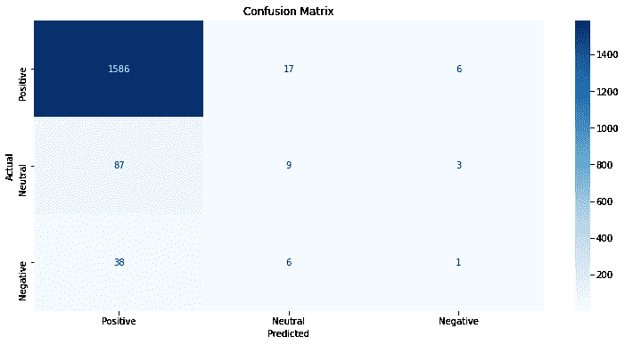

# 如何从 K 倍交叉验证中绘制混淆矩阵

> 原文：<https://towardsdatascience.com/how-to-plot-a-confusion-matrix-from-a-k-fold-cross-validation-b607317e9874>

## [实践教程](https://towardsdatascience.com/tagged/hands-on-tutorials)

# 如何从 K 倍交叉验证中绘制混淆矩阵

## 绘制 k 倍交叉验证评估中涉及的所有折叠的组合混淆矩阵

照片由 [JJ 英](https://unsplash.com/@jjying?utm_source=unsplash&utm_medium=referral&utm_content=creditCopyText)在 [Unsplash](https://unsplash.com/s/photos/fold?utm_source=unsplash&utm_medium=referral&utm_content=creditCopyText)

# 背景

当评估机器学习模型的性能时，通常将数据分成训练集和测试集，例如通过采样 80%的数据用于训练，20%用于测试。

该模型适合训练数据，然后可以使用一系列指标进行评估和调整，包括准确度、精确度、召回率、f1 分数等。

最终，机器学习模型将根据测试数据进行性能评估，这些测试数据被放在一边并从训练中排除，因为根据模型建立过程中未使用的新数据进行评估可以更好地表明这些模型在现实世界中的表现。

然而，这种方法有时会有问题。在我参加的 Kaggle 比赛中，我经常欣喜地发现，我的最新算法在我保留的测试数据中表现如此之好，结果却在 Kaggle 验证数据中进行了测试，结果发现性能很差。

这到底是怎么回事？好吧，在那些 Kaggle 比赛中，我绞尽脑汁也没能爬上领先的位置，我得出结论，我只是幸运地选择了测试数据的样本，并在性能上得了高分。

这就是 k 倍交叉验证的用武之地。

交叉验证不是抽取 20%的数据用于测试，剩下的 80%用于训练，而是多次抽取数据，每次抽取不同的一组数据用于测试和训练。它可以被形象化如下:

作者图片

注意:实际上褶皱并不像这样整洁干净。上图给人的印象是，训练数据和测试数据都是连续的(即，这些行彼此紧邻)，但实际情况并非如此。

在`scikit-learn`库中，我在第一个“测试数据”块中可视化的行集实际上是从整个数据集中采样的，但为了学习交叉验证是如何工作的，简化的可视化更容易理解。

这些数据被分成 5 个“折叠”,这可以在 Python 中使用`scikit-learn`库实现，如下所示

作者图片

请注意:我从 ka ggle([https://www . ka ggle . com/nica potato/womens-ecommerce-clothing-reviews](https://www.kaggle.com/nicapotato/womens-ecommerce-clothing-reviews))选择了一个数据集，该数据集获得了“CC0: Public Domain”许可，这意味着“你可以复制、修改、分发和执行该作品，即使是出于商业目的，都无需请求许可”(详见[https://creativecommons.org/publicdomain/zero/1.0/](https://creativecommons.org/publicdomain/zero/1.0/))。

对`KFold`的调用创建了分为训练集和测试集的 5 个“折叠”数据，对`cross_val_score`的调用执行以下操作

1.  迭代 5 次折叠中的每一次
2.  对于每个折叠，使模型适合为训练保留的 4/5 的数据
3.  针对为测试保留的 1/5 数据评估模型的性能

对`cv_results.mean()`的调用计算所有 5 次折叠的性能平均值，作为一个单一的数字，比单一的训练/测试分割方法更有可能给出生产性能的更好指示。

# 问题是

我发现交叉验证的一个问题是，我喜欢为我的分类机器学习算法绘制一个混淆矩阵，以帮助我可视化性能，但没有直接和即时的方法来做到这一点。

如果我执行了单个训练/测试分割，我将使模型适合训练数据，然后我可以使用模型来预测测试数据的类别，并将这些类别与实际类别一起传递到混淆矩阵中。

然而，当使用交叉验证时，模型拟合发生在`cross_val_score`内部。我们的`RandomForestClassifier`的`model`实例还没有安装，即使安装了，到底应该用什么数据来评估它呢？

事实证明，有一种相对简单的方法来产生一组预测的和实际的类，然后可以在混淆矩阵中使用这些类来可视化算法的性能和有效性。

## 1.导入库

完成这项任务还需要几个库…

## 2.计算预测类别和实际类别

该解决方案的核心部分是通过定义一个名为`cross_val_predict`的帮助函数来计算折叠数据的实际和预测类别(即分类),该函数执行以下操作

1.  获取机器学习算法的本地副本(`model`)以避免更改传入的副本
2.  围绕 5 个交叉验证数据折叠进行迭代(假设`n_splits=5`)。
3.  对于 5 次分裂中的每一次—

a.从培训功能、培训目标、测试功能和测试目标的数据中提取行

b.将实际目标分类附加到`actual_classes`

c.使用从当前文件夹中提取的训练数据来拟合机器学习模型

d.使用拟合模型预测当前文件夹中测试数据的目标分类

e.将当前文件夹测试数据的预测类别追加到`predicted_classes`

然后，helper 函数返回可用于绘制混淆矩阵的完整的实际和预测类(分类)集。

## 3.想象混乱矩阵

`plot_confusion_matrix`助手函数使用`sklearn.metrix.confusion_matrix`来计算矩阵，然后由一个叫`heatmap`的人用一种很好的格式来显示矩阵，这有助于通过可视化来全面理解算法的性能。

## 4.调用助手函数

定义了两个辅助函数后，只需依次调用它们来计算实际类和预计类，然后显示混淆矩阵。

作者图片

91%的总体交叉验证准确度看起来性能良好，但是复合混淆矩阵的可视化显示，虽然该算法在预测`Review Sentiment`何时为`Positive`时表现良好，但在预测`Neutral`和`Negative`分类时表现差得多。

# 结论

Abhisek Thakur 是一位数据科学家，也是世界上第一位 Kaggle 四重大师，他将交叉验证定义为…

*“构建机器学习模型过程中的一个步骤，帮助我们确保我们的模型准确地拟合数据，并确保我们不会过度拟合”*

他继续说道…

*“交叉验证是建立机器学习模型的第一步，也是最重要的一步。如果你有一个好的交叉验证方案，其中验证数据代表训练和现实世界的数据，你将能够建立一个良好的高度可推广的机器学习模型。”*

来自世界领先的数据科学家的这一强烈建议导致了这样的结论:k 倍交叉验证是一种比简单的训练/测试分割更好的方法，因此本文通过可视化和示例来解释交叉验证。

人们注意到，使用`scikit-learn`库中的`cross_val_score`进行交叉验证的一个缺点是，没有直接的方法来可视化混淆矩阵中的结果，并且示例中使用的数据显示了混淆矩阵是多么有用，尤其是在数据不平衡的情况下。

然后，文章提供了一个名为`cross_val_predict`的帮助函数的代码和解释，该函数通过访问折叠的索引并构建实际和预测的类来解决这个问题，然后使用`plot_confusion_matrix`函数在混淆矩阵中有效地可视化结果。

K-fold 交叉验证是构建准确的机器学习算法的核心步骤，提取和可视化实际和预测的分类对于理解结果和优化性能非常有用。

# 感谢您的阅读！

如果你喜欢读这篇文章，为什么不看看我在 https://grahamharrison-86487.medium.com/[的其他文章呢？此外，我很乐意听到您对这篇文章、我的任何其他文章或任何与数据科学和数据分析相关的内容的看法。](https://grahamharrison-86487.medium.com/)

如果你想联系我讨论这些话题，请在 LinkedIn 上找我—[https://www.linkedin.com/in/grahamharrison1](https://www.linkedin.com/in/grahamharrison1)或者发邮件给我[ghar rison @ Lincoln college . AC . uk](mailto:GHarrison@lincolncollege.ac.uk)。

如果你想通过订阅来支持作者和全世界 1000 个为文章写作做出贡献的人，请使用这个链接——[https://grahamharrison-86487.medium.com/membership](https://grahamharrison-86487.medium.com/membership)(注意:如果你使用这个链接注册，作者将收到一定比例的费用)。