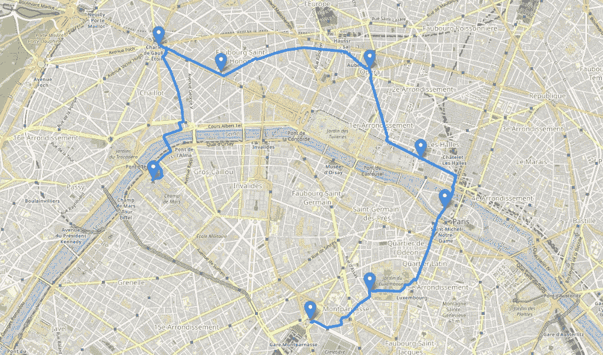
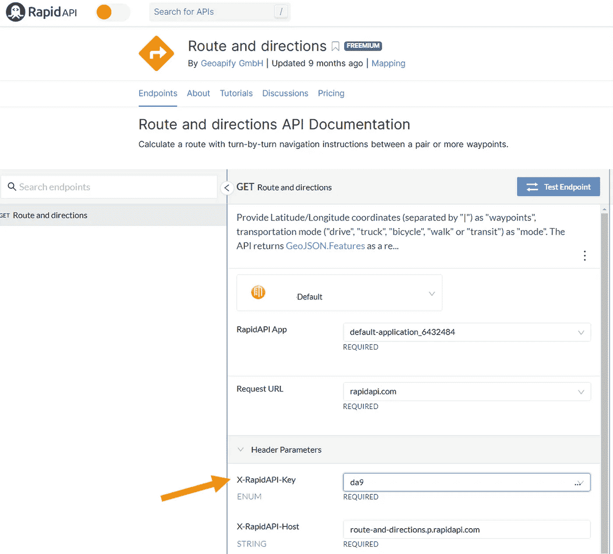
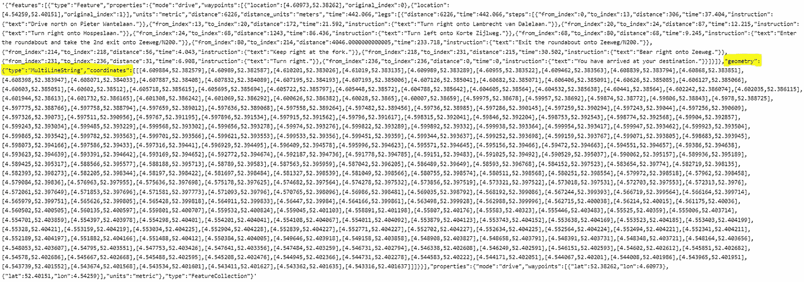
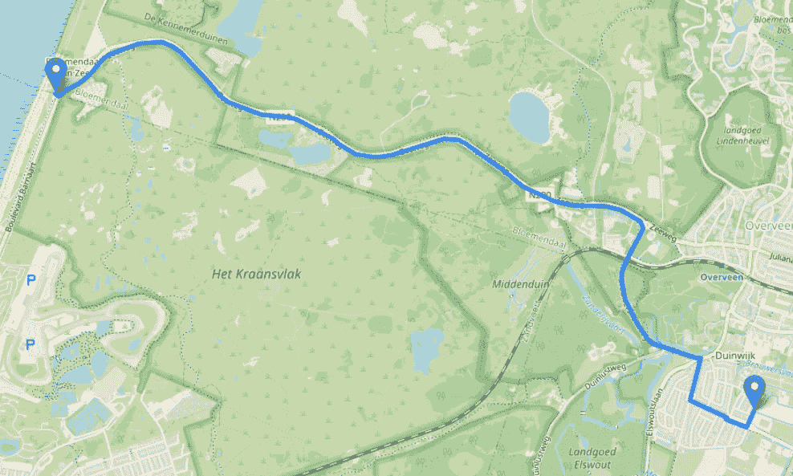
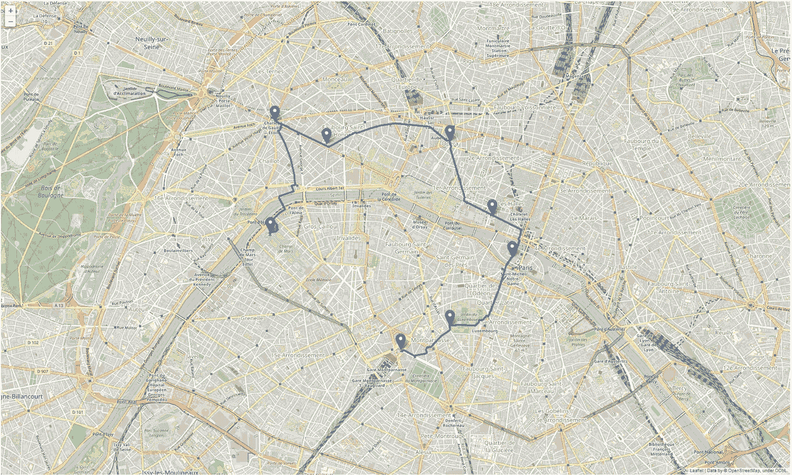

# 如何在地图上绘制路线

> 原文：<https://towardsdatascience.com/how-to-plot-a-route-on-a-map-fb900a7f6605>



巴黎城市漫步。图片作者。

## **python 中带有代码示例的教程。**

对于某些项目来说，在地图上绘制路线可能会很有用。在这里你可以找到你需要的所有信息:包、API 和代码示例。最终，您可以创建漂亮的交互式地图。

# 安装和准备工作

我们将使用 [geopy](https://geopy.readthedocs.io/en/stable/#) 和[folio](https://python-visualization.github.io/folium/)，这两个包都是为使用 python 处理地理空间数据而设计的。首先，使用 conda 或 pip 安装软件包:

```
# conda
conda install -c conda-forge folium
conda install -c conda-forge geopy# pip
pip install folium
pip install geopy
```

除了这些包之外，您还需要能够调用一个 API 来给出多行线段的路径坐标。做这件事的 API 是[路线和方向 API](https://rapidapi.com/geoapify-gmbh-geoapify/api/route-and-directions/) 。您可以在 RapidAPI 上创建一个帐户，并订阅路线和方向 API。RapidAPI 免费计划包括每月 30 000 次免费通话，这是一个不错的开始。还有其他(更商业化的)选项可用，如 [ArcGIS](https://developers.arcgis.com/) 或[谷歌地图](https://developers.google.com/maps/documentation/directions)方向，所以选择适合你的情况。

# 检索两点之间的路线数据

本节末尾的代码使用了我前面提到的[路线和方向 API](https://rapidapi.com/geoapify-gmbh-geoapify/api/route-and-directions/) 。获得两点之间的方向真的很容易:您需要指定两点的纬度和经度。如果您的数据集包含没有经纬度值的地址，不要担心，转换它们很容易。这个过程称为*地理编码*。使用 geopy，其工作方式如下:

```
from geopy.geocoders import Nominatimdef get_lat_long_from_address(address):
   locator = Nominatim(user_agent='myGeocoder')
   location = locator.geocode(address)
   return location.latitude, location.longitude# example
address = 'Zeeweg 94, 2051 EC Overveen'
get_lat_long_from_address(address)
>>> (52.4013046, 4.5425025)
```

在路线和方向 API 中，您还可以指定想要使用的交通方式:驾车、卡车、自行车、步行或公交。

要调用 API，您需要一个 API 键。订阅后，您可以在这里找到它:



快速 API 键，见黄色箭头。图片作者。

调用 API 获取从第一个地址到第二个地址的方向:

```
import requestsdef get_directions_response(lat1, long1, lat2, long2, mode='drive'):
   url = "https://route-and-directions.p.rapidapi.com/v1/routing"
   key = "**YOUR-API-KEY**"
   host = "route-and-directions.p.rapidapi.com"
   headers = {"X-RapidAPI-Key": key, "X-RapidAPI-Host": host}
   querystring = {"waypoints":f"{str(lat1)},{str(long1)}|{str(lat2)},{str(long2)}","mode":mode}
   response = requests.request("GET", url, headers=headers, params=querystring)
   return responseresponse = get_directions_response(52.4013, 4.5425, 52.402, 4.5426)
```

`response`变量是这样的(点击放大):



API 的回应，点击放大。图片作者。

对于我们的路线绘图，我们需要*几何图形*:它包含了我们必须在其间画线的所有坐标，这将在地图上创建路线。

请注意，响应还包含驾驶员指示，如:*‘进入环形交叉路口，从第二个出口进入 zee weg/N200。’很酷，不是吗？您可以将它们用于导航目的。*

现在我们可以用数据来可视化路线了！

# 使用 leav 创建路线图

下面的函数使用两点之间的路径创建地图。输入是我们从对路线和方向 API 的 API 调用中收到的响应。我们从响应中提取坐标。然后我们添加标记(起点和终点)并用`PolyLine`画线。该脚本的一个重要部分创建了最佳缩放，这确保了您的路线将始终在地图的中心。为此，我们使用最小和最大纬度和经度值以及`fit_bounds`。

```
import foliumdef create_map(response):
   # use the response
   mls = response.json()['features'][0]['geometry']['coordinates']
   points = [(i[1], i[0]) for i in mls[0]] m = folium.Map() # add marker for the start and ending points
   for point in [points[0], points[-1]]:
      folium.Marker(point).add_to(m) # add the lines
   folium.PolyLine(points, weight=5, opacity=1).add_to(m) # create optimal zoom
   df = pd.DataFrame(mls[0]).rename(columns={0:'Lon', 1:'Lat'})[['Lat', 'Lon']]
   sw = df[['Lat', 'Lon']].min().values.tolist()
   ne = df[['Lat', 'Lon']].max().values.tolist()
   m.fit_bounds([sw, ne])
   return mm = create_map(response)
```

如果你在笔记本上工作，你可以打电话给`m`，你会看到:



第一条路线绘制在一张漂亮的交互式图表上！图片作者。

漂亮！另一种方法是将图像保存为 html 格式，并在浏览器中打开:

```
m.save('./route_map.html')
```

# 添加地址

功能的改进可以是添加更多的地址。让我们沿着巴黎的亮点创建一个城市漫步。

首先我们指定我们的地址:

```
# touristic route through Paris (Eiffel Tower, Arc de Triomphe, ...)
address1 = '5 Avenue Anatole France, 75007 Paris, France'
address2 = 'Place Charles de Gaulle, 75008 Paris, France'
address3 = '60 Avenue des Champs-Élysées, 75008 Paris, France'
address4 = "Place de l'Opéra, 75009 Paris, France"        
address5 = 'Rue de Rivoli, 75001 Paris, France'
address6 = '10 Bd du Palais, 75001 Paris, France'
address7 = '3 Rue Guynemer, 75006 Paris, France'
address8 = '33 Avenue du Maine, 75015 Paris, France' addresses = [address1, address2, address3, address4, address5, address6, address7, address8]
```

我们需要坐标，而不是地址，所以我们使用之前创建的`get_lat_long_from_address`函数创建一个包含纬度和经度的列表:

```
lat_lons = [get_lat_long_from_address(addr) for addr in addresses]
```

然后，我们用`get_directions_response`函数调用 API 来获取点之间的方向:

```
responses = []for n in range(len(lat_lons)-1):
   lat1, lon1, lat2, lon2 = lat_lons[n][0], lat_lons[n][1], lat_lons[n+1][0], lat_lons[n+1][1]
   response = get_directions_response(lat1, lon1, lat2, lon2, mode='walk')
   responses.append(response)
```

现在我们更改`create_map`函数来处理多个响应:

```
def create_map(responses, lat_lons):
   m = folium.Map()
   df = pd.DataFrame() # add markers for the places we visit
   for point in lat_lons:
      folium.Marker(point).add_to(m) # loop over the responses and plot the lines of the route
   for response in responses:
      mls = response.json()['features'][0]['geometry']['coordinates']
      points = [(i[1], i[0]) for i in mls[0]]

      # add the lines
      folium.PolyLine(points, weight=5, opacity=1).add_to(m) temp = pd.DataFrame(mls[0]).rename(columns={0:'Lon', 1:'Lat'})[['Lat', 'Lon']]
      df = pd.concat([df, temp]) # create optimal zoom
   sw = df[['Lat', 'Lon']].min().values.tolist()
   sw = [sw[0]-0.0005, sw[1]-0.0005]
   ne = df[['Lat', 'Lon']].max().values.tolist()
   ne = [ne[0]+0.0005, ne[1]+0.0005]
   m.fit_bounds([sw, ne])
   return mm = create_map(responses, lat_lons)
```

`m`看起来是这样的:



游览巴黎。点击放大。图片作者。

这里一个有趣的附加功能是通过优化计算所有地址之间的最短或最快路线。以下文章中的更多信息(示例 2):

[](/how-to-handle-optimization-problems-daf97b3c248c) [## 如何处理优化问题？

### 带有解决方案和代码的简单示例。

towardsdatascience.com](/how-to-handle-optimization-problems-daf97b3c248c) 

# 结论

在这篇文章中，您学习了使用 follow、geopy 和 route and directions API 在交互式地图上创建路线。你可以以多种不同的方式使用地图，比如在 flask 应用程序中使用[或者与 plotly 结合使用](http://python-visualization.github.io/folium/flask.html)[来进行很酷的交互](/how-to-embed-interactive-plotly-visualizations-in-folium-map-pop-ups-c69c818a8cd9)。您也可以决定将地图保存为代码为`m.save('./route_map.html')`的 html 文件。这使得嵌入文件成为可能:`<iframe src="route_map.html" height=”500" width="500"></iframe>`

感谢阅读！

*别忘了* [*订阅*](https://hennie-de-harder.medium.com/subscribe) *如果你想在我发表新文章时收到电子邮件。*