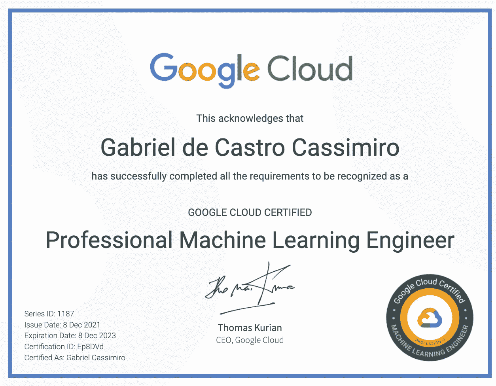

# 如何备考 GCP 专业机器学习工程师考试

> 原文：<https://towardsdatascience.com/how-to-prepare-for-the-gcp-professional-machine-learning-engineer-exam-b1c59967355f>

照片由[思想目录](https://unsplash.com/@thoughtcatalog?utm_source=unsplash&utm_medium=referral&utm_content=creditCopyText)在 [Unsplash](https://unsplash.com/s/photos/study?utm_source=unsplash&utm_medium=referral&utm_content=creditCopyText) 上拍摄

# 如何备考 GCP 专业机器学习工程师考试

## 课程回顾，学习技巧，以及我是如何做到的

所以我决定参加 GCP 专业机器学习工程(PMLE)考试，但我只有两个月的时间来获得足够的认证，使我的公司成为 GCP 的合作伙伴。我知道这将是一个艰难的挑战，但我还是欣然接受了。

在这篇文章中，我将分享帮助我学习和准备考试的东西，以及你不应该浪费时间的东西。阅读像这样的反馈也有助于获得关于考试的不同观点，所以我将从[这个伟大的知识库](https://github.com/sathishvj/awesome-gcp-certifications/blob/master/professional-machine-learning-engineer.md)开始，它有许多关于 GCP 和其他认证的帖子。我建议你在开始学习之前先读一读。

像往常一样，这是我的证明:

# 测试反馈

专业机器学习工程师认证考试被认为是最难的 GCP 认证之一，原因有两个:内容非常广泛，大多数问题都有不止一个正确答案，但只有一个最佳答案。

该测试涵盖了如何使用机器学习技术解决现实世界的商业问题，以及如何在正确的上下文中使用最佳可用解决方案(显然是由 GCP 提供的)。

了解考试涵盖的内容是学习中最重要的部分，因为有了这些信息，你可以在观看课程时专注于什么是重要的。所以你要做的第一件事就是仔细阅读[官方 GCP 认证网站](https://cloud.google.com/certification/machine-learning-engineer)。在那里你可以找到考试内容、规则、考试地点和其他重要信息。

另一个很好的起点是做这些由谷歌提供的[样题，看看你在测试中会有什么表现。从那里你可以专注于学习，更加关注你不知道的东西。](https://docs.google.com/forms/d/e/1FAIpQLSeYmkCANE81qSBqLW0g2X7RoskBX9yGYQu-m1TtsjMvHabGqg/viewform)

# 以往经验推荐

[官方考试](https://cloud.google.com/certification/machine-learning-engineer)指南不要求任何先决条件，但是它建议:

> 3 年以上行业经验，包括 1 年或以上使用谷歌云设计和管理解决方案的经验。

那与我的情况相去甚远。到我参加考试的时候，我已经有了将近一年的云经验(AWS ),而在 GCP 的经验还不到一个月。因此，我将在此给出我对该建议的看法:

岁月不能决定你对某件事了解多少，但有一次有意义的经历可以。在我看来，如果你对任何云都有一些经验，并且了解概念和产品的基础，你就可以开始了。

作为一名机器学习工程师，你需要使用 ML 模型解决问题，为该模型提供数据，并创建持续利用该解决方案产生价值的方法。

在机器学习方面，如果你有建立模型的经验，你将不得不学习得少得多。如果您知道如何区分需要分类、建议或回归模型的问题，并且知道在哪些情况下需要 DNN 或基本线性回归，您将能够使用 GCP 解决方案部分将研究重点放在为模型提供数据和为用户提供预测上。

## 总结**之前的经历**部分:

*   你不需要 3 年以上的经验，但是拥有一些云提供商的经验会节省你学习的时间。
*   拥有机器学习的经验是必要的，但也足够让你能够使用 ML 来创建商业问题的解决方案。
*   使用 GCP 的实际操作经验可以通过谷歌提供的一些课程获得，并且足够你参加考试。

# 如何学习

这项考试的主要知识来源是谷歌设计的一组课程，可在 Coursera 上获得。然而，并不是所有的课程都与考试内容有相同的相关性。这就是为什么我会对它们进行排名，并对下面的每一个进行评论。

首先，在开始上课之前，我有一些值得一提的准备技巧。如果你只关心课程，请随意跳过，但这对我吸收更多相关的东西帮助很大。

学习课程时，你必须记住的主要事情是:

> 如何使用 GCP 解决方案和 ML 模型解决实际业务问题

你需要了解 GCP 所有的 ML 和数据解决方案，它们是做什么的，它们的优势和劣势是什么，以及每个解决方案的使用案例。

**记住:**很多问题都可以用不同的方法解决，但结果都很好，测试会一直问你最好的**解决方案**。

所以我有两种方法帮助我在观看课程时了解这些特征:

## 抽认卡

我使用抽认卡来记住每个解决方案的功能、特点和用例。然后我试着研究了几次，直到我不用看答案就能解释所有的问题。

这是一个非常丰富的技巧，因为你在抽认卡上写了一个简短的解释，锻炼了你总结的能力。然后你试着每隔几天做一次，锻炼你的长期记忆，最后，试着向某人解释一下，看看你是否真的学会了那个概念。

我用过并推荐使用一个免费的抽认卡应用程序。

## 思维导图

另一个组织主要概念的好方法是创建思维导图。通过这种方式，您可以轻松地将产品和解决方案与业务问题和优势联系起来。

特别是我用了 [mind meister](https://mindmeister.com/) ，但是有很多很棒的免费解决方案。

## 课程

最后，我们来看看谷歌提供的课程及其内容。

[***备考谷歌云机器学习工程师职业证书***](https://www.coursera.org/professional-certificates/preparing-for-google-cloud-machine-learning-engineer-professional-certificate?)

这是准备的主要课程，全神贯注地观看它们是最重要的。

它从 [*Google Cloud 大数据和机器学习基础*](https://www.coursera.org/learn/gcp-big-data-ml-fundamentals?specialization=preparing-for-google-cloud-machine-learning-engineer-professional-certificate) 中的一些云基础知识开始，如果你已经在 GCP 使用过数据解决方案，你可以跳过它，否则，你应该这样做，因为它提供了 GCP 数据解决方案的第一视角。这也是仅有的展示数据工程解决方案的课程之一，所以如果你不知道，就去做吧。

第二和第三门课程展示了 GCP 提供的一些 ML 解决方案和 API。记住他们做什么和他们的用例是非常重要的。

第五、第六和第七门课程将深入探讨 ML 解决方案、特征工程和建模产品。

最后三门课程将涵盖如何利用所有最佳实践部署和创建有效的 ML 管道。在我看来，这些才是最重要的课程([生产机器学习系统](https://www.coursera.org/learn/gcp-production-ml-systems?specialization=preparing-for-google-cloud-machine-learning-engineer-professional-certificate)、 [MLOps 基础](https://www.coursera.org/learn/mlops-fundamentals?specialization=preparing-for-google-cloud-machine-learning-engineer-professional-certificate)、Google Cloud 上的 [ML 管道](https://www.coursera.org/learn/ml-pipelines-google-cloud?specialization=preparing-for-google-cloud-machine-learning-engineer-professional-certificate))。

所有这些课程都提供了在真实的 GCP 环境中实施解决方案的实验。它们是学习事物如何工作以及如何设置它们的好方法。

一些实验室会有大的 Jupyter 笔记本，上面有大量的代码。在这些情况下，我的建议是关注代码在做什么，不要担心理解和学习如何自己编码。如果以后你需要自己实现代码，只要去 Google 提供的开放 [GitHub 库](https://github.com/GoogleCloudPlatform/training-data-analyst)记住语法就行了。

## 课程总结:

*   你应该使用抽认卡、思维导图或其他技术来记住许多关于解决方案的细节。
*   测试的主要重点是 MLOps 和 ML 管道，但是，不要放弃数据工程知识和机器学习模型特定的问题。
*   不要关注代码的语法，要关注它的作用和好处。

# 模拟测试

最后，你**要**做模拟测试。这对于检查你的知识和学习如何阅读问题是至关重要的。

## 回答问题

这最后一部分决定了你能否通过。考试很大，有 60 道题，120 分钟做，这意味着你每道题有 2 分钟。你必须阅读问题，寻找问题的特征，这将有助于你找到正确的解决方案。我在这里举个例子:

*你在一家公共交通公司工作，需要建立一个模型来* ***估计多条交通路线*** *的延误时间。预测是* ***在应用中直接实时提供给用户。*** *因为不同的季节和人口的增加会影响数据的相关性，你将* ***每个月重新训练模型*** *。你想要遵循谷歌推荐的最佳实践。你应该如何* ***配置预测模型的端到端架构*** *？*

*   *答:配置 Kubeflow Pipelines，安排从培训到部署模型的多步骤工作流程。*
*   *B .使用在 BigQuery ML 上训练部署的模型，用 BigQuery 中的调度查询特性触发再训练。*
*   *C .编写云函数脚本，在 AI 平台上启动由云调度程序触发的培训和部署作业。*
*   *D .使用 Cloud Composer 以编程方式安排数据流作业，该作业执行从培训到部署模型的工作流。*

粗体字是问题最相关的部分。你必须注意细节，比如实时批处理、再训练、部署和架构。最后一点也是最重要的一点，因为他们通常会要求无代码解决方案、无服务器，甚至是对基础架构的完全控制。这将确定解决该特定请求的最佳方案。

在这种情况下，Kubeflow 是唯一能够提供端到端部署和再培训功能的解决方案。所以答案是 a。

另一个好的建议是，在找到问题中最相关的信息后，排除明显错误的答案，这样你就可以有更少的选项来比较。

## 模拟测试链接

我做了几次模拟测试，但并不完美。所有这些问题都有很多错误答案，但以下是每个问题的链接和评论:

考试题目:这是我做过的最好的模拟考试。网站上没有给出正确的答案，但是，所有的问题都有一个讨论，人们对每种可能性都提出了自己的观点。这是新知识的巨大来源，对我帮助很大。

[谷歌样题:](https://docs.google.com/forms/d/e/1FAIpQLSeYmkCANE81qSBqLW0g2X7RoskBX9yGYQu-m1TtsjMvHabGqg/viewform)既然你已经完成了学习，你应该重温一下你在学习之初做的第一道样题。

还有其他付费备考，但我不能复习，因为我只做了免费的。这些网站通常会提供一些免费的样题，但是我做的那些有着我不同意的奇怪答案。所以你要自担风险。

如果我必须再做一次，我会支付其余的考试题目，并在检查正确答案时只关注讨论。

感谢您的阅读，祝您在成为 GCP 认证专业机器学习工程师的旅途中好运！

如果你想支持我的工作，你可以给我买杯咖啡:

 [## Gabriel Cassimiro 是一名数据科学家，他向社区分享免费内容

### 嘿👋我刚刚在这里创建了一个页面。你现在可以给我买杯咖啡了！

www.buymeacoffee.com](https://www.buymeacoffee.com/cassimiro)