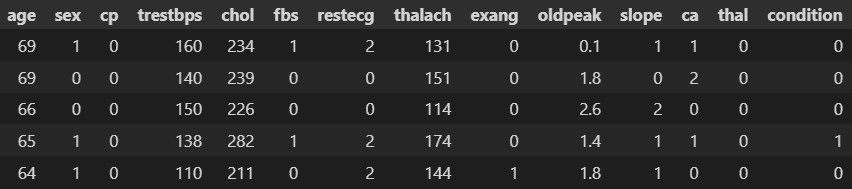
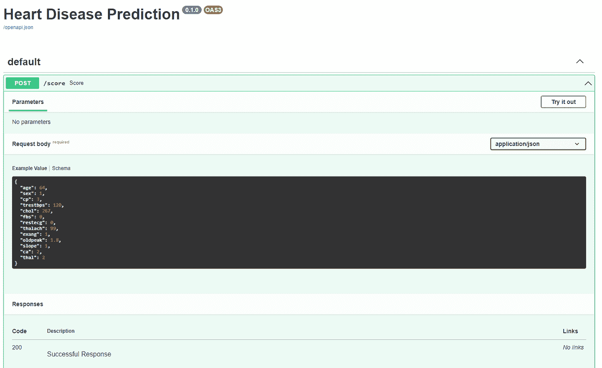
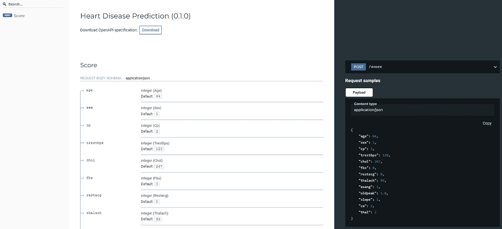
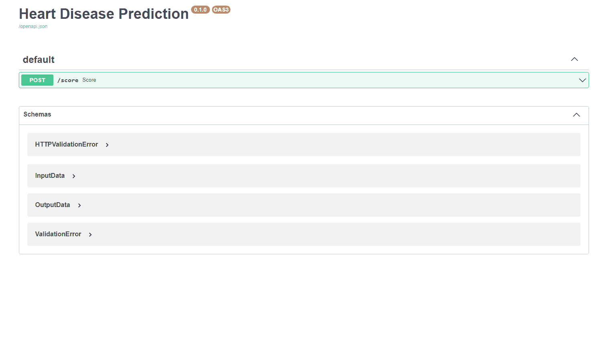
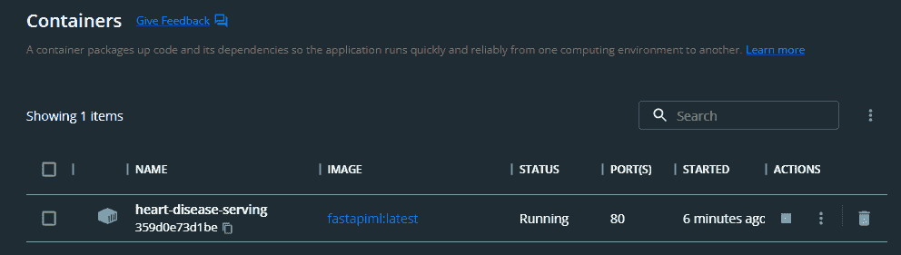

# 如何为生产准备 Scikit-Learn 模型

> 原文：<https://towardsdatascience.com/how-to-prepare-scikit-learn-models-for-production-4aeb83161bc2>

## 利用 FastAPI 和 Docker 服务 scikit-learn 模型


图片来自 [Pixabay](https://pixabay.com/photos/ready-prepared-preparation-2379042/)

# 介绍

数据科学家花费大量精力收集业务需求，执行探索性数据分析、数据预处理、功能工程、超参数调整和模型评估，结果却让他们的模型停留在本地笔记本电脑环境中。为了释放训练模型的全部价值，模型必须对下游应用程序可用。在本文中，我们将介绍使用 Docker 和 FastAPI 向下游应用程序提供 scikit-learn 机器学习模型的步骤。本质上，我们将训练一个模型，将模型包装成 API，并将应用程序容器化。

**Docker 是什么？**

> Docker 是一个开发、发布和运行应用程序的开放平台。它提供了在松散隔离的环境(称为容器)中打包和运行应用程序的能力。容器是轻量级的，包含运行应用程序所需的一切，因此您不需要依赖主机上当前安装的内容[1]。

**什么是 FastAPI？**

> *FastAPI 是一个现代、快速(高性能)的 web 框架，用于基于标准 Python 类型提示使用 Python 3.7+构建 APIs。*

本文中的内容按以下顺序涵盖:

1.  设置
2.  数据
3.  项目目录
4.  火车模型
5.  使用 FastAPI 创建 API
6.  本地测试 API
7.  创建 docker 图像
8.  docker 容器中的测试 API

# 设置

这是用于演练的设置。

1.  Visual Studio 代码
2.  Docker 桌面
3.  包装

```
fastapi>=0.68.0,<0.69.0
pydantic>=1.8.0,<2.0.0
uvicorn>=0.15.0,<0.16.0
numpy==1.23.3
scikit-learn==0.23.2
joblib==1.1.0
pandas==1.4.4
```

# 数据

在这个例子中，我们将使用心脏病数据集[3]。任务是在给定患者的各种属性的情况下，预测患者是否患有心脏病。`condition`是目标变量，其中`1`表示存在心脏病，`0`表示不存在心脏病。



作者图片

# 项目目录

项目目录结构如下:

```
G:.
│   requirements.txt
│   Dockerfile
│   app.py
|
├───data
│       heart-disease.csv
│
└───model
    │   train.py
    │   heart-disease-v1.joblib
```

*   `[app.py](<http://app.py>)`:包含 API 逻辑
*   `/data`:训练数据(`heart-disease.csv`)保存在该目录下
*   `/model`:训练好的模型和训练脚本保存在这个目录下
*   `[train.py](<http://train.py>)` : scikit-learn 模型在这个脚本中被训练
*   `Dockerfile`:容器化 API 的 Dockerfile
*   `requirements.txt`:包含 python 包的需求

# 火车模型

文件名:`train.py`

为了演示 FasAPI 和 Docker，我们保持培训简单，不包括任何预处理或功能工程。从`/data`目录中读取数据，用 10 棵树训练一个随机森林分类器。然后，训练好的模型被保存为`/model`目录中的`.joblib`文件。

```
#train.pyfrom os import PathLike
from sklearn.ensemble import RandomForestClassifier
from sklearn.model_selection import train_test_split
from sklearn.metrics import classification_report
from joblib import dump
import pandas as pd
import pathlibdf = pd.read_csv(pathlib.Path('data/heart-disease.csv'))
y = df.pop('condition')
X = dfX_train, X_test, y_train, y_test = train_test_split(X,y, test_size = 0.2)print ('Training model.. ')
clf = RandomForestClassifier(n_estimators = 10,
                             max_depth=2,
                             random_state=0)
clf.fit(X_train, y_train)print ('Saving model..')
dump(clf, pathlib.Path('model/heart-disease-v1.joblib'))
```

# 创建 API

文件名:`app.py`

这是大部分活动发生的地方。

**导入库**

```
from fastapi import FastAPI
from pydantic import BaseModel
import numpy as np
from joblib import load
import pathlib
```

**创建一个 FastAPI 实例**

```
app = FastAPI(title = 'Heart Disease Prediction')
```

**加载训练好的模型**

```
model = load(pathlib.Path('model/heart-disease-v1.joblib'))
```

**定义请求模型**

我们定义 API 所需的输入数据。格式由字段名、数据类型和可选默认值组成。

```
class InputData(BaseModel):
    age:int=64
    sex:int=1 
    cp:int=3
    trestbps:int=120
    chol:int=267
    fbs:int=0
    restecg:int=0
    thalach:int=99
    exang:int=1
    oldpeak:float=1.8
    slope:int=1
    ca:int=2
    thal:int=2
```

**定义响应模型**

我们可以用类似的方式定义响应数据。

```
class OutputData(BaseModel):
    score:float=0.80318881046519
```

**定义发布请求**

```
@app.post('/score', response_model = OutputData)
def score(data:InputData):
    model_input = np.array([v for k,v in data.dict().items()]).reshape(1,-1)
    result = model.predict_proba(model_input)[:,-1]

    return {'score':result}
```

上面的代码片段里有很多事情在进行，我们来分解一下。

让我们先来看看`@app.post('/score', response_model = OutputData)`。

*   `/score`是路线名称。它是 URL 的最后一部分，例如“[http://my-url.com/score"](http://my-url.com/score%E2%80%9D)”。
*   `@app.post`表示`/score`路由接受 post 请求。
*   `@app.post('/score')`告诉 FastAPI 下面的函数(即`def score`)负责处理去往`/score`路线的请求。
*   `response_model`表示 API 将返回给调用者的格式数据。

在`@app.post`下面我们有`score`功能。

*   score 函数需要一个`data`参数，它采用我们之前定义的`InputData`的格式。
*   score 函数然后解析`data`并将其转换成一个 numpy 数组
*   该数组被传递给`.predict_proba`方法，该方法返回一个介于 0-1 之间的分数。

**运行实时服务器**

我们可以通过以下方式在本地启动 API。在终端中，在项目根目录下运行:

```
uvicorn app:app --reload
```

成功部署的输出如下所示:

```
INFO:     Will watch for changes in these directories: ['path/to/project']
INFO:     Uvicorn running on <http://127.0.0.1:8000> (Press CTRL+C to quit)
INFO:     Started reloader process [24040] using StatReload
INFO:     Started server process [26612]
INFO:     Waiting for application startup.
INFO:     Application startup complete.
```

上述代码块中的第二行显示了应用程序被提供的 URL。

**自动化 API 文档**

基于 API 定义，FastAPI 在 Swagger 和 Redoc UI 中自动生成文档。使用`[http://127.0.0.1:8000/docs](http://127.0.0.1:8000/docs.)` [访问 Swagger API 文档。](http://127.0.0.1:8000/docs.)



作者图片

而 Redoc API 文档使用`[http://127.0.0.1:8000/redoc](http://127.0.0.1:8000/redoc.)` [。](http://127.0.0.1:8000/redoc.)



作者图片

# 本地测试 API

此时，可以通过 swagger UI、终端或使用 python 来测试 API。

**霸气 UI**



作者图片

**端子**

我们可以使用`curl`通过终端调用 API。`score`函数所需的`data`参数通过`curl`中的`-d`参数传递。

```
curl -X 'POST' \\
  '<http://127.0.0.1:8000/score>' \\
  -H 'accept: application/json' \\
  -H 'Content-Type: application/json' \\
  -d '{
  "age": 64,
  "sex": 1,
  "cp": 3,
  "trestbps": 120,
  "chol": 267,
  "fbs": 0,
  "restecg": 0,
  "thalach": 99,
  "exang": 1,
  "oldpeak": 1.8,
  "slope": 1,
  "ca": 2,
  "thal": 2
}'
```

**Python**

可以使用 python 的`requests`包调用 API。`score`函数所需的`data`参数通过`request.post`中的`json`参数传递。

```
import requestsbody = {
    "age": 64,
    "sex": 1,
    "cp": 3,
    "trestbps": 120,
    "chol": 267,
    "fbs": 0,
    "restecg": 0,
    "thalach": 99,
    "exang": 1,
    "oldpeak": 1.8,
    "slope": 1,
    "ca": 2,
    "thal": 2
    }response = requests.post(url = '<http://127.0.0.1:8000/score>',
              json = body)print (response.json())
# output: {'score': 0.866490130600765}
```

# 创建 Docker 图像

太好了！API 在本地工作。通常，我们可能需要在云环境中部署 API，如 AWS、Azure 或 GCP。实现这一点的方法之一是将您的应用程序容器化。

**定义 python 需求**

让我们在`requirements.txt`中定义要求

```
# requirements.txt
fastapi>=0.68.0,<0.69.0
pydantic>=1.8.0,<2.0.0
uvicorn>=0.15.0,<0.16.0
numpy==1.23.3
scikit-learn==0.23.2
joblib==1.1.0
```

**定义 Dockerfile**

```
#Dockerfile
FROM python:3.8WORKDIR /appCOPY ./requirements.txt ./requirements.txtRUN pip install --no-cache-dir --upgrade -r ./requirements.txtCOPY ./app.py .
COPY ./model ./modelCMD ["uvicorn", "app:app", "--host", "0.0.0.0", "--port", "80"]
```

does 文件执行以下操作:

1.  从 Docker hub 获取 python 3.8 图像
2.  创建一个名为`/app`的工作目录
3.  将`requirements.txt`复制到工作目录
4.  安装`requirements.txt`中定义的软件包
5.  将代码和模型复制到工作目录中
6.  `CMD`当容器启动时，在端口 80 上启动服务器

**构建 Docker 映像**

```
# at the project root folder
docker build -t fastapiml .
```

# 在 Docker 容器中测试

**启动码头集装箱**

```
docker run -d --name heart-disease-serving -p 80:80 fastapiml
```

正在运行的容器将显示在 Docker 桌面中。



作者图片

**自动化 API 文档**

与之前类似，我们可以使用以下方式访问 API 文档:

1.  招摇:`[http://127.0.0.1/docs](http://127.0.0.1/docs)`
2.  Redoc: `[http://127.0.0.1/redoc](http://127.0.0.1/redoc)`

docker 容器中运行的 API 可以像以前一样以类似的方式进行测试。要么在终端使用 Swagger UI、`curl`命令，要么使用 python 的`requests`包。

# 结论

在本文中，我们讨论了让下游应用程序可以访问机器学习模型的重要性。我们可以通过使用 FastAPI 的 API 来服务这些模型，从而释放机器学习模型的价值。使用 FastAPI 的一个优点是它在 Swagger 中的自动文档，这也允许进行快速测试。我们还演示了如何将 FastAPI 应用程序容器化，从而更容易部署到云中。

[加入灵媒](https://medium.com/@edwin.tan/membership)阅读更多这样的故事！

# 参考

[1] [Docker 概述| Docker 文档](https://docs.docker.com/get-started/overview/)

[2][FastAPI(tiangolo.com)](https://fastapi.tiangolo.com/)

[3]来自 [UCI 机器学习库](https://archive-beta.ics.uci.edu/ml/datasets/heart+disease)的心脏病数据集。由 4.0 在 CC 下授权。