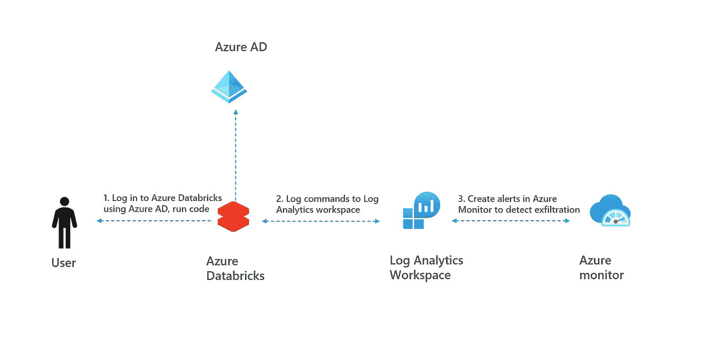
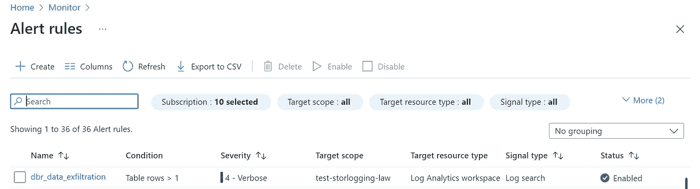

# 如何防止 Azure 数据块的数据泄露

> 原文：<https://towardsdatascience.com/how-to-prevent-data-exfiltration-from-azure-databricks-c1c55df5c9f2>

## 使用数据块审计日志、日志分析和 Azure Monitor


检测数据泄露—图片由[凯文·Ku 在 Unsplash](https://unsplash.com/@ikukevk) 上提供

# 1.介绍

Azure Databricks 是企业做数据科学的热门工具。但是，应防止使用数据块来泄漏数据。为此，将为 Azure Databricks 实施一个[安全基线](https://docs.microsoft.com/en-us/security/benchmark/azure/baselines/databricks-security-baseline)。[网络架构](https://databricks.com/blog/2020/03/27/data-exfiltration-protection-with-azure-databricks.html)使用 [VNET 注入、](https://docs.microsoft.com/en-us/azure/databricks/administration-guide/cloud-configurations/azure/vnet-inject) [安全集群连接](https://docs.microsoft.com/en-us/azure/databricks/security/secure-cluster-connectivity)和 [Azure AD 条件接收](https://docs.microsoft.com/en-us/azure/databricks/administration-guide/access-control/conditional-access#enable-conditional-access-for-azure-databricks)都是实现深度防御的关键。

安全基线的一部分还包括启用审计日志记录。在这篇 blogpost 和 git repo `[azure-monitor-detect-exfiltration-databricks](https://github.com/rebremer/azure-monitor-detect-exfiltration-databricks)`中，讨论了如何使用 [Databricks audit logging](https://docs.microsoft.com/en-us/azure/databricks/administration-guide/account-settings/azure-diagnostic-logs#--configure-verbose-audit-logs) 、Log Analytics 工作区中的 kusto 和 Azure Monitor 中的警报规则来防止数据泄露。基本原理如下:

*   尽管审计日志本身不能保护公司数据失窃，但它可以用来对数据泄漏进行警报和取证。这可以再次用于*阻止*员工窃取数据(“我们会找到你”)
*   详细审核日志的设置简单且成本低廉，没有能力设置所有深度防御措施的小型公司也可以使用。

另请参见下面的架构。



1.Azure Databricks 审计日志记录检测泄漏-作者图片

在这篇博文的剩余部分，我们将更详细地解释数据泄漏检测。在第 2 章中，部署了资源并创建了一个简单的警报。在第 3 章中，我们将更详细地讨论 kusto 脚本，并使用 Azure CLI 进行部署。

# 2.设置数据块数据泄漏检测

在本博客的剩余部分，使用以下步骤部署项目:

*   2.1 部署资源
*   2.2 在数据块中启用详细审计日志记录
*   2.3(可选)使用 Azure 门户创建 Azure Monitor 警报

## 2.1 部署资源

本教程需要以下资源，并且需要部署这些资源:

*   [Azure data bricks Premium Plan](https://docs.microsoft.com/en-us/azure/databricks/scenarios/quickstart-create-databricks-workspace-portal?tabs=azure-portal#create-an-azure-databricks-workspace)**(仅 Premium 支持日志记录)**
*   **[日志分析工作区](https://docs.microsoft.com/en-us/azure/azure-monitor/logs/quick-create-workspace?tabs=azure-portal)(建议将工作区部署在与 Azure Databricks 相同的区域)**

## **2.2 在数据块中启用详细审计日志记录**

**在此步骤中，启用了 Databricks 中的详细审核日志记录。需要执行以下两个步骤:**

*   **[配置数据块](https://docs.microsoft.com/en-us/azure/databricks/administration-guide/account-settings/azure-diagnostic-logs#configure-diagnostic-log-delivery)的诊断日志传送。确保所有日志都归入在 2.1 中创建的日志分析工作区。**
*   **[在数据块](https://docs.microsoft.com/en-us/azure/databricks/administration-guide/account-settings/azure-diagnostic-logs#enable-or-disable-verbose-audit-logs)中启用详细审计记录。确保您以 Databricks admin 身份登录，转到 Azure Databricks [管理控制台](https://docs.microsoft.com/en-us/azure/databricks/administration-guide/admin-console)，单击工作区设置，然后启用**详细审计日志****

## ****2.3** (可选)使用 Azure 门户创建 Azure Monitor 警报**

**在此步骤中，会生成一个简单的警报。在步骤 3.2 中，使用 Azure CLI 部署了完整的 Databricks 渗出脚本，因此可以跳过这一段。需要执行以下步骤:**

*   **[在 Azure 门户](https://docs.microsoft.com/en-us/azure/azure-monitor/alerts/alerts-log#create-a-new-log-alert-rule-in-the-azure-portal)中创建一个新的日志提醒规则。以`DatabricksNotebook`为查询，以表格行为度量，以 Cound 为聚集类型。作为通知类型，向您自己发送电子邮件。**

**如果您正确配置了规则，并且在 Databrick notebook 中运行了命令，将在 Databrick notebook 表的日志分析工作区中创建审核日志记录，这将创建一个导致电子邮件的警报。**

# **3.Kusto 数据渗透脚本示例**

**在本章中，我们将讨论一个数据渗透脚本，然后将其部署到 Azure Monitor。为此，使用了 Azure CLI 脚本。**

*   **3.1 解释 Kusto 渗透脚本**
*   **3.2 使用 Azure CLI 创建 Azure Monitor 警报**

## **3.1 解释 Kusto 渗透脚本**

**在脚本`[databricksnotebook.kusto](https://github.com/rebremer/azure-monitor-detect-exfiltration-databricks/blob/main/detection/databricksnotebook.kusto)`中，使用 kusto 检测到三种不同的数据泄露场景。这些情景可以解释如下:**

*   **场景 1。向 dbfs 写入数据:最好不要在 dbfs 上存储数据，参见[这里的](https://github.com/Azure/AzureDatabricksBestPractices/blob/master/toc.md#do-not-store-any-production-data-in-default-dbfs-folders)。这也是因为数据可以通过 dbfs 渗透**
*   **场景 2。下载数据集。数据框架可以显示在数据块中，并且是可视化的。还有一个下载按钮，使用户能够在本地存储数据**
*   **场景 3:在笔记本中多次显示数据。当使用 display()命令时，只有有限的一组数据被打印到浏览器。然而，用户可以多次执行显示命令，kusto 中窗口可以用于检测这种情况。**

**场景 2 的示例片段如下所示:**

```
...                         
//                             
// scenario 2: large download
//
let scenario2 = (
DatabricksNotebook
| where ActionName == "downloadPreviewResults" or ActionName == "downloadLargeResults"
| project TimeGenerated, Identity, ActionName, MyJson = parse_json(RequestParams)
| extend type= "scenario 2: large download"                             | project type, TimeGenerated, Identity, ActionName, MyJson.executionTime, notebook_text=MyJson.commandText, count_row=1                             );
...

scenario1a                              
| union scenario1b, scenario2, scenario3a, scenario3b                             | order by TimeGenerated
```

**整个脚本也可以在日志分析工作区中运行进行测试，另请参见下图:**

****

**3.1 日志分析工作区中的 Kusto 脚本—按作者分类的图像**

## **3.2 使用 Azure CLI 创建 Azure Monitor 警报**

**在下面的脚本中，代码被部署 kusto 脚本被部署到 Log Analytics 工作区。**

```
# 0\. Preliminaries
#
# - Chapter 2\. Databricks data exfiltration detection is done# 1\. Set variables
#
$SUB='<<your subscription id>>'
$EMAIL='<<your email address>>'
$LAW_RG='<<your resource group with Log Workspace analytics>>'
$LAW_NAME='<<your Log Workspace Analytics name>>'
$ALERT_GROUP_NAME='dbr_exf_detection_ag'
$ALERT_RULE_NAME='dbr_data_exfiltration'# 2\. Log in
#
az login
az account set --subscription $SUB# 3\. Create Action Group
#
az monitor action-group create -n $ALERT_GROUP_NAME -g $LAW_RG --action email rebremer $EMAIL
$action_id=$(az monitor action-group show -n $ALERT_GROUP_NAME -g $LAW_RG | ConvertFrom-Json).id# 4\. Read Kusto detection file, escape special characters
#
Set-Location deployment
$kusto_script = Get-Content "..\detection\databricksnotebook.kusto" -Raw
$kusto_script = $kusto_script -replace "`r`n", "\n"
$kusto_script = $kusto_script -replace '"', '\"'# 5\. Add Kusto file to ARM template (using ARM params does not work)
#
$arm_data = Get-Content "arm_dbr_exf_script.json.template" -Raw
$arm_data = $arm_data -replace "{dbr_exf_script}", $kusto_script
$arm_data | Out-File -encoding ASCII arm_dbr_exf_script.json# 5\. Create Alert rule using ARM template
#
$law_id="/subscriptions/$SUB/resourcegroups/$LAW_RG/providers/microsoft.operationalinsights/workspaces/$LAW_NAME"
az deployment group create --name AlertDeploymentv4 --resource-group $LAW_RG --template-file arm_dbr_exf_script.json --parameters scheduledqueryrules_dbr_data_exfiltration_name=$alert_rule_name
actionGroups_test_dbrdataexf_ag_externalid=$action_id
workspaces_test_storlogging_law_externalid=$law_id
```

**当一切部署成功时，Azure Monitor 中会创建一个警报规则。**

****

**3.2 警报规则成功创建—按作者分类的图像**

# **4.结论**

**Azure Databricks 是企业做数据科学的热门工具。由于企业通常拥有大量敏感数据，因此应防止数据外泄。应实施 Azure 数据块的[安全基线](https://docs.microsoft.com/en-us/security/benchmark/azure/baselines/databricks-security-baseline)。在这篇 blogpost 和 git repo `[azure-monitor-detect-exfiltration-databricks](https://github.com/rebremer/azure-monitor-detect-exfiltration-databricks)`中，讨论了如何使用 Databricks 审计日志、日志分析中的 kusto 和 Azure monitor 来扩展安全基线。另请参见下面的架构。**

****

**4.Azure Databrisks 审计日志记录检测泄漏-作者图片**