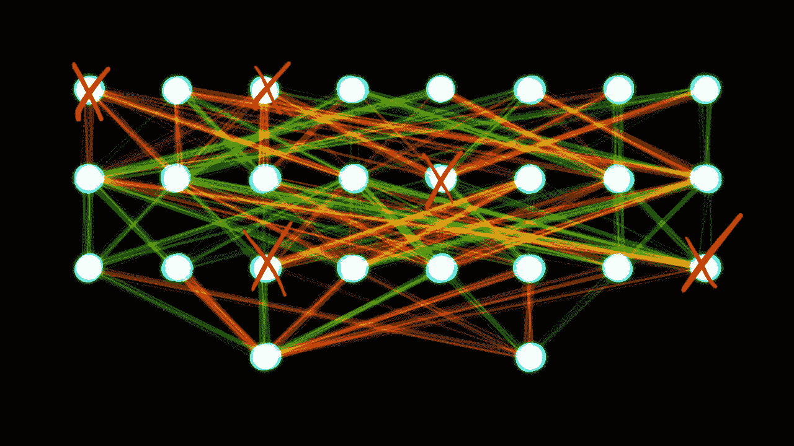
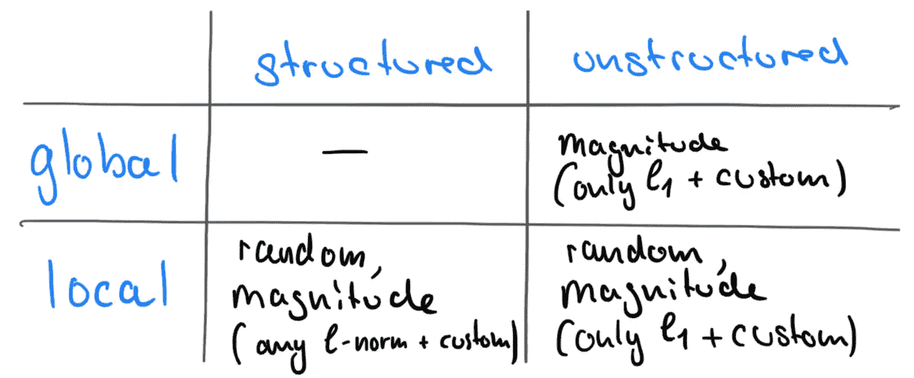

# 如何用 PyTorch 修剪神经网络

> 原文：<https://towardsdatascience.com/how-to-prune-neural-networks-with-pytorch-ebef60316b91>

## 流行的框架内置了对这一伟大技术的支持，这一技术提高了泛化能力、准确性和推理速度

我一直认为修剪需要单独的模块，但是我最近发现 PyTorch 内置了对它的支持。文档有点缺乏，所以我决定写这篇文章，向你展示一些技巧和窍门！



Wikimedia Commons 上的图片由 [Akritasa](https://commons.wikimedia.org/wiki/File:Two-layer_feedforward_artificial_neural_network.png) 提供。作者修改。根据 CC-BY-SA-4.0 获得许可。

# 什么是修剪？

修剪是一种从神经网络中移除权重或偏差(参数)的技术。如果做得好，这将减少模型的内存占用，提高泛化能力，加快推理速度，并允许用更少的样本进行训练/微调。当然，您不能只是从您的网络中随机删除参数并期望它执行得更好，但是您可以确定哪些参数对您的目标是不必要的并删除它们。不用说，你还应该注意你移除了多少参数:如果你移除了太多，你的网络将会表现得更差，或者如果你阻塞了梯度流(例如，通过从连接层修剪所有参数)，你的网络可能会完全失效。

请注意，在训练之后进行修剪是很常见的，一般来说，也可以在训练之前或期间进行修剪。

# 我应该删除哪些参数？

在前一段中，我有意使用“不必要的”一词来指代可修改的参数。但是是什么使得参数变得不必要呢？这是一个相当复杂的问题，至今仍是一个研究领域。寻找可修剪权重(修剪标准)的最流行的方法有:

1.  **Random*:** 简单剪枝随机参数。
2.  **Magnitude*:** 修剪具有最小权重的参数(例如它们的 L2 范数)。
3.  **梯度:**根据累积的梯度修剪参数(需要一个反向过程，因此需要数据)。
4.  **信息:**利用高阶曲率信息等其他信息进行剪枝。
5.  **学会了:**当然，我们也可以训练我们的网络自我修剪(很贵，需要训练)！

*PyTorch 内置了对随机、基于幅度的修剪的支持。这两种方法都出奇地有效，因为它们很容易计算，而且可以在没有任何数据的情况下计算。

# 修剪的类型

## 非结构化修剪

非结构化普宁是指修剪参数的单个原子。例如，线性层中的单个权重、卷积层中的单个过滤器像素、自定义层中的一些缩放浮动等。要点是您在没有各自结构的情况下修剪参数，因此命名为非结构化修剪。

## 结构化剪枝

作为非结构化修剪的替代方法，结构化修剪会删除整个参数结构。这并不意味着它必须是一个完整的参数，但你可以超越删除单个原子，例如，在线性权重中，你可以删除整个行或列，或者，在卷积层中，可以删除整个滤波器(我将感兴趣的读者指向[1]，其中我们已经表明，许多公开可用的模型包含一组退化的滤波器，这些滤波器应该是可删除的)。

在实践中，您可以通过非结构化修剪实现更高的修剪率，但这可能不会加速您的模型，因为您仍然需要进行所有的计算。例如，结构化修剪可以修剪整个卷积通道，从而显著降低所需的矩阵乘法次数。目前，有一种趋势是在软件和硬件中支持稀疏张量，因此在未来非结构化修剪可能变得非常重要。

## **局部与全局修剪**

修剪可以发生在每层(**局部**)或所有多层/所有层(**全局**)。

# PyTorch 中的修剪

## PyTorch 中的修剪是如何工作的？

修剪在`torch.nn.utils.prune`中实现。

有趣的是，PyTorch 不仅仅是简单地将修剪后的参数设置为零。PyTorch 将参数`<param>`复制到一个名为`<param>_original`的参数中，并创建一个存储修剪掩码`<param>_mask`的缓冲区。它还创建了一个模块级的`forward_pre_hook`(一个在向前传递之前调用的回调函数)，将修剪掩码应用于原始权重。

这具有以下结果:打印`<param>`将打印带有应用掩码的参数，但是通过`<module>.parameters()`或`<module>.named_parameters()`列出它将显示原始的、未修剪的参数。

这具有以下优点:有可能确定模块是否已经被修剪，并且原始参数是可访问的，这允许对各种修剪技术进行实验。然而，这是以一些内存开销为代价的。

## 支持哪些 PyTorch 版本？

如果你有 1.4.0 或更高版本，你是好的。

# 我该如何实施？

支持的选项有点混乱，API 也有点不一致，所以我做了这个概述，希望能澄清一些事情:



py torch 1 . 12 . 1 版支持的修剪技术。图片作者。

## 局部非结构化剪枝

以下函数可用于本地非结构化修剪:

> torch . nn . utils . prune . random _ unstructured(模块，名称，金额)
> 
> torch . nn . utils . prune . L1 _ unstructured(模块，名称，金额，重要性分数=无)

只需调用上面的函数，将你的层/模块作为`module`传递，并将参数的名称传递给`name`。通常这将是*重量*或*偏差*。`amount`参数指定要修剪多少。您可以传递一个介于 0 和 1 之间的浮点数作为比率，或者传递一个整数来定义参数的绝对数量。请注意，这些命令可以迭代应用，并且`amount`始终与剩余(即未删减)参数的数量相关。所以，如果你用`amount=0.5`反复修剪一个有 12 个条目的参数，第一轮后你会得到 6 个参数，然后是 3 个…

这是一个修剪 40%卷积层权重的示例。请注意 4 个参数是如何设置为零的。

```
>>> import torch.nn.utils.prune as prune
>>> conv = torch.nn.Conv2d(1, 1, 3)
>>> prune.random_unstructured(conv, name="weight", amount=4)
>>> conv.weight
tensor([[[[-0.0000,  0.0000,  0.2603],           
          [-0.3278,  0.0000,  0.0280],      
          [-0.0361,  0.1409,  0.0000]]]], grad_fn=<MulBackward0>)
```

由于我们对原子进行操作，所以不支持 L1 规范以外的其他规范。

## 全局非结构化修剪

如果您想要全局非结构化修剪，命令略有不同:

> torch . nn . utils . prune . global _ unstructured(parameters，pruning_method，importance_scores=None，**kwargs)

这里我们需要将`parameters`作为元组列表传递，这些元组包含要修剪的模块及其参数名。`pruning_method=prune.L1Unstuctured`似乎是唯一支持的选项。这里有一个来自 [PyTorch 文档](https://pytorch.org/tutorials/intermediate/pruning_tutorial.html#pruning-a-module)的例子:

```
model = ...parameters = (
    (model.conv1, "weight"),
    (model.conv2, "weight"),
    (model.fc1, "weight"),
    (model.fc2, "weight"),
    (model.fc3, "weight"),
)prune.global_unstructured(
    parameters,
    pruning_method=prune.L1Unstructured,
    amount=0.2,
)
```

如果要修剪特定层类型(例如卷积层)的所有权重，可以按如下方式自动收集它们:

```
model = ...parameters_to_prune = [
    (module, "weight") for module in filter(lambda m: type(m) == torch.nn.Conv2d, model.modules())
]prune.global_unstructured(
    parameters_to_prune,
    pruning_method=prune.L1Unstructured,
    amount=0.2,
)
```

当然，您可以根据需要调整过滤器。

## 局部结构化剪枝

PyTorch 仅支持*局部*结构化修剪:

> torch . nn . utils . prune . ln _ structured(模块，名称，金额，n，dim，importance _ scores =无)
> 
> torch . nn . utils . prune . random _ structured(模块、名称、金额、维度)

这些命令与本地非结构化命令非常相似，唯一的区别是您必须定义`dim`参数。这将定义你的结构的轴。以下是相关维度的助手:

对于`torch.nn.Linear`

*   断开一个输入的所有连接:`1`
*   断开一个神经元:`0`

对于`torch.nn.Conv2d`:

*   通道(输出一个特征图的内核堆栈):`0`
*   神经元(在不同通道中处理相同输入特征图的内核堆栈):`1`
*   过滤内核:*不支持*(需要多轴[2，3]或预先整形，这也不容易)

请注意，与非结构化修剪相反，您实际上可以通过`n`参数定义使用什么范数。可以在这里找到支持的列表:[https://py torch . org/docs/stable/generated/torch . norm . html # torch . norm](https://pytorch.org/docs/stable/generated/torch.norm.html#torch.norm)。

下面是一个基于 L2 范数修剪整个通道(在我们的例子中对应于 2 个内核)的例子:

```
>>> conv = torch.nn.Conv2d(2, 3, 3)
>>> prune.ln_structured(conv, name="weight", amount=1, n=2, dim=0)
>>> conv.weight
tensor([[[[ 0.0000,  0.0000,  0.0000],
          [ 0.0000,  0.0000,  0.0000],
          [ 0.0000, -0.0000, -0.0000]], [[ 0.0000, -0.0000,  0.0000],
          [ 0.0000,  0.0000,  0.0000],
          [ 0.0000,  0.0000, -0.0000]]], [[[ 0.2284,  0.1574, -0.0215],
          [-0.1096,  0.0952, -0.2251],
          [-0.0805, -0.0173,  0.1648]], [[-0.1104,  0.2012, -0.2088],
          [-0.1687,  0.0815,  0.1644],
          [-0.1963,  0.0762, -0.0722]]], [[[-0.1055, -0.1729,  0.2109],
          [ 0.1997,  0.0158, -0.2311],
          [-0.1218, -0.1244,  0.2313]], [[-0.0159, -0.0298,  0.1097],
          [ 0.0617, -0.0955,  0.1564],
          [ 0.2337,  0.1703,  0.0744]]]], grad_fn=<MulBackward0>)
```

请注意，如果我们删除一个神经元，输出会如何变化:

```
>>> conv = torch.nn.Conv2d(2, 3, 3)
>>> prune.ln_structured(conv, name="weight", amount=1, n=2, dim=1)
>>> conv.weight
tensor([[[[ 0.0000, -0.0000, -0.0000],
          [-0.0000, -0.0000,  0.0000],
          [-0.0000,  0.0000,  0.0000]], [[-0.1013,  0.1255,  0.0151],
          [-0.1110,  0.2281,  0.0783],
          [-0.0215,  0.1412, -0.1201]]], [[[ 0.0000, -0.0000,  0.0000],
          [ 0.0000, -0.0000,  0.0000],
          [ 0.0000, -0.0000,  0.0000]], [[ 0.0878,  0.2104,  0.0414],
          [ 0.0724, -0.1888,  0.1855],
          [ 0.2354,  0.1313, -0.1799]]], [[[-0.0000, -0.0000, -0.0000],
          [-0.0000, -0.0000,  0.0000],
          [ 0.0000, -0.0000,  0.0000]], [[ 0.1891,  0.0992,  0.1736],
          [ 0.0451,  0.0173,  0.0677],
          [ 0.2121,  0.1194, -0.1031]]]], grad_fn=<MulBackward0>)
```

## 自定义基于重要性的修剪

您可能已经注意到，前面的一些函数支持`importance_score`参数:

> torch . nn . utils . prune . L1 _ unstructured(模块，名称，金额，重要性分数=无)
> 
> torch . nn . utils . prune . ln _ structured(模块，名称，金额，n，dim，importance _ scores =无)
> 
> torch . nn . utils . prune . global _ unstructured(parameters，pruning_method，importance_scores=None，**kwargs)

您可以将一个张量(或`global_unstructured`的张量列表)传递给那些与您的参数形状相同的函数，并带有您自定义的修剪信息条目。这可作为量值的替代，并为您提供用任何自定义评分来替换它的选项。

例如，让我们实现一种简单的修剪方法，该方法消除了线性层权重张量中的前 5 个条目:

```
>>> linear = torch.nn.Linear(3, 3)
>>> prune.l1_unstructured(linear, name="weight", amount=5, importance_scores=torch.arange(9).view(3, 3))
>>> linear.weight
tensor([[-0.0000,  0.0000, -0.0000],
        [ 0.0000, -0.0000, -0.1293],
        [ 0.1886,  0.4086, -0.1588]], grad_fn=<MulBackward0>)
```

## 助手功能

PyTorch 还提供了几个助手函数。我想展示的第一个是:

> torch . nn . utils . prune . is _ prune(模块)

正如您可能已经猜到的，这个函数允许您检查模块中的任何参数是否已经被删除。如果模块被删除，则返回 True。然而，您**不能**指定要检查哪个参数。

我想展示的最后一个功能是:

> torch.nn.utils.prune.remove(模块，名称)

您可能天真地认为这撤销了修剪，但实际情况恰恰相反:它通过删除掩码、原始参数和前向挂钩来应用修剪。最后，将修剪后的张量写入参数。因此，在这样的模块上调用`torch.nn.utils.prune.is_pruned(module)`将返回 False。

## 结论

PyTorch 提供了一种内置的方法，可以根据大小或自定义度量对张量随机应用非结构化或结构化修剪。然而，API 有点混乱，文档可以改进。

*感谢您阅读本文！如果你喜欢它，请考虑订阅我的更新。如果你有任何问题，欢迎在评论中提出。*

参考资料:

[1] P. Gavrikov 和 J. Keuper， [CNN 滤波器 DB:训练卷积滤波器的实证研究](https://openaccess.thecvf.com/content/CVPR2022/html/Gavrikov_CNN_Filter_DB_An_Empirical_Investigation_of_Trained_Convolutional_Filters_CVPR_2022_paper.html) (2022)，CVPR 2022 Orals

*这项工作由德国巴登-符腾堡州科学、研究和艺术部资助，基金号为 32–7545.20/45/1(Q-AMeLiA)。*