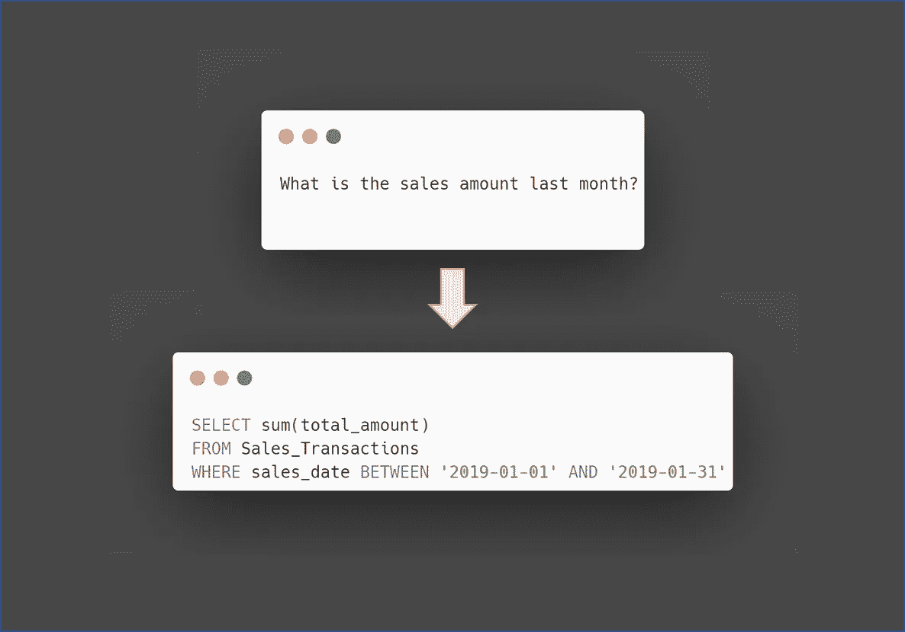
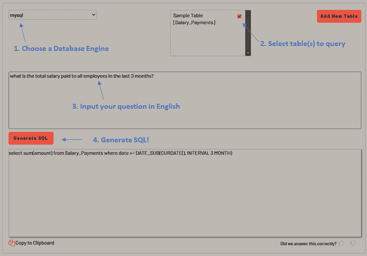

# 如何不用写 SQL 查询就能查询 SQL 数据库

> 原文：<https://towardsdatascience.com/how-to-query-sql-databases-without-writing-sql-queries-fad2c06fe1e0>

## 将简单英语中的问题转换成 SQL 查询


鲍比·麦克劳德在 [Unsplash](https://unsplash.com?utm_source=medium&utm_medium=referral) 上的照片

# 介绍

从自然语言生成 SQL 查询的能力可以减少编写精确复杂查询的时间，从而增强精通 SQL 和不精通 SQL 的用户的能力。



作者图片

[Ai2Sql](https://ai2sql.bubbleapps.io/) 通过 OpenAI 使用 GPT-3 语言模型将简单英语中的问题转换成 Sql 查询。在本文中，我们将了解 Ai2Sql 如何处理各种复杂查询。让我们从使用 Ai2Sql 提供的示例`Salary_Payments`表开始。该表包含以下列:

*   身份证明（identification）
*   员工 id
*   数量
*   日期

从简单的英语生成 SQL 语句只需要 4 个简单的步骤。



# 基本问题

以下问题从单个表中查询。

**问题**

```
what is the total salary paid to all employees in the last 3 months?
```

**查询**

```
select sum(amount) from Salary_Payments where date >= DATE_SUB(CURDATE(), INTERVAL 3 MONTH)
```

答对了。生成的查询汇总了正确的列，并将日期限制为最近 3 个月。

**问题**

```
How many employees were paid last month?
```

**查询**

```
select count(*) from Salary_Payments where date between '2019-01-01' and '2019-01-31'
```

答对了。假设我们现在是在 2019 年 2 月，这个查询将是正确的。

到目前为止，我们一直在查询 Ai2Sql 提供的样本表。让我们通过为 Ai2Sql 提供我们自己的表来使它更具挑战性。我们创建一个新表`Sales_Transactions`,记录所有雇员的销售交易。该表包含以下列:

*   身份证明（identification）
*   员工 id
*   销售日期
*   总计 _ 金额
*   项目代码
*   项目 _ 描述

**问题**

```
What is the total sales in the last month?
```

**查询**

```
select sum(total_amount)
from Sales_Transactions
where sales_date between '2019-01-01' and '2019-01-31'
```

答对了。假设我们现在是在 2019 年 2 月，这个查询将是正确的。

**问题**

```
Which employee has the highest sales amount last month?
```

**查询**

```
select employee_id, sum(total_amount) as total_amount 
from Sales_Transactions 
where sales_date between '2019-01-01' and '2019-01-31' 
group by employee_id
order by total_amount desc 
limit 1
```

答对了。Ai2Sql 似乎理解`Sales_Transaction`表的粒度级别。因为表中的每一行都是一个事务，所以在对雇员进行降序排列以找到销售额最高的雇员之前，必须通过对销售额求和来找到每个雇员的总额。

**问题**

```
What is the average sales amount per employee in the last month?
```

**查询**

```
select employee_id, avg(total_amount)
from Sales_Transactions 
where sales_date > '2019-01-01' 
group by employee_id
```

除了日期过滤器之外，一切似乎都没问题。

# 中级问题

下一个查询需要 Ai2Sql 来计算移动平均值。我们希望找到每月的移动平均销售额。

**问题**

```
What is the moving average sales amount?
```

**查询**

```
select avg(total_amount)
from Sales_Transactions
where sales_date between '2019-01-01' and '2019-01-31'
```

它返回 2019 年 1 月的平均销售额，而不是移动平均值。这个问题被故意措辞模糊。让我们再试一次。

**问题**

```
What is the past 12 months rolling average sales amount?
```

**查询**

```
select avg(total_amount)
from Sales_Transactions
where sales_date between date_sub(now(), interval 12 month) and now()
```

这个查询为我们提供了过去 12 个月的平均销售额，与预期的不太一样，但是我们已经越来越接近了。让我们试着在我们的问题中更具体一些。

**问题**

```
What is the 12 months rolling average sales amount for the past 6 months?
```

**查询**

```
select avg(total_amount)
from Sales_Transactions
where sales_date between date_sub(curdate(), interval 6 month) and curdate()
```

该查询为我们提供了过去 6 个月的平均销售额。很好的尝试，但还没有完全实现。

# 预先提问

让我们增加一点挑战。我们在`Salary_Payments`表中添加了几列，现在看起来像这样:

*   身份证明（identification）
*   员工 id
*   部门
*   标题
*   数量
*   日期

以下查询需要连接两个表(`Salary_Payments`和`Sales_Transactions`)以产生所需的结果。

**问题**

```
Which department had the highest sales amount last month?
```

**查询**

```
select department, sum(total_amount) as total_amount 
from Sales_Transactions 
where sales_date between '2019-01-01' and '2019-01-31' 
group by department 
order by total_amount desc 
limit 1
```

Ai2Sql 试图从`Sales_Transactions`中选择`department`列。然而，该列在所述表中不存在。

让我们用一个更难的问题再试一次。这个问题需要连接两个表和一些数据的上下文。

**问题**

```
Which employee did not make any sale in the last month?
```

**查询**

```
select employee_id
from Sales_Transactions
where sales_date < DATE_SUB(CURDATE(), INTERVAL 1 MONTH)
```

生成的查询提供了上个月至少有一笔销售额的雇员的雇员 id。这与我们的意图相反。

可以回答给定问题的一个可能的查询是识别哪些雇员在上个月从`Salary_Payments`表中收到了薪水，但是没有出现在`Sales_Transaction`表中。

让我们问一个在给定的表格中没有答案的问题。

**问题**

```
Which employees are married?
```

**查询**

```
select employee_id, first_name, last_name, marital_status
from employees
where marital_status = 'M'
```

生成的查询从不存在的`employee`表中读取。

# 生成问题

Ai2Sql 允许用户生成可以在数据库中查询的问题。下面是产生的一些问题。对于不确定要调查什么业务问题的用户来说，这是一个有用的起点。

```
1\. What is the total number of transactions?
2\. What is the total quantity sold?
3\. What are the top 10 items most sales?
4\. What are the top 10 items in terms of the quantity sold?
5\. How many transactions were made each day?
6\. How many transactions were made by hour?
7\. What are the top 10 items in terms of revenue?
8\. What are the mean quantity and revenue by date?
9\. What is the mean quantity and revenue by the hour?
10\. What are the mean quantity and revenue by item?
11\. What are the mean quantity and revenue by item per day?
12\. What are the mean quantity
```

# 结论

虽然 Ai2Sql 能够为简单的问题生成相当准确的 Sql 语句，但对于需要连接表或更深入地理解数据的复杂问题，仍然有改进的余地。用户可能还会发现用英语表达复杂的问题对于 GPT3 来说是一种挑战。

在当前阶段，在使用 Ai2Sql 时，采取人在循环中的方法将更加实际——人用简单的英语提供一个初始问题，并在使用它们之前验证生成的 Sql 语句。虽然这种方法要求用户具备一定程度的 SQL 能力，但它有助于减少编写 SQL 语句所需的时间，并确保语句的准确性。

*   加入 Medium 阅读更多这样的故事
*   [关注我](https://medium.com/@edwin.tan)获取更多类似的帖子