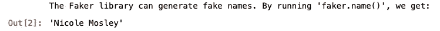
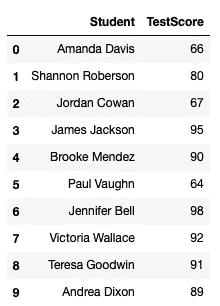
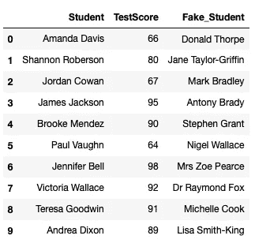
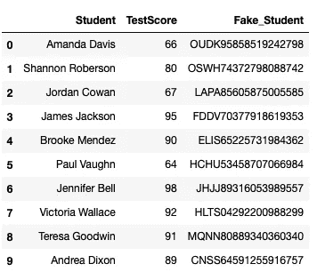
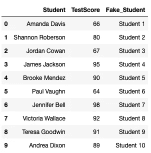
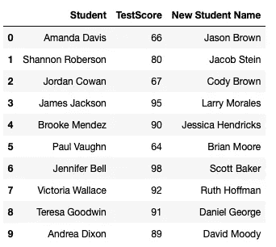
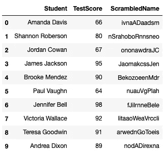
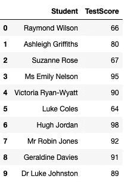
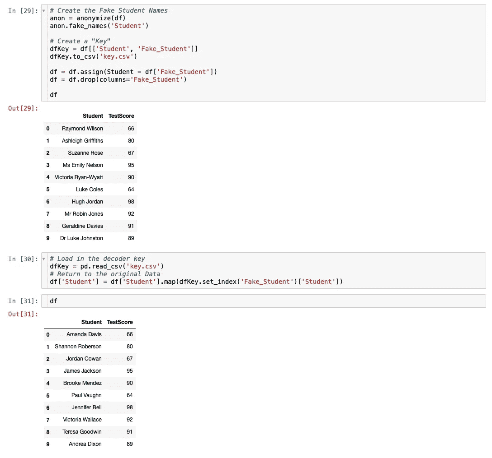

# 如何在 Python 中快速匿名化个人姓名

> 原文：<https://towardsdatascience.com/how-to-quickly-anonymize-personal-names-in-python-6e78115a125b>


Julian Hochgesang 在 [Unsplash](https://unsplash.com/@julianhochgesang) 上拍摄的照片。

最终，大多数数据科学家将处理包含个人信息的数据集。个人数据是高度敏感的，此类数据的汇总可能会泄露个人或组织的机密信息。美国联邦贸易委员会(联邦贸易委员会)的保护个人信息指南进一步阐述[1]:

> [如果]敏感数据落入坏人之手，可能会导致欺诈、身份盗窃或类似的伤害[导致]失去客户的信任，甚至可能在诉讼中为自己辩护。
> 
> — [联邦贸易委员会保护个人信息指南](https://www.ftc.gov/system/files/documents/plain-language/pdf-0136_proteting-personal-information.pdf)

因此，未能保护个人数据的数据科学家的职业生涯将会很短暂。幸运的是，Python 中有几个选项可以匿名化姓名并轻松生成虚假的个人数据。遵循下面的示例，并在 [**链接的 Github 页面**](https://github.com/kurtklingensmith/Anonymization) 下载完整的 Jupyter 笔记本和代码示例。

# 场景—考试分数

首先，让我们创建一个场景。假设一位教授有一组最近考试的分数，但他希望在与全班讨论考试趋势时模糊学生的名字。为了方便这个场景，Python 库 [Faker](https://pypi.org/project/Faker/) 使我们能够生成假数据，以包含名字[2]。生成概念数据集很简单:

```
# Import Faker
from faker import Faker
faker = Faker()# Test fake data generation
print("The Faker library can generate fake names. By running 'faker.name()', we get:")
faker.name()
```

这段代码应该提供一个假名字，这个名字会随着每次执行而改变。下面是一个输出示例:



作者截图。

然而，这只能给我们一个名字；要生成一个包含 10 名学生和 10 个随机测试分数的示例数据帧，请运行以下代码:

```
# Create a list of fake names
fake_names = [faker.name() for x in range (10)]
df = pd.DataFrame(fake_names, columns = ['Student'])# Generate random test scores
import numpy as np
df['TestScore'] = np.random.randint(50, 100, df.shape[0])# Optional - Export to CSV
df.to_csv('StudentTestScores.csv', index=False)
```

得到的数据帧是:



作者截图。

这将作为学生测试结果数据。对于这个场景，上面随机生成的名字代表学生的真实姓名。

# 1.通过匿名化实现匿名化 f

[AnonymizeDF](https://pypi.org/project/anonymizedf/) 是一个 Python 库，能够生成假数据，包括姓名、id、数字、类别等等[3]。下面是一个生成假名字的示例代码块:

```
# Anonymize DF
from anonymizedf.anonymizedf import anonymize# AnonymizeDF can generate fake names
anon.fake_names("Student")
```

结果输出是:



作者截图。

AnonymizeDF 还可以创建假的身份证明。下面是一个例子:

```
anon.fake_ids("Student")
```



作者截图。

AnonymizeDF 也可以创建类别。这个特性接受列名并给它加上一个数字。下面是一个例子:

```
anon.fake_categories("Student")
```



作者截图。

AnonymizeDF 为希望隐藏和匿名用户名的数据科学家提供了一组强大的选项，并且易于使用。但是对于那些寻求其他选择的人来说，还有其他的选择。

# 2.通过 Faker 匿名

与 AnonymizeDF 类似， [Faker](https://pypi.org/project/Faker/) 是一个 python 库，它将生成从姓名到地址等范围内的假数据[4]。Faker 非常容易使用:

```
# Install Faker
from faker import Faker
faker = Faker()Faker.seed(4321)
dict_names = {name: faker.name() for name in df['Student'].unique()}
df['New Student Name'] = df['Student'].map(dict_names)
```



作者截图。

Faker 还有一些独特的能力，比如创建一个假地址。例如:

```
print(faker.address())
```


作者截图。

# 3.定制的字加扰器

除了使用第三方库，自制解决方案也是一种选择。这些功能包括单词加扰器或用随机单词或数字替换名字的功能。加扰器函数的一个例子如下:

```
# Scrambler
from random import shuffle# Create a scrambler function
def word_scrambler(word):
    word = list(word)
    shuffle(word)
    return ''.join(word)
```

使用以下代码将此函数应用于数据帧:

```
df['ScrambledName'] = df.Student.apply(word_scrambler)
df['ScrambledName'] = df['ScrambledName'].str.replace(" ","")
```

这会产生以下数据帧:



作者截图。

这种方法有一些限制。首先，事先知道学生姓名的人可以根据打乱的姓名中代表首字母的大写字母推断出谁是谁。第二，这些乱七八糟的字母在外观上不像假名那样干净，也不像假名那样容易理解。进一步的定制可以去除大写字母或生成随机数来代替名字；最合适的选择取决于客户的场景和需求。

# 4.将所有这些放在一起:匿名化、清理和取消数据框的匿名化

一旦选择了一种技术，将它应用于数据帧、清理帧和存储“密钥”就相当简单了。从一开始就考虑学生考试成绩的原始数据框架:


作者截图。

让我们使用 AnonymizeDF 来创建匿名名称。下面的代码块将:

*   生成假名。
*   创建一个包含真实和虚假姓名的 CSV“密钥”。
*   从原始数据帧中删除真实姓名。
*   呈现一个干净、匿名的数据框架，在结构上与原始数据框架没有区别。

```
# Create the Fake Student Names
anon = anonymize(df)
anon.fake_names('Student')# Create a "Key"
dfKey = df[['Student', 'Fake_Student']]
dfKey.to_csv('key.csv')df = df.assign(Student = df['Fake_Student'])
df = df.drop(columns='Fake_Student')
```

输出是以下数据帧:



作者截图。

解扰这是加载 CSV“密钥”并将原始学生姓名映射到假学生姓名的简单事情:

```
# Load in the decoder key
dfKey = pd.read_csv('key.csv')# Return to the original Data
df['Student'] = df['Student'].map(dfKey.set_index('Fake_Student')['Student'])
```

这是它在 Jupyter 笔记本中的样子( [**笔记本可在链接的 Github**](https://github.com/kurtklingensmith/Anonymization) 下载):



作者截图。

# 结论

数据科学家不可避免地会遇到包含个人信息的数据集，这些信息的保护对于保护个人和组织至关重要。上面强调的简单匿名技术提供了一种快速生成虚假数据作为占位符来保护个人的方法。

但是，对于某些数据集，仅仅匿名化名称可能还不够。诸如地址或个人属性的其他数据点可以允许第三方重建与观察相关联的身份。因此，更复杂的数据集将需要先进的匿名和去识别技术，在某些情况下，合成数据可能是进行分析同时保护个人信息的最佳途径。

## 参考资料:

[1]联邦贸易委员会，[保护个人信息:商业指南](https://www.ftc.gov/system/files/documents/plain-language/pdf-0136_proteting-personal-information.pdf) (2016)。

[2] Faker PyPI， [Faker 13.0](https://pypi.org/project/Faker/) (2022)，Python 包索引。

[3]匿名化 DF，[匿名化 df 1.0.1](https://pypi.org/project/anonymizedf/) (2022)，Python 包索引。

[4] Faker PyPI， [Faker 13.0](https://pypi.org/project/Faker/) (2022)，Python 包索引。