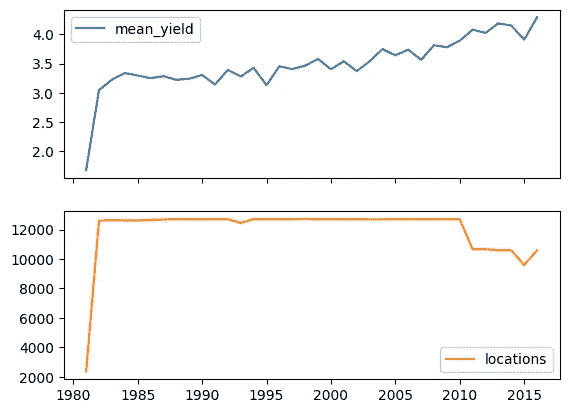
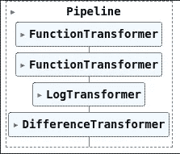
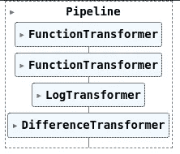
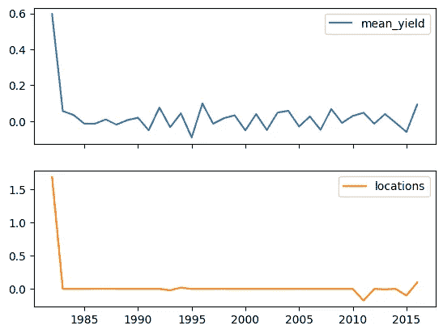
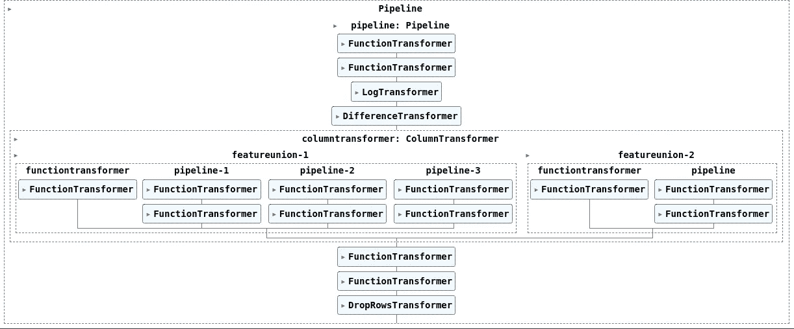
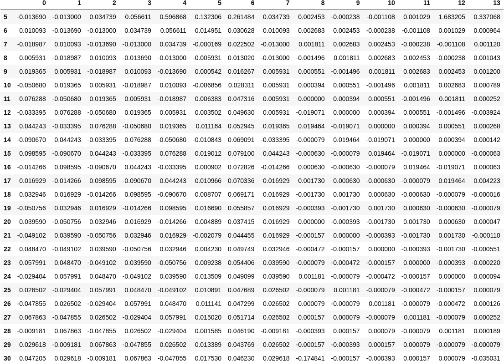
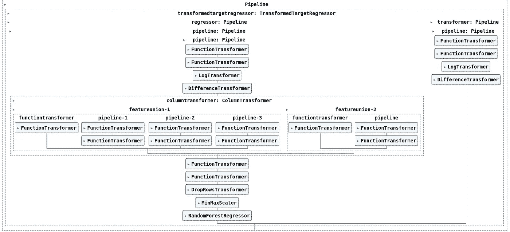

# 如何快速设计先进的 Sklearn 管道

> 原文：<https://towardsdatascience.com/how-to-quickly-design-advanced-sklearn-pipelines-3cc97b59ce16>

## 辅导的

## 组合 Scikit-Learn 管道中的所有组件，构建定制的生产就绪模型


克林特·帕特森在 [Unsplash](https://unsplash.com?utm_source=medium&utm_medium=referral) 上拍摄的照片

本教程将教你**如何以及何时**使用来自 Sklearn Pipelines 生态系统的所有高级工具来构建**定制的、可扩展的、模块化的机器学习模型**，这些模型能够**轻松部署到生产中。**

单独来看，Sklearn Pipelines 工具箱中有许多关于不同组件的内容。我写这篇教程是因为看到所有这些组件如何在一个更复杂的系统中协同工作是非常珍贵的。

我将使用一个**具体示例**向您展示**如何以及何时**使用以下组件:

*   [变压器混频器](https://scikit-learn.org/stable/modules/generated/sklearn.base.TransformerMixin.html)
*   [基本估算器](https://scikit-learn.org/stable/modules/generated/sklearn.base.BaseEstimator.html)
*   [功能变压器](https://scikit-learn.org/stable/modules/generated/sklearn.preprocessing.FunctionTransformer.html)
*   [柱式变压器](https://scikit-learn.org/stable/modules/generated/sklearn.compose.ColumnTransformer.html)
*   [特征联合](https://scikit-learn.org/stable/modules/generated/sklearn.pipeline.FeatureUnion.html)
*   [转换的目标进度器](https://scikit-learn.org/stable/modules/generated/sklearn.compose.TransformedTargetRegressor.html)

> 知道如何单独使用它们是很容易的，这也是为什么本教程将会强调**何时**使用它们以及**如何在一个复杂的系统中互换使用**。

## 目标

我们将建立一个**预测模型**来预测下一年的全球平均小麦产量。

主要重点将放在 **Sklearn 管道** **组件的**高级概念**上。因此**，我们不会在其他数据科学原理上花太多时间。

# 目录

*   资料组
*   管道基础概述
*   配置
*   数据准备
*   建设管道
*   全球管道。让我们把事情放在一起。
*   如何使用全球管道

**注:**如果你只对 Sklearn 管道的高级主题感兴趣，直接跳到**构建管道。**

# 资料组

我们使用的是由 [Pangaea](https://doi.pangaea.de/10.1594/PANGAEA.909132) 提供的公开可用的**数据集**【1】，该数据集跟踪了从 1981 年到 2016 年各种植物的全球历史年产量。

我们使用这个 [GitHub 库](https://github.com/awesomedata/awesome-public-datasets)找到了数据集。查看更多精彩的公开数据集。

数据集提供了多种类型的作物，但在本例中，我们将只使用小麦。



全球小麦年产量和泛大陆数据集内提供的位置数量[图片由作者提供]。

# 管道基础概述

这里有一个 Sklearn Pipelines 生态系统使用的主要原则的简短提示。

一切都围绕着**管道**对象。

一个**管道**包含多个**估算器**。

一个**估算器**可以具有以下属性:

*   从数据中学习→使用 **fit()** 方法
*   转换数据→使用 **transform()** 方法。也被称为**变压器**(不，不是机器人，它是**估计器**的**子类**)。
*   从新数据预测→使用 **predict()** 方法。也称为**预测器**。

**注 1:** 我们可以拥有没有 **fit()** 方法的**变形金刚**。因此，这些类没有参数化，并且遵循纯函数的原则。通常，这些类型的转换器在进行特征工程时很有帮助(例如，在使用 **fit()** 方法之前，我们无需学习任何东西就可以将两个不同的列相乘)。

**注 2:****管道**对象继承了**管道**中最后一个**估算器**的方法。

**注 3:** 如果你想给你的管道添加一个模型，它必须是最后一个元素。我将向您展示如何使用[TransformedTargetRegressor](https://scikit-learn.org/stable/modules/generated/sklearn.compose.TransformedTargetRegressor.html)对模型预测执行后处理操作的技巧。

# 配置

## 将管道呈现为图表

通过将 Sklearn 配置的显示设置为“ **diagram，”**，我们可以快速将管道可视化为图表。



Sklearn 管道图可视化示例【图片由作者提供】。

## 常数

下面我们将定义一些在代码中使用的常量。

# 数据准备

## 挑选事实真相

因为时间序列预测是一种无监督学习的形式，我们必须使用过去的信息来预测 tₙ**的一个数据点。因此，在开始时，我们将把特征和标签作为相同的时间序列。但是在预处理步骤中，我们将使用特征作为过去的数据点，使用标签作为我们想要预测的数据点。**

这不是一个时间序列预测帖子。所以，这一步不要想多了。还有，你不用一行一行的读代码。

> 只需**将**聚焦在**大图**和**管道**步骤上。了解**如何以及何时**使用特定 **Sklearn 组件的最终目标就足够了。**

```
X, y = yields.copy(), yields.copy()
```

## 分割数据:培训和测试

现在，我们将在训练和测试之间拆分数据。您将看到正确使用 Sklearn 管道在新数据上使用您的模型是多么容易。

让我们看看火车测试分裂看起来如何:

```
*(Starting year of the split, Ending year of the split, number of years within the split)***X_train.index.min(), X_train.index.max(), X_train.index.max() - X_train.index.min() + 1**(1981, 2012, 32)**y_train.index.min(), y_train.index.max(), y_train.index.max() - y_train.index.min() + 1**(1986, 2012, 27)**X_test.index.min(), X_test.index.max(), X_test.index.max() - X_test.index.min() + 1**(2007, 2016, 10)**y_test.index.min(), y_test.index.max(), y_test.index.max() - y_test.index.min() + 1**(2012, 2016, 5)
```

# 建设管道

说够了。让我们开始实现实际的管道。

**全局管道**分为以下子组件:

1.  平稳性管线(用于*特征*和*目标*
2.  特色工程管道
3.  回归器管道
4.  目标管道

## 1.平稳流水线

流水线用于时间序列，使其保持平稳。更具体地说，它将消除周期性，并对不同时间的平均值和方差进行标准化。你可以在这里阅读更多相关内容。

在这一步中，我们将向您展示如何使用以下内容:

*   [变压器米欣](https://scikit-learn.org/stable/modules/generated/sklearn.base.TransformerMixin.html)
*   [基本估算器](https://scikit-learn.org/stable/modules/generated/sklearn.base.BaseEstimator.html)
*   [功能变压器](https://scikit-learn.org/stable/modules/generated/sklearn.preprocessing.FunctionTransformer.html)

**我们可以用两种方式来构建管道估算器:**

1️⃣继承了 BaseEstimator + TransformerMixin。使用这种方法，管道单元可以从数据中学习，转换数据，并反转转换。以下是受支持接口的简短描述:

*   **fit(X，y)** —用于从数据中学习
*   **transform(X)** —用于转换数据
*   **fit_transform (X)** —学习并转换数据。该函数继承自 TransformerMixin
*   **inverse_transform(X)** —用于反向变换

***注 1:*** 此语句始终成立:**x = = inverse _ transform(transform(x))**—接受小容差。

***注 2:*** 目标(如 y)只在 fit()方法中传递。至于 transform()和 inverse_transform()，仅给出特征(例如，X)作为输入。此外，我们不能强制管道访问任何其他属性。

2️⃣编写了一个纯函数，最终被 FunctionTransformer 封装。

当转换不需要有状态(它没有 fit()方法)，也不需要对转换进行逆变换(它没有 inverse_transform()方法)时，这种方法是实用的。因此，当您只需要实现 transform()方法时，这很有用。

这必须是一个纯函数(对于输入 A，你**总是**得到输出 B →它不依赖于外部上下文)。否则，当您的管道变大时，您会遇到奇怪的行为。

***注意:*** 因为我们只实现了一个转换，所以我们只能访问特性(例如 X)。我们无法访问任何其他属性。

作为观察，我们选择为转换编写一个类，即使它不需要实现 fit()方法(例如 LogTransformer)。但是，将转换及其逆转换打包到同一个结构中是一个很好的软件实践。

我们利用 Python *functools* 模块中的**部分**函数来配置转换。

如前所述，赋予 **FunctionTransformer** 的函数应该只接受一个输入，只输出一个值。还有，在构造函数里面配置它不是一个类。因此，使用 **partial，**我们可以只设置一个函数参数的子集。它将结束我们的初始函数，并在下一次调用时返回另一个函数，该函数只需要未在**部分**中指定的参数作为输入。

最后，让我们建立管道。我们使用了 **make_pipeline()** 实用函数，它自动命名每个管道步骤。



stationary_pipeline 的示意图[图片由作者提供]。

以下是如何快速检查您的转换和 inverse_transformation 是否正确执行的方法:

使用 **np.allclose()，**我们通过接受一个小错误来检查等式。



时间序列经过静态管道处理后的样子示例[图片由作者提供]。

## 2.特色工程管道

现在让我们做一些特征工程。

注意，你不必理解每个函数的实现。**关注结构**。

对于大多数转换，我们使用了**纯函数** + **FunctionTransformer** 。我们使用这种方法是因为我们对实现 *fit()* 或 *inverse_transform()* 不感兴趣。因此，使用这种方法，我们的代码更加简洁。

只有 DropRowsTransformer 是用类实现的，因为它同时需要 *fit()* 和*inverse _ transformer()*。

> 从我的经验来看，在实现数据和特征工程管道时，我通常发现**函数转换器**更有用、更干净。我不认为继承类并让大多数方法为空是好的做法。

现在让我们进入**甜蜜部分**，在这里我们将使用:

*   [make _ column _ transformer](https://scikit-learn.org/stable/modules/generated/sklearn.compose.make_column_transformer.html)([column transformer](https://scikit-learn.org/stable/modules/generated/sklearn.compose.ColumnTransformer.html)的快捷方式)
*   [make _ union](https://scikit-learn.org/stable/modules/generated/sklearn.pipeline.make_union.html)([feature union](https://scikit-learn.org/stable/modules/generated/sklearn.pipeline.FeatureUnion.html)的快捷方式)

使用**make _ column _ transformer**，我们可以在*列*的*子集*上运行*不同的操作/流水线*。在这个具体的例子中，我们对“*mean _ yield”*和“*locations”*列运行了不同的转换。这个操作器的另一个好处是，它为*平行*中的每一组*列*运行*操作*。因此，并行计算“*mean _ yield”*和*“locations”*的特征。

使用 **make_union** ，我们可以计算*平行*中的*多重特征*。在本例中，对于“ *mean_yield，”*，我们并行计算四个不同的特征:

*   过去的观察
*   移动平均数
*   移动标准偏差
*   移动中位数

***注 1:*** 同样的原理也适用于“*位置”*特征。

***注 2:*** 我推荐使用 **make_[x]** 效用函数。这会让你的生活更轻松。

在下面的代码片段中，您可以看到这些组件的运行。遵循 Sklearn 管道范例，看看我们如何很好地重用了管道中的大多数功能。

另一个基本元素是 **memory= "cache"** 属性。使用它，所有的步骤都被缓存在本地磁盘上。因此，如果您的输出在新运行时被缓存，它将自动从缓存中读取结果。如果发生变化，它还知道何时使缓存无效。

> 现在，用最少的努力，通过并行运行**所有的**转换并缓存管道的输出，你的机器学习管道将会非常快。



特征 _ 工程 _ 管线图。请注意，在笔记本中，图表是交互式的。你有一个下拉菜单，显示每个管道单元的更多细节。

让我们在我们的培训功能上运行*功能 _ 工程 _ 管道*:

```
feature_engineered_yields = feature_engineering_pipeline.fit_transform(X_train.copy())
```



由 feature _ engineering _ pipeline[Image by Author]计算的训练特征。

现在让我们在我们的测试功能上运行它:

```
feature_engineering_pipeline.transform(X_test.copy())
```

## 3.回归器管道

下面你可以看到如何建立最终回归。除了上面介绍的*feature _ engineer _ pipeline*之外，我们还堆叠了一个缩放器和一个随机森林模型。

> 您可以观察到模型是添加到管道中的最后一个单元。

## 4.目标管道

**target_pipeline** 用于*预处理*标签和*后处理*模型的*预测*。

一切都会在一瞬间变得有意义。

# 全球管道。让我们把事情放在一起。

这里我们将向您展示如何使用[TransformedTargetRegressor](https://scikit-learn.org/stable/modules/generated/sklearn.compose.TransformedTargetRegressor.html)组件。

**TransformedTargetRegressor**类采用以下参数:

*   **回归器**:将上面定义的*回归器 _ 管道*作为输入。我们习惯在大多数管道中使用的东西。
*   **transformer:** 将 *target_pipeline* 作为输入，后者将*预处理*标签，当使用管道中定义的 *fit()* 和 *transform()* 方法时，模型将使用这些标签作为基础事实。*还有*，做预测的时候会*后处理*模型的输出调用*inverse _ transform()***。**多牛逼啊？最后，将所有步骤打包成一个逻辑单元的方法。



整个管道的示意图。随着管道变得更加复杂，一个好的可视化将永远是你的朋友[图片由作者提供]。

# 如何使用全球管道

## 火车

现在，培训步骤只是一行程序。

```
pipeline.fit(X=X_train.copy(), y=y_train.copy())
```

## 做预测

最棒的是做预测；你还必须打电话给一个俏皮话。调用**pipeline . predict(X)**就是这样。你有你的预言。

使用 **TransformedTargetRegressor，**调用 predict 时，预测已经被转换回其初始比例。因此，模型/管道高度紧凑，易于在各种场景中部署:批处理、API、流式、嵌入式等。

另一个有用的特性是，您可以在您的特征和模型上快速使用 GridSearch(或其他技术)。现在，您可以将数据管道中的不同配置视为超参数。因此，您只需几行代码就可以快速体验各种特性。

```
**y_pred = pipeline.predict(X_test.copy())
y_pred**26    4.026584
0     4.122576
1     4.080378
2     4.174781
3     4.380293
Name: 0, dtype: float64
```

## 试验

为了好玩，让我们使用传统的 **RMSE** 和 **MAPE** 指标来评估这个模型。

```
**evaluate(y_test, y_pred)**INFO:sklearn-pipelines:RMSE: 0.147044
INFO:sklearn-pipelines:MAPE: 0.030220
```

我们可以观察到，它使用一个简单的模型做得很好，根本没有任何微调。在大约 4.0 的范围内，大约 0.13 的 RMSE 已经很不错了。

但是正如几次提到的，本教程是关于利用 Sklearn 管道，而不是建立一个精确的模型。

# 结论

如果你已经走了这么远，那你就太棒了。现在你知道如何编写专业的 Scikit 管道了。谢谢你看我的文章！

通过一个具体的例子，我们展示了利用 Sklearn 管道及其整个组件堆栈的强大功能:TransformerMixin、BaseEstimator、FunctionTransformer、ColumnTransformer、FeatureUnion、TransformedTargetRegressor。

使用这种方法，我们构建了一个灵活的机器学习管道，我们可以:

*   轻松地重用转换，并以各种方式组合它们(模块化代码)。
*   编写干净的、可伸缩的类。
*   编写高速代码，并行计算所有特性，并缓存整个管道中的中间检查点。
*   将模型作为简单的类直接部署，无需进一步的预处理/后处理步骤。
*   对特征/数据管线和模型本身快速执行超参数调整。

> 关于 Sklearn 管道，你还知道哪些隐藏的宝石？

你可以在我的 [GitHub](https://github.com/IusztinPaul/ml-blog-code/tree/main/professional-sklearn-pipelines) 上找到教程中使用的例子的完整实现。在这个库中，我将不断地推送我将用来撰写各种文章的所有示例。

# 参考

[1] Iizumi，Toshichika，[全球历史收益率数据集 v1.2 和 v1.3 对齐版本。盘古大陆](https://doi.pangaea.de/10.1594/PANGAEA.909132) (2019)，补充:饭泉，土肥猪；Sakai，【1981 年至 2016 年 (2020 年)全球主要农作物历史产量数据集，科学数据

如果你喜欢读我的文章，你可以在 LinkedIn 上关注我，了解关于 ML、MLOps 和自由职业者的每周见解。

<https://medium.com/membership/@pauliusztin> 