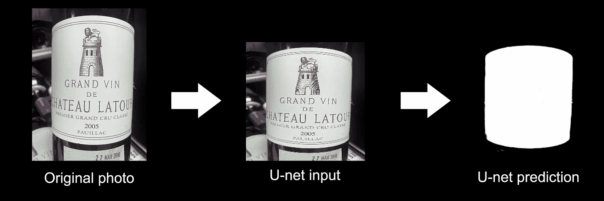
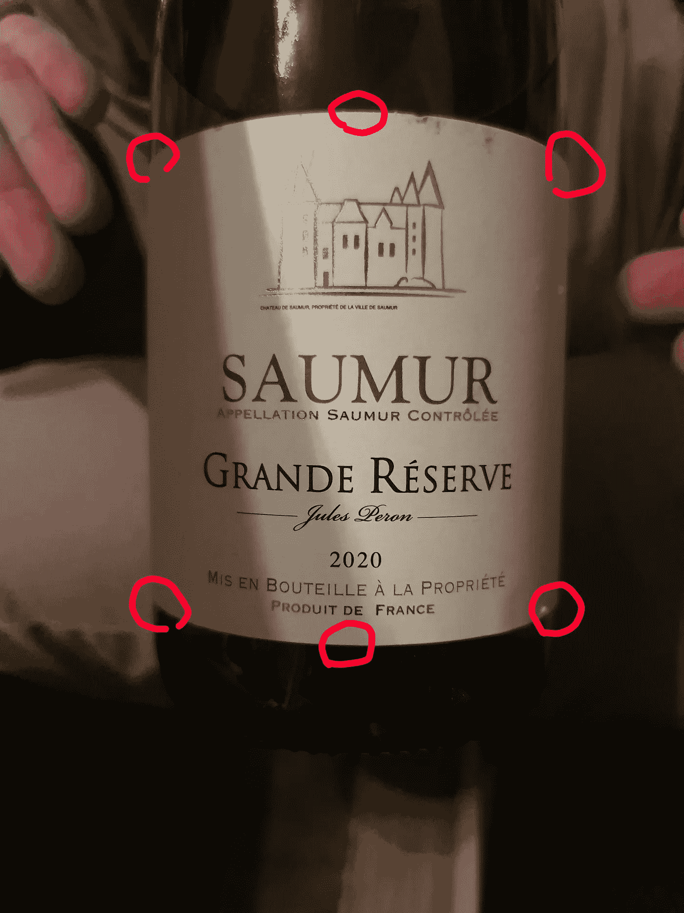
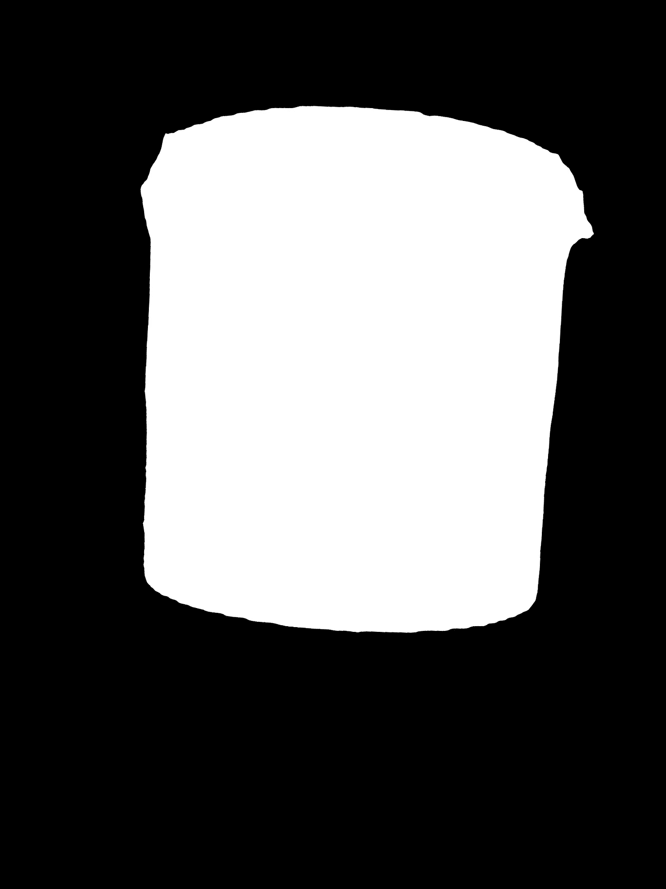
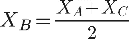
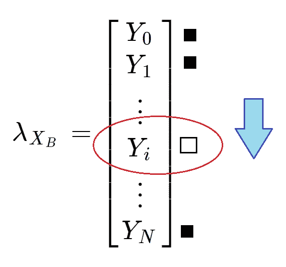
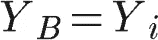
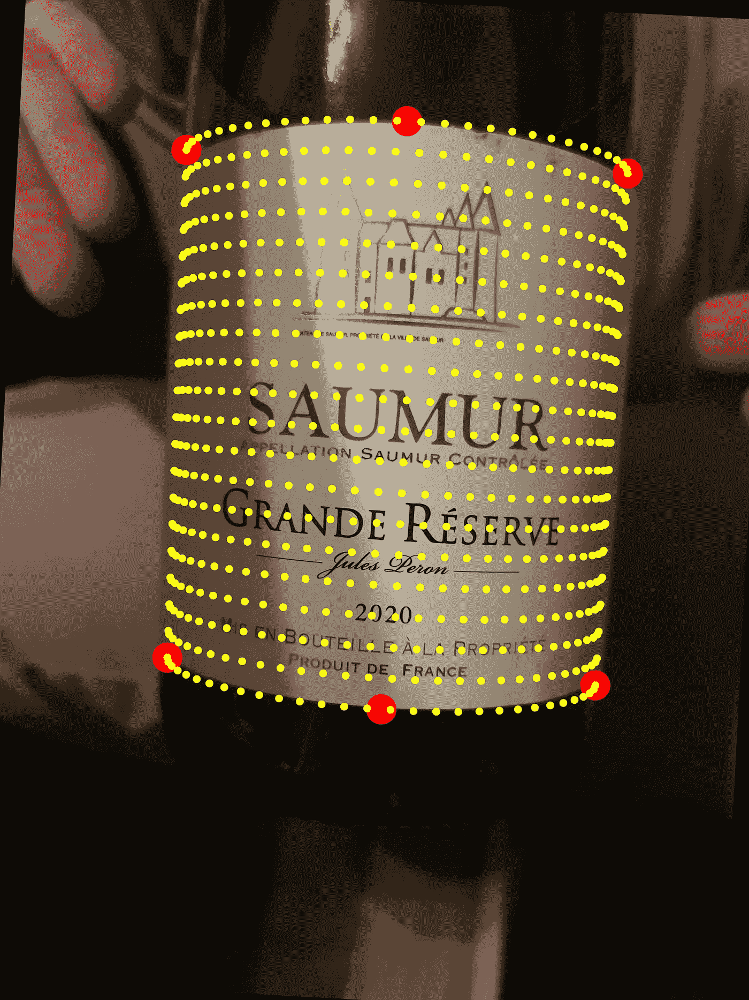
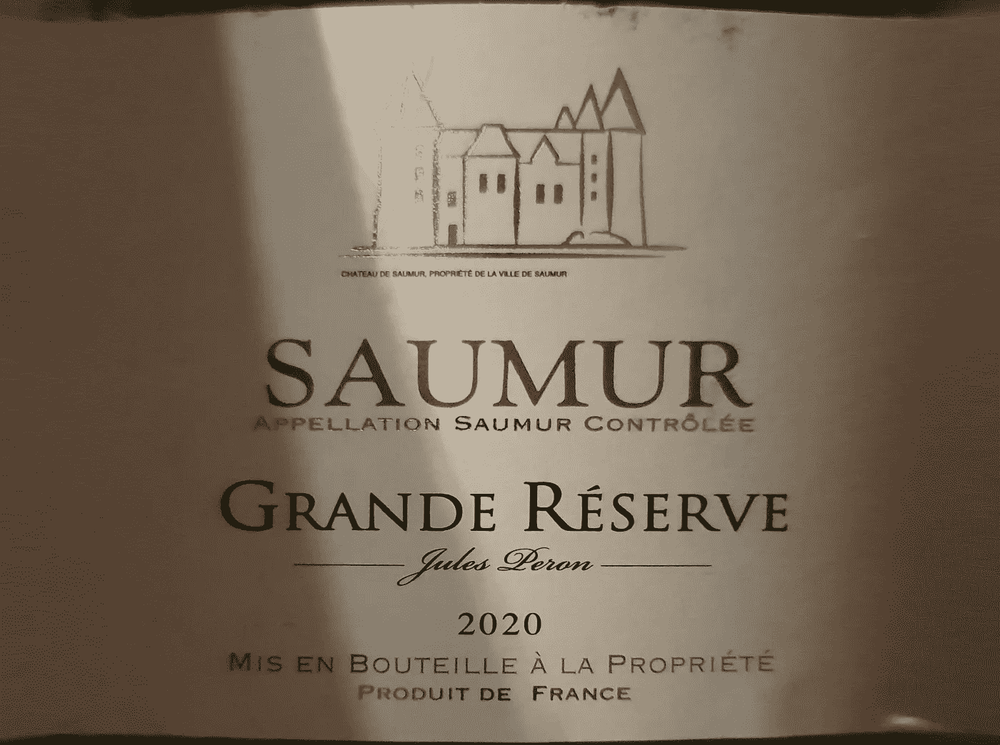
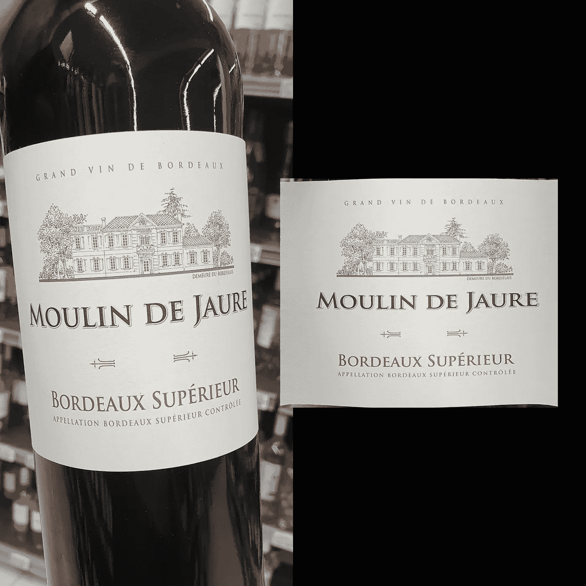
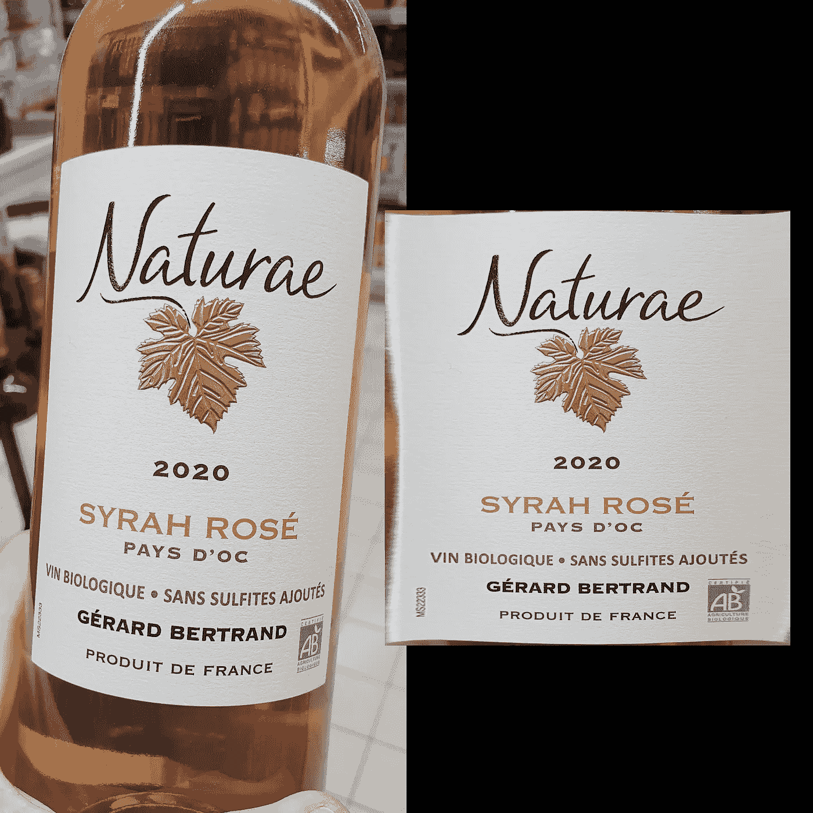

# 如何使用计算机视觉阅读酒瓶上的标签(第三部分)

> 原文：<https://towardsdatascience.com/how-to-read-a-label-on-a-wine-bottle-using-computer-vision-part-3-e4729e5a8140>

欢迎回到本系列文章。提醒一下，在我们的前两篇文章([第一部分](https://medium.com/towards-data-science/how-to-read-a-label-on-a-wine-bottle-using-computer-vision-part-1-25447f97a761)、[第二部分](/how-to-read-a-label-on-a-wine-bottle-using-computer-vision-part-2-8bd047d2a945))中，我们探索了两种不同的方法来尝试检测酒瓶上标签的位置。

在项目的当前阶段，我们能够将酒瓶的照片输入到我们训练过的 U-Net 型神经网络，并获得黑白蒙版作为输出，该蒙版定位标签的估计位置:

预测的例子

下一个具有挑战性的步骤是移除标签上的所有曲率，这样我们就可以对我们的扁平化标签应用 OCR，并成功检测上面写的单词和句子。

在我的研究过程中，我有机会偶然发现了一个很棒的 [github 项目](https://github.com/Nepherhotep/unwrap_labels)，它是由[阿列克谢·赞克维奇](https://github.com/Nepherhotep)完成的。在使用他的库和写这篇文章之前，有必要提一下**，我请求他正式授权使用他的代码，并在这篇文章中提到他的工作**。

我不会详细解释他的库是如何工作的，因为我根本没有编码它，我也不掌握他使用的几何概念，但简单地说，这个库允许通过在标签圆柱体边缘周围手动定位 6 个点来“解开”葡萄酒标签。然后，代码生成并映射许多点，这些点遵循估计的圆柱体几何形状，并使用 scipy 库将这些点的插值应用到几何形状平坦的目标地图。通过这样做，我们得到了一个平面标签的视觉近似。

问题是，我们需要找到一种方法来自动定位我们的 U-Net 图像预测上的这 6 个点。让我们举一个我们会用到本文结尾的照片例子:

原始 256*256 U_net 预测

一旦我们得到了我们的 U-net 预测，我们需要将它重新整形回原始源照片的大小，这样，一旦我们找到了我们的 6 点坐标，我们就可以将它们正确地放置在原始照片中。此外，我们希望标签垂直对齐，我们只想要二进制颜色(黑色或白色像素)。为此，我们使用包的 [readLabels](https://github.com/AntoninLeroy/wine_label_reader_toolkit/blob/eb2c14ba4f9a1b6efaa476696439754a9abde8ce/wineReader/labelVision.py#L572) 方法中的这段代码。

调整大小、二值化和对齐的 U-net 预测

关于我实现的[垂直对齐算法](https://github.com/AntoninLeroy/wine_label_reader_toolkit/blob/eb2c14ba4f9a1b6efaa476696439754a9abde8ce/wineReader/labelVision.py#L382)说几句，它只是试图最大化全黑列的数量，所以在这里你可以看到我们不能说对齐是完美的，因为圆柱体形状的一些不完美的检测，但我选择不采用完美的例子来表明它在不完美的情况下工作。

现在让我们来谈谈我是如何估计和定位我们需要使用展开标签代码的 6 个点的。我的想法是先找到一种迭代的方法来检测角，因为在垂直对齐算法中，我使用了“全黑列”的逻辑作为继续迭代的条件，所以基本上:从一边扫描到另一边，只要有一列至少有 1 个白色像素就停止，等等。但问题是，我没有用这种逻辑找到所有的角，因为通常圆柱体都有透视，因此顶部或底部比另一个大…

然后我想起了矩阵对角线！如果我能找到一种像这样用对角线迭代的方法，而不是用列和行迭代，会怎么样呢？

拐角/边缘检测逻辑

这样我就能找到 A，C，D 和 F 坐标点的对角线，并通过计算简单的距离找到 B 坐标:

其中 XB 是点 b 的 X 坐标。我们现在可以选择对应于该 XB 位置的图像的列向量(λ):

是的，我知道这是一个疯狂的非正统的数学符号

我们在向量中从上到下迭代，找到第一个白色像素来减去 B 点的 Y 坐标。

对于 E 点，逻辑是相同的:我们在 D 点和 F 点的中间找到列向量，这次我们从下到上迭代，直到找到第一个白色像素。

*要获得实现的细节，请查看包中的方法*[*【getCylinderPoints】*](https://github.com/AntoninLeroy/wine_label_reader_toolkit/blob/eb2c14ba4f9a1b6efaa476696439754a9abde8ce/wineReader/labelVision.py#L420)*。*

现在我们有了 6 个坐标，我们可以使用“[展开标签”代码](https://github.com/AntoninLeroy/wine_label_reader_toolkit/blob/eb2c14ba4f9a1b6efaa476696439754a9abde8ce/wineReader/labelVision.py#L64)。

网状圆柱投影

展平标签

TADA！最后，我们现在有了一个几乎完美的平面标签，可以尝试在上面应用 pytesseract OCR 库。为了看到原始(弯曲的)图像和展平的图像之间的差异，我把两个 OCR 副本放在一起，以证明我们没有白做这些工作！

**原始图像 OCR:**

> 酱汁控制
> 
> DE RESERVE
> _ftes Lo
> 2020
> 
> 法国产品的所有者

**展平标签图像 OCR:**

> 索穆尔市所有人盖泰·德索穆尔
> 
> 奥穆尔
> 
> 索默控制器
> 
> DE 储备
> 
> 2020
> 
> 法国产品

所以它绝对不是完美的，但肯定有所改善。照片本身有一些照明差异，似乎会影响光学字符识别。以下是我测试的其他几个例子:

**原始图像 OCR:**

> R
> ORDEAUX SUPER！
> 
> 伊利厄
> 
> APDE 波尔多特级葡萄酒

**展平标签图像 OCR:**

> 从 5 月 8 日开始
> 
> 一天
> 
> 边境安全
> 
> 穆林-德茹尔
> 
> +S a
> 
> (一氧化碳)
> 
> 波尔多特级葡萄酒
> 
> 波尔多特级酒庄

**原始图像 OCR:**

> 帕夫
> | i YS dD' :
> = UE e :
> :桑斯 SUL
> :艾特斯阿约特斯
> ARD 贝特朗在
> 
> 栅栏
> oL0 oul
> 
> 便便
> 
> :
> 
> p
> R
> O
> D
> U
> IT
> DE F
> RA
> 
> 新天主教版本(New Catholic Edition)

**展平标签图像 OCR:**

> MS22338
> 
> 2020
> 
> 西拉·罗斯
> 
> 支付现金
> 
> 无亚硫酸盐葡萄酒
> 
> CEeRTiFre
> 
> 杰拉德·贝特朗
> 
> 农业
> 
> 法国产品= sos:

我想我们已经完成了我的第一个计算机视觉项目的系列文章。您可能已经发现了这一点，它远非完美，有些步骤还可以优化:

*   拐角/边缘圆柱体检测是我提出的解决这个算法任务的一种方法，但是我确信也许可以找到另一种解决方案。
*   在我看来，OCR 部分本身是一项非常懒惰的工作，它可以通过使用默认配置之外的其他配置进行更好的优化，并可能增加一个图像处理步骤来减少可能产生一些噪声的阴影/照明或背景对象。
*   标签形状检测 U-Net 在预测方面远非完美，经常无法找到几何上正确的圆柱体，我相信实验计算机视觉工程师会找到一种方法，通过更多的深度学习工作或图像处理技术来提高其效率。

如果您有一些改进此解决方案的建议，请随时评论或联系我。你可以在[https://plural.run/wineReader](https://plural.run/wineReader)用你自己的酒瓶照片测试这个应用程序(记住，它们应该有一个好的分辨率，尽可能少的透视和与标签高对比度的背景)。

*所有图片均由作者提供。*