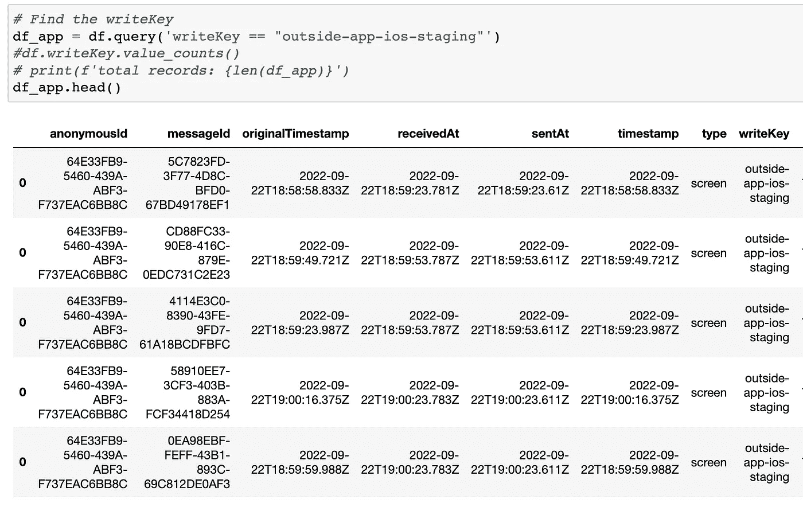
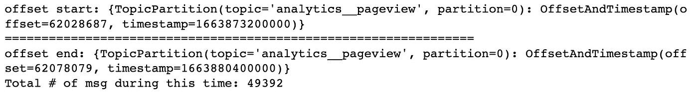
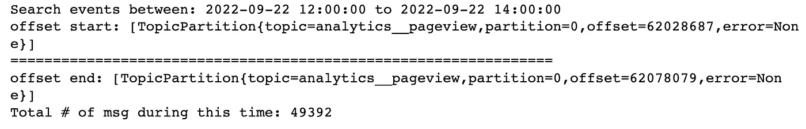

# 如何阅读熊猫中的卡夫卡点击流事件数据

> 原文：<https://towardsdatascience.com/how-to-read-kafka-clickstream-event-data-in-pandas-96f50e88f7eb>

## 构建 Kafka 消费程序以读取 Jupyter 笔记本中特定日期范围内的事件数据


照片由[乔纳森派](https://unsplash.com/@r3dmax?utm_source=medium&utm_medium=referral)在 [Unsplash](https://unsplash.com?utm_source=medium&utm_medium=referral) 上拍摄

# 背景

最近，我被分配了一个看似简单的任务→

> “我们开始从一个新的应用程序中捕捉事件。你能证明这样的测试事件在卡夫卡那里是正确的吗？”

我对我们系统中的数据流有一个粗略的想法:从 Web 和移动应用程序收集的点击流数据将首先流向 MetaRouter，然后 MetaRouter 作为 Kafka 生产者，为某个 Kafka 主题生成事件日志。我们的新应用程序生成的事件有一个共享的`writeKey`。因此，为了阅读这些事件，我需要:

1.  创建一个卡夫卡消费者来听这个卡夫卡话题
2.  因为我知道这样的测试事件是在特定的日期范围内产生的，所以我想为指定的日期构建 Kafka 消费者只读事件。
3.  以一种我可以过滤和分析的方式存储数据，最好是在熊猫的数据框架中。

所以我的目标是实现卡夫卡->熊猫的数据流！

在谷歌搜索了 StackOverflow、GitHub 和各种网站很多天后，我终于让它工作了！下面是我关于如何在 Kafka 的两个最流行的 python 库中实现的代码片段。

# 解决方案 1:使用“kafka-python”库

**必备:** `pip install kafka-python`(我的笔记本用的是最新版本 2.0.2)

首先，我们需要导入下面的库和 Kafka 环境变量。下面的设置脚本可以在解决方案 2 中重复使用，只需稍作修改。

接下来，构建一个 Kafka 消费程序来读取特定日期时间范围内的事件。有 5 个步骤:

*   **步骤 1** :因为我知道测试事件是在 2022–09–22 之间的 12 点至 14 点(UTC)时间发送的，所以我使用`datetime`函数创建`dt_start`和`dt_end`来限定时间范围。
*   **第二步**:在 Kafka 中，只有来自同一个分区的事件才是有序的，所以我们需要从指定的分区读取事件。(假设您有 6 个主题分区，您可以从 0-5 中选择任意一个数字作为分区)。
*   **第三步**:基础消费者要求`topic`、`bootstrap_servers`和`group_id`。我发现在 Jupyter 笔记本中，如果我不提供`security_protocol`它就会抛出错误。
*   **第四步:**这是关键！它的工作方式是这样的:
    - datetime 对象→转换为 UTC 时间戳(单位为毫秒)→转换为主题分区中的相关偏移量
    -基本函数是`consumer.offsets_for_times({tp:dt_start.timestamp()*1000})`
*   **步骤 5:** 使用`seek`获取从期望的开始时间
    开始的事件——每个消息都有一个属性`offset`，我们将它与期望的结束时间偏移进行比较，以决定是继续还是中断

说够了，下面是完整的代码→

之后，我可以在熊猫里查询我们新应用的`writeKey`！🐼



上述解决方案受到 StackOverflow 的[类似问题的启发。实际上，这是我开始做大量搜索的地方，发现没有使用`confluent-kafka`的等价解决方案。由于我的原始代码是基于`confluent-kafka`而不是`kafka-python`，我对它们表面上的相似性和细微差别感到困惑。](https://stackoverflow.com/questions/50405509/kafka-how-to-consume-data-based-on-timestamp)

现在我很高兴使用`confluent-kafka`介绍我自己的解决方案😃~~~

# 解决方案 2:使用“汇合-卡夫卡”库

**先决条件:** `pip install confluent-kafka`(我的笔记本用的是最新版本 1.9.2)

在这里，您可以使用解决方案 1 中的相同设置脚本，只需稍作修改:

*   将第 10 行改为`from confluent_kafka import Consumer, TopicPartition`

接下来，我们需要构建一个 Kafka 消费者来读取特定日期时间范围内的事件。在高层次上，我们仍然需要同样的 5 个步骤，但是主要的区别是我们需要使用`on_assign`来实现`seek`所做的——从主题分区中获取特定的偏移量。

**步骤 1:** 和解决方案 1 一样，我们需要 datetime 对象来限定搜索范围。

**第二步**:同方案一。**一个比较棘手的事情**就是大部分时候你可以用 string 作为 topic 比如`topic = 'analytics__pageview'`，但是当你要`subscribe`的时候，它只接受一个 list 比如`consumer.subscribe(['analytics__pageview'])`！(就像邓布利多可能会说的:“多么希望如此~ ~”🧙

**步骤 3:** 除了将变量赋值中的`=`替换为`:`之外，几乎与解决方案 1 相同。

**第四步:**下面是你将看到的细微差别！我们需要一个额外的步骤`4c`来建造`on_assign`。而这个功能最初是来自 [Magnus Edenhill](https://github.com/edenhill) 提供的[github confluent-Kafka-python issue](https://github.com/confluentinc/confluent-kafka-python/issues/373)。

**步骤 5:** 这里我们不使用`seek`，而是使用`subscribe`和主题(列表形式)以及`on_assign`来获取所需开始时间的偏移量。而且取数后我们需要调用`close()`。

还有一个值得注意的细节是，如何得到偏移量。

在`kafka-python`中，你用的是`offset_start[tp].offset`，`offset_start`是字典。

```
offset_start = consumer.offsets_for_times({tp:dt_start.timestamp() * 1000})# to print out the offset number
offset_start[tp].offset
```

输出:(注意表示类型的{ }是 dict)



在`confluent-kafka`中，`offset_start`是一个列表，所以需要使用`offset_start[0].offset`

```
tp_in = TopicPartition(topic=topic, partition=partition, 
                       offset=int(dt_start.timestamp() * 1000))offset_start = c.offsets_for_times([tp_in])# to print out the offset number
offset_start[0].offset
```

输出:(注意[ ]表示类型是 list)



好的，这是实现`confluent-kafka`的完整代码

# 摘要

*   构建事件驱动的应用程序是一种趋势，我预见到对数据科学家能够快速处理和对事件数据进行简单探索分析的需求会不断增长。这可以帮助通知哪些数据字段应该被进一步转换并引入 ETL 管道，这可能应该涉及`Faust`和`ksql`而不是`pandas.`