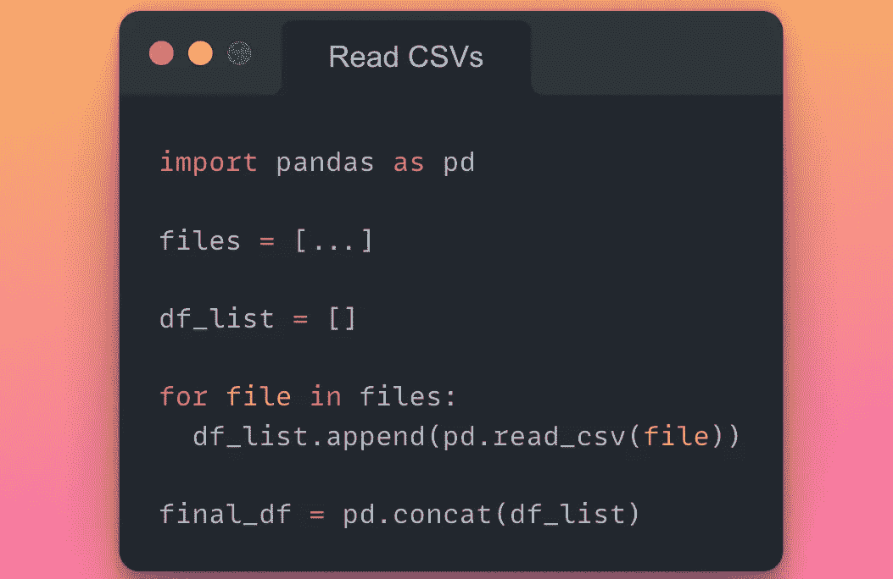
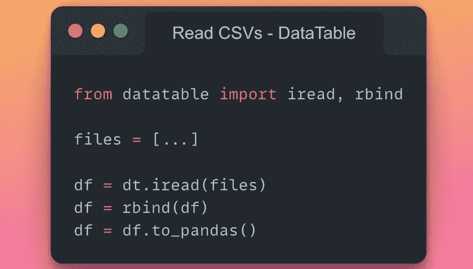
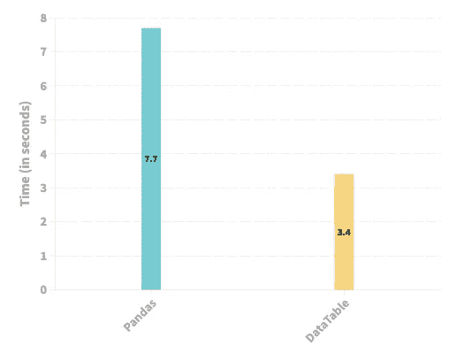

# 如何非迭代地读取多个 CSV 文件(并且没有熊猫)

> 原文：<https://towardsdatascience.com/how-to-read-multiple-csv-files-non-iteratively-and-without-pandas-984fd954999c>

## 对熊猫的读 CSV 方法说不！

Solaiman Hossen 在 [Unsplash](https://unsplash.com?utm_source=medium&utm_medium=referral) 上拍摄的照片

Pandas 的一个主要警告是它不能扩展到多个 CPU 核心(通常)。本质上，当您运行任何操作时，在理想情况下并行化是可能的，Pandas 仍将坚持传统的单核执行，而其他内核将闲置。当您构建大规模应用程序时，这一点尤其重要。

处理大规模数据驱动的应用程序需要通过优化算法来加快执行速度，并消除/减少管道中每一个可能的位的运行时间。在我看来，经常被忽视的一个领域是优化输入输出操作。

假设您有数百个 CSV 文件需要读入 python 环境。毫无疑问，你的第一选择是熊猫。另外，即使您没有处理大量的 CSV 文件，我也总是建议您删除所有的 CSV 文件，将它们转换为相对更快、存储效率更高的文件，比如 Pickle、Feather 或 Parquet。

</why-i-stopped-dumping-dataframes-to-a-csv-and-why-you-should-too-c0954c410f8f>  

如果你必须使用 CSV，我个人不推荐使用熊猫的 CSV 读写功能，你可以在我下面的帖子中找到答案。

</its-time-to-say-goodbye-to-pd-read-csv-and-pd-to-csv-27fbc74e84c5>  

因此，回到我们的数百个 CSV 文件的场景，在这里，读取多个 CSV 文件的一种简单方法可以是在一个循环中迭代它们，获得 Pandas 数据帧的列表，并将该列表连接成单个数据帧。这将在下面演示。

使用 Pandas 读取多个 CSV 文件的代码片段(图片由作者提供)

但是，这种方法存在一些问题:

1.  该循环不可避免地引入了一个迭代过程，即一次只能读取一个 CSV 文件，从而导致资源利用不足。
2.  Pandas read-csv 方法本身是一个序列化的过程。

这篇文章旨在解决上述两个与熊猫有关的读取多个 CSV 文件的问题，我们将在这篇文章中探索**数据表**。

> Datatable 是一个用于操作表格数据的 python 库。它支持内存不足的数据集、多线程数据处理和灵活的 API。

# **使用数据表读取多个 CSV(非迭代):**

下面的代码片段演示了如何使用 DataTable 读取多个 CSV 文件。

使用数据表读取多个 CSV 文件的代码片段(图片由作者提供)

# 实验设置:

1.  出于实验目的，我用 Python 生成了 10 个不同的随机 CSV 文件，每个文件有 10 万行和 30 列——包括字符串、浮点和整数数据类型。
2.  我重复了下面描述的实验五次，以减少随机性，并从观察到的结果中得出公正的结论。我下面报告的数字是五次实验的平均值。
3.  Python 环境和库:

*   Python 3.9.12
*   熊猫
*   数据表 1.0.0

# 实验:读取所有 CSV 文件所花费的时间

下图描述了 Pandas 和 DataTable 读取十个 CSV 文件并生成一个**Pandas 数据帧所花费的时间(以秒为单位)。**

描述熊猫和数据表读取 CSV 文件所用时间的条形图(图片由作者提供)

*   实验结果表明，在读取 CSV 文件时，与 Pandas 相比,**的速度提高了两倍多。**
*   与 Pandas 相反，这些结果也为 DataTable 采用的多线程方法提供了证据。

# 结束语

老实说，我不太喜欢 CSV。如果你通读了我之前的帖子(我在上面链接了)和你现在正在读的帖子，你可能也会和我产生共鸣。自从我发现与 CSV 相关的众多问题后，我尽可能地停止使用它们。

总之，我认为除非您需要在非 pythonic 环境(如 Excel)之外查看数据框架，否则根本不需要 CSV。更喜欢像拼花地板、羽毛或泡菜这样的格式来存储你的数据帧。尽管如此，如果您看不到其他选择，至少通过利用 DataTable 而不是 Pandas 来优化您的输入和输出操作。

毒枭迷因由作者使用 MemesPortal.com 创造。