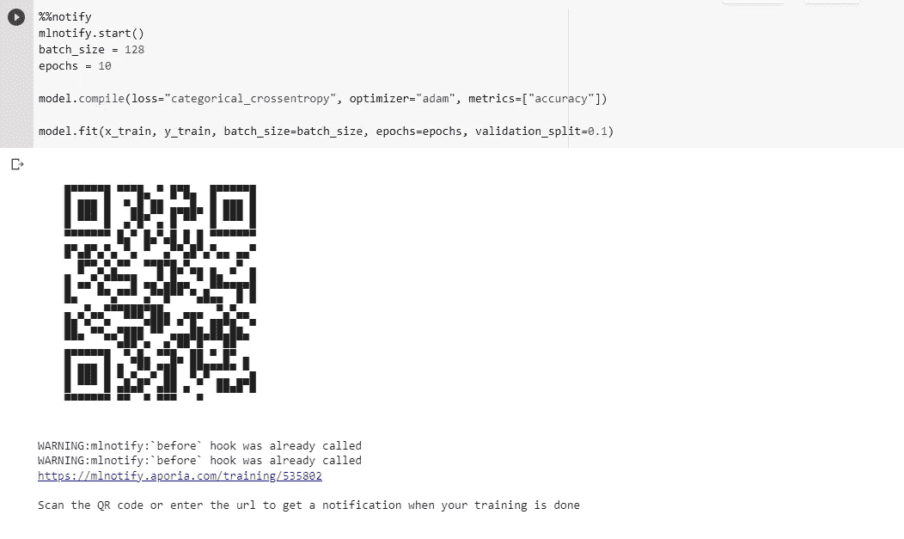
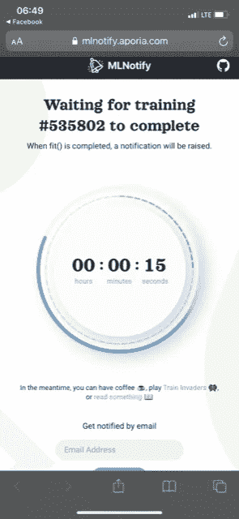
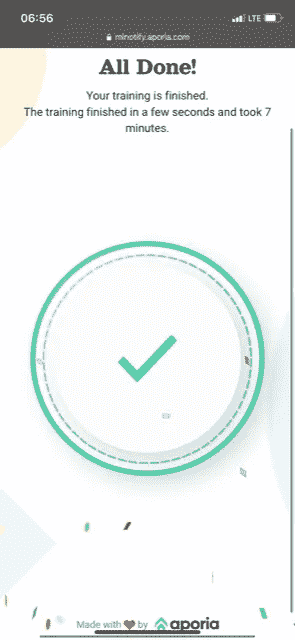

# 如何在手机上接收机器学习模型训练完成时间通知

> 原文：<https://towardsdatascience.com/how-to-receive-machine-learning-model-training-completion-time-notifications-on-your-phone-a8e6cdb02d1a>

## 一种在 Python 脚本中单击“运行”并离开直到模型训练完成的方法。

* *注意:我与 aporia 和 mlnotify 的创建者没有任何关系。我只是分享这一点，以帮助其他人的数据科学学习经验。*


照片由 [Aron 视觉效果](https://unsplash.com/@aronvisuals?utm_source=medium&utm_medium=referral)在 [Unsplash](https://unsplash.com?utm_source=medium&utm_medium=referral) 上拍摄

# 介绍

每个人在他们的数据科学旅程中都要经历这个过程:w **等待他们的机器学习模型训练完成**。*你是干什么的？你会坐在电脑前等待模型完成吗？或者你离开了，冒着训练过程提前结束的风险，或者浪费宝贵的时间，认为你的模型实际上已经完成了，还在训练？我找到了一种方法来训练你的机器学习模型，离开你的电脑，当训练完成时，会收到通知。如果你生活中有其他的事情要做，需要离开电脑，但又不想在模型训练结束后浪费宝贵的分析时间，这将非常有帮助。*

# mlnotify

我最近在我的数据科学之旅中遇到了 *mlnotify* ，认为它好得令人难以置信。你可以在这里找到更多关于[*ml notify*](https://mlnotify.aporia.com/)[的信息。它是由 aporia 创建的，是一个在模型训练完成时通知机器学习爱好者的工具。用户调用**后。fit()** 在他们的 ML 模型上，提供了一个二维码，用户可以对其拍照并接收计时器，并在他们的手机上更新训练的完成情况。此外，用户可以选择访问 mlnotify 网站来跟踪其模型的训练进度，也可以选择在训练停止时接收电子邮件。](https://mlnotify.aporia.com/)

# 例子

在今天的例子中，我们将创建一个基本的[卷积神经网络(CNN](https://medium.com/towards-data-science/convolutional-neural-networks-from-an-everyday-understanding-to-a-more-technical-deep-dive-83af329e5d89) )来对 [MNIST 数据集](https://en.wikipedia.org/wiki/MNIST_database)进行分类。首先，我们想要导入我们的包。

```
import mlnotify
import tensorflow as tf
import keras
import numpy as np
from keras import layers
```

你将需要！pip 在导入库之前安装 mlnotify。接下来，我们要加载 MNIST 数据集。 **Keras** API 允许我们用他们的数据集方法来做这件事。为了正确训练我们的模型，我们需要在 0 和 1 之间缩放图像，将它们转换为 *float32* 值，并将其整形为 *(28，28，1)。*最后一步是将类别标签向量转换成二进制矩阵。

```
#Creating the training and test sets(x_train, y_train), (x_test, y_test) = keras.datasets.mnist.load_data()#Image scaling
x_train = x_train.astype("float32") / 255
x_test = x_test.astype("float32") / 255# Image Shaping
x_train = np.expand_dims(x_train, -1)
x_test = np.expand_dims(x_test, -1)#Class label vector conversion
num_class = 10
y_train = keras.utils.to_categorical(y_train, num_class)
y_test = keras.utils.to_categorical(y_test, num_class)
```

现在让我们创建模型。该模型将有两个*卷积*层，每个使用 *3x3* 内核和一个*泄漏 ReLU* (LReLU)激活函数。第一*卷积*层将具有 *32* 个神经元，第二层将成形为具有 *64* 。在*卷积*层之后，我们将使用参数值为 *(2，2)的*最大池*层。*最后，该模型将以一个*脱落*层、*展平*层和*密集*层结束，该层使用我们为其神经元数量创建的 *num_class* 参数(在本例中为 *10* )。*密集*层将利用 *Softmax* 激活功能，因为这是一个多分类问题。

```
model = keras.Sequential([
keras.Input(shape=input_shape),
layers.Conv2D(32, kernel_size=(3, 3)),
layers.LeakyReLU(),
layers.MaxPooling2D(pool_size=(2, 2)),
layers.Conv2D(64, kernel_size=(3, 3)),
layers.LeakyReLU(),
layers.MaxPooling2D(pool_size=(2, 2)),
layers.Flatten(),
layers.Dropout(0.5),
layers.Dense(num_classes, activation="softmax"),
]
)
```

最后是训练模式的时候了。让我们看看 *mlnotify* 如何与培训过程交互。您需要编写 **%%notify** 和 **mlnotify.start()** (参考下面的代码)来调用 *mlnotify* API。

```
%%notify
mlnotify.start()
batch_size = 128
epochs = 10model.compile(loss="categorical_crossentropy", optimizer="adam", metrics=["accuracy"])model.fit(x_train, y_train, batch_size=batch_size, epochs=epochs, validation_split=0.1)
```

当您执行他的代码时，会弹出一个二维码，让您可以在手机上获得培训进度。



培训二维码(图片来自作者)

扫描二维码后，你的手机上会弹出一个计时器来跟踪你的模特的训练。



电话计时器培训(图片来自作者)

你也可以通过 *mlnotify* 提供的链接访问同一个定时器。一旦培训完成， *mlnotify* 将会通过电话通知您，无论您身在何处！



培训完成(图片来自作者)

# 结论

正如我们今天看到的，当你离开办公桌而不是坐在电脑前盯着进度条的时候，有一些方法可以通知你机器学习模型何时完成训练*。这个 API 允许你在终端中点击 run，继续做你一天中的其他事情，而不必经常检查模型的训练进度。我发现这个 API 在训练耗时较长的模型时非常有用。它允许我去做我一天中喜欢和享受的其他活动，但通过 *mlnotify* 的快速通知快速返回我训练的模型的结果。我希望你和我一样在使用这个工具时发现同样的价值！*

如果你喜欢今天的阅读，请关注我，并告诉我你是否还有其他想让我探讨的话题！如果你没有中等账号，就通过我的链接 [**这里**](https://ben-mccloskey20.medium.com/membership) **报名吧！另外，在**[**LinkedIn**](https://www.linkedin.com/in/benjamin-mccloskey-169975a8/)**上加我，或者随时联系！感谢阅读！**