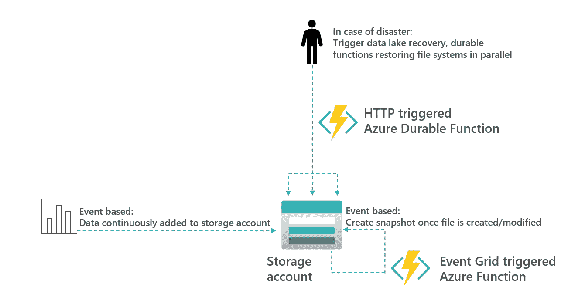
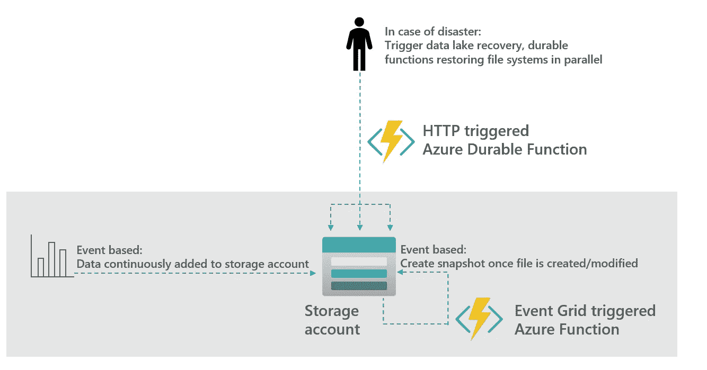
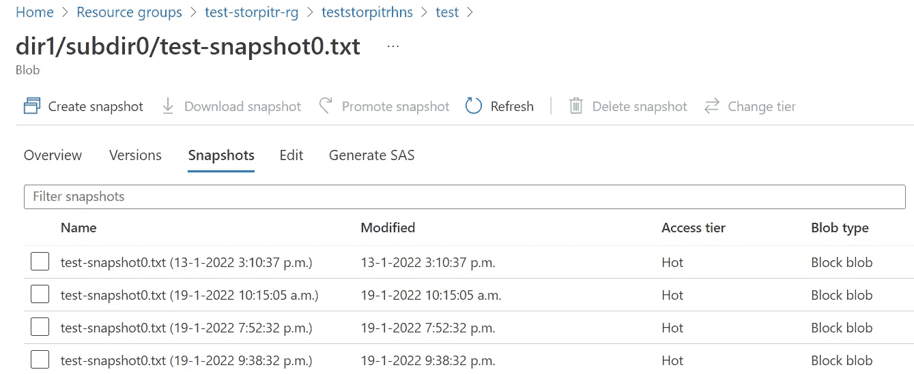
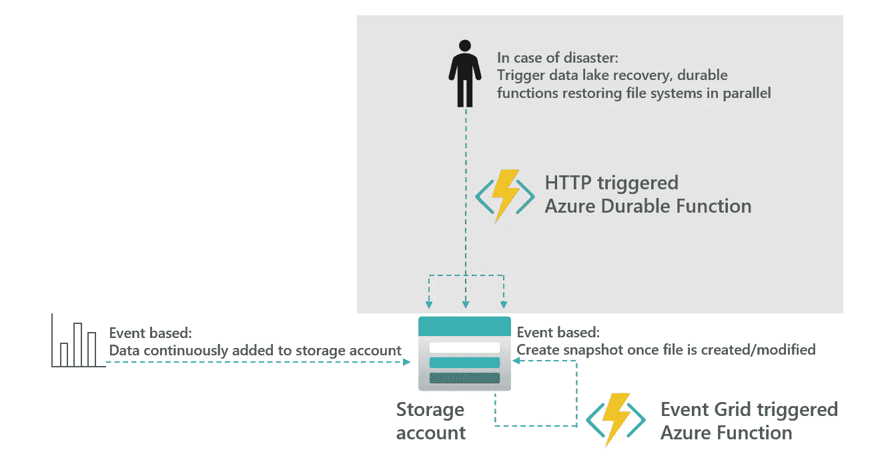
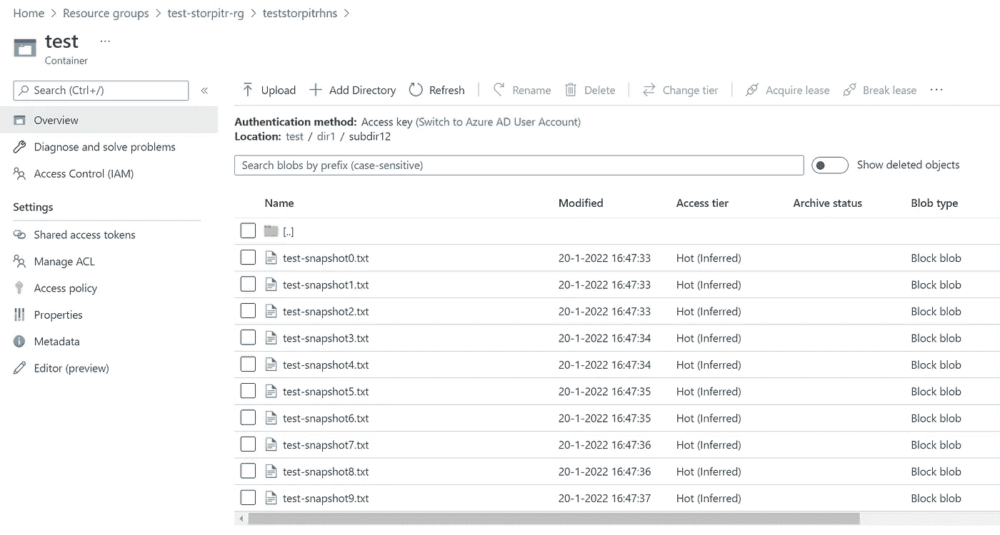
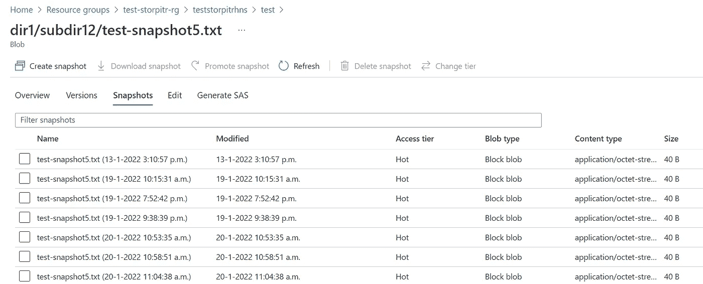
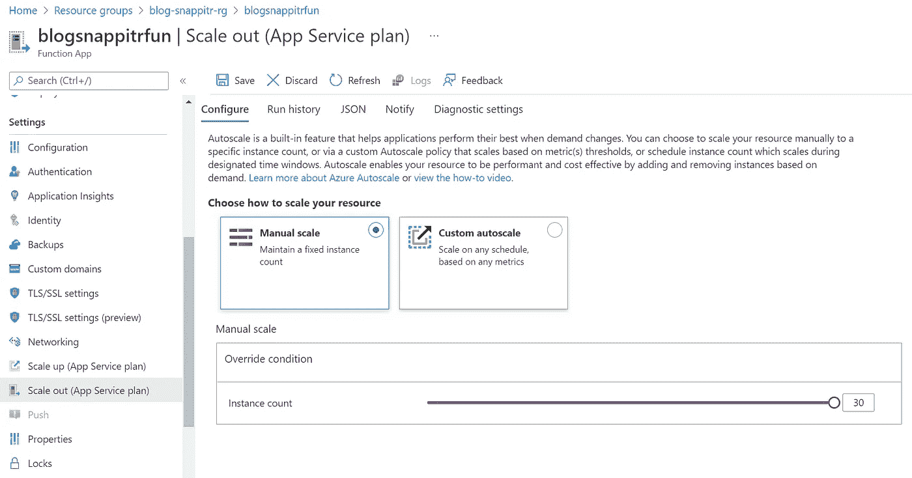
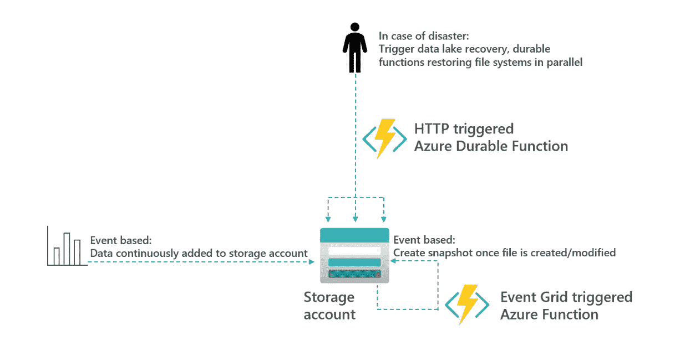

# 如何为您的 Azure 数据湖构建时间点恢复解决方案

> 原文：<https://towardsdatascience.com/how-to-recover-your-azure-data-lake-5b5e53f3736f>

## 利用快照、软删除和 Azure 功能在 Azure 数据湖存储上构建时间点恢复解决方案。

*TLTR:在* [*克隆项目并运行脚本 https://github . com/rebremer/azure-functions-data lake-recovery-pitr/blob/main/script . PS1*](https://github.com/rebremer/azure-functions-datalake-recovery-pitr/blob/main/script.ps1)*部署解决方案*

# 1.介绍

企业数据湖中的一个普遍担忧是，由于应用程序错误或人为错误，数据会被破坏。在这种情况下，可能需要执行时间点恢复(PiTR)并恢复快照。启用了分层命名空间(HNS)的 Azure 存储尚不支持 PiTR。但是，快照和软删除是可用的，可以用作创建恢复解决方案的构造块。

在这篇博客和 git repo `[azure-functions-datalake-recovery-pitr](https://github.com/rebremer/azure-functions-datalake-recovery-pitr)`中，讨论了如何使用快照、软删除和 Azure 函数来实现 PiTR，参见下面的架构。



1.建筑——作者的图像

在这篇博文的剩余部分，我们将更详细地解释数据湖恢复项目。这将按如下方式完成:

*   在第 2 章中，确保在数据湖中添加/修改文件时创建快照。
*   在第 3 章中，详细解释了如何使用这些快照来构建数据湖恢复功能，以便在数据损坏时加以利用。此外，解决方案的可扩展性将在第 3.3 章中讨论。

最后，要了解更多关于灾难恢复的知识，请参阅我之前的[博客](/disaster-recovery-scenarios-for-azure-storage-sql-cosmos-db-synapse-9bf5b561f858)。

# 2.基于事件:创建快照

在这一章中，项目开始运行。在这方面，需要做以下工作:

*   2.1 先决条件
*   2.2 设置 Azure 数据湖
*   2.3 设置快照创建

另请参见下面的概述:



2.架构，基于事件的快照创建—按作者创建图像

## 2.1 先决条件

本教程需要以下先决条件:

*   [Azure CLI](https://docs.microsoft.com/en-us/cli/azure/install-azure-cli?view=azure-cli-latest)
*   [Python 3.7+](https://www.python.org/downloads/)
*   [Azure 功能核心工具](https://docs.microsoft.com/en-us/azure/azure-functions/functions-run-local)

最后，将下面的 git repo 克隆到您的本地计算机上。如果你没有安装 git，你可以从网页上下载一个 zip 文件。

```
git clone [https://github.com/rebremer/azure-functions-datalake-recovery-pitr](https://github.com/rebremer/azure-functions-datalake-recovery-pitr)
```

## 2.2 设置 Azure 数据湖

在这一部分中，使用以下属性创建了一个 Azure 数据湖

*   支持分层命名空间(HNS)的 Azure 存储帐户提供了真正的文件系统，而不是基于对象的存储
*   为启用了 HNS 的存储帐户启用快照预览，请参见[https://learn . Microsoft . com/en-us/azure/storage/blob/snapshot s-overview # about-blob-snapshot s](https://learn.microsoft.com/en-us/azure/storage/blobs/snapshots-overview#about-blob-snapshots)
*   已禁用访问密钥，仅允许 Azure AD 作为身份外围设备
*   启用软删除

运行以下脚本:

```
# 0\. Set variables
#
$SUB='<<your subscription>>'
$RG='<<your resource group>>'
$LOC='<<your location>>'                             
$DLSTOR='<<your data lake account>>'
$FILE_SYSTEM='<<your data lake file system name>>'
$EMAIL='<<your email address>>'              

# 1\. Create resource group
#
az account set --subscription $SUB                 
az group create -n $RG -l $LOC# 2\. Create data lake account
#
az storage account create -n $DLSTOR -g $RG -l $LOC --sku Standard_LRS --kind StorageV2 --enable-hierarchical-namespace true --allow-shared-key-access false# 3\. Add yourself as user to data lake acount
#
$scope="/subscriptions/$SUB/resourceGroups/$RG/providers/Microsoft.Storage/storageAccounts/$DLSTOR/blobServices/default"
az role assignment create --role "Storage Blob Data Contributor" --assignee $email --scope $scope # 4\. Enable soft delete on storage acount
#
az storage account blob-service-properties update -n $DLSTOR -g $RG --enable-delete-retention true --delete-retention-days 7# 5\. Create File System on date lake account
#
az storage container create --account-name $DLSTOR -n $FILE_SYSTEM --auth-mode login
```

## 2.3 设置快照创建

在这一部分中，一旦创建或更新了文件，就会创建快照。这是按如下方式完成的:

*   创建侦听存储帐户的事件网格
*   一旦文件被创建/修改，事件网格 Azure Functions 被触发
*   Azure Functions 创建文件快照

另请参见下面的脚本:

```
# 0\. Set variables
#
$SUB='<<your subscription>>'
$RG='<<your resource group>>'
$LOC='<<your location>>'
$DLSTOR='<<your data lake account>>'
$FUNSTOR='<<your azure function storage account>>'
$FUNNAME='<<your azure function name>>'
$FUNPN='<<your azure function app plan name>>'# 1\. Deploy Event Grid triggered Functions
#
az functionapp plan create -g $RG -n $FUNPN --sku B1 --is-linux true
az storage account create -n $FUNSTOR -g $RG -l $LOC --sku Standard_LRS --kind StorageV2
az functionapp create -n $FUNNAME -g $RG -s $FUNSTOR -p $FUNPN --assign-identity --runtime Python
$function_mi=$(az functionapp show -n $FUNNAME -g $RG | ConvertFrom-Json).identity.principalId
az role assignment create --assignee $function_mi --role "Storage Blob Data Contributor" --scope $scope
func azure functionapp publish $FUNNAME # 2\. Subscribe to event grid
#
$stordlid = "/subscriptions/$SUB/resourceGroups/$RG/providers/Microsoft.Storage/storageaccounts/$DLSTOR"
$endpointid = "/subscriptions/$SUB/resourceGroups/$RG/providers/Microsoft.Web/sites/$FUNNAME/functions/EventGridTriggerCreateSnapshot"
az eventgrid event-subscription create --name storegversion --source-resource-id $stordlid --endpoint-type azurefunction --endpoint $endpointid --included-event-types Microsoft.Storage.BlobCreated
```

如果现在文件被上传到存储帐户或被修改，则会自动创建快照，另请参见下图。



2.3 自动快照创建—按作者创建图像

在下一章中，我们将讨论 Azure 函数，它可以用来恢复快照。

# 3.发生灾难时:恢复数据湖

在这一章中，数据湖将在灾难发生时恢复。在这方面，需要做以下工作:

*   3.1 讨论灾难恢复场景
*   3.2 设置和运行 Azure 持久功能
*   3.3 规模数据湖恢复解决方案

另请参见下面的概述:



## 3.1 讨论灾难恢复场景

当数据损坏发生时，您希望恢复数据损坏前的状态。让我们把这个时刻命名为 restore_date。那么对于每个单独的文件，下面的场景是真实的

*   场景 1: file_last_modified < restore_date. In this situation, the file was last modified before corruption occured =>什么都不做
*   场景 2:文件创建时间>恢复日期。在这种情况下，文件仅在发生损坏后创建= >软删除文件
*   场景 3:文件创建时间< restore_date < file_last_modified && snapshot is present before restore_date =>恢复快照
*   场景 4: file_creation_time < restore_date < file_last_modified && NO_snapshot is present before restore_date =>提出条件，创建需要更多调查的警报下一步做什么

请注意，当实现第 2 章中解释的基于事件的快照时，场景 4 永远不会发生；每当创建或修改文件时，都会创建快照。4 个场景的详细逻辑可以在下面的 Python 文件中找到:`[ActivityPointInTimeRecovery](https://github.com/rebremer/azure-functions-datalake-recovery-pitr/blob/main/ActivityPointInTimeRecovery/__init__.py#L91)`

## 3.2 安装和 Azure 持久功能

通常，企业数据湖包含数百个容器、数百个文件夹和子文件夹以及数 TB 的数据。要恢复数据湖，以下是关键:

*   恢复数据湖应该是精细的。应该可以恢复单个容器，甚至文件夹，而不是整个存储帐户
*   修复应在大范围内进行。这应该并行进行，而不是让一个进程一个接一个地恢复文件夹和文件

[Azure 持久功能扇入/扇出模式](https://docs.microsoft.com/en-us/azure/azure-functions/durable/durable-functions-cloud-backup?tabs=python)正是这么做的。在这个场景中，多个函数被并发执行，文件夹被递归解析。

在下面的脚本中，代码被部署到一个 Azure 函数。也可以决定先在本地运行 Azure(见脚本[此处](https://github.com/rebremer/azure-functions-datalake-recovery-pitr/blob/main/script.ps1#L84))。运行以下脚本以部署到 Azure 功能:

```
# 0\. Set variables
#
$RG='<<your resource group>>'
$DLSTOR='<<your data lake account>>'
$FILE_SYSTEM='<<your data lake file system name>>'
$FUNNAME='<<your azure function name>>'# 1\. Deploy Function
#
func azure functionapp publish $FUNNAME# 2\. Get function key
#
$code=$(az functionapp keys list -n $FUNNAME -g $RG | ConvertFrom-Json).functionKeys.default# 3\. Create sample folders and files in File System
#
Invoke-RestMethod "https://$FUNNAME.azurewebsites.net/api/orchestrators/OrchestratorInitFileSystem?code=$code&storage_account_name=$DLSTOR&file_system=$FILE_SYSTEM&number_of_folders=2"# 4\. Restore data lake (play around with restore_date in URL to test # four scenarios described in 2.2
#
Invoke-RestMethod "https://$FUNNAME.azurewebsites.net/api/orchestrators/OrchestratorPointInTimeRecovery?code=$code&restore_date=2021-01-20T00:00:00.0000000Z&storage_account_name=$DLSTOR&file_system=$FILE_SYSTEM&number_of_folders=2"
```

脚本成功运行后，一个包含 2 个文件夹和 100 个子文件夹的文件系统被设置，每个子文件夹包含 10 个文件，另请参见下面的屏幕截图:



3.2.1 目录 1，子目录 12，包含 10 个文件

使用快照，可以选择任何日期来恢复快照。逻辑描述了将恢复哪些快照(如果有)，请参见下面示例文件中可以恢复的可能快照:



3.2.2 目录、子目录 12、文件测试快照 5.txt、要恢复的可能快照

## 3.3 规模数据湖恢复解决方案

选择 Azure 持久功能是因为它的伸缩能力。在上一章中，创建了一个只有两个文件夹的 file_system。通过改变 InitFileSystem 函数中的参数`&number_of_folders=10000`，可以建立一个 10M(10000 * 100 * 10)文件的文件夹结构。但是，在执行此操作之前，该解决方案应进行扩展，因为基本 SKU 仅用于 1 名员工。有两种选择两种规模。

*   纵向扩展:通过纵向扩展，可以使用拥有更多内核/内存的虚拟机。通过使用更多的内核和内存，可以在同一台机器上运行多个恢复线程。最高的 SKU 是 [P3V3](https://docs.microsoft.com/en-us/azure/app-service/app-service-configure-premium-tier#create-an-app-in-premiumv3-tier) ，其中使用了 8 个内核(相比之下，3.2 中使用的基本 SKU 只有一个内核)
*   横向扩展:通过横向扩展，多个虚拟机/工作人员用于运行恢复作业。如果使用 2 个内核的 P1V3 SKU，虚拟机的最大数量为 30，另请参见下图



3.3 SKU P1 v3 中的横向扩展解决方案最多 30 个实例(工作人员)

通过横向扩展，该解决方案可以真正扩展到在几分钟/几小时内恢复 1000 万个文件。最后，请注意，文件大小并不重要，因为在恢复解决方案中使用了快照。通过使用快照，数据不会被拷贝回来，这非常耗时。相反，斑点的状态通过指回在恢复时刻当前的[块斑点 id](https://docs.microsoft.com/en-us/rest/api/storageservices/understanding-block-blobs--append-blobs--and-page-blobs#about-block-blobs)来恢复。

# 4.结论

企业数据湖中的一个普遍担忧是，由于应用程序错误或人为错误，数据会被破坏。在这种情况下，可能需要执行时间点恢复(PiTR)并恢复快照。启用了分层名称空间(HNS)的 Azure 存储尚不支持 PiTR。

在这篇博客和 git repo `[azure-functions-datalake-recovery-pitr](https://github.com/rebremer/azure-functions-datalake-recovery-pitr)`中，讨论了如何使用基于事件的快照创建、软删除和 Azure 持久功能来实现 PiTR 的可伸缩性，另请参见下面的架构。最后，讨论了如何通过使用更高的 SKU 和多个工作人员来纵向和横向扩展解决方案。



4.建筑——作者的图像