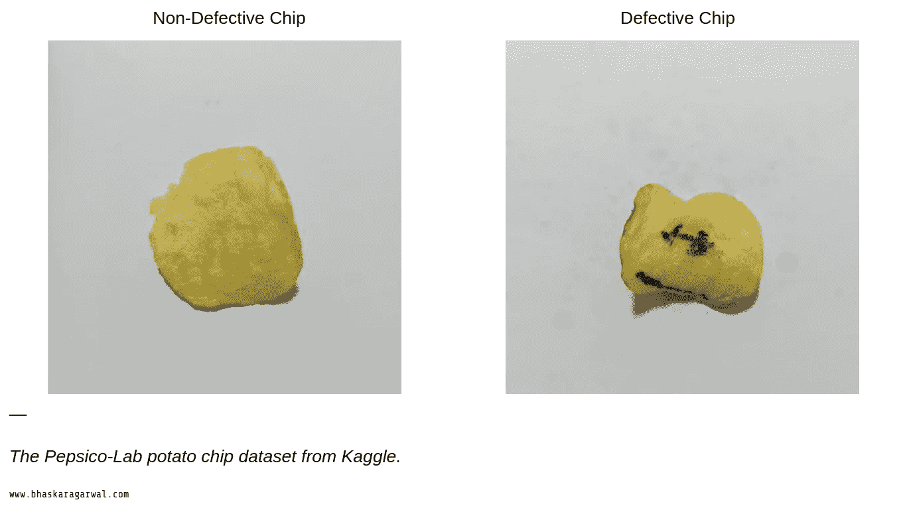
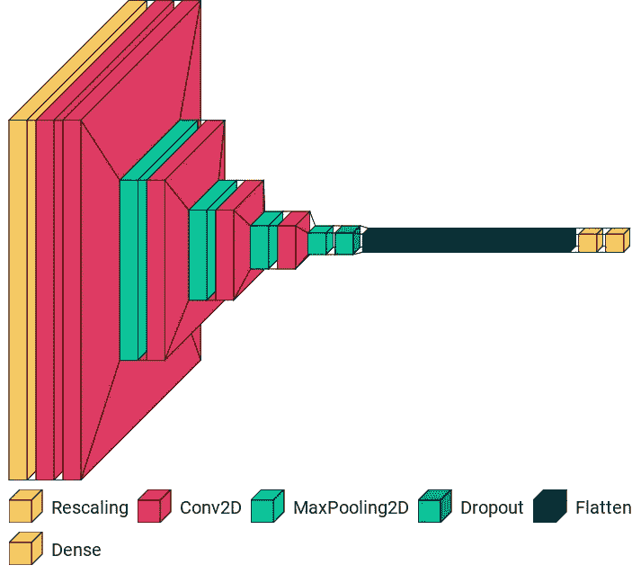
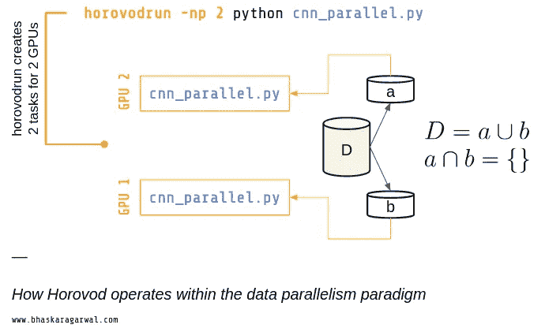
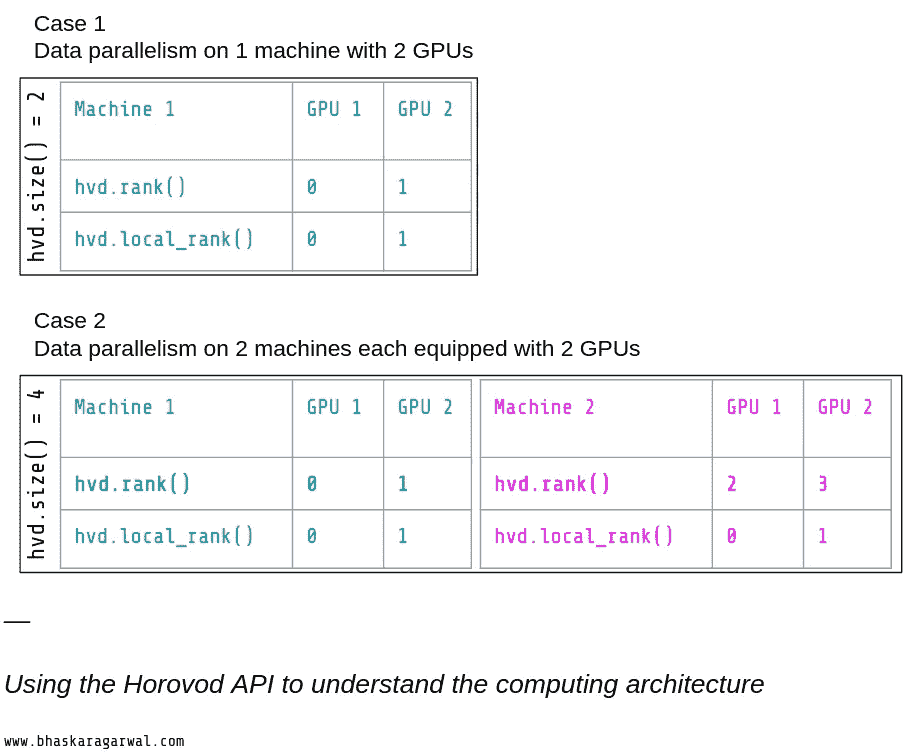
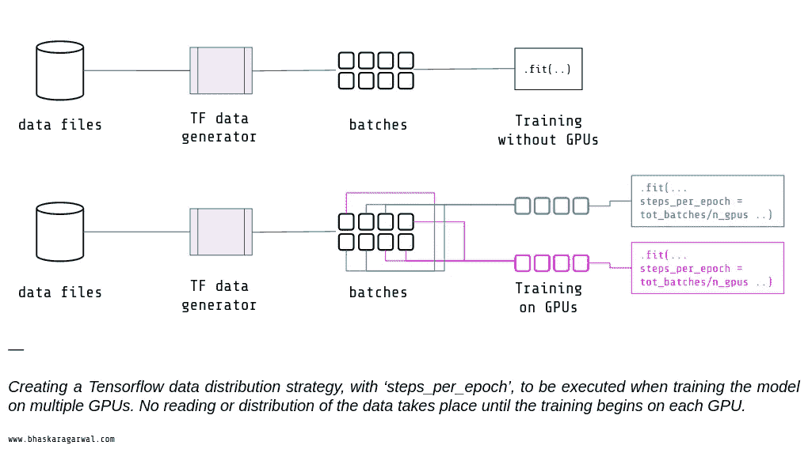
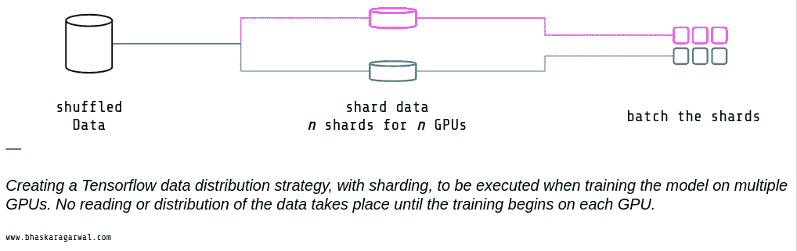
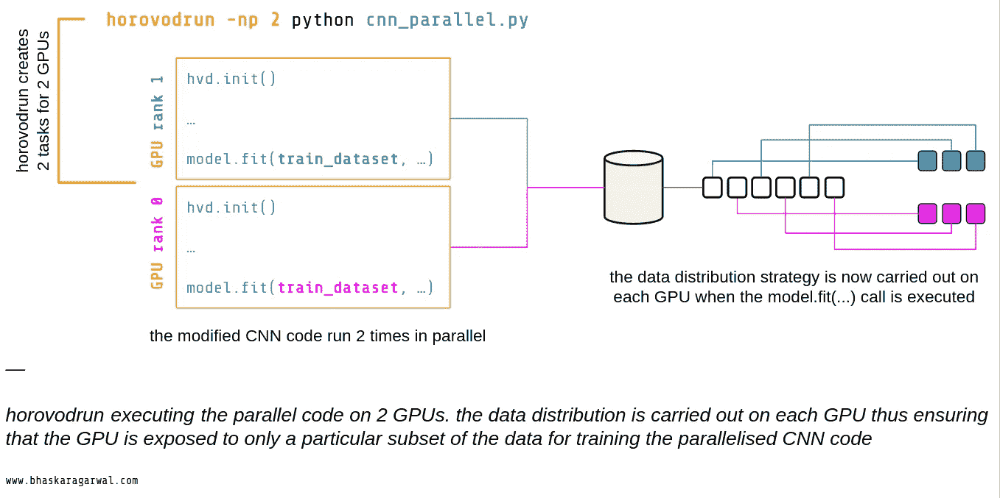
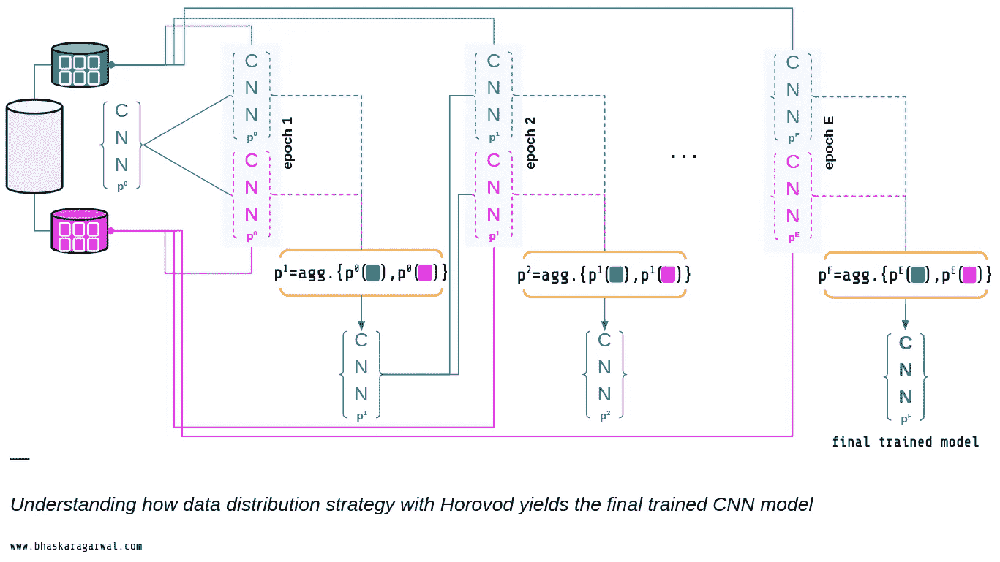
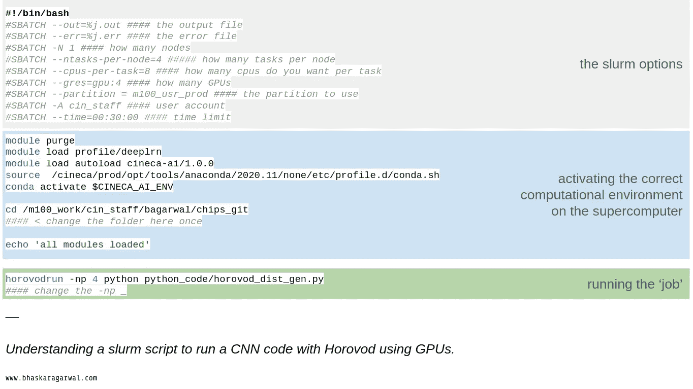
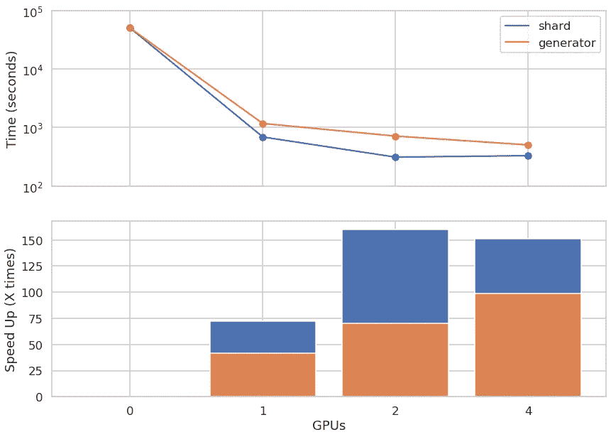

# 如何将你的神经网络的训练时间从几小时减少到几分钟

> 原文：<https://towardsdatascience.com/how-to-reduce-the-training-time-of-your-neural-network-from-hours-to-minutes-fe7533a3eec5>

## 关于使用 HPC 的人工智能的文章的第 2 部分:使用 Horovod 和 GPU 并行 CNN 以获得 75-150 倍的加速。


罗伯特·卡茨基在 [Unsplash](https://unsplash.com?utm_source=medium&utm_medium=referral) 上的照片

在本系列的[第 1 部分](/machine-learning-on-supercomputers-data-processing-aa403e51516b)中，我们研究了如何通过使用多处理模块的几行 Python 代码在 IO 操作中获得**到 1500 倍的加速。**在本文中，我们将研究并行化深度学习代码，并将训练时间从大约 13 小时减少到 13 分钟！****

# 背景

作为一名数据科学家，你最终会面临以下问题(如果你还没有面对过的话)。

***“我有一个要训练的神经网络，但输入数据不适合内存！”*** 或 ***“我的神经网络用这么大的数据量来训练，永远花不完！”***

如果将你的一大部分数据排除在训练之外，或者等待几个小时(甚至几天)让你的神经网络完成训练，那肯定是很可惜的。必须有一个更好的方法，这就是所谓的**数据并行**。

# 问题是

在这篇文章中，我们将使用在 [Kaggle](https://www.kaggle.com/datasets/concaption/pepsico-lab-potato-quality-control) 上可获得的百事公司实验室薯片控制数据集的修改版本。原始图像为 2000 x 2000 像素格式，有 3 个通道。我修改图像，将它们缩放到 500 x 500，并应用 5 次变换(一次垂直翻转、一次水平翻转和三次 90 度旋转)来创建比原始数据集中多 6 倍的图像。



这两种类型的芯片区分在这个职位。

然后，我编写了一个简单的卷积神经网络(CNN)代码，用于基于从原始数据集创建的输入数据进行分类。所有的材料都可以在这里找到。



这篇文章中使用的 CNN 是使用 [visualkeras](https://github.com/paulgavrikov/visualkeras) 可视化的。请注意，为了美观，第一层没有按比例绘制，但它给出了我为这个问题创建的微型 CNN 的概念。

## 资源和存储库

在本文中，我们将使用:

*   张量流 2 和 Keras
*   霍罗沃德
*   Python 3.8+版本
*   至少有 1 个 GPU 的计算机
*   所有的代码和数据都可以在这个[库](https://github.com/codiusmaximus/chips_cnn)中找到。

# 数据并行性

在数据并行中，我们部署相同的模型，在不同的处理单元(比如 GPU)上进行训练，但是使用输入数据的唯一子集。在每个时期之后，模型参数被收集、聚集并传送回处理单元，以继续训练它们各自的模型。通过这种方式，每个处理单元使用其自己唯一的数据子集(即数据的一部分)来训练相同的模型，但是模型参数会随着对整个输入数据集的了解而更新。

## 我如何将这种方法用于神经网络？

如果你使用 TensorFlow、PyTorch 或任何流行的公共深度学习框架，你可以使用 [Horovod](https://github.com/horovod/horovod) 进行分布式训练。Horovod 是由优步开发的，目的是将 HPC 的思想引入深度学习。安装相当简单，我就不赘述了，因为他们的 [GitHub 页面](https://github.com/horovod/horovod)很好地解释了这一点。在这篇文章的剩余部分，我们将讨论如何使用 Horovod 数据并行化他们的 TensorFlow 代码。

把 Horovod 想象成你现有代码的一个插件。在*Horovod-ing*你的代码中涉及的步骤遵循数据并行的思想，所以在做任何事情之前，你必须完全理解你的代码将如何被 horo VOD 执行。然后，您必须决定分发数据的方式。一旦完成，就可以开始在代码中实现 Horovod 了。

对我来说，用下面的步骤来处理这个问题更容易。

1.  了解你的代码将如何用 Horovod 执行，即 *horovodrun*
2.  确保您有一个好的数据分发策略
3.  在代码中初始化 Horovod
4.  确保您的优化器是分布式的
5.  从协调器广播您的变量并修复您的回调

我们现在将详细讨论每一点。

# 1.Horovod 如何运作

Horovodrun 将一些基本的消息传递接口(MPI)命令和概念封装到一个更高级别的 API 中。因此，如果熟悉 MPI 的话，您可以发现两者之间有很多相似之处。在一个有 *n* 个 GPU 的系统上，人们会执行一个 CNN 代码，这里已经实现了 Horovod，如下所示

```
horovodrun -np **n** python cnn_parallel.py
```

用 Horovod 修改过的代码需要用 *horovodrun* 或 *mpirun* 来执行。对于数据并行框架，使用 *n* 个 GPU 可以创建 n 个任务。每个任务都使用 python 运行修改过的 CNN 代码，但是只针对数据的一个唯一子集。在下图中，我也做了同样的解释。我们正在一台有 2 个 GPU 的机器上工作。输入数据集 D 被分成两个子集 a 和 b，使得它们之间没有共同的元素。



理解 Horovod 如何并行执行代码。

这里要记住的重要一点是，您的整个 python 代码将运行 *n* 次，其中 n 是 GPU 的数量。因此，每个打印命令，每个 IO 操作，每个绘图部分等。将被执行 n 次。起初这可能是一个令人困惑的概念，但好的一面是每个屏幕上的消息(例如 print(…))都有自己的 GPU 标识符。

Horovod 附带了一些有用的调用(类似于 MPI 标准定义的调用),帮助定义我们将在其上运行代码的系统的架构。“hvd.size()”命令显示实际可用的 GPU 数量，“hvd.local_rank()”告诉您 GPU 的本地等级，“hvd.rank()”告诉您 GPU 的全局等级。等级可以被认为是 GPU id。下图更好地解释了这个想法。



了解单节点与多节点设置中 GPU 的大小和等级。

# 2.数据分发策略

那么，为什么必须分发数据呢？为了充分利用数据并行性，每个 GPU 必须看到唯一的数据子集。然而，如果您传递相同的数据集进行训练，您将在 n 个 GPU 上使用相同的样本对模型进行 n 次训练，或者换句话说，您将使用相同的数据以完全相同的方式运行代码 n 次。这不是我们想要通过数据并行实现的。

为了正确地分配数据，可以采用许多策略。Pytorch、Tensorflow 等都有内置的数据分发方法。，但实际的策略将取决于数据的结构和数据量。

让我们用一个简单的例子来创建一些数据分布策略。假设我们的数据由从 1 到 100 的所有整数组成，按升序排列，没有重复。我们希望将这些数据分布在 2 个 GPU 上。

## **选项 1:张量流数据生成器**

我们将在训练开始时采用在 GPU 上随机分配批次的想法。我们将欺骗 TensorFlow 中的 fitting 调用，使用“steps_per_epoch”关键字将 1/n 个批次分配给每个 GPU。这种方法适用于数据生成器，在我们的例子中是图像数据生成器。我们保持与我们在没有任何 GPU 的情况下训练时相同的批量大小。



用张量流数据发生器进行数据分配。

```
img_gen = tf.keras.preprocessing.image.ImageDataGenerator(
                                           validation_split=split)train_dataset = img_gen.flow_from_directory(
                           directory= train_data_path,
                           target_size=(img_height,img_width),              
                           color_mode=**'rgb'**,
                           batch_size=**batch_size**,
                           class_mode=**'sparse'**,
                           seed=123, 
                           shuffle=True, 
                           subset=**'training'**)val_dataset=img_gen.flow_from_directory(directory=...  
                           subset=**'validation'**)**total_train_batches** = train_dataset.samples//batch_size**total_val_batches** = val_dataset.samples//batch_size
```

然后，当我们执行拟合时，我们指示 TensorFlow 仅使用总批次的 1/n 进行训练和验证。这是因为训练将在每个 GPU 上进行，并且通过将“steps_per_epoch”指定为 total_batches/n，我们指示 TensorFlow 在两个 GPU 上拆分批次，以便每个 GPU 从我们的数据生成器获得批次的不相交子集。

```
history = model.fit(
    train_dataset,
    epochs=epochs,
    batch_size=batch_size,
 **steps_per_epoch=total_train_batches//hvd.size(),**validation_data=val_dataset,
 **validation_steps=total_val_batches//hvd.size(),***
    ...*
)
```

## **方案二:张量流数据。数据集对象**

我们将使用“分片”的概念，这相当于获取数据集中的第 q 个元素。下面的伪代码应该能更好的解释。

```
D = [1,2,...,99,100]# split into 2 shards
shard_1 = [1,3,5,...]
shard_2 = [2,4,6,...]# split into 3 shards
shard_1 = [1,4,7,...]
shard_2 = [2,5,8,...]
shard_3 = [3,6,9,...]
```

下面我描述了两种不同的方法，每批 4 个。请注意，这些不是分发数据可以采用的唯一策略，您可以自由设计自己的策略。

*   方法 A:将数据集分片 2 次→批量化
*   方法 B:混洗数据集→分片 2 次数据集→批量处理

从机器学习的角度来看，你能解释为什么只有一种方法是正确的吗？

```
D = [1,2,...,99,100]**# method A**shard_1 = [1,3,5...]
shard_2 = [2,4,6...]shard_1_batch = [[1,3,5,7],[9,11,13,15]...] # split 1
shard_2_batch = [[2,4,6,8],[10,12,14,16]...] # split 2**# method B**D_shuffle = [63,74,22,26,36,14,34,94,60,42,56,17,65,1,12,51...]shuffle_shard_1 = [63,22,36,34,60,56,65,12]
shuffle_shard_2 = [74,26,14,94,42,17,1,51]shuffle_shard_1_batch = [[63,22,36,34],[60,56,65,12]...] # split 1
shuffle_shard_2_batch = [[74,26,14,94],[42,17,1,51]...] # split 2
```

使用方法 A，所有奇数都在分割 1 中结束，偶数在分割 2 中结束。很明显，方法 B 是最好的，因为产生的分割公平地表示(和分布)了偶数和奇数。

现在想想 CNN 的输入。理想情况下，输入文件夹将包含数千(如果不是数百万)您需要训练的图像，通常分组到不同的类别(子文件夹)。当您从图像文件夹中创建 TensorFlow 数据集时，它会从目录结构中推断出类。下面的片段应该能更好地阐明这一点。

```
**input_folder
|-train
| |-class_1**
| | |-image_1.jpg
| | |-...
| | |-image_100.jpg
**| |-class_2**
| | |-image_1.jpg
| | |-...
| | |-image_50.jpg
**| |-class_3**
| | |-image_1.jpg
| | |-...
| | |-image_500.jpg
```

因此，一旦这样的文件夹结构被传递给 TensorFlow，它会自动将文件名映射到它们各自的类，准备好进行处理并传递给 CNN 进行训练。**注意，默认情况下，***image _ dataset _ from _ directory***会打乱文件名，或者换句话说，如果您使用它摄取图像，您的数据集已经被打乱了。**



使用分片的数据分发。

```
import tensorflow.keras.preprocessing as tkplocal_bs = .. # will be scaled with the hvd.size() 
              # we will discuss this laterX_train = tkp.image_dataset_from_directory(..., batch_size = 1) train_dataset = X_train.
                        **unbatch()**.
                        **shard(hvd.size(), hvd.rank()).
                        batch(local_bs).
                        cache()**
```

*hvd.shard()* 调用接受 GPU 的数量(创建多少个碎片)和 GPU 的 *id* 来创建数据的唯一碎片。使用 hvd.size()和 hvd.rank()作为该调用的输入，我们可以轻松地管理将由每个 GPU 处理的数据分割。至此， *train_dataset* 尚未创建，因此不存在于内存中。它将在最终使用下面的命令训练模型时创建。

```
model.fit(train_dataset,...)
```

注意，这里我们使用了 *local_bs，*来代替原来的批量大小。我将很快解释原因。

## **数据分发后训练模型**

一旦我们正确地决定并实现了数据分发策略，我们就准备好训练 CNN 了。此时，使用 2 个 GPU，数据训练策略将被执行，如下所示。



训练 CNN 时执行的数据分发策略。

## 批量大小和学习率(数据分布策略中的选项 2)

如果你使用过神经网络，你必须熟悉学习率和批量的概念。在数据分布式框架中，人们可能需要正确地调整这些，以补偿我们的训练策略的变化。由于每个 GPU 现在都在用唯一的数据子集训练模型，NN now *在每个时期有效处理的样本数量与批量大小不同。请注意，根据您决定如何分发数据以及如何编写代码，您可能不需要执行这种缩放。根据我的经验，如果相应地调整批量大小和/或学习率，上面的数据分布选项 2 通常会更好。基本上，如果您在实现数据并行后发现奇怪的损失和准确性曲线，那么这可能是要记住的事情。*

让我们回到选项 2 的数据分发。我们有 2 个 GPU，数据集由 100 个整数组成，批量大小为 4。每个 GPU 获得 50 个唯一的整数，分组为大小为 4 的批次。每个 GPU 通过处理其自己的 13 个批次(最后一个批次将只有 2 个元素)来执行训练，并且在每个时期之后，模型参数被传递到 Horovod 用于聚合。Horovod 从批量大小为 4 的 GPU 0 和批量大小为 4 的 GPU 1 聚合模型参数，因此*有效地*批量大小为 8！换句话说，当 Horovod 在每个时期结束时更新模型参数时，模型在技术上“看到”了一个批次，其中每个批次具有 8 个独特的样本。下图应该能更好地解释这一点。



基于两个 GPU 的 CNN 数据分布式训练。在每个时期结束时，Horovod(橙色)聚集来自每个 GPU(蓝绿色和紫红色)的模型参数，并更新 CNN 模型，现在为下一个时期的训练做好准备。

在我们不改变批量大小的情况下，即保持其固定为与代码的非数据分布版本相同的值，我们必须随着 GPU 的总数线性*调整学习速率。这是因为在我们的*有效批次*中有更多的样本，可以增加算法在寻找损失函数最小值的过程中允许采取的步长。换句话说，我们有更少的噪声(更多的样本)，因此我们可以在参数空间中进行更大的跳跃，以便找到最小值。

然而，如果我们希望保持固定的学习速率，即与代码的非数据分布版本相同，我们必须与 GPU 的数量成反比地调整批量大小。让我们以整数为例。对于 2 个 GPU，如果我以 2 的批处理大小对我的每个数据分片进行批处理，那么 Horovod 在每个 epoch 结束时看到的*有效批处理大小*是 4。因此，我可以保持与数据分发前相同的学习速度。

总结一下:

```
############################################ THEORY
# original batch size: batch_size
# local batch size: local_bs (batch size on each gpu)#original learning rate: lr
#scaled learning rate: scaled_Llr## option 1: 
# bs= local_bs : therefore, the effective batch size is larger
# therefore scaled_lr = lr*n_gpus## option 2:
# scaled_lr = lr
# therefore local_bs = batch_size/n_gpus 
# now the effective batch size will be the same as before
######################################################################################## IMPLEMENTATION
#**pick one** below:
**# Option 1:**
# local_bs = batch_size
# scaled_lr = base_lr * hvd.size()
# **OR
# Option 2:** local_bs = int(batch_size/hvd.size())
scaled_lr = base_lr
```

* *有时，学习率的平方根缩放或 2/3 幂缩放比严格的线性缩放效果更好*

# 3.在代码中初始化 Horovod

第一步是告诉你的代码你将使用 Horovod。

```
**import horovod.tensorflow as hvd****hvd.init()** # this initiliases horovodprint('Total GPUs available:', hvd.size())
print('Hi I am a GPU and my rank is:', hvd.rank())
```

下一步是使用 GPU 的本地等级作为标识符，将每个可用的 GPU 固定到一个“进程”。

```
*# Pin GPU to be used to process local rank (one GPU per process)*
gpus = tf.config.experimental.list_physical_devices('GPU')
for gpu in gpus:
    tf.config.experimental.set_memory_growth(gpu, True)
if gpus:
  tf.config.experimental.set_visible_devices(gpus[hvd.local_rank()], 'GPU')
```

# 4.分发优化器

这是优化器进行聚合的地方。Horovod 使这变得非常容易，因为我们只需要在代码中添加一行来分发优化器。

```
opt = keras.optimizers.Adam(learning_rate=learning_rate)# Horovod: add Horovod Distributed Optimizer.
**opt = hvd.DistributedOptimizer(opt)**
```

# 5.修复回电

下一步是确保我们不会通过允许所有 GPU 更新模型参数来破坏我们的训练。因此，我们将我们的一个 GPU 声明为“协调器”。这个 GPU 将负责收集模型参数，聚合它们，并在每个训练时期后将它们广播回其他 GPU。请记住，它也将使用自己的数据子集来训练 CNN。通常我们声明排名为 0 的 GPU 为我们的协调器。

```
callbacks = [
    # Horovod: broadcast initial variable states from rank 0 to
    # all other processes. This is necessary to ensure consistent
    # initialization of all workers when training is started with
    # random weights or restored from a checkpoint.
 **hvd.callbacks.BroadcastGlobalVariablesCallback(0),**

    # Horovod: average metrics among workers at the end of every
    # epoch.
 **hvd.callbacks.MetricAverageCallback(),**
    ]# Horovod: save checkpoints only on worker 0 to prevent other
# workers from corrupting them.
**if hvd.rank() == 0:
    callbacks.append(keras.callbacks.ModelCheckpoint('...h5'))**
```

# 运行代码

我们现在准备运行代码。如果您使用的计算机只有 1 个 GPU，您可以从终端执行该命令，如下所示

```
horovodrun -np 1 python python_code/horovod_dist_gen.py
```

相反，如果我们要在一台超级计算机上运行它，我们需要编写一个脚本来提交我们的“作业”，其中作业是一段要用给定的资源组合运行的代码。下面是一个脚本的例子，我在一台有 4 个 GPU 的机器上运行代码。



使用带有 *Horovod* 的 GPU 运行 CNN 代码的 slurm 脚本。

# 结果如何呢？

**无 GPU 时间:14 小时**

**使用 1 个 GPU 的时间:12 分钟**

对于使用碎片的数据分发方法，**我们使用 1 个 GPU** 获得了 75 倍的速度提升，使用 2 个或更多 GPU 获得了**150 倍的速度提升。**



在我们的 CNN 代码中实现 Horovod 并使用 1、2 和 4 个 GPU 运行后获得的加速。

与生成器方法相比，以碎片形式分布的数据性能更好。从 1 个 GPU 到 2 个 GPU 的加速几乎是线性的，即 75 倍到 150 倍，但之后就不再加速了。这是为什么呢？这是因为当我们并行处理一个代码时，我们的想法是最大限度地利用可用资源。有了 1 个 GPU，即使代码运行速度比没有 GPU 时快 75 倍，也仍然有从更多计算能力中受益的空间。当我们添加第二个 GPU 时，运行时间减半，从而导致理想的线性加速。此时，我们处于这样一个阶段，即提供给代码的资源对于计算量来说是最优的。增加更多的资源对我们没有好处。因此，我们看不到 4 个 GPU 有更多的速度提升。我们可以使用命令 *nvidia-smi 来监控资源使用情况(在我们的例子中是 GPU 使用情况)。*我不会深入探讨这个话题，但如果你有兴趣，请随时联系我。

# 结束语

*   请随意设计您自己的数据分发策略。这通常取决于你的数据是如何组织的，以及数据的大小。
*   使用 GPU 时，初始设置总会有开销，即根据您使用的系统，可能需要一些时间来设置 GPU-CPU 通信、环境变量等。这是由引擎盖下的系统完成的，所以如果在开始时代码似乎停顿了几秒钟，它很可能只是在设置 GPU。
*   为了简单起见，我只对训练部分计时。原则上，人们可能需要对整个代码的运行时进行基准测试。这取决于你想优化什么。
*   为了正确测试性能，需要多次运行相同的代码，以获得更好的运行时统计数据。
*   还必须检查模型的收敛性，即使用 GPU 的并行化训练应该收敛到与在没有 GPU 的运行中看到的相同的损失和精度值。此外，无论使用多少个 GPU，精度和损耗曲线都应该收敛到相同的值。