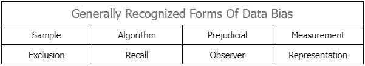

# 如何消除机器学习训练数据中的偏差

> 原文：<https://towardsdatascience.com/how-to-remove-bias-in-machine-learning-training-data-d54967729f88>

## 理解和减少人工智能/人工智能项目训练数据中的偏差

图片作者:作者

在人工智能/人工智能的世界里发生了很大的变化，但是“垃圾”的概念；“清除垃圾”仍然是坚忍的。任何算法的好坏都取决于它的训练数据。而且，没有任何训练数据是没有偏见的，即使是通过自动化生成的数据也是如此。

在过去，许多机器学习算法对某些宗教、种族、性别、种族和经济地位等不公平。IBM 的沃森超级计算机使用医学研究论文数据集向医生提供建议，被发现只支持声誉良好的研究。亚马逊的招聘算法被发现对男性比对女性更有利。COMPAS 是一种风险评估算法，被美国许多州的法官用来帮助判决，因在暴力犯罪中给黑人分配更高的再次犯罪风险系数而受到争议。2016 年，微软对一个 Twitter 聊天机器人(从其他推文中学习)进行了一天的实验，结果糟糕地结束了，该机器人在 16 个小时内发布了 95000 条推文，其中大多数都充满了厌女症、种族主义和反犹太主义思想。

但是，事情是这样的——算法不是不道德的、种族主义的或道德上有缺陷的。然而，他们接受训练的数据是另一回事。

# 数据偏差很复杂

偏差会破坏多个结点的数据。在收集、数据聚合、模型选择甚至最终用户解释的过程中，它可能会渗入到无害的数据集中。事实上，几乎可以假设没有任何数据不存在这样或那样的偏差。可能是人类训练者的外部偏见造成的。或者，它可能是数据集中任何组的过度简化或不令人满意的表示的结果。

根本原因并不总是很明显。但是，影响是！

# 数据偏差对机器学习的影响

有偏差的数据集是不平衡的。它未能代表机器学习模型的原始动机。它的结果是不准确的，它的决策是有偏见的，并且它的精度水平可以在不同的环境下变化，从而违背了模型的目的。

COMPAS(替代性制裁的矫正罪犯管理概况)是一个非常受欢迎的例子，说明了在有偏见的数据上训练的自给自足算法的后果。它使用一份问卷来评估罪犯的各种参数，并预测他们再次犯罪的可能性。这一预测被美国许多州和司法管辖区的法官用来量刑。

在几个有问题的决定、关于其完整性的各种问题和几起诉讼之后，ProPublica 检查了该算法的风险评估因素，并观察到两大荒谬之处。

> 预测精度低于 20%
> 
> 黑人罪犯被贴错标签的 2 倍

COMPAS 仅仅是一个例子，它展示了由于有偏见的 ML 模型，人类可能不得不遭受的非常真实的后果。任何 AI/Ml 模型的实施范围的影响直接受到算法获得的训练的性质的影响，因此，对创建所述数据集的 [**数据注释服务**](https://www.suntecindia.com/data-support-for-ai-ml.html) 产生影响。

# 数据偏差的类型

图片作者:作者

# 样本偏差:

当在研究过程中意外地或有意地排除了一组数据时，样本(或选择)偏差就被引入了系统。这样的样本将不会真实地反映预期的可观察环境，并导致不准确的结果。

**例如，**考虑一个数据集，该数据集研究一个地区 15 年的人口数据，以帮助预测新租户的租期。如果我们错误地将 15 年的期限解释为绝对期限，并将在当地居住时间少于 15 年的租户排除在我们的研究之外，那么可能会引入偏见。删除这样的数据会使模型无效，因为它不会在每个可能的情况下都被训练。

# 算法偏差:

算法偏差是一种系统误差，它会导致糟糕的计算。它可能是预先存在的问题，也可能是由于程序限制或设计约束而出现的。如果一个特定的算法被用在一个它没有被训练过的环境中，算法偏差也会显现出来。

**例如，**考虑任何自动剽窃检查器，它将超过三个单词长的字符串与一组内容进行比较，并返回相似率。如果目标内容是旋转的，单词用同义词改变，算法的准确率就会下降。

# 偏见:

偏见的范围很广。它从基于地区的术语差异发展到围绕种族、宗教、性别、性等的更深层次的歧视。数据集中的偏见是由于数据训练者的观点而产生的。

**例如**，英国的一个数据标注团队仔细查看了女性钱包的图片，并将其标注为钱包。对于美国的数据接收者来说，这种模型将产生无效的结果，因为在美国,“钱包”指的是女人的手提包，而不是钱包。

# 测量偏差:

数据测量或收集中的问题会导致测量偏差。这种变形可能是分类错误、用于数据捕获的不同工具或基本注释错误的结果。

**例如**，考虑一个 [**图像注释服务**](https://www.suntecindia.com/image-annotation-services.html) 提供商，该提供商致力于为自动驾驶项目标记车辆的项目。如果数据集只有道路上车辆的图像，而没有行人或流浪动物的图像，那么训练员将没有其他可标记的内容。最终标记的数据和它给予 ML 模型的训练将非常无效。

# 排除偏差:

在清理过程中，会对数据集的几个要素进行加权，不重要的要素通常会被移除。然而，如果我们对任何重要的特征赋予较低的重要性，我们可能最终会创建一个具有一些未被充分表示的部分的数据集，从而导致一个有偏见的模型。

**例如**，考虑一组来自女性的绝经前症状——90%为白人，10%为西班牙裔。很可能这 10%的人被忽视了，因为他们的症状没有被认为是主流。由此产生的算法不太可能诊断出需要帮助的西班牙妇女。

# 回忆偏差:

在收集过程中，回忆偏差也包含在数据中。如果数据提供者提供的是一个估计值，而不是一个精确值，这将动摇数据集的整体准确性。因此，我们可以认为这是一种测量偏差。

但是，数据注释中的直接回忆偏差的一个例子可以在以下情况下观察到:训练者的标签数据基于近似，并且不一致性重复足够多次，使得数据对于某个特征不可靠。

# 观察者偏差:

在标注过程中，训练者可能会将其对特定数据要素的看法投射到数据集中，从而导致观察者产生偏差。

两个人给同一组图像加标签会得出不同的结果。例如，尽管指示将图像标记为船或非船，但训练员可能将一艘船标记为游艇，而将另一艘船标记为轮船，从而破坏了结果数据集中的一致性。

对于**文本注释服务，观察者偏差也是一个非常常见的现象。我们向供应商提交的文档可能会落入不同地区不同人的任务列表中。他们可能对笔迹有不同的理解，从而在整个数据集中产生明显的不一致。**

# **代表性偏差:**

**如果我们拿两个相似的情境，仅仅因为相似性就根据另一个来预测其中一个的结果，这将导致表征偏差。表征偏差在流行的短语中被拟人化了——“相关性并不意味着因果关系。”**

****例如**，如果一个算法评估学生的成绩，并预测那些成绩相似的人将进入某个特定的大学，因为他们中的少数人进入了，那么这个预测的准确率将会很低。**

**同时，如果我们只在数据集上训练算法，而该数据集在算法的预期环境中对所有组没有相等的表示，这也将导致偏差。例如，如果我们只用白人男性的数据集来训练员工面部的算法，它将很难检测出肤色较深或头发较短的女性等。**

# **识别和处理机器学习训练数据集中的偏差**

**这些例子证明了偏差在本质上是多种多样的，并且可以在其生命周期中的任何点进入样本集。许多偏见并不明显。许多与其他过程混合在一起，以至于识别它们似乎是一个难以管理的挑战。**

**有几种提议的技术来建立公平感知的机器学习模型。已经开发和研究了许多方法来减少机器学习的训练数据中的偏差，每种方法都遵循不同的上下文。他们中的大多数归结为一件事——在每一步都保持谨慎和好奇是至关重要的。**

# **1.质疑先入为主**

**机器学习模型从历史决策及其意图中学习，其中意图是已知的。因此，如果过去的决策者在他们记录的决策中表现出任何偏见，ML 模型将面临反映这些偏见的风险。**

**如果在数据标注期间，训练员将西伯利亚哈士奇和瑞典猎兔犬的图片标记为狼，模型将学习做同样的事情。如果一家公司最近的 20 次招聘是为了 19 名男性和 1 名女性，那么从这一决策数据中学习的 ML 模型可能会丢弃比男性更多的女性简历。**

**因此，在训练数据准备的每个阶段，询问数据来自哪里，谁的观点影响了早期的决策，以及需要对数据进行哪些相应的更改来清理数据以用于训练目的是很重要的。**

# **2.消除偏见**

**这个想法很有挑战性；它的实现更是如此。**

**消除偏见需要对可能污染数据的先入之见有一个近乎彻底的了解。但是，根据机器学习模型的目标，根除潜在的导致偏见的感知可能从还好到非常棘手。**

**您可以记录组织过程中的问题，并修复它们。但是，在多个动态参数上训练模型时这样做将带来许多新问题。例如，如果你的 ML 模型使用 100 个人的社交媒体帖子来确定他们的就业能力得分，这可能对来自母语不是英语的国家或来自不发达国家的潜在客户不公平。**

**因此，尽管我们尽了最大努力来识别潜在的偏见并将其根除，但最好是测试结论并验证其有效性。**

# **3.不要放松监督**

**适用于一组数据的算法不太可能适用于同一数据的扩展版本。如果我们继续用 challenger 模型测试该系统，并验证其预测准确性、透明度和改进率，就有可能。**

**尽管如此，假设任何机器学习模型都能自给自足都是错误的。随着数据、其预期环境和目标对象的变化，其准确率也会变化。**

# **目前，基于现实世界的机器学习模型中的偏差仍将是一个人工智能难题**

**尽管有几种合理的公平方法，但机器学习模型在某个领域仍不尽如人意。期望一个模型同时满足多个动态约束并保持其预测精度是不可能的。我们需要根据具体情况做出选择。**

**然而，目前，创建相当公平的机器学习训练数据主要取决于数据标注和处理。希望在不久的将来，我们会有更具体的方法来创建公平的数据集。**

****也读作:****

> **[为什么外包数据标注更好？](https://www.suntecindia.com/blog/why-is-it-better-to-outsource-data-annotation/)**
> 
> **[为什么外包视频注释服务对企业有利可图？](https://www.suntecindia.com/blog/why-outsourcing-video-annotation-services-is-profitable-for-businesses/)**