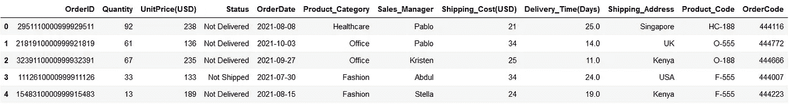
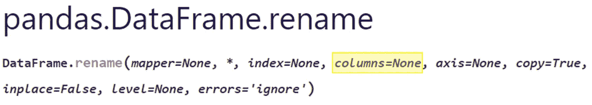
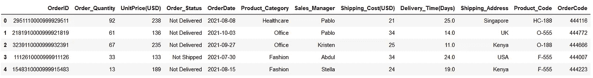
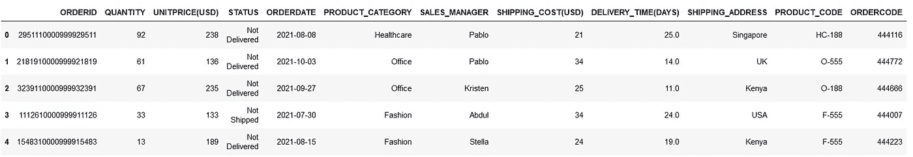
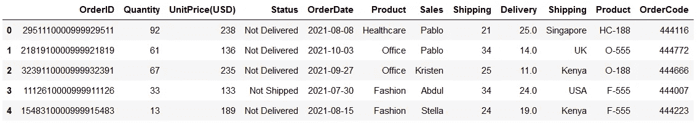
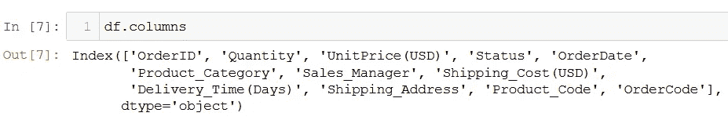
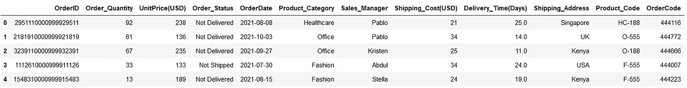
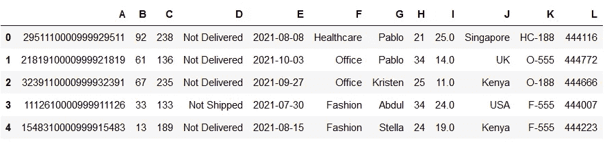

# Python 熊猫:重命名 DataFrame 列的 4 种惊人方法

> 原文：<https://towardsdatascience.com/how-to-rename-columns-in-pandas-with-examples-24c983fcc3b8>

## 计算机编程语言

## 了解并掌握这些方法来处理熊猫数据框架中混乱的列名


[贾里·海托宁](https://unsplash.com/@jarispics?utm_source=medium&utm_medium=referral)在 [Unsplash](https://unsplash.com?utm_source=medium&utm_medium=referral) 拍摄的照片

熊猫是一种快速、有力、灵活的动物！🔋

导入到 pandas DataFrame 中的数据有时会有不正确或混乱的列名，您需要重命名全部或部分列名。

用有意义的列名替换混乱的列名是数据清理的重要步骤。这无疑使整个代码更具可读性，并在接下来的数据处理步骤中节省了大量时间。⏳

今天，我将演示 4 种最好的方法来轻松地更改熊猫数据帧的列名。

> *📍*注意:我使用的是自己创建的 [Dummy_Sales_Data](https://github.com/17rsuraj/data-curious/blob/master/TowardsDataScience/Dummy_Sales_Data_v1.csv) ，你可以在我的[***Github***](https://github.com/17rsuraj/data-curious/blob/master/TowardsDataScience/Dummy_Sales_Data_v1.csv)repo 上免费获得&用于你的其他练习项目！

让我们首先导入数据集，

```
import pandas as pd
df = pd.read_csv("Dummy_Sales_Data_v1.csv")
df.head()
```



虚拟销售数据|作者图片

这是一个简单的 10000 x 12 的数据集，是我在文章 [**Faker 中创建的:一个惊人且非常有用的 Python 库**](/faker-an-amazing-and-insanely-useful-python-library-b313a60bdabf) **。**📚

你可以在本文末尾下载一个完整的笔记本，里面有所有这些例子！

好吧，我们开始吧..

在深入研究其他方法之前，让我们从最简单直接的方法开始。

# 熊猫。DataFrame.rename() —使用字典

这是一个数据帧功能，主要用于改变*轴*标签。这里，单词— *轴—* 指的是行和列，这取决于我们在该函数中为参数`axis`设置的值。

因为我们更有兴趣了解如何更改列名，所以让我们把重点放在它上面。因此，`.rename()`函数中的重要参数是如下所示的`columns`。



熊猫。DataFrame.rename() |图片作者

要替换部分或全部列名，您只需传递一个字典，其中*键*将是旧列名，而*值*将是新列名，如下所述。🔽

```
df.rename(columns={"Status": "Order_Status",
                   "Quantity": "Order_Quantity"}).head()
```



使用 df.rename() | Image by Author 重命名 pandas dataframe 列

如你所见，我在`df.rename()`中的参数列中传递了字典，其中 ***键*** 是旧的列名*状态*和*数量*。而 ***值*** 是*订单 _ 状态*和*订单 _ 数量*这是新的列名。

> *📍*注:`df.rename()`包含一个`inplace`参数，默认为假。为了保留列名中的更改，您需要执行`inplace = True`。

因为我不想保留更改后的列名，所以我使用了`.head()`方法来查看更改后的列名。

> *📍*注意:在任何函数中使用`inplace = True`之前，最好使用`.head()`来看看变化看起来如何。

接下来的方法是`.rename()`函数的一个微小变化。

# 熊猫。DataFrame.rename() —使用函数

就像上面的第一种方法一样，我们仍然会使用`.rename()`函数中的参数`columns`。但是除了传递旧名称-新名称*键-值*对，我们还可以传递一个函数给列参数。

例如，使用这个技巧将所有列名转换成大写字母非常简单，如下所示

```
df.rename(columns=**str.upper**).head()
```



使用函数|作者图像重命名列名

我简单地使用了一个字符串函数`**str.upper**`让所有的列名都是大写的，正如你在上面的图片中看到的。

> 这里可以使用的字符串函数的完整列表在[**Python 中的五个必知字符串方法**](/five-must-know-string-methods-in-python-e97925d12eec) *中有所提及📚*

通过这种方式，所有的列名将被一次性修改。然而，这可以通过用户定义的函数来实现。

*是的！！*您可以向参数`columns`传递任何用户定义的函数，以根据函数更改列名。

例如，您可以编写一个简单的函数来拆分下划线`( **_** )`上的列名，并只选择其中的第一部分。然后将这个函数传递给如下所示的列。🔽

```
def **function_1**(x):
    x = x.split('_')[0]
    return xdf.rename(columns=**function_1**).head()
```



根据用户定义的函数更改列名|按作者排序的图像

在上面的输出中可以注意到更改的列名。根据应用的功能，包含`**_**`的列名在`**_**`上被拆分，只有第一部分被指定为新的列名，例如 *Product_Category* 变成 *Product* 。

如果它是一个简单的函数，就像上面的一样，你也可以使用 lambda 函数。♻️

接下来让我们看看重命名列的另一种方法..

# 熊猫。数据框架.列

实际上，这是返回数据帧的所有列名列表的方法，例如

```
df.columns
```



使用 df.columns | Image by Author 列出列名

然而，反过来，我们可以将新列名的列表传递给`df.columns`，然后新列名将被分配给数据帧。

这是它的工作原理..🔽

```
df.columns = ['OrderID', 'Order_Quantity',
              'UnitPrice(USD)', 'Order_Status',
              'OrderDate', 'Product_Category',
              'Sales_Manager', 'Shipping_Cost(USD)',
              'Delivery_Time(Days)', 'Shipping_Address',
              'Product_Code', 'OrderCode']
df.head()
```



使用 df.columns | Image by Author 一次更改所有列名

正如你所看到的，我将新列名的列表分配给了`df.columns`，所有列的名称都相应地改变了。

> *📍*注意:您需要传递所有列的名称。该名称列表的长度必须正好等于数据帧中的列总数。

并且没有任何其他选项，比如`inplace`，列名被直接永久地改变，这种方法有点冒险。⚠️

因此，我建议只有当您 100%确定想要更改列名时才使用它。

> *📍*注意:列名列表的顺序应该与数据帧中列的顺序相同，否则列名可能会分配错误。

记住以上几点，这是一次性改变所有列的最好方法。

让我们看看最后一个方法..

# 熊猫。DataFrame.set_axis

该方法最初用于为数据框的轴设置标签，即该方法可用于标记列和行。

您只需将列名列表传递给`**.set_axis()**`函数，并指定`**axis = 1**`来重命名列，如下所示🔽

```
df.set_axis(['A', 'B', 'C', 'D', 'E', 'F',
             'G', 'H', 'I', 'J', 'K', 'L'], axis=1).head()
```



使用 set_axis() | Image by Author 更改列名

这是您可以更改所有或部分列的列名的方式。这里也必须考虑我在前一个方法中提到的所有要点。

然而，`.set_axis()`是先前方法`df.columns`的更安全版本，因为它包含了参数`**inplace**`。因此，即使在应用更改之前，您也可以预览未来的更改。

要保留更改后的列名，只需使`inplace = True`。

这就是改变列名的全部内容！！

我希望你觉得这篇文章有趣，有用，令人耳目一新。让列名可读性更强、风格更统一总是好的。因此，重命名列是项目开始时需要完成的基本步骤之一。

💡通过 [**成为中级会员**](https://medium.com/@17.rsuraj/membership) 可以探索中级物品。相信我，你可以**访问无限**的故事媒介和每日有趣的媒介文摘。我会得到你的费用的一小部分，没有额外的费用给你。

💡不要忘记 [**注册我的电子邮件列表**](https://medium.com/subscribe/@17.rsuraj) 来接收我的文章的第一份副本。

📚下面是一个完整的 [**笔记本**](https://github.com/17rsuraj/data-curious/blob/master/TowardsDataScience/4_methods_to_change_column_names.ipynb) 用所有这些方法来重命名列。

**感谢您的阅读！**